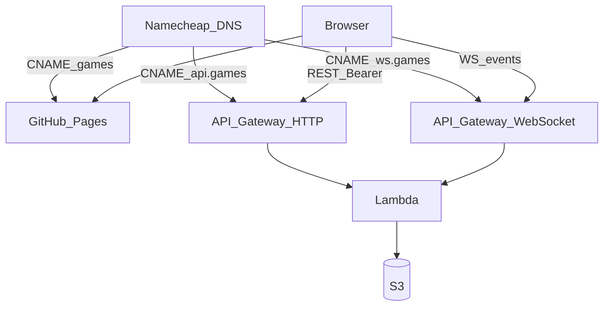

# ADR 0002 — Cheap async online multiplayer

**Status:** Accepted
**Date:** 2026-08-13
**Amended:** 2026-08-14 (P17 spec) — creator seat index, Start/revoke authz, 410 reasons, unauthenticated invite GET, `/my-games` includes open lobbies, Start writes meta only.
**Amended:** 2026-08-14 (P18 spec) — nested `/games/{groupHash}/{gameNumber}` GET+POST moves, quoted `If-Match` version from 0, first member GET ensures `makeMatch` + opening burst, WS `access_token` query, 409 finished + `meta.winner`, conditional put on accept/Start.
**Amended:** 2026-08-14 (P19 spec) — Pages GIS Sign-In, `sessionStorage` token, `#/invite/<token>` and `#/g/<groupHash>/<gameNumber>`, Local|Online lobby toggle, 412 GET-and-drop, WS while signed in.
**Amended:** 2026-08-14 (P25 spec) — Pages **host** binds GIS, `hashchange`, `visibilitychange`, and WS `onmessage` to `createOnlinePages`. No new AWS.
**Amended:** 2026-08-14 (P26 spec) — GET game includes meta `seats`; HTTP 410 `started` includes `groupHash` and `gameNumber` when known.
**Amended:** 2026-08-14 (P27 spec) — Create-invite pending copy; Local→Online coerces seats 0–1 to human; GIS `offerChooser` after One Tap dismiss.
**Amended:** 2026-08-27 (P45 spec) — `GET /my-games` started rows carry caller-relative `status` (`your-turn` \| `waiting` \| `won` \| `lost`). Persist stamps `players` / `activePlayer` / `lostPlayers` on game `meta.json`. No new AWS.
**Amended:** 2026-08-27 (P46 spec) — library rows add ordered `seats` (labels, `you`), `seatIndex`, optional `startedAt`. Display names from GIS `given_name`/`name` on `users/<userHash>/profile.json`. No email/sub. No new AWS.
**Context:** [`SPEC.md`](../../SPEC.md) §1 (delivery shape), [ADR 0001](./0001-pure-core-and-pluggable-geometry.md), packets [P14](../design/packets/P14-online-adr.md)–[P20](../design/packets/P20-deferred-online-followons.md)

## Context

Playtest is a client-only game on GitHub Pages (`games.hochgi.com/conquarrow/`). The rules engine is a pure `apply(state, move) → state` (ADR 0001). That makes an authoritative server cheap: re-`apply` on the server, store state + log, never invent a second rules engine.

Constraints that drove the rest:

- Hobby cost floor: Lambda + S3 + API Gateway. No DynamoDB, no Cognito, no Route53 hosted zone.
- Personal AWS only — never employer / Versatile.
- Grain fairness: online seats are **3 or 6** (same as the playtest lobby). Two-player mirror play was unfair.
- Async: players need not be online at the same time. A WebSocket is a wake-up, not a lockstep session.
- Future games may share `*.games.hochgi.com`. Do not mint per-game API subdomains.

## Decision

### 1. Authority and purity

The browser is untrusted. Lambda loads state, checks the move is legal for the bound seat, calls the same `rules-core` `apply`, writes S3, notifies. Heuristic AI runs **in that same invocation** after a human move, until the next seat is human or the game ends. One conditional put + log append for the whole burst. Timeout leaves S3 unchanged so the client retries the same move + version.

The core stays pure. Adapters may use clocks and CSPRNG (invite tokens, JWT `exp`).

### 2. Who is allowed to cost money

**AWS group/game objects exist only when a lobby has ≥2 human seats, all bound.** One human plus heuristic AI, and all-AI, stay in the browser — today's local lobby — and **must not** create a group or game. An **invite** object may exist in S3 as soon as create succeeds, provided the *plan* has ≥2 human seats; only the creator is bound until others accept.

### 3. Identity, groups, games

- Google OIDC ID token verified in Lambda. `sub` is the stable player id.
- `userHash = truncate16(SHA-256(sub))` (32 lowercase hex chars).
- `groupHash = truncate16(SHA-256(sorted userHashes joined by `\n`))`. **Humans only.** Seat order, 3-vs-6, and heuristic seats are not in the preimage. The same people always share one group folder. Hashing is order-independent because the list is sorted.
- A **game** is `groups/<groupHash>/games/<NNNNNN>/` with `NNNNNN` a 6-digit counter from `1`. Rematch allocates the next integer. **Existing game objects are never overwritten.**
- Equivalent to the informal id `${groupHash}_${counter}`: the counter is a path segment, not part of the hash.

### 4. Seats and meta

Each game `meta.json` records ordered seats:

```text
seats: [{ kind: "human", userHash }, { kind: "heuristic" }, …]
```

Length 3 or 6. The FE shows "B is AI" from this, not by guessing.

### 5. Invites

Opaque token URL (not a short PIN). **No TTL.**

The **creator** is the Google user who `POST /invites`. They occupy one **human** seat at create, named by `hostSeatIndex` (index into the seats array). Default: the first human seat (ADR's original "first human chair" behaviour). The named seat must be `kind: human`. Invitees `POST …/accept` and take the next unbound human seat (lowest index). Full → 409, no viewers. Same user accepting twice is idempotent (same seat).

**Revoke:** only the creator. **Start:** any human already bound on that invite, and only when every human seat is bound (and therefore ≥2). After Start, and after revoke, the token is **410** with `reason` `started` or `revoked`. A `started` 410 also includes `groupHash` and `gameNumber` when the invite record has them (P26, additive). Revoke stays `{ "reason": "revoked" }`. Started games never expire.

`GET /invites/:token` is **unauthenticated** while the invite is open (seat plan and which chairs are bound — `userHash` only, never Google `sub`). After revoke/Start it returns the same 410 + `reason` (and started ids when known).

Start open-or-creates `groupHash = H(sorted human userHashes)` and allocates the next `games/NNNNNN` with `If-None-Match` (never overwrite). A retry while the invite is still open **finishes that same start**. After invite status is `started`, GET/accept/start of the token stay **410**. P17 persists **meta only**. First bound-human GET (or POST moves) **ensures** `state.json` / `log.jsonl`: `makeMatch` with default config and the seat-plan `playerCount`, then the opening heuristic burst if seat 0 is heuristic, persist at **version 0**.

### 6. Store and notify

S3 is the database. Key prefix `conquarrow/` so another game can share the bucket.

```text
conquarrow/users/<userHash>/lobbies/<token>      # open invite this user is seated in
conquarrow/users/<userHash>/groups/<groupHash>
conquarrow/users/<userHash>/profile.json         # { displayName } from GIS given_name else name (P46)
conquarrow/groups/<groupHash>/meta.json          # { nextGameNumber }; membership is the per-user pointer keys, not a field here
conquarrow/groups/<groupHash>/games/NNNNNN/meta.json
conquarrow/groups/<groupHash>/games/NNNNNN/state.json
conquarrow/groups/<groupHash>/games/NNNNNN/log.jsonl
conquarrow/invites/<token>.json
conquarrow/connections/<userHash>/<connectionId>
conquarrow/connection-ids/<connectionId>         # userHash pointer so $disconnect is O(1)
```

`GET /my-games` is that user's membership pointers only: **open lobbies** they are seated in, plus **started games** under their groups. Never another user's rows. Each started row includes a caller-relative **`status`**: `your-turn` \| `waiting` \| `won` \| `lost` (P45). Classification is `libraryStatusFor` in contracts: winner is you → won; winner is set → lost; you are in `lostPlayers` → lost; `activePlayer` is you → your-turn; else waiting. Persist of `state.json` stamps `players`, `activePlayer`, `lostPlayers`, and `winner` onto that game's `meta.json` so listing stays a meta read, not a `state.json` scan. Unstamped (pre-P45) games fall back to one state hydrate. Meta-only (Start before first GET) is `waiting`. The Pages lobby hides the list behind a signed-in Online **My games** button. P46 adds ordered **`seats`** (kind, label, `you`), **`seatIndex`**, and optional **`startedAt`**. Labels are GIS given name when `users/<userHash>/profile.json` exists, else `Player A`…, heuristic `AI`. Never email, `sub`, or `userHash` on the row. `startedAt` is written at Start from the adapter clock (ISO UTC); pre-P46 games omit it.

HTTP play: `GET /games/{groupHash}/{gameNumber}` and `POST …/moves` (If-Match `"<n>"`). The P16 `POST /moves` stub is gone. POST body is one `Move`. GET 200 is `{ version, state, seats }` (`seats` from game meta; P26). Missing If-Match → 428; stale → 412; illegal `apply` → 422; already finished → 409 `{ reason: "finished" }`. A persist that first sets `winner` copies that `PlayerId` onto game `meta.json`. HTTP 410 on a started invite includes `groupHash` and `gameNumber` when known so the waiting host can open the match.

WebSocket: `wss://ws.games.hochgi.com/conquarrow?access_token=<Google ID token>`. Any verified user may `$connect`. Registry `connections/<userHash>/<connectionId>` plus `connection-ids/<connectionId>` for O(1) `$disconnect`. Payload is only `{ type: "stateChanged", version, groupHash, gameNumber }`. Notify **other** bound humans, not the caller. Notify is **best-effort after persist** — a `PostToConnection` failure must not fail the HTTP response. Gone connection ids are deleted. The client then GETs state. `visibilitychange` is a safety net, not a poll loop.

`state.json` (conditional put) is the **commit pointer** for If-Match and GET. `log.jsonl` and `meta.winner` follow; S3 cannot transaction two keys. A crash between them can leave a short log; GET still serves the committed version, and a client retry of that version is 412.

Pages (P19): Google Identity Services. ID token in `sessionStorage` (`conquarrow:google-id-token`). Hash routes `#/invite/<token>` and `#/g/<groupHash>/<gameNumber>`. One lobby with Local | Online (Online hides BYOK, requires ≥2 human seats). WS open while signed in. After POST 200 or 412 the tab GETs; 412 **drops** the in-flight move. No optimistic local `apply` for online moves. Sign-out clears the session key and closes the socket. P27: Local→Online sets seats 0 and 1 to `human` (leftover `byok` → `heuristic`); `POST /invites` in flight reports `createInvitePending` and the creating copy; Sign-In click is GIS `offerChooser` (`renderButton`); auto unsigned-invite / 401 stays One Tap `prompt()` with `cancel_on_tap_outside: false`.

Move Lambda: **60 s timeout, 1024 MB**. Worst burst: 4 consecutive heuristic seats (6-player, two humans on opposite corners).

### 7. URLs and deploy

| Surface | URL |
|---|---|
| FE | `https://games.hochgi.com/conquarrow/` (Pages, `shalevhoch` fork) |
| HTTP | `https://api.games.hochgi.com/conquarrow/…` |
| WS | `wss://ws.games.hochgi.com/conquarrow` |

API Gateway **base-path mapping** `/conquarrow` on shared custom domains. A later game adds a mapping, not a hostname.

Namecheap CNAMEs only. No NS-delegation of `games`. No new Route53 zone.

Code: TypeScript in-repo (`infra/` + `packages/online-api/`), bundles `rules-core`. **SAM + GitHub Actions OIDC from `hochgi/conquarrow` to the owner's personal AWS account.** Do not put that OIDC role on the son's fork. Do not deploy to employer AWS.



### 8. Authz for a move

`POST /games/{groupHash}/{gameNumber}/moves` succeeds only if the bearer maps to the **active** human seat. GET of that path is any **bound** human (including finished games). Heuristic seats never present a Google token. Stale quoted `If-Match` → 412. Missing → 428. Illegal move → 422. Finished → 409. No write on those paths. Accept uses server-side `If-Match` retry so two clients cannot bind the same chair.

## Consequences

### Good

- Same `apply` on both sides: desync is a bug in bundling, not a second ruleset.
- Rematches cannot clobber history.
- One-human vs AI costs nothing on AWS.
- Shared `api.games` / `ws.games` hostnames leave room for other hobby games.

### Costs

- S3-as-index is clumsy for queries; `/my-games` is pointer-fan-in, not a scan.
- WebSocket connection registry in S3 is not elegant; it is cheap at family scale. `$disconnect` looks up `connection-ids/<connectionId>` rather than listing the registry.
- Split deploy: Pages on `shalevhoch`, API on `hochgi`.
- Heuristic burst can make a human wait on Lambda time (accepted; 60s budget).
- Persist of `state.json` + `log.jsonl` is two puts. The versioned state object is authoritative.

### Rejected alternatives

- **Cognito + DynamoDB.** Correct at work; overkill and idle cost here.
- **Per-game API subdomains.** Fights the "one games zone" DNS story.
- **Go/Rust Lambdas.** Would fork `rules-core`. Language cost is noise next to S3.
- **Content-address including seat plan.** Same two people in 3p vs 6p would be different groups; the library would split.
- **Concatenated `${hash}_${counter}` as the only id.** Same identity, worse listing; path segments already do this.
- **1-human online.** Would bill AWS for what the browser already does.
- **Invite TTL.** Abandoned lobby objects are tiny; host revoke is enough.
- **Viewers, arena, Elo, online BYOK, auto-replay.** [P20+](../design/packets/P20-deferred-online-followons.md).

## Follow-on packets

P16 SAM/CI/DNS → P17 auth+invites → P18 moves+WS → P19 Pages adapter → P25 Pages host → P26 playtest UX → P27 lobby follow-up → P45 game library status → P46 library row identity.
