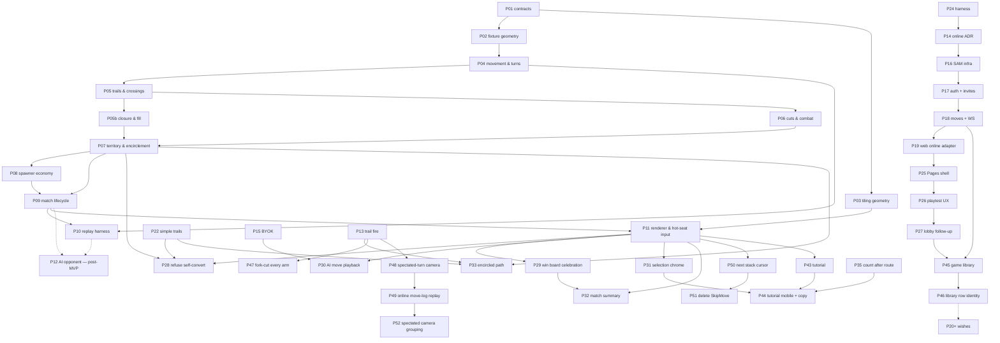

# 02 — Work packets: index, dependencies, build order

> **Status:** Draft for review.
> Each packet is one encapsulated unit of work, sized for a single `/spec-to-ship`
> run (spec → tests → code → review → PR + Copilot + merge). A packet doc is the
> **phase-1 input**: it fixes scope, decisions, invariants and a scenario
> inventory; the spec-author turns those into Gherkin + EARS. No human gate
> between phases. Escalate only for unexpected cost, a big behavioral shift, or
> a SPEC.md game-rule gap.
>
> Everything here is derived from [`SPEC.md`](../../SPEC.md). The § references
> point at the section that owns the behaviour.

## MVP scope

MVP is **stateless, client-only, hot-seat** (SPEC §1). Two players alternating on
one machine, no save/resume, no server, no AI.

That trims the plan rather than reshaping it: **P12 leaves MVP**, and P11 becomes
the only adapter that ships. Nothing moves the other way — there was never a
persistence or netcode packet, because ADR 0001 kept both outside the core by
construction.

**P10 stays in, and its justification changes.** With no save/resume it is not a
product feature; it is the determinism detector, which is the reason it was
scheduled early in the first place.

## Packet index

| # | Packet | Layer | SPEC | Depends on | Gate / risk |
|---|---|---|---|---|---|
| P01 | Contracts: ports & DTOs | foundation | §2–7 | — | unblocked — §11 item 19 settled the `Move` DTO: one unit, one step |
| P02 | Fixture geometry (hand-authored boards) | foundation | §2 | P01 | **[packet doc written](./packets/P02-fixtures.md).** **No longer owes the green suite — P03 discharges it**, so P02 matches a suite already known satisfiable. Fixtures are **abstract conformant digraphs, not lattice sub-boards** (§11 item 29) — floor **7 points / 21 arrows / 14 vertices** (corrected from "near 6 and 18" while writing P02), and readability when a *rules* test fails is the whole point. **A fixture is finite where the real board is not** (§11 item 4), so its window at a large enough radius simply *is* the board — the sharpest remaining difference between the two implementations, and also its one hard limit: **on a finite board every ray closes, so no fixture can host even-odd fill**, and P05b and P07 test against the tiling — which is what split P05 in two. Slots must **alternate** in/out; the phase is free. No layout: an abstract board has no coordinates |
| P03 | Tiling generator | foundation | §2 | P01 | **[packet doc written](./packets/P03-tiling.md); taken next, ahead of P02.** A generator, not an extraction, and the maths is already validated against the artwork by a throwaway viewer. **Discharges the conformance debt** instead of P02 — 37 assertions, unedited. **§11 item 4 shrank this packet**: the board is unbounded, so `makeTiling()` takes no arguments, precomputes nothing, and the whole seam and board-floor surface is gone. Also owns the renderer's **layout** (a polygon per arrow), which is *not* on `GeometryPort`: item 29 made fixtures abstract digraphs, and those have no coordinates at all |
| P04 | Movement, stacks & the turn loop | rules | §2–4 | P01, P02 | **[packet doc written](./packets/P04-movement.md).** allowance is an **integer** — `speed(N) = 1 + floor(log₂ N)`, nothing carried between turns. No rationals on this path; exact rationals belong to the §7 accumulators (P08). First `RulesPort` / `rules-core` slice; trails and combat stay out (P05/P06) |
| P05 | Trails, sentries & crossings | rules | §2, §5, §6.1a | P04 | **[packet doc written](./packets/P05-trails-crossings.md); P05 was split, and P02's finiteness theorem is the seam.** Everything here is *local*, so it tests on a fixture board where a failure prints; closure and fill are not and cannot (§11 item 4), so they moved to P05b. A point presents `i × o` chords, not one — extracting them is this packet's job, and `chordsCross` is called once per chord. Owns §5's branch-anchor legality, whose prose admits three readings and only one avoids freezing the board: it constrains **what you may leave**, locally to what a move changes, because damage can legally empty a fork. **Landed.** The same sentence turned out to be ambiguous about the *amount* too, which the review caught and §11 item 35 settled — **one head per branch, not one per strand**, so a sibling arm carries a whole junction; no scenario discriminates the readings and three properties hold the decision |
| P05b | Closure, fill & land bridges | rules | §7 | P05 | **[packet doc written](./packets/P05b-closure-fill.md); taken next.** **A landing claims the trail walked *backwards along the grain* from the closing arrow** — which gives §7 both of its hardest passages at once: a fork's other arm is downstream so it stays open trail (the pincer survives), a cut fragment is upstream so salvage claims all of it, and a merge claims every in-arrow because the set holds no pairing (§6.1a). The same walk decides enclose-versus-strip, so there is no second gate. **even-odd fill is the subtlest logic in the game**, and it must read the trail's **arrow set** and use `chordsInterleave`, not `chordsCross` (§6.1a). **§11 item 4 made fill easier, not harder**: the board is a plane, so a ray escapes, every closed curve bounds, there is no girdling case and no homology anywhere. Fill is bounded by the trail's own extent, never by the board — but *not* by a fixture: on any finite board every ray closes, so this packet is the first that **cannot** use one. Owns the land bridge, the pincer, and the anchor-grade consequence (only territory grade closes). **Fill never enumerates a vertex** (§11 item 34): closure moves *tiles*, and every special's ownership follows from its three bordering arrows in thirds — so the minimal three-arrow closure takes a whole spawner and nothing sweeps vertices at all |
| P06 | Cuts, evaporation & combat | rules | §6 | P05 | **§6 was rebuilt twice after P01 landed.** Bidirectional evaporation, one kill per front, 1:1 per-move combat — then bare trail, **all-to-all points**, and **per-arrow halting** (a head does *not* shield the point ahead against fire; that range is combat's alone). Two grades of anchor, territory and stack, and conflating them breaks §6.3 |
| P07 | Territory & encirclement | rules | §7 | P05, P06 | conversion must conserve total heads exactly |
| P08 | Spawner economy | rules | §7 | P07 | exact rationals only — **the accumulator is the one thing in the game that banks**; blockades halt accrual and cost the share. Accrual takes *a* force per spawner and must never read its value: **no branch on 1/3 vs 1/12, no threshold against a constant** (§7, *placement and force are setup data*). MVP defaults are playtest-first (§11 items 12 and 25) and a retune must not change which scenarios pass |
| P09 | Match lifecycle, setup & victory | rules | §8, §9 | P07, P08 | **two win conditions, not one.** Elimination, plus **domination — every spawner share held for *N* consecutive turns** (§9, §11 item 32 resolved). Domination is what makes an unbounded board terminate: a runner past *R* holds no shares, so the clock starts when they leave and never depends on catching them. It also closed §9's turtle: a spawner is enclosable at the minimum size the game has (§11 items 16, 34), territory is contestable (§7), and closing around a garrison converts it (§6.3) — so **§9 carries no accepted risk** and **upkeep** is a shelved balance knob rather than a pending fix. **Owns the spawner tuning table**: which eligible vertices carry a spawner, the band *radii*, force per band, *N*, and the cutoff radius *R* past which there are none — one input read once at setup, not conditions spread through placement (§7). Also owns two-player placement, which must use the **reflection** `(i,j) ↦ (i+j,−j)`: 180° rotation reverses every arrow's grain and would hand player 2 a board running backwards |
| P10 | Replay & determinism harness | cross-cutting | — | P04, P09 | the primary detector of accidental nondeterminism |
| P11 | Renderer & hot-seat input | adapter | §2, §5, §7 | P03, P09 | **[packet doc written](./packets/P11-renderer-hotseat.md); landed.** Web SVG hot-seat: pan + clamped zoom, cull via `window`, trail at 50% opacity / territory solid, pluggable Galcon + HoMM-preview input. **The board is unbounded (§11 item 4), so deciding which arrows are on screen is this packet's central job** — P03's layout clips nothing and knows no viewport |
| P13 | Trail fire & anchors | rules | §5–6.3 | P05–P07 | **[packet doc](./packets/P13-trail-fire-anchors.md).** Halt-at-first (no kill); wipe/convert scrub trail; territory-root feeder cut; stack-grade freeze; dormant illegal |
| P21 | Findings planner | adapter | — | P11, P15 | **[packet](./packets/P21-findings-planner.md).** Deterministic findings list; heuristic + BYOK target locks. Web only |
| P22 | Simple trails | rules | §5–7 | P05–P07, P13 | **[packet](./packets/P22-beta-simple-trails.md).** **Landed.** No branch toll; dormant legal; no size-1 freeze. Firebreak-capped paint (D5) **superseded by P42**. |
| P23 | Intercept findings | adapter | — | P21 | **[packet](./packets/P23-intercept-findings.md).** **Ready to ship.** Timed `intercept` vs projected tip-frontier triangles; in-time gate; layout wired into heuristic + BYOK |
| P24 | Delivery harness | tooling | — | — | **[packet](./packets/P24-delivery-harness.md).** Grok 4.6 xhigh, Stryker, CRAP hint, complexity warn, `local-main` test-kit overlay, verify CI. Lands before the online track. Skips Gherkin. |
| ~~P12~~ | ~~AI opponent~~ | — | — | — | **out of MVP** (hot-seat). Kept in the graph because P10 exists partly to make it cheap later |
| P14 | Online ADR | architecture | — | ADR 0001, P10, P24 | **[packet](./packets/P14-online-adr.md).** **Landed** as [ADR 0002](../adr/0002-cheap-async-online.md). 3/6 seats, ≥2 humans for AWS, groupHash = sorted Google subs, rematch = next game number. |
| P15 | Local BYOK LLM bot | adapter | — | P11 | **[packet](./packets/P15-byok-llm-bot.md).** **Landed.** Browser-only OpenAI-compatible seat; legalMoves filter; keys never leave session. Pages-direct CORS: [ADR 0003](../adr/0003-pages-direct-byok.md). Local Pause + all-bot idle-pause: [bot-pause](../spec/bot-pause/bot-pause.md) |
| P16 | Online infra | adapter | — | P14 | **[packet](./packets/P16-online-infra.md).** SAM + OIDC CI + base-path `/conquarrow` — **personal AWS only, never employer** |
| P17 | Online auth & invites | adapter | — | P16 | **[packet](./packets/P17-online-auth-invites.md).** Google OIDC, lobby 3/6, ≥2 humans, `/my-games` |
| P18 | Online moves + WS | adapter | — | P17 | **[packet](./packets/P18-online-moves-ws.md).** `apply` + heuristic burst in one Lambda put; WS `stateChanged` |
| P19 | Online web adapter | adapter | — | P18 | **[packet](./packets/P19-online-web-adapter.md).** **Landed** (`9898041`, PR #5). Port + tests. Shell is P25. |
| P25 | Pages online shell | adapter | — | P19 | **[packet](./packets/P25-pages-online-shell.md).** GIS, Local\|Online lobby, hash/WS/visibility host, REST play on Pages |
| P26 | Playtest online UX | adapter | — | P17–P19, P25 | **[packet](./packets/P26-playtest-online-ux.md).** GET seats, frozen roster, lobby peek, 410 started ids, online auto-pass |
| P27 | Lobby follow-up | adapter | — | P25, P26 | **[packet](./packets/P27-lobby-followup.md).** Create wait, Online Player floor, GIS chooser after One Tap dismiss |
| P28 | Refuse self-convert | rules + adapter | §6.3, §4 | P04, P05, P07, P11, P22 | **[packet](./packets/P28-refuse-self-convert.md).** Self-convert steps illegal; opponent-caused convert unchanged; refused-target tooltip |
| P29 | Win board celebration | adapter | §9 (read) | P09, P11, P08 | **[packet](./packets/P29-win-board-celebration.md).** Dim the rest, shine winner shares, pulse winner stacks. Banner `{label} wins` (**P36 retired the how clause**). No splash |
| P30 | Local AI move playback | adapter | — | P11, P15 | **[packet](./packets/P30-ai-move-playback.md).** Plan once, play back with 400ms between local heuristic/BYOK moves. Online burst stays one put |
| P31 | Quieter selection chrome | adapter | §4 (read) | P11 | **[packet](./packets/P31-selection-chrome.md).** Quiet reach wash; min-count on hover/tap; path-only during send dialog; confirm when unique portion > 1; selected halo |
| P32 | Match summary telemetry | adapter | — | P11, P29 | **[packet](./packets/P32-match-summary-telemetry.md).** Playtest counters on the match log (steps / end-turns / skips / closes / cuts / firstCloseAt); HUD line only when over. Adapter proxies, not §7/§6 events |
| P33 | Encircled path on convert | rules | §6.3, §6.1 | P07, P13, P22 | **[packet](./packets/P33-encircled-path.md).** Playtest: leftover enemy trail chord after a winning enclosure. Convert wipes from converted arrows (halt-at-first); both fork arms evaporate; cut-created dormant stays |
| P34 | Ray-run route input | adapter | §4, §5 (prose) | P11, P31 | **[packet](./packets/P34-ray-run-input.md).** Playtest: equal-length routes to one arrow, adapter picked one. Draft a route by clicking straight **runs**; clickable set = unique-route arrows (straight, then optionally one turn); carry at the tip; Send commits. Retires the portion modal. Edits SPEC §5's interaction line |
| P35 | Count after route | adapter | §3, §5 (read) | P34, P31 | **[packet](./packets/P35-count-after-route.md).** Mobile playtest of P34: the carry was asked for before the route it pays for. A click drafts the run at full strength; the count control edits the **last** run, floored at what that run costs; a one-run draft with a forced count and a finished tip applies on the click; the control docks below the board |
| P36 | Losing conditions per seat | rules | §9, §11 32/44/45 | P08, P09 | **[packet](./packets/P36-starvation-per-seat.md).** 6-player log: a seat with no territory kept taking turns. Repeals §9's "lose your last head and you are out"; four cases over (territory, shares, heads); a lost seat **vanishes** and its land reverts to unowned; destitution is **per seat** (the old single holder/streak pair ended the match by array order). Loss resolves at the round boundary |
| P37 | Immediate loss | rules | §9, §11 44 | P36 | **[packet](./packets/P37-immediate-loss.md).** Playtest: encircling the last enemy territory did not end the match — deciding move 1242, `winner` set at 1246, and the dead seat took a turn at 1244. `resolveLosses` moves from `applyEndTurn` to the tail of `apply`. Repeals P36 invariants 11/12; resolves §11 item 44 **by dissolution** (no path un-owns a share). Share walk short-circuits (**invariant 16**) so five other packets' "enumerate no vertex" survives |
| P38 | A won match is over | rules + adapter | §9, §11 46 | P37, P29, P32 | **[packet](./packets/P38-won-is-over.md).** P37 opened a window inside a turn: at the win the seat still had allowance and `legalMoves` never read `winner`. Resolves §11 item 46 — `legalMoves` offers **nothing** (not even the pass), `apply` throws; the gate is at the *top* of `apply` so the deciding move still resolves every effect. Adapter: the celebration waits for that move's overlays instead of painting over them |
| P39 | Flicker-then-fade on vanish | adapter | §9, §11 45 | P36, P38 | **[packet](./packets/P39-seat-vanish-fx.md).** Resolves §11 item 45: a lost seat's trail still *clears* (no new §6.1 trigger). The adapter names `seatVanished` from the diff and presents flicker-then-fade, all remnant cells together — not `cutSnap` + `evaporate`. P32's cut proxy ignores a vanished seat's trail drop. |
| P40 | Birth on open trail is a cut | rules | §6.1, §7, §11 47 | P08, P13, P22 | **[packet](./packets/P40-birth-on-trail-is-cut.md).** Playtest: enemy spawn on bare trail left the trail intact. Birth onto another player's trail is `evaporateFromArrow` at the birth arrow; blockade and friendly merge unchanged. |
| P41 | Mirrored spawner field | setup | §2, §4, §7, §11 48 | P03, P08, P36 | **[packet](./packets/P41-mirrored-spawner-field.md).** Sample the thinning hash at the reflection orbit representative so the field is exactly mirror-symmetric like the homes. Density/force tables untouched; 120° parked. |
| P42 | Claim walk ignores firebreaks | rules | §6.1, §7, §11 42/49 | P05b, P22 | **[packet](./packets/P42-claim-walk-ignores-firebreaks.md).** Playtest: unanchored landing painted only up to a mid sentry. Repeals P22 D5 / item 42 — firebreaks halt evaporation, not the claim walk. **Landed.** |
| P43 | Interactive walkthrough tutorial | adapter | §4–§9 (read) | P11, P31, P34, P35 | **[packet](./packets/P43-tutorial.md).** **Landed** (`#29`). Eight lessons on the real engine. Rails never fake legality. |
| P44 | Tutorial mobile input + plain copy | adapter | — | P43, P31, P35 | **[packet](./packets/P44-tutorial-mobile-copy.md).** Playtest: fat-finger misses, Send undiscoverable, log formula in L0. Coarse `hitArrow` padding, rail auto-Send, stage banner, pan-to-from, plain copy. |
| P45 | Game library status | adapter | — | P17, P18, P25, P27 | **[packet](./packets/P45-game-library.md).** Signed-in Online **My games**: per-caller `won` / `lost` / `waiting` / `your-turn`. Stamp on persist; no new AWS. |
| P46 | Library row identity | adapter | — | P45 | **[packet](./packets/P46-library-row-identity.md).** My games rows: opponent labels, start time, caller seat colour. |
| P47 | Fork cut floods every arm | rules | §6.1, §6.1a, §11 50 | P06, P13, P22 | **[packet](./packets/P47-fork-cut-floods-every-arm.md).** Playtest: F interleaved D's trail; sibling fork arm survived. Region between firebreaks is undirected; cutter is not a firebreak. |
| P48 | Spectated-turn camera | web | — | P11, P13, bot-pause | **[packet](./packets/P48-spectated-turn-camera.md).** Camera performs turns this client did not drive: two-point fit per hop, no full-board beat, restore to last-selected stack. Local AI seats only; hot-seat and tutorial excluded. Adds a cogwheel with auto-focus + playback speed. |
| P49 | Online move-log replay | online + web | — | P48, P14–P20 | **[packet](./packets/P49-online-move-log-replay.md).** `log.jsonl` exists server-side but no route serves it; the client only ever gets a state snapshot, so remote turns have no per-move presentation at all. Replay from what this client last displayed, never from what the server stored; cold start installs the snapshot. Full FX parity with local. |
| P50 | Next stack cursor | web | — | P11 | **[packet](./packets/P50-next-stack-cursor.md).** *Skip group* was memoryless — with three or more movable stacks it ping-ponged between the two lowest arrow ids and never reached the third. Replaced by a real cursor: baseline `compareArrows` order, destination/remainder preemption after a committed step, per-seat turn anchoring on the stack acted on last. Emits no move; nothing skip-shaped is logged again. Web adapter only. |
| P51 | Delete `SkipMove` | contracts + rules-core + web + online | — | P50 | **[packet](./packets/P51-delete-skip-move.md).** Removes the move kind P50 stopped producing, plus the test/`.feature` sweep and the SPEC.md prose that had written a UI cursor up as a game rule. No behavioural delta except one deliberate one: a persisted or wire record naming `"skip"` is rejected, not translated — pre-P50 logs do not replay. |
| P52 | Spectated camera grouping | web | — | P48, P49 | **[packet](./packets/P52-spectated-camera-grouping.md).** P48's per-move hop dribbles micro pans between moves that were already on screen. Replaced by camera groups: greedy prefix at the zoom floor fixes the number of camera movements, a contiguous lexicographic-maximin DP redistributes moves across them, one merged tween per boundary, suppressed when the pan is negligible. Still inside a group; never spans a seat or a turn. |
| P20+ | Deferred follow-ons | — | — | — | **[packet](./packets/P20-deferred-online-followons.md).** Viewers, fork, arena, replay button, Elo, online BYOK, under-18 GIS, admin panel |

## Dependency graph

## Build order and why

**P01–P02 first, and P03 in parallel.** The tiling is fully known — the oriented
triangular lattice with alternating junctions (§2, §11 item 1) — so P03 generates
a board from two basis vectors rather than tracing an image, and there is no
measurement left anywhere in the plan. Keeping fixture geometry separate still
pays: rules packets test against small hand-authored boards with known adjacency,
which make failures readable, while both implementations answer to the same
`GeometryPort` and the same conformance suite. **With one measured exception:**
every ray closes on itself on a finite board, so even-odd fill reports *outside*
everywhere and P05b and P07 test against the tiling (§11 item 29, P02
measurement 2). That line is where the P05 split came from: the theorem draws it,
not a preference about packet size.

It pays by more than it looks, and §11 item 4 changed *why*. The old argument was
a size floor — the smallest conformant torus was 4×4, against a hand-authored
digraph's 7 points and 21 arrows. **The floor went with the wrap**, and what
replaced it is starker: the real board is now **unbounded**, so it cannot be
printed, diffed, or held whole in a failing test's output, while a fixture can.
That is the difference between a fixture you can read when a rules test fails and
one you cannot, and it is why P02 authors graphs rather than sub-boards.

**P03 is the closest thing to a hard prerequisite, and it used to be P02.** Until
one of them lands, 37 of P01's tests are pending rather than passing, so the repo
has no board and no rules packet can be tested against one. P03 is taken first
because it also produces a **visible** board, and because proving the suite
against the real tiling is worth more than proving it against a fixture.

**P04 → P05 → P06 → P07 is a genuine chain.** Closure needs movement; cuts need
trails to cut; territory needs both closure and the encirclement that combat
produces. Do not try to parallelise these — the interactions are the game.

**P05b and P06 are the one exception, and it is a fork rather than a
parallelisation.** Both need P05's trail state and neither needs the other:
evaporation reads *what a trail is* and *where it is anchored*, not *what a
closure claims*. They rejoin at P07, which needs both. The order between them is
therefore free, and **neither carries an open rules question** — item 34 turned out
not to be a gap, and item 35, the one P05 really did open, was closed by its own
review. So the tie-breaker is now taste: P05b is the harder logic and the first
packet that cannot use a fixture board, which is an argument for doing it while the
trail rules are freshly in mind.

**P08 after P07**, because a spawner share is ownership of an arrow *as
territory*, so there is nothing to accrue to until territory exists.

**P10 early enough to matter.** The replay harness is worth landing as soon as
there is a turn loop to replay. Its value is not regression coverage, it is that
it catches nondeterminism *while the core is still small enough to find it*.

## Post-playtest online track

Playtest changed seating (3 or 6 only) and landed local BYOK (P15). Online is a
**new adapter track**, not a rewrite of `SPEC.md`. Ship order after this
harness (P24):

1. **P14** — ADR 0002 (docs; skip red/green)
2. **P16** — SAM + DNS + OIDC on `hochgi/conquarrow`
3. **P17** — auth, invites, library
4. **P18** — moves, heuristic burst, WebSocket
5. **P19** — Pages adapter (`createOnlinePages`)
6. **P25** — Pages shell (GIS, lobby, host events)
7. **P26** — playtest lobby/HUD (GET seats, frozen roster, peek, 410 ids, online auto-pass)
8. **P27** — create wait, Online Player floor, GIS chooser after One Tap dismiss
9. **P45** — My games statuses (won / lost / waiting / your-turn)
10. **P20+** — wishes only (viewers, fork, arena, replay button, Elo, online BYOK)

One `/spec-to-ship` per packet.

## Open items this plan inherits

Tracked in [`SPEC.md` §11](../../SPEC.md): **two tuning knobs, no remaining
structural rules question.** Item 45 (whether a lost seat's trail evaporates)
was resolved by P39: it still *clears*, and the adapter presents flicker-then-fade
rather than teaching a cut. No geometric measurement remains — items 1, 5, 16 and
29 are all resolved, so P03 generates rather than extracts. Nothing blocks P01,
P02 or P03.

**Items 30 and 31 are closed, and they closed by having their cause deleted.**
Both said the same thing — §7's fill and §8's setup were written for a plane while
the board was a torus — and **item 4 re-resolved the board to the plane** rather
than answering either on its terms. The trigger was sharper than item 30 had
realised: on a torus every lattice ray is a closed loop, so even-odd fill reports
*outside* for every tile of every enclosure, not merely for a girdling trail. Fill
was silently broken, not merely undefined at an edge case.

What that costs and pays across the plan:

- **P01** — reworked in place. `allPoints/allArrows/allVertices` became
  `window(centre, radius)` plus `seedPoint()`, and the two global assertions were
  restated locally. Suite went 28 → 37, all still pending
- **P03** — smaller. No `(n, m)`, no 4×4 floor, no seam, no wrap; a stateless
  generator that takes no arguments
- **P05b** — simpler. Even-odd fill is now correct as written, and there is no
  homology case to handle. It also cannot run on a fixture, and that is what split
  P05 in two
- **P09** — gains the radial gradient and loses the board size

Parked — **numbers only, and not open questions:**

- **item 11** — ~~board size `(n, m)`~~ → the spawner cutoff radius *R*, the band
  radii, force per band, and **item 32's *N***. MVP player count fixed at 2, placed
  by **reflection** — 180° rotation reverses the grain and is not a symmetry →
  **P09**

Closed since the last revision of this doc:

- **item 32** — nothing ended a match against a player who simply walks away.
  **Resolved: domination** — hold every spawner share for *N* consecutive turns and
  you win (§9). A win condition rather than a chase mechanic, which is what makes it
  work: a runner past *R* holds no shares, so the clock starts when they leave and
  never depends on catching them. Chosen over **upkeep**, which also killed the flee
  case but adds per-turn bookkeeping where domination reads ownership the board
  already carries. It closed §9's **turtle** as a side effect, by changing what the
  attacker must reach: a spawner is enclosable at the minimum size the game has, a
  shell is proof against cutting but not against closure, and closing around a
  garrison converts it → **P09** owns *N* and the victory check
- **item 36** — §7 said *even-odd fill*, and even-odd needs a closed curve that a
  claim is not. **Resolved: the wall is the player's ground and *enclosed* means
  cannot reach infinity** — no parity, no outline arc, no degenerate probe. A
  self-loop therefore claims its inside even without territory at both ends →
  **P05b**
- **item 35** — §5 and §6.1 priced a branch at two different numbers, and the
  memoryless trail could not tell them apart. **Resolved: one head per branch**,
  opened and closed by P05's review → **P05**
- **item 12** — spawner density, resolved as *non-uniform*: dense and fast in the
  contested centre, sparse and slow at home, nothing past *R*. MVP defaults are
  written down and explicitly playtest-first → **P09**

Items 11 and 12 are a single balance sweep against total spawner force, and want
a playable game rather than an argument — which is why P09 owns them and why the
replay harness (P10) lands right behind it. Item 32 belongs in the same
conversation: it is a victory-condition question, and P09 owns §9.

Neither is a blocker, and the reason is a constraint rather than an accident:
§7's *placement and force are setup data* keeps every one of these numbers on the
setup side of the port. Build against the defaults now; the sweep later is a
table edit, and if it turns out not to be, that is a defect in P08 or P09.

**Item 20 is closed and the plan used to say otherwise.** The two "residual carry
edges" it listed dissolved when §3 dropped banking — there are no carries to
forfeit or duplicate, so P04 inherits nothing from it.

An item with no packet owner is a scoping gap, not a decision. Say so rather than
absorbing it.

## Packet docs

Individual packet docs live in `./packets/PNN-<slug>.md`. Rules packets are
written just-in-time before `/spec-to-ship`. The **online track** (P14–P20) has
docs now because the architecture conversation already happened; Gherkin is
still written in phase 1 of each packet, not all at once.
