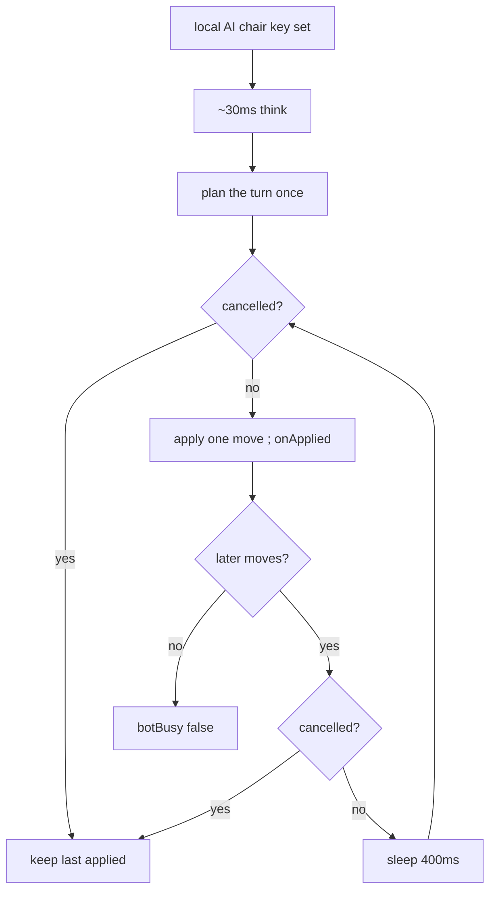

# ai-move-playback — show local AI moves in order

**Packet:** [P30 — Local AI move playback](../../design/packets/P30-ai-move-playback.md)
**SPEC:** none (adapter presentation). Planner stays `playBotTurn` / `playLlmBotTurn`.
**Layer:** `packages/web` only. Does not touch `rules-core`, contracts DTOs, ADR 0002, P18.
**Features:** [core](./ai-move-playback.core.feature) ·
[edge cases](./ai-move-playback.edge-cases.feature)

## Purpose

A local AI turn is planned as an ordered list of moves, then committed in one
React update. The board jumps to the end of the turn, so a cut and
the next step are indistinguishable. Play the planned list back with a short
gap so the order of operations is visible.

## Scope

In: a helper `packages/web/src/botPlayback.ts` — `applyMovesSequentially`,
`localAiChairKey`, `BOT_PLAYBACK_GAP_MS`. App wires it for heuristic and BYOK
seats. Tests against the helper (same posture as `fx/victory.ts`). No RTL.

Out: re-planning per step; online heuristic burst; human auto-pass; SPEC.md;
`rules-core`; shortening the gap for `prefers-reduced-motion`.

## Terms

| Term | Means |
|---|---|
| **plan** | one `playBotTurn` or `playLlmBotTurn` call that returns an ordered `moves` list |
| **playback** | applying that list one move at a time, with a gap between consecutive applies |
| **gap** | `BOT_PLAYBACK_GAP_MS` (400) milliseconds of injected `sleep` between steps |
| **chair key** | `localAiChairKey` — the active local AI player id, or `null` |
| **cancel** | `cancelled()` became true; no further `apply` / `onApplied` / `sleep` |

## Helper shape

```
BOT_PLAYBACK_GAP_MS = 400

applyMovesSequentially(
  rules: RulesPort,
  start: GameState,
  moves: readonly Move[],
  opts: {
    gapMs: number
    sleep: (ms: number) => Promise<void>
    onApplied: (move: Move, after: GameState, index: number) => void
    cancelled: () => boolean
  },
): Promise<GameState>

localAiChairKey(
  state: GameState | undefined,
  opts: { online: boolean; isAiSeat: (id: string) => boolean },
): string | null
```

Playback algorithm (normative):

```
at = start
for i in 0 .. moves.length-1:
  if cancelled(): return at
  at = rules.apply(at, moves[i])
  onApplied(moves[i], at, i)
  if i < moves.length-1:
    if cancelled(): return at
    sleep(gapMs)
return at
```

Chair key (normative):

```
if state is undefined or opts.online or state.winner is set: return null
key = String(state.activePlayer)
if not opts.isAiSeat(key): return null
return key
```

App: the playback `useEffect` depends on the chair key (and `commitApplied`),
**not** on occupancy or the match log. Capture turn-start `GameState` when the
effect starts. Plan once from that snapshot. `onApplied` calls
`commitApplied([move], after)`; BYOK stats and seat attach only when
`index === moves.length - 1`. `botBusy` stays true until playback returns or
cancel. Think pause before planning remains ~30ms and is **not** a gap before
the first playback step.

## Flow



## Invariants

- When playback is given n greater than 1 moves and is not cancelled, the
  system shall call `sleep` exactly n − 1 times, each with `gapMs`.
- When playback is given 0 or 1 moves, the system shall not call `sleep`.
- The system shall apply moves in the given list order, each via `rules.apply`
  on the state produced by the previous apply (or `start` for the first).
- When `cancelled` is true before an apply, the system shall apply no further
  moves and shall not call `onApplied` for them.
- When `cancelled` becomes true during a gap, the system shall not apply
  later moves.
- Equal `start` + `moves` shall yield equal intermediate states and the same
  final state as folding `rules.apply` (determinism of the sequence, not of
  wall-clock).
- The playback helper shall not call `Date.now`, `Math.random`, or
  `setTimeout`; `sleep` is injected.
- While the same local AI player is active and the match is not over, the
  chair key shall not change because occupancy or the match log changed.
- When play is online, or `winner` is set, or the active seat is not AI, the
  chair key shall be `null`.
- The rules engine shall be unchanged: no edit to `packages/rules-core`.
- Planning remains one burst per chair: playback shall not call the chooser.

## What this file deliberately does not decide

- Heuristic scoring / BYOK prompt — P12-as-web / P15, already shipped.
- Online AI burst — P18, stays one put.
- Human auto-pass delay — stays 0ms.
- The 400ms constant is playtest-first; retune the named export, not the
  algorithm.
