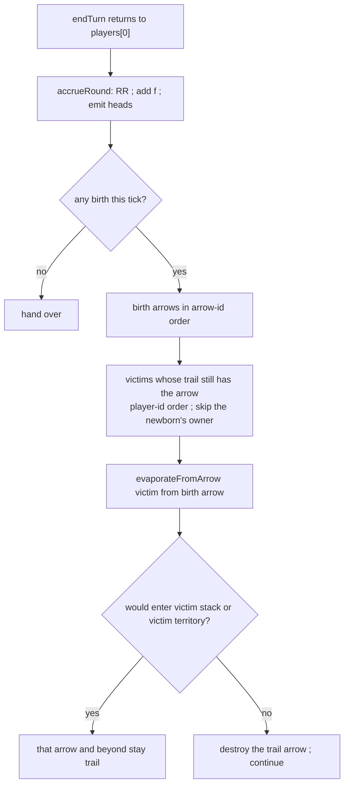

# birth-cut — enemy birth on open trail is a cut

**Packet:** [P40 — Enemy birth on open trail is a cut](../../design/packets/P40-birth-on-trail-is-cut.md)
**SPEC:** §6.1, §7, §11 item 47
**Features:** [core](./birth-cut.core.feature) · [edge cases](./birth-cut.edge-cases.feature)
**Upstream:** [economy](../economy/economy.md) emits the head;
[cuts](../cuts/cuts.md) owns `evaporateFromArrow`.

## Purpose

Playtest: an enemy head appeared on the observer’s open trail (bare marks, no
garrison) and the trail stayed intact. Accrual already refuses to spawn onto an
**occupied** enemy arrow (item 15). Bare trail is not occupation, so the birth
is legal — and until this packet it was not a cut.

A birth onto another player’s trail arrow **is** a cut at that arrow. The
economy does not get a free bypass of the surface you are only hurt on while
growing.

## Scope

In: post-birth cut on foreign trail membership; halt-at-first from the birth
arrow; fork arms; firebreaks; friendly birth is not a cut; blockade still
prevents the birth.

Out: changing the halt rule; treating marks as occupation; combat math;
convert wipe; adapter FX (existing trail-drop detection covers `endTurn`).

## Terms

| Term | Means |
|---|---|
| **birth** | whole heads emitted onto a feed arrow when its accumulator reaches 1 |
| **birth arrow** | that feed arrow, this tick |
| **birth-cut** | `evaporateFromArrow` of each other player whose trail contains the birth arrow |
| **blockade** | an enemy stack on the feed arrow — no birth, so no birth-cut |

## How a birth-cut resolves

Births complete before any cut, so a double-fed arrow that emits once is one
cut pass. The newborn is already the territory owner’s group, so it is not a
victim firebreak.

## Invariants

- When a birth places a head on an arrow that is in another player’s trail, the
  system shall evaporate that player’s trail from the birth arrow under the
  halt-at-first rule.
- When a birth-cut runs, the system shall not treat the newborn as the victim’s
  firebreak.
- When a birth-cut would enter an arrow occupied by the victim, the system shall
  halt and shall leave that arrow and its stack.
- When the birth arrow is a fork stem of the victim’s trail, the system shall
  evaporate both arms until each arm’s firebreak or the victim’s territory.
- When a birth lands on the territory owner’s own trail, the system shall not
  cut that trail.
- When an enemy stack occupies the feed arrow, the system shall neither spawn
  nor birth-cut (existing blockade).
- When a feed arrow is unowned, the system shall neither spawn nor birth-cut.
- The system shall not reduce any head count when resolving a birth-cut.
- The system shall process birth-cuts in arrow-id then player-id order, and
  shall not mutate the input state.

## What this file deliberately does not decide

- Whether marks occupy an arrow for the halt check — they do not (item 15).
- Convert wipe, movement cuts, territory-root cuts — reused, not rewritten.
- Adapter `trailCut` attribution on `endTurn` (mover is the player who ended
  the round). Existing trail-drop detection is enough.

## Counts

11 scenarios (4 core, 7 edge). 9 invariants. Item 47 opened and closed in
SPEC.md. Two distinct birth arrows in one tick (disconnected *trail*
components, so each seed must fire) are pinned by the invariant suite. No new
§11 gap. No unexpected cost.
