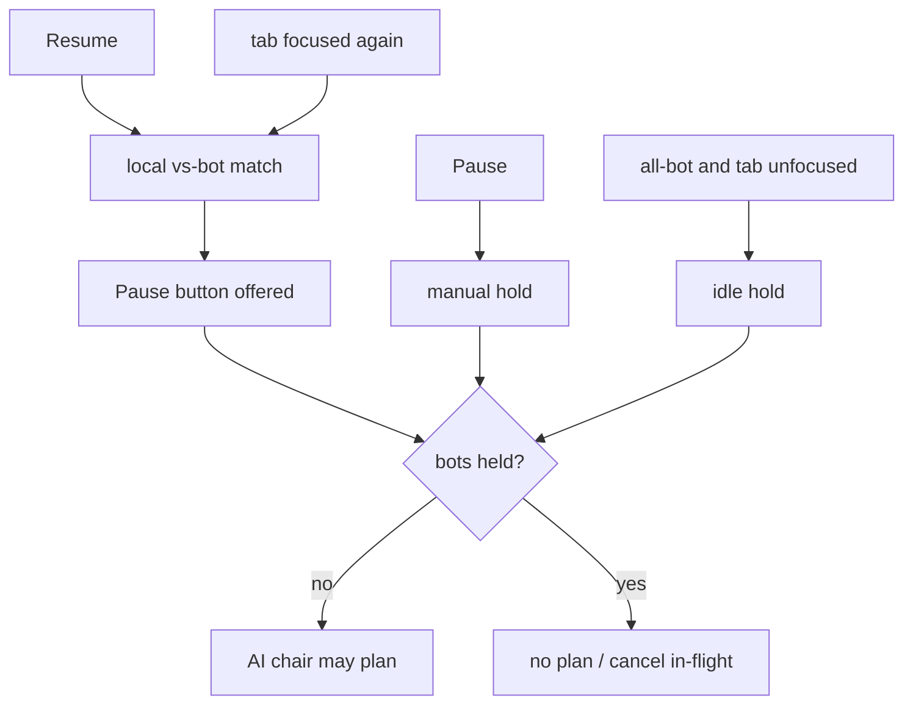

# bot-pause — hold local bot seats without ending the match

**Packet:** none (ADR 0003 follow-up). [ADR 0003](../../adr/0003-pages-direct-byok.md), [`CONTEXT.md`](../../../CONTEXT.md)
**SPEC:** none (adapter presentation / quota brake). Not a game rule.
**Layer:** `packages/web` only. Does not touch `rules-core` or contracts DTOs.
**Features:** [core](./bot-pause.core.feature) ·
[edge cases](./bot-pause.edge-cases.feature)

## Purpose

An all-bot local match otherwise plans every turn until someone wins, including
while the tab sits in the background. BYOK seats then burn the player's key
overnight. A **pause** control holds bot decisions until resumed. **Idle pause**
holds them automatically when an all-bot match's watching tab is not focused.

A human chair is already a quota brake (bots play, then the match waits). Pause
must not block that human from moving on their turn.

## Scope

In: `packages/web/src/botPause.ts` (pure hold/offer/kind helpers) and HUD wiring
in `Hud.tsx` / `App.tsx`. Playback cancel stays P30's chair-key `null` → effect
cleanup.

Out: online matches; the tutorial; ending the match; freezing a human chair;
hosted-LLM / Lambda pump; changing `BOT_PLAYBACK_GAP_MS`.

## BSSN (recorded)

- The Pause **button** is offered on any local vs-bot match (heuristic or BYOK),
  not only all-bot. CONTEXT's pause is a hold on bot decisions; a mixed match
  still wants to stop a BYOK opponent mid-think.
- **Idle pause** is all-bot only, as ADR 0003 states. A mixed match already
  waits at the human chair.
- "Tab not focused" means the document is hidden **or** the window does not
  have focus (`visibilityState !== 'visible'` or `!document.hasFocus()`).
- Manual pause outranks idle: Resume is required after Pause even if the tab
  is focused again. Leaving and returning does not clear a click-pause.
- Lobby / new match clears manual pause.

## Terms

| Term | Means |
|---|---|
| **pause** | operator control that holds bot decisions until Resume |
| **idle pause** | automatic hold on an all-bot match while the watching tab is not focused |
| **hold** | bots must not plan or play; in-flight playback cancels via a null chair key |
| **all-bot** | every seat is `heuristic` or `byok` (no `human`) |
| **vs-bot** | at least one local seat is not `human` |

## Helper shape

```
type PauseKind = 'running' | 'manual' | 'idle'

pauseOffered({ vsBot, online, matchOver, tutorial }): boolean

isAllBot(kinds): boolean

idlePaused({ allBot, tabFocused, online }): boolean

botsHeld({ manual, idle }): boolean

pauseKind({ manual, idle }): PauseKind

pauseButtonLabel(manual): 'Pause' | 'Resume'

turnControlsLocked({ matchOver, botBusy, aiChair }): boolean
```

Normative:

```
pauseOffered = vsBot and not online and not matchOver and not tutorial
isAllBot = kinds is non-empty and none of the kinds is human
idlePaused = allBot and not tabFocused and not online
botsHeld = manual or idlePaused
pauseKind = manual ? 'manual' : idlePaused ? 'idle' : 'running'
pauseButtonLabel = manual ? 'Resume' : 'Pause'
turnControlsLocked = matchOver or botBusy or aiChair
```

App: while `botsHeld`, pass `paused` into the chair-key path by **not calling**
playback (`localAiChairKey` is skipped / the effect sees `null`). Human turn
controls stay enabled when `aiChair` is false.

## Flow



## Invariants

- While `pauseOffered` is false, the system shall not show a Pause control.
- While `botsHeld` is true, the local AI chair key used for playback shall be
  `null`.
- When only `manual` is true, `pauseKind` shall be `manual` and the button
  label shall be `Resume`.
- When `idlePaused` is true and `manual` is false, `pauseKind` shall be `idle`
  and the button label shall be `Pause`.
- When neither hold applies, `pauseKind` shall be `running`.
- The system shall treat a roster as all-bot only when it is non-empty and no
  seat is `human`.
- When a human chair is active, `turnControlsLocked` shall be false unless the
  match is over or `botBusy` is true.
- When an AI chair is active, `turnControlsLocked` shall be true even if
  playback is not busy (so Pause cannot arm Skip / End turn for the bot).
- Idle pause shall not apply when any seat is `human`, including while the tab
  is unfocused.
- Idle pause shall not apply when play is online, even if every seat is a bot
  and the tab is unfocused.
- The pause helper shall not call `Date.now`, `Math.random`, or `fetch`.
- The pause helper shall not import `packages/rules-core`.

## What this file deliberately does not decide

- Heuristic scoring / BYOK prompts.
- Online heuristic burst (ADR 0002).
- Whether a backgrounded mixed match should idle-pause a BYOK opponent — no,
  ADR 0003 limits idle pause to all-bot.
