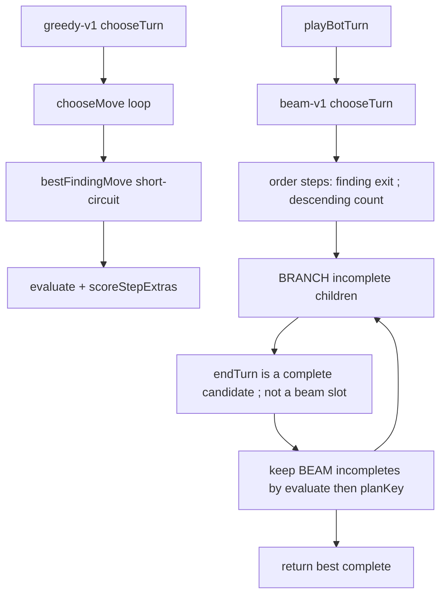

# bot-turn-search — the heuristic learns to stride

**Packet:** [P53 — Bot turn search](../../design/packets/P53-bot-turn-search.md)
**SPEC:** read [§3](../../../SPEC.md) (speed, split vs merge, allowance) and
[§6.2](../../../SPEC.md) (stay-behind: a lone head cannot attack). **No game
rule is added, changed, or implied.** Nothing is owed to SPEC §11.
**Layer:** `packages/web` only. No `contracts` DTO change, no `rules-core`.
Online-api **behaviour** is unchanged (`pagesHeuristic` still calls
`chooseMove`); `tsconfig.json` `include` lists the new web modules so Pages
can typecheck through `opponent`'s import graph.
**Features:** [core](./bot-turn-search.core.feature) ·
[edge cases](./bot-turn-search.edge-cases.feature)

## Purpose

The heuristic cannot perceive SPEC §3. A per-step greedy chooser never sees
that striding a 2-stack two arrows beats shuttling the pair onto the same
destination, because the win appears only after two of the bot's own plies.
On the committed 6-seat baseline
([`P53-baseline-match-2026-08-31.json`](../../design/packets/data/P53-baseline-match-2026-08-31.json))
34 of 71 turns contained a shuttle and no seat's allowance ever exceeded its
head count.

This packet searches **whole turn plans** so that stride, a correct split, a
correct pass, and a one-turn box are visible to `evaluate`. Close valuation,
the spawner mill, and opponent replies stay P54 / P55.

## Scope

In: a `ChooseTurn` seam in `packages/web` (`greedy-v1` frozen, `beam-v1` live);
`playBotTurn` calls `beam-v1`; `findings.ts` demoted to move ordering for the
beam; a symmetric size-scaled mobility term in `evaluate`; `pnpm bots` (advisory
report) plus one committed head-to-head test.

Out: opponent plies (P55); close rate / `close_path` / mill fix (P54); a
strategy registry, lobby difficulty picker, seat-kind change, or match-log
format change; moving search onto a worker; SPEC.md; `rules-core`; retuning
`greedy-v1`'s existing coefficients (`scoreStepExtras`, pair bias, close-urgency,
findings short-circuit, never-pass).

## BSSN (recorded)

These are adapter decisions, not game rules. Written here so phase 2–4 do not
re-litigate them.

1. **No registry.** `ChooseTurn` is a function type plus two named exports.
   Difficulty tiers are a one-line lookup later, not this packet.
2. **Local live, online frozen.** `playBotTurn` (local heuristic / BYOK
   fallback) calls `beam-v1`. Pages `pagesHeuristic` keeps calling
   `chooseMove` (`greedy-v1`'s per-step primitive). No online-api *behaviour*
   change; `packages/online-api/tsconfig.json` `include` lists `botEvaluate.ts`
   and `botSearch.ts` so Pages can still typecheck `chooseMove` through
   opponent's new import graph. Local and online heuristic quality therefore
   diverge until a follow-on lifts the Lambda chooser. Suites that need a
   combat-rich trajectory rather than the live policy (event-legibility's
   match harness) replay the committed P53 baseline log. After P54, frozen
   `chooseTurnGreedy` also homes via `close_path` and no longer mills into a
   cut.
3. **Mobility lives in `evaluate`.** Existing `greedy-v1` coefficients are not
   retuned; `chooseMove` inherits the new term because it already scores with
   `evaluate`. Scale is `MOBILITY_SCALE = 16` so boxing a 3-stack (9 exit-heads)
   reads as 144 — more than a share (100), less than converting that stack
   (720). A coefficient of 1 is a rounding error against `heads * 120` and
   cannot be the gradient P55 relies on.
4. **Beam pool (look-ahead).** The beam holds **incomplete** plans only.
   Every `endTurn` extension is scored as a completed candidate for the return
   value and does **not** occupy a beam slot. A unified "best BEAM of steps
   plus passes" would fill the beam with `endTurn` at depth 1 whenever the
   first step is not yet a share — exactly the myopia this packet exists to
   kill.
5. **Terminal score is `evaluate` only.** `scoreStepExtras` stays on the
   `greedy-v1` per-step path. Beam does not sum it.
6. **Move order for expansion.** Findings rank *exits*, not portions.
   Legal steps sort by: (1) index of the first finding with the same
   `from`+`exit` (`∞` if none), (2) descending `count`, (3) `moveKey`
   ascending. Expand `selectBranch` of that list (size `BRANCH`). Always
   also consider `endTurn` as a complete. `collectFindings` / `pickPortion`
   / the mill skip are **not**
   edited (P54). `pruneCandidates` is `greedy-v1` only. Flattening every
   count of the first exit would fill `BRANCH` and drop the other outs —
   expansion takes each ranked exit at its **max count**, then fills with
   `count=2` (the §3 pair) while slots remain. If slots still remain, take
   further legal steps in the same sort order.
7. **Budgets** (opening bids, named exports): `BEAM = 8`, `BRANCH = 6`,
   `MAX_PLAN = 8` (including the terminating `endTurn`), `MAX_APPLIES = 2000`
   (successful `rules.apply` calls inside one `chooseTurn`, not playback —
   including `collectFindings` on the capped port). `IDLE_SLACK = 16`: a
   pass must beat the best stepped complete by more than this or the
   stepped plan wins (playtest 2026-08-31 pinwheel freeze).
8. **Cap / horizon.** On `MAX_APPLIES` exhaustion or no extendable plan:
   return the best complete found so far (evaluate desc, then `planKey` asc).
   If none is complete, append `endTurn` to the best incomplete — that one
   apply is allowed over the cap so the returned list is always a legal turn.
   A plan with `moves.length === MAX_PLAN - 1` may extend only by `endTurn`.
9. **`pnpm bots`** is advisory, like `pnpm crap`. It is not a CI gate on
   metric values. Default: 3 seeds `{1, 2, 3}` as `spawnerSeed`, baseline
   match config (`playerCount: 6`, `R: 7`, `homeOffset: 5`, `dominationN: 5`),
   50 `endTurn`s, both implementations, print the table. The committed
   head-to-head is **shuttle rate** and **count>1 share** on the reconstructed
   baseline heuristic turns (the same position set as BSSN 10). Shares-at-50
   and closes-per-100 stay in the report; they are P54's race. Plan search
   at 50 turns of 6-seat self-play did not beat greedy on those two (greedy
   mills shares; beam strides). Requiring that would invent a close-value
   term this packet forbids.
10. **Shuttle rate on the baseline position set** replays the committed log
    to each heuristic seat's turn-start (seat E in that log is human — skip
    those turns), then re-plans with `beam-v1`. It does not continue the
    greedy game. Bar: shuttle in **< 10%** of those plans.
11. **`evaluate` does not treat occupancy as a share.** `sharesOf` counts
    *territory* on a spawner-border arrow. Stepping onto an unowned border
    marks trail, not a claim — so a barren run "to a share" does not raise
    the terminal score, and `endTurn` can beat it. Constructed stride is a
    **two-arrow homeward close**: the 2-stack sits on own trail, grain
    distance 2 from own territory, both steps legal at `count=2`. Landing
    claims (territory, possibly shares). Shuttle advances one arrow and
    does not land. Constructed split is a **4-stack splitting 2+2** onto two
    territorial outs: `stackShapeScore` already values two pairs above one
    4-stack (§3, the pair is free), so that terminal evaluates higher than
    passing or walking the 4-stack one way. Do not add an occupancy term.
12. **Pass-is-correct** is constructed as: every legal step's one-step
    terminal evaluates strictly worse than `endTurn` on the current state
    (leave a share, or unbox an enemy). Not a new game rule — an `evaluate`
    cliff the search is allowed to respect.
13. **Box construction.** Occupying O with a **1-stack** leaves a lone tip
    on trail after `endTurn` (`stackShapeScore` −90) that outweighs
    `MOBILITY_SCALE * 1`. The constructed box uses a **2-stack** parking on
    O (pair stays; §6.2 still means the enemy 1-stack cannot attack it).
    Do not raise `MOBILITY_SCALE` to paper over the lone-tip term.

## Terms

| Term | Means |
|---|---|
| **chooseTurn** | `(geometry, rules, state, me) => readonly Move[]` — a full turn, last move `endTurn` |
| **greedy-v1** | today's `chooseMove` loop behind that signature, **frozen** (never-pass, findings short-circuit, `scoreStepExtras`) |
| **beam-v1** | beam search over incomplete turn plans; the live local heuristic |
| **turn plan** | ordered moves for one seat, terminated by `endTurn` |
| **shuttle** | two `count=1` steps in the same plan that share `from` **and** `exit` |
| **stride** | one group spending its §3 allowance as a stack — a 2-stack taking two arrows, a 4-stack taking three |
| **box** | every legal exit of a group denied (territory-illegal + §6.2 stay-behind) |
| **mobility** | `MOBILITY_SCALE * Σ_groups sign(owner) × heads × legalExits(group)` |
| **legalExits** | distinct `exit` values among legal **step** moves from that group's arrow, computed as if that group's owner were the active seat (`legalMoves` is otherwise only the mover's list) |
| **moveKey** | `step:{from}>{exit}:{count}` or `endTurn` |
| **planKey** | `moveKey`s joined with `\|` (a character `moveKey` never contains) |
| **apply count** | successful `rules.apply` calls inside one `chooseTurn` search |

*arrow*, *stack*, *head*, *share*, *trail*, *point*, *vertex* keep their
AGENTS.md meanings. *shuttle* is not SPEC §3's **conveyor** (a priced
concentration manoeuvre). *box* is not P52's **safe box**.

## Module boundary (normative)

Search and `evaluate` stay **pure**: no `Date`, no `Math.random`, no
`performance.now`, no elapsed-time cutoff, no I/O. Ties break on `planKey` /
`moveKey`, never on `Map`/`Set` insertion or identity. `rules.legalMoves` and
`rules.apply` are the only engine traffic. Geometry is `GeometryPort`.

```ts
export type ChooseTurn = (
  geometry: GeometryPort,
  rules: RulesPort,
  state: GameState,
  me: PlayerId,
) => readonly Move[];

export const BEAM = 8;
export const BRANCH = 6;
export const MAX_PLAN = 8;
export const MAX_APPLIES = 2000;
export const MOBILITY_SCALE = 16;
export const IDLE_SLACK = 16;

export const chooseTurnGreedy: ChooseTurn; // greedy-v1
export const chooseTurnBeam: ChooseTurn;   // beam-v1

export const playBotTurn: (
  geometry: GeometryPort,
  rules: RulesPort,
  state: GameState,
  me: PlayerId,
) => BotTurn; // plans with chooseTurnBeam, then folds apply for `state`
```

`chooseMove` remains exported: it **is** greedy-v1's per-step primitive
(Pages heuristic, BYOK per-step fallback, P21 tests).

When `state.activePlayer !== me` or `state.winner` is set, both `chooseTurn`
implementations and `playBotTurn` return an empty list / `{ state, moves: [] }`.

## greedy-v1 (frozen)

Normative: identical to today's `playBotTurn` loop, except `evaluate` now
includes mobility.

```
moves := []
at := state
loop at most 64 times while at.activePlayer === me and winner unset:
  pick := chooseMove(geometry, rules, at, me)
  at := apply(at, pick)
  append pick
if still our chair: apply endTurn and append it
return moves
```

`chooseMove` still: prune candidates; **never pass while a step is legal**;
return `bestFindingMove` whole when that step is in the pruned set; else
argmax `evaluate(next) + scoreStepExtras` with `moveKey` ties.

Do not retune those weights in this packet.

## beam-v1 (normative)

```
moveKey(step) = "step:{from}>{exit}:{count}"
moveKey(endTurn) = "endTurn"
planKey(moves) = moveKey(m) joined with "|"

legalExits(state, arrow) =
  |{ exit | some legal step has from=arrow and that exit }|

sign(owner) = +1 if owner === me else −1

mobility(state) =
  MOBILITY_SCALE * Σ over groups in state.groups
    sign(group.owner) * group.heads * legalExits(state, arrow)
  (0 when `rules` is omitted from evaluate, matching stackShapeScore)

evaluate(...) includes the pre-P53 terms plus + mobility(state)

orderSteps(state):
  findings := collectFindings(..., DEFAULT_FINDINGS_CAPS, playLayout)
  findingRank(from, exit) := index of first finding whose move has that from+exit
                             or +∞
  legal steps sorted by:
    findingRank ascending, then count descending, then moveKey ascending

selectBranch(sorted, BRANCH):
  take each distinct from+exit at its first occurrence (max count, given the sort)
  then remaining count=2 steps in sort order
  then any leftover legal steps in sort order, until BRANCH

betterComplete(a, b):
  evaluate(a.state) > evaluate(b.state)
  or equal and planKey(a.moves) < planKey(b.moves)

chooseTurnBeam(state):
  if not our chair or winner set: return []
  applies := 0
  beam := [ { moves: [], state } ]          # incomplete only
  best := undefined                         # best complete
  considerEnd(parent):
    if applies < MAX_APPLIES:
      after := apply(parent.state, endTurn); applies += 1
    else
      after := apply(parent.state, endTurn) # allowed over cap to terminate
    child := { moves: parent.moves + [endTurn], state: after }
    if best is undefined or betterComplete(child, best): best := child

  loop:
    extendable := [p in beam
      | p.moves.length < MAX_PLAN
        and p.state.activePlayer === me
        and p.state.winner unset]
    if extendable is empty: break
    next := []
    for p in extendable in current beam order:
      if p.moves.length === MAX_PLAN - 1:
        considerEnd(p); continue
      steps := selectBranch(orderSteps(p.state), BRANCH)
      for s in steps:
        if applies >= MAX_APPLIES: break both
        after := apply(p.state, s); applies += 1
        child := { moves: p.moves + [s], state: after }
        if after.activePlayer !== me or after.winner set:
          if best is undefined or betterComplete(child, best): best := child
        else:
          next.push(child)
      considerEnd(p)
      if applies >= MAX_APPLIES: break both
    if next is empty: break
    next sorted by evaluate desc, then planKey asc
    beam := first BEAM of next

  if best is undefined:
    considerEnd(best incomplete in beam, or the seed)
  if best is [endTurn] and a stepped complete exists
     and score(best) − score(bestStepped) ≤ IDLE_SLACK:
    return bestStepped.moves
  return best.moves
```

`applies` is an implementation counter, not an observable except: it never
exceeds `MAX_APPLIES` for search applies (every successful `rules.apply`
inside `chooseTurn`, including `collectFindings` on the capped port), and a
returned plan is always a legal sequence that hands the seat on (or the
match is over). One forced terminating `endTurn` may apply over the cap.

## Mobility (normative)

Added to `evaluate` after the pre-P53 sum, when `rules` is passed:

```
mobility = 0
for each [arrow, group] of state.groups:   # sum is commutative
  exits = number of distinct legal step exits from arrow
  mobility += sign(group.owner) * group.heads * exits
return previousEvaluate + MOBILITY_SCALE * mobility
```

Winner short-circuits still dominate (`±1_000_000`). Own groups with many
exits raise the score; an enemy group with none (a **box**) raises it by
`MOBILITY_SCALE * enemyHeads * (exitsBefore − 0)` relative to the unboxed
position. Size scaling is what makes boxing a 3-stack the 6-head-shaped
swing the packet wants the gradient to hint at — conversion itself stays
several turns away (P55 / §6.3).

## Idle slack (normative)

Playtest 2026-08-31 (after P53–P55): `tipTerm` made the first step off the
home pinwheel score ~9–14 below `[endTurn]`, so `beam-v1` froze. Greedy-v1
never-passes; beam-v1 still may pass when that is clearly better (a lone
tip walking onto trail). A pass must beat the best stepped complete by
more than `IDLE_SLACK = 16` (one `MOBILITY_SCALE`) or the search returns
that stepped plan.

## `pnpm bots` (advisory)

Root script `pnpm bots` prints one table, two rows (`greedy-v1`, `beam-v1`):

| column | meaning |
|---|---|
| shuttle rate | fraction of turns whose plan contains a shuttle |
| count>1 share | fraction of `kind=step` moves with `count > 1` |
| steps per turn | mean step count per turn |
| closes / 100 turns | closes using P32's territory-gain proxy, scaled |
| firstCloseAt | P32: index of the first closing move, or unset |
| shares at turn 50 | `Σ_players sharesOf` after 50 `endTurn`s |
| mean applies / turn | search `rules.apply` calls per `chooseTurn` |

No absolute threshold. Mean applies / turn must stay ≤ `MAX_APPLIES`.

**Head-to-head (committed):** on the reconstructed baseline heuristic
turn-starts (BSSN 10; skip the human seat), `beam-v1`'s shuttle rate is
below `greedy-v1`'s and its share of `count > 1` steps exceeds
`greedy-v1`'s. Shuttle rate is also below 10% of those turns. Shares-at-50
and closes-per-100 stay in this report only (P54). Relative: re-point the
pair when a later packet supersedes `beam-v1`.

## Flow



## Invariants

1. When `playBotTurn` is given the active local heuristic seat and the match
   is not over, the system shall return `chooseTurnBeam`'s move list (then
   fold `apply` for `state`).
2. When `chooseTurn` is invoked twice on equal inputs, the system shall
   return byte-identical move lists.
3. When two completes tie on `evaluate`, the system shall pick the smaller
   `planKey`.
4. The system shall not use `Date`, `Math.random`, `performance.now`, or an
   elapsed-time cutoff anywhere in `chooseTurn` / `evaluate` mobility.
5. WHILE expanding, the system shall not let search `rules.apply` count
   exceed `MAX_APPLIES`.
6. When the apply cap fires, the system shall still return a legal plan that
   ends in `endTurn` (or in a move that already handed the seat / ended the
   match).
7. When a 2-stack on own trail has a two-arrow homeward close whose landing
   evaluates higher than a shuttle or a pass, `beam-v1` shall stride it with
   two `count=2` steps and shall not emit a shuttle.
8. When a fresh 4-stack has a clear three-arrow run whose deepest terminal
   evaluates highest, `beam-v1` shall take that run in three steps; the last
   hop may drop a leftover pair (`count` 2 or 4).
9. When two separate destinations each raise `evaluate` more than one deeper
   advance (a 4-stack splitting 2+2), `beam-v1` shall split.
10. When an enemy 1-stack has one open exit and its other exits are the
    bot's territory, and the bot can occupy that open arrow this turn without
    a competing share/close, `beam-v1` shall put a head on that arrow.
11. When every legal step's terminal `evaluate` is worse than passing by
    more than `IDLE_SLACK`, `beam-v1` shall return `[endTurn]` even though
    steps are legal.
12. WHILE `greedy-v1`'s `chooseMove` sees a legal step, the system shall not
    return `endTurn` from `chooseMove`.
13. The system shall not let `bestFindingMove` short-circuit `beam-v1`: a
    findings-ranked shuttle shall lose to a higher-`evaluate` stride.
14. The system shall compute mobility as
    `MOBILITY_SCALE * Σ sign × heads × legalExits` over every group.
15. When an enemy group's legal exits drop and nothing else in `evaluate`
    changes, the system shall raise `evaluate` by
    `MOBILITY_SCALE × enemyHeads × exitsLost`.
16. Shuffling `state.groups` / `state.territory` insertion order shall not
    change `beam-v1`'s plan.
17. The system shall not import `packages/rules-core` from new search
    modules except through `RulesPort`.
18. `pagesHeuristic` shall keep calling `chooseMove` (no `online-api` change).
19. On the committed baseline heuristic turn-starts, `beam-v1`'s shuttle
    rate shall be below `greedy-v1`'s, and its share of steps with
    `count > 1` shall exceed `greedy-v1`'s.
20. On the committed baseline heuristic turn-starts, `beam-v1`'s shuttle
    rate shall be below 10% of those turns.
21. Returned plans shall be a prefix of legal moves from the start state,
    each applied to the state produced by the previous, last move handing
    the seat or ending the match.
22. When a 6-seat opening has taken the 2026-08-31 playtest first round
    (heuristic seats milled a 2-stack onto a sibling home arrow; the human
    left home) and the next heuristic seat still has a legal step,
    `beam-v1` shall include a `step`. Sitting on the home pinwheel must not
    evaluate as a pass.

## What this file deliberately does not decide

- Close value as a rate, `close_path`, superlinear shares, mill rewrite —
  [P54](../close-and-spawner-value/close-and-spawner-value.md).
- One enemy reply, exposure as worst-reply, search reuse at a smaller budget
  — [P55](../opponent-ply-and-denial/opponent-ply-and-denial.md).
- Whether Pages should call `chooseTurnBeam` — not this packet (BSSN 2).
- Retuning `BEAM` / `BRANCH` / `MAX_PLAN` / `MOBILITY_SCALE` after
  playtesting — named exports, same algorithm.
- A worker thread.

## Spec files

- `bot-turn-search.core.feature` — 10 scenarios
- `bot-turn-search.edge-cases.feature` — 17 scenarios
- Invariants above — 21 EARS one-liners
