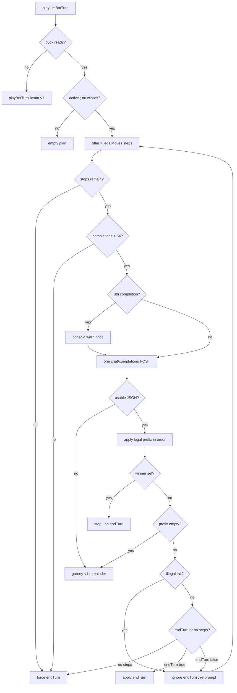

# byok-batch-turn — one completion commits an ordered step batch

**Packet:** [P61 — BYOK commits a step batch per completion](../../design/packets/P61-byok-batch-turn.md)
**Depends on:** P15 (`byokBot.ts`), P11. P30 still plays back the returned `Move[]`
with 400 ms gaps. Pages still calls `chooseMove`.
**SPEC:** read [§3](../../../SPEC.md) (speed, split, inherit `spent`) and
[P38](../won-is-over/won-is-over.md) (a won match offers nothing). **No game
rule is added, changed, or implied.** Nothing is owed to SPEC §11. Do not edit
SPEC.md. Do not burst [bot-turn-search](../bot-turn-search/bot-turn-search.md)
or rewrite P53 shuttle/stride scenarios.
**Layer:** `packages/web` adapter only (`byokBot.ts` and its tests). No
`contracts`, `rules-core`, or `online-api` behaviour change. `greedy-v1` stays
frozen.
**Features:** [core](./byok-batch-turn.core.feature) ·
[edge cases](./byok-batch-turn.edge-cases.feature)

**Counts:** 21 scenarios (11 core, 10 edge) · 18 invariants · 0 deferred ·
0 SPEC §11 items. Prompt-contract assertions live on core scenario 1.

## Purpose

P15 loops `chooseLlmMove` over numbered `legalMoves` and `apply` until
`endTurn`. Each completion picks **one** step. A 3-stack's `count=1` and
`count=3` sit as sibling indices, so the model peels singletons even when a
lump is legal. Same class of bug P53 fixed for `beam-v1` by searching a whole
turn.

This packet does not search. It changes the **reply contract**: one completion
returns an ordered index batch plus an `endTurn` flag. The adapter applies the
legal prefix, re-prompts from the new offer when the model under-specified,
and falls back to frozen `greedy-v1` only when that prefix is empty.

## Scope

In: `packages/web/src/byokBot.ts` — offer (steps only), batch JSON parse, one
`chat/completions` per completion with no extract retry and no turn runner,
`playLlmBotTurn` completion loop, seat-turn `byokStats`, prompt contract
(guidance, not a filter).

Out: offer-filter / coalescing singletons into a lump / forbidding shuttle;
enumerating complete turn plans; calling `chooseTurnBeam` on parse fail;
unfreezing `greedy-v1`; P58 personalities; P60 worker / HUD-during-think;
Pages lift onto `chooseTurnBeam`; MCP adapter; online BYOK (P20+); resurrecting
`tools/byok-turn-runner`; lobby runner checkbox removal; new match-log fields;
editing SPEC.md; a new `Move` kind; spending more `max_tokens` so the model
"notices" tempo.

## BSSN (recorded)

Adapter decisions, not game rules. Written here so phases 2–4 do not
re-litigate them. No SPEC §11 item.

1. **One live turn protocol.** `playLlmBotTurn` is the only BYOK seat-turn
   loop. It must not call `chooseLlmMove`. `chooseLlmMove`, `fetchLlmMoveIndex`,
   and `parseMoveIndex` are not the live contract — delete them, or leave them
   unused. This packet's tests go through `playLlmBotTurn` / `parseMoveBatch` /
   `fetchLlmMoveBatch`. Do not leave two live turn protocols.

2. **JSON batch only. No batch tag. No extract retry.** Distinctive
   `<<<MOVE:N>>>` / `<<<MOVES:…>>>` tags are not v1. Parse is deterministic
   without a second completion. Unusable text → empty prefix, not a salvage
   POST.

3. **Parse.** Take `extractReplyText` (non-empty `content`, else
   `reasoning_content`). Trim. Strip one optional wrapping markdown fence
   (` ``` ` / ` ```json ` as the first and last lines). `JSON.parse`. Usable
   iff the value is a non-null object, `moves` is an array, and `endTurn` is a
   boolean. `why` is optional and ignored for control flow. Extra keys are
   ignored. Each `moves` entry must be an integer (JSON number, `Number.isInteger`).
   A non-integer entry makes the whole reply **unusable** (malformed), not an
   illegal item. Negative and out-of-range integers stay in the array and
   become illegal items at apply time. No digit harvest from prose. No
   last-match-wins.

4. **Offer.** `movesForLlm(legalMoves(state))` is the engine list **filtered to
   `kind === 'step'`**, unfiltered by count, in **engine `legalMoves` order**.
   `endTurn` is never an index. Empty offer (no legal step) → do not POST;
   force `endTurn` (same as §2.5 / §2.4). Membership of a mapped step in
   `legalMoves(now)` uses `movesEqual`.

5. **Apply prefix.** Snapshot the offer at POST time. Map each integer index
   onto that snapshot (`undefined` / out of range → illegal item). Apply in
   array order while the mapped step is in `legalMoves(now)`. Stop at the first
   that is not. That stop is the **legal prefix**; the rest (including the
   stopper) is the **illegal tail**. Do not skip an illegal item to apply a
   later legal one.

6. **Empty prefix → one `greedy-v1` remainder.** Unusable JSON, HTTP / fetch
   failure, every index illegal, or `moves: []` with `"endTurn": false`. Then
   `chooseTurnGreedy` (the frozen `chooseMove` loop) from the state after any
   already-applied moves of this seat-turn, until `endTurn` or the seat is
   handed / the match is won. **One** fallback. Do not POST again this
   seat-turn. Do **not** call `chooseTurnBeam` / `playBotTurn` on this path.

7. **not-ready is a different split.** `!isByokReady(config)` still calls
   `playBotTurn` (`beam-v1`), never this batch protocol and never the
   empty-prefix `chooseMove` remainder. `llmHits = 0`, `llmFallbacks = 0`,
   `lastError = 'byok not ready'`. Not an empty-prefix fallback.

8. **`useTurnRunner: true` does not call the runner.** `fetchLlmMoveBatch`
   POSTs OpenAI `chat/completions` only. No `/v1/pick`. Lobby checkbox stays;
   this packet does not wire `useTurnRunner`.

9. **`testByokConnection` is still the tiny probe** `{"move":0,"why":"probe"}`.
   Do not retarget it at the batch contract.

10. **HTTP dialect unchanged.** `temperature: 0`, `response_format: json_object`,
    thinking off (P15 `BYOK_THINKING_OFF`). Token budgets unchanged
    (`BYOK_REASONING_MAX_TOKENS` / `BYOK_FAST_MAX_TOKENS`). No conversation
    history: every completion is one system message plus one user message.

11. **Prompt is guidance, not a filter.** System: pick an ordered `moves`
    index array from this offer; set `endTurn` when the seat is done. Keep
    P15's rules / tempo / priorities prose (including “send a `2^k` lump as
    one count”). Do **not** claim the adapter will reject a shuttle. User:
    `STATE_JSON` + targets + phase hint + numbered steps **grouped by `from`**
    (arrow id, never seat letters) with **global `[i]`**. Groups appear in
    first-seen-in-offer order; within a group, increasing index. Not “pick
    one index.” `endTurn` is described as a flag, not a numbered row.

12. **Completions cap 64** (same bound as today's `MAX_MOVES_PER_TURN`, now
    counting POSTs, not applied steps). When the 8th completion of this
    seat-turn is about to be issued, `console.warn` once (not a fallback, not
    a match-log field). After 64 completions, if the seat is still active and
    `winner` is unset, force `endTurn`. No 65th POST. No separate applied-step
    cap: a single batch may apply every still-legal mapped step.

13. **`byokStats` count seat-turns.** Same JSON fields, new meaning:
    - `llmHits += 1` iff this seat-turn never took the empty-prefix fallback
    - `llmFallbacks += 1` iff it did (including after a good prefix on an
      earlier completion)
    A listed under-walk / pass / forced `endTurn` (no steps left, cap, empty
    offer) is a **hit**. Fallback is HTTP / parse / empty prefix only.
    `lastError` may record illegal-tail indices or the empty-prefix reason
    even on a hit; never secrets (API key, `Authorization`, proxy token,
    raw key material). Match log still stores every applied `Move`.

14. **P38 mid-batch win.** After each applied step, if `winner` is set:
    stop. Do not apply the rest of the batch. Do not `endTurn`. Do not
    re-prompt. Not a fallback.

15. **SPEC §3 leftover.** A lump then a 2-way split from the landing is
    engine-legal: both parts inherit `spent`, so a leftover 1-stack with
    `spent === speed(1)` does not take a second tile. The adapter must not
    treat that split as illegal or coerce peel-then-lump.

16. **No “never three `count=1`” chooser assert.** The engine list stays.
    Tests may mock a lump **and** mock three singletons; both apply. Shuttle
    flood is a later log, not this packet's filter.

17. **Target locks stay prompt-only.** Keep `syncTargetLocks` /
    `formatTargetsForPrompt` on the user prompt and `advanceTargetLock` on
    applied moves. They must not retarget fallback at `chooseTurnBeam`.

18. **P30 / Pages / P53 untouched.** Playback still consumes the returned
    `Move[]`. `pages-heuristic.ts` still imports `chooseMove`, not
    `chooseTurnBeam`. This packet's diff does not edit
    `docs/spec/bot-turn-search/` or P53 shuttle/stride constructions.
    `greedy-v1` output on those baseline positions is unchanged.

## Terms

| Term | Means |
|---|---|
| **offer** | `legalMoves(state)` steps only, engine order, one global index space `[0]…[n-1]` |
| **completion** | one `chat/completions` POST and its reply; no conversation history |
| **batch** | the reply's `moves` index array plus required `endTurn` flag |
| **legal prefix** | longest leading span of mapped steps that each remain in `legalMoves(now)` when applied in order |
| **illegal tail** | the rest of the array from the first illegal item inclusive |
| **empty prefix** | unusable JSON, HTTP/fetch failure, every index illegal, or `moves: []` with `"endTurn": false` |
| **seat-turn** | one `playLlmBotTurn` call; the unit `llmHits` / `llmFallbacks` count |
| **hit** | a seat-turn that never took the empty-prefix fallback |
| **fallback** | empty prefix → frozen `greedy-v1` (`chooseMove` / `chooseTurnGreedy`) for the **whole remaining** seat-turn |
| **greedy-v1** | frozen per-step `chooseMove` loop (`chooseTurnGreedy`). Never-pass while a step is legal |
| **beam-v1** | live local heuristic. `playBotTurn` calls this. Used for **not-ready** only, not empty-prefix |
| **shuttle** | split-and-remerge onto the same destination (CONTEXT). Engine-legal; adapter does not hide it |
| **stride** | spending a stack's SPEC §3 allowance as intended. Not this chooser's job |
| **under-walk** | whole `moves` array applied and `"endTurn": true` while a step remained — legal pass |

Reserved elsewhere, not this packet: *island*, *forge*, *armory*, *gate*,
*anvil*, personality, worker.

## Helper shape

```
movesForLlm(legalMoves) -> steps only, engine order

parseMoveBatch(text) -> { indices: number[], endTurn: boolean } | unusable

fetchLlmMoveBatch(...) -> one chat/completions
  no extract retry, no /v1/pick, no conversation history

playLlmBotTurn -> completion loop below
```

Normative loop (ready config, active seat, no winner yet):

```
moves = []
at = state
completions = 0
fellBack = false
while at.winner is unset and at.activePlayer is me:
  offer = movesForLlm(legalMoves(at))
  if offer is empty:
    force endTurn; break
  if completions >= 64:
    force endTurn; break
  if completions == 7: console.warn   # 8th completion about to issue
  completions += 1
  reply = fetchLlmMoveBatch(offer)    # one POST
  parsed = parseMoveBatch(reply)
  prefix, tail = applyMapped(offer, parsed, at)
  append prefix to moves; at = after prefix
  if at.winner is set: break          # P38; no endTurn
  if prefix is empty:
    remainder = chooseTurnGreedy(at)  # greedy-v1, not beam-v1
    append remainder; fellBack = true; break
  if tail is nonempty:
    ignore parsed.endTurn; continue   # re-prompt unless offer now empty
  if offer-after-prefix is empty OR parsed.endTurn:
    if still active and no winner: apply endTurn
    break
  # parsed.endTurn is false and steps remain → re-prompt
if still active and no winner: force endTurn
llmHits = fellBack ? 0 : 1
llmFallbacks = fellBack ? 1 : 0
```

`applyMapped`: out-of-range / unmapped index is an illegal item. Stop at the
first item that is not in `legalMoves(now)` under `movesEqual`. Log every
illegal-tail index on `lastError` (no secrets).

Wrong seat or `winner` already set at entry: `{ state, moves: [], llmHits: 0,
llmFallbacks: 0, lastError: undefined }` — unchanged from P15.

## Flow



## Invariants

1. WHEN `playLlmBotTurn` runs with a ready config and the mock returns a full
   origin batch plus `"endTurn": true`, the system shall issue exactly one
   completion.
2. WHEN the legal prefix is nonempty and an illegal tail remains, the system
   shall ignore `"endTurn": true` and shall re-prompt from the post-prefix
   state unless no legal step remains (then it shall force `endTurn`).
3. WHEN the prefix is empty, the system shall finish the remaining seat-turn
   with `greedy-v1` (`chooseMove` / `chooseTurnGreedy`) and shall not call
   `chooseTurnBeam`.
4. WHEN the prefix is empty, the system shall not issue an extract-retry POST.
5. The system shall apply a mocked `count=3` lump and shall also apply three
   mocked `count=1` steps when those indices stay legal — it shall not hide
   singletons and shall not assert “never three `count=1`.”
6. WHEN `moves` is `[]` and `"endTurn"` is true, the system shall apply
   `endTurn` only (a pass) and shall count `llmHits = 1`.
7. WHEN `moves` is `[]` and `"endTurn"` is false, the system shall treat the
   prefix as empty, run `greedy-v1` for the remainder, and count
   `llmFallbacks = 1`.
8. WHEN a whole `moves` array applies and no legal step remains, the system
   shall force `endTurn` even if `"endTurn"` is false, and shall count a hit.
9. WHEN one successful seat-turn uses several completions, `llmHits` shall be
   1 and `llmFallbacks` shall be 0.
10. WHILE the offer is built, `endTurn` shall not occupy an index.
11. WHEN two different `from` arrows appear in one `moves` array, the system
    shall apply them in array order.
12. WHEN an applied prefix sets `winner`, the system shall stop, shall not
    apply `endTurn`, and shall not count a fallback.
13. WHEN the 8th completion of a seat-turn is issued, the system shall
    `console.warn` once and shall not count a fallback. WHEN 64 completions
    have been issued and the seat is still active with no winner, the system
    shall force `endTurn` and shall not POST a 65th time.
14. WHEN config is not ready, the system shall call `playBotTurn` (`beam-v1`)
    and shall not run the batch protocol.
15. WHEN `useTurnRunner` is true, the system shall still not call the turn
    runner (`/v1/pick`).
16. `testByokConnection` shall still accept a `{"move":0}` probe.
17. WHEN the same state and the same mock replies are given twice, the
    returned `Move[]` shall be byte-identical. Offer order shall be
    `legalMoves` order. The chooser paths in `byokBot.ts` shall not use
    `Date.now`, `Math.random`, or `performance.now`.
18. `packages/online-api/src/pages-heuristic.ts` shall keep importing
    `chooseMove` and shall not import `chooseTurnBeam`. This packet shall not
    rewrite `docs/spec/bot-turn-search/` or change `greedy-v1` output on P53
    baseline positions.

## What this file deliberately does not decide

- Game rules (cuts, closure, combat, economy, win). SPEC.md is silent here
  because this is not a game packet — do not add a §11 item.
- Offer-filter / hiding dominated singletons / coalescing `[i,i,i]` into
  `count=3` (grilled and rejected).
- Numbered complete turn plans (grilled and rejected).
- `beam-v1` finalists as the BYOK offer.
- Worker, lobby runner checkbox removal, match-log new fields, HUD copy.
- Online BYOK (P20+).
- Whether Pages should call `chooseTurnBeam` (P53 BSSN 2, still later).
- P58 personalities, P60 HUD-during-think, MCP adapter.
- The 2026-09-02T15:17 6-seat quiet-board freeze.

## Game-rule edges (out of scope)

Cut mid-closure, fork-stem cut, chord coincide vs interleave, pincer arms on
different turns, land bridge vs enclosing heads, accumulator capture, stack
reduced to one head, stranded head, contested spawn (SPEC §11 item 15), cell
far from origin (item 4): **not this packet**. Engine behaviour is unchanged.
The leftover-after-lump case in core scenario 3 **reads** SPEC §3 inherit
`spent`; it does not change it.
