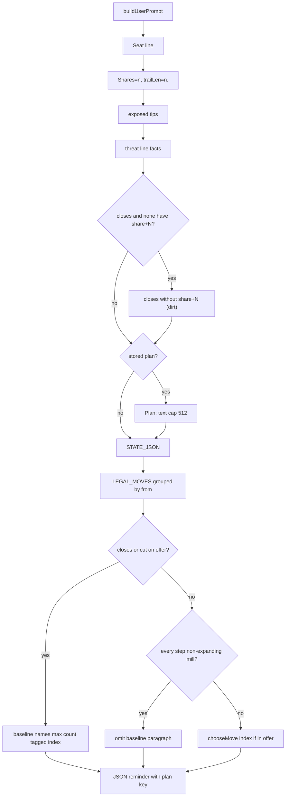

# byok-hint-and-threat — tags are hints, threat line, lump-close baseline, plan echo

**Packets:** [P64 — BYOK: tags are hints, threat line, lump-close baseline, plan echo](../../design/packets/P64-byok-hint-and-threat.md)
· [P66 — BYOK: plan budget, dirt close, tag-chase rewrite](../../design/packets/P66-byok-plan-budget-and-dirt.md)
(amends this directory — **do not open a new spec dir**).
**Depends on:** P64 (which depends on P63, P62, P61, P15, P11). P65 is
heuristic-only and is not edited here. P30 playback unchanged.
**SPEC:** read [§1](../../../SPEC.md) (existing non-normative teaching pointer
only — **do not add a second**), [§2](../../../SPEC.md) (grain, 3-in / 3-out,
girth 3), [§3](../../../SPEC.md) (`speed(N)`, inherit `spent`). **No game rule
is added, changed, or implied.** Teaching stays **non-normative**. If it
disagrees with SPEC.md, SPEC wins. Nothing is owed to SPEC §11.
**Layer:** `packages/web` adapter (`byokBot.ts`, `App.tsx`) +
`docs/byok-teaching.md` + recorded-offer fixtures. No `contracts`,
`rules-core`, or `online-api` behaviour change. `greedy-v1` / `chooseMove`
stay frozen as the named *chooser*. P66 does not change which row the
baseline sentence names.
**Features:** [core](./byok-hint-and-threat.core.feature) ·
[edge cases](./byok-hint-and-threat.edge-cases.feature)

**Counts:** 30 scenarios (15 core, 15 edge) · 30 invariants · 0 deferred ·
0 SPEC §11 items.

Do not burst [byok-batch-turn](../byok-batch-turn/byok-batch-turn.md),
[byok-teaching-prompt](../byok-teaching-prompt/byok-teaching-prompt.md),
[byok-thinking-teach](../byok-thinking-teach/byok-thinking-teach.md),
[bot-turn-search](../bot-turn-search/bot-turn-search.md), or
[mission-and-staging](../mission-and-staging/mission-and-staging.md). Do not
rewrite P61’s apply-prefix / empty-prefix / `llmHits` seat-turn loop. Do not
touch `chooseTurnBeam`.

## Purpose

Playtest `conquarrow-match-2026-09-08T18:00:34.723Z` (R=7, seed 1, 3 seats:
A heuristic / B grok-4.6 BYOK / C human) never saw a `cut` on B’s offer.
`on_target` was treated as an order. Hit 12 had a count=3 `closes` on the
offer and the model played `[4,0]` (2 outward + 1 close) because the weak
baseline named `[0]` count=1 and the header never said C led shares. Hit 15
correctly passed a mill-only leftover; the baseline must stop advertising
that mill.

P64 changed **prompt facts and one store**: tags-are-hints teaching,
one threat line, a lump-close/cut baseline sentence, a `plan` echo, and
spawner-row rank / near-trail tags so observation is not lex-first-12 of
the centre belt. Apply-prefix is untouched. Temperature is not this packet.

P66 is a content follow-up from playtest
`conquarrow-match-2026-09-10T06:57:10.109Z` (R=7, seed 1, 3 seats:
A heuristic / B grok-4.6 BYOK / C human). P64 plumbing worked; P64 *content*
did not: hit 0 stored a tag-chase plan (`continue on_target…`); hits 5 and 9
executed a `closes` row with no `share+N` (dirt; shares stay 4) while
`borders_spawner` lumps sat on the offer; hit 13 correctly passed a mill-only
offer. This amend raises the plan budget 80 → 512, teaches dirt close /
factory-share / tag-chase rewrite as **outcomes not orders**, and adds one
header clause when every `closes` row on the offer lacks `share+N`. It does
not invent a `cut` or `deny` tag, does not reopen P64 §4.1 spawner rank,
and does not call grok in CI.

## Scope

In (P64, still live): `docs/byok-teaching.md` (one paragraph under “Close,
cut, mill”; JSON contract `plan` key; `## Plan`); `buildUserPrompt` threat
line + plan echo + reply line; `greedyBaselineLines` **sentence** (not
`chooseMove`); per-seat plan map + `clearByokPlans()` on new match;
`snapshotForPrompt` interesting-spawner rank; `annotateMove`
`near_trail:<seat>` via `origin`/`target`; fixture
`docs/design/fixtures/P64-hit12-hit15.json`; helpers
`threatLineFromCounts`, `baselineIndexFromTags`, `isFullStackClose`.

In (P66): teaching Plan-section budget + dirt / factory-share / 4-stack
implication / tag-chase rewrite beats and the Hit 5/9 contrast (Hit 12
contrast stays); exported `PLAN_CAP` 512 and newline→space sanitize;
threat-line dirt clause; fixture
`docs/design/fixtures/P66-hit5-hit9-hit13.json`; helpers `isDirtClose`
(byokBot, offer tags — **not** P57 `botClose.isDirtClose`),
`isTagChasePlan`, `dirtClosesFromRows`.

Out: temperature; offer-filter / hiding `count=1`; `beam-v1` as hint or
offer; runner; P58/P60; Pages `chooseTurnBeam`; `evaluate` as an IQ score;
MCP (that is P67); live grok in CI; path-to-enemy search; inventing a
`cut` or `deny` tag that `annotateMove` would not already emit; unfreezing
`greedy-v1`; SPEC.md game-rule edits; a second SPEC.md teaching pointer;
bursting P61/P62/P63/P53/P65 feature files; reopening P64 §4.1 spawner
rank; prefer-orders (`prefer spawners`, `prefer 4-stacks`, `never close`).

## BSSN (recorded)

Adapter / docs decisions, not game rules. Written here so phases 2–4 do not
re-litigate them. No SPEC §11 item.

### 1. Teaching: tags are hints (not orders)

Add **one short paragraph** under `## Close, cut, mill` in
`docs/byok-teaching.md`. The existing sentence “Tags on the offer name
outcomes … they are not orders” may stay or be folded into the new
paragraph. Required beats — do **not** turn them into “prefer X” orders:

- Tags name outcomes. They are not orders.
- `on_target` loses to: an available `closes`, an available `cut`, an
  opponent share/territory lead, `trailLen` already ≥ girth and `tipDist`
  not shrinking.
- Do not invent a tag. Do not treat `borders_spawner` as “walk past the
  close.”

Keep every P62/P63 lock (verbatim where those packets required them):

| Lock | Exact substring |
|---|---|
| Speed | `speed(N) = 1 + floor(log₂ N)` |
| Split inherit | `On a split, both parts inherit` and `spent` in that sentence |
| Majority bar | `majority` and `speed 0` |
| Grain | `follows the grain` |
| Points | `3-in / 3-out` |
| Girth | `girth is 3` |
| Board | `unbounded` |
| Win | `one seat remains` |
| Starvation | `starvation` |
| JSON | `"moves"` and `endTurn` |

Still required: P38 “won match offers nothing”; loop
`risk heads → take territory → hold specials → make heads`; `2^k` lump;
T1 split-vs-lump numbers (`[0]` count=1, `[1]` count=2, `[2]` count=3,
lump walks 2, split 2+1 walks 3, no peel-three-POSTs); close-vs-cut
`Before` / `After close` / `After cut`; pinwheel `After 1-share` /
`After 3-share`; no `Play [2]`.

**Forbidden** (any case for domination): `domination`; `§11`; `even-odd`;
`evaporation front`; P43 ids `L0`–`L7`; prefer-orders (`prefer split`,
`prefer don’t close`, `prefer the 3-share`, `Prefer closes` as an order).
No fourth canned example.

### 2. JSON contract includes `plan`

Teaching JSON contract becomes:

```
{"moves":[i,...],"endTurn":true|false,"why":"short","plan":"short"}
```

`plan` may be omitted on a one-batch job or a pass. `asUsableBatch` still
ignores it for apply. Teaching **and** the live user-prompt reply line must
show the key.

Live reply line (exact):

```
Reply with only JSON: {"moves":[i,...],"endTurn":true|false,"why":"short","plan":"short"}
```

The live user prompt shall not contain `prefer ` (trailing space,
case-insensitive) and shall not contain `via count=` or a `TARGETS`
heading (P62). Do **not** put “Prefer closes” in the user prompt — 3a is
the hint paragraph and 3c is the baseline sentence.

### 3. Teaching `## Plan` (required)

New section **after** JSON contract, before Close vs cut. Locked beats; no
prefer-orders:

- `plan` is one clause naming the job this seat is still on after this
  batch (close this trail, contest the open enemy trail, spend leftover on
  the same exit). Not an offer index. Not geometry. Not a second `why`.
  Do not name offer tags (`on_target` / `closes` / `cut`) as the job.
- Write it when the job needs another POST or another seat-turn. Omit it
  on a pass (`[]` + `endTurn: true`) or when this batch finishes the job
  (close lands, trailLen will be 0).
- Keep it under 512 characters, one paragraph, no invented destinations.
  (P64 locked ~80 / one line. P66 raises the budget so a job clause can
  name a trail and a reason to rewrite. Not 1K — 1K becomes a second
  `why`.)
- Rewrite when the job is done, when this offer no longer contains that
  walk, or when the threat line shows a `cut` / `closes` that beats the
  old job. **P66 extends this list** — see BSSN 13.
- The echoed `Plan:` line is a reminder, not an order. `LEGAL_MOVES` still
  binds. A plan cannot create a cut that is not a row.
- Do not put indices in `plan` (`close the 3-stack` not `play [2]`).

Worked contrast, compact, no fourth full example — required substrings:

```
Hit 12 shape. Offer has count=3 closes [2] and [8].
Good: {"moves":[2],"endTurn":true,"why":"lump close","plan":"close the open trail"}
Bad:  {"moves":[4,0],"endTurn":false,"why":"split for spawner"}  // abandoned the close; no plan
```

### 4. Threat line (one line, facts only)

`buildUserPrompt` already prints seat, `Shares=…`, `trailLen=…`, exposed
tips. Add **one line** immediately after that block, before `STATE_JSON`
(and before an optional `Plan:` line).

Exported helper `threatLineFromCounts` is the live wording. Same inputs →
same string. Do not dump an enemy trail sample; `STATE_JSON.trails`
already has it.

Inputs: `me`, `players` (`state.players` as printed ids), per-seat
`shares` and `territory` counts, per-seat `trailLen`, the set of tags
present on any **this-offer** step (`cut` / `closes` / `borders_spawner`
from `annotateMove`), and whether any legal exit shares a **point** with
an enemy-trail arrow (BSSN 10).

**Lead clause.** Every seat including `me` is listed. Sort: shares
descending, then territory descending, then `state.players` index
(stable). First seat: `{id} {shares} shares / {terr} terr`. Later seats:
`{id} {shares} / {terr}`. Prefix `Lead: `; join with `; `.

**Longest enemy trail.** Among seats ≠ `me`, take max `trailLen`. Ties:
first in `state.players`. If that max is 0 or there is no enemy:
`Longest enemy trail: none`. Else: `Longest enemy trail: {id} {n}`.

**Offer-tag clause.** Let `named` be those of `cut`, `closes`,
`borders_spawner` that appear on any offer step, in that order. If
`named` is nonempty: `Offer tags: {named joined by ", "}`. If there is
**no** `cut` and **no** `closes`: also `No cut/contest/deny row` (even
when `borders_spawner` is present). Do **not** invent a `deny` tag —
`annotateMove` does not emit `deny`.

**Dirt-close clause (P66).** At most **one** extra clause, exact text
`closes without share+N (dirt)`, iff `dirtClosesFromRows` is true for
this offer (some row is tagged `closes` **and** none of those closing
rows carry a `share+N` tag). Omit when there is no `closes` row, when
every `closes` row has `share+N`, or when the offer mixes dirt closes
with `share+N` closes (the add-condition is “none of those closing rows
carry `share+N`”). Join with `. ` after the offer-tag clause and before
the near-trail clause. Same offer → same clause. Do not invent `deny`.

**Near-trail clause.** If no legal offer exit shares a point with any
enemy-trail arrow: `no enemy trail on a legal vertex`. If some do, omit
that phrase (the LEGAL_MOVES row carries `near_trail:<seat>`).

Join clauses with `. ` (period-space). Deterministic. No `Date` /
`Math.random` / `performance.now`.

Hit 12 counts (documentary; helper tests use the fixture JSON): C 18
shares / 25 terr, B 5 / 14, A 6 / 5; longest enemy trail C 6; offer has
`closes` (and `borders_spawner`); no `cut`.

### 5. Weak baseline names the lump close/cut

Change **only the sentence**, not `chooseMove` / `chooseTurnGreedy` /
`chooseTurnBeam` bodies. Pages still imports `chooseMove`.

Exported `baselineIndexFromTags(rows)`: among offer steps whose
`annotateMove` tags include `cut` or `closes`, return the member with
**largest `count`**, ties broken by existing offer order (smallest
index). `undefined` if that set is empty.

`greedyBaselineLines`:

1. If `baselineIndexFromTags` returns an index `i`, the sentence still
   starts `A weak one-ply baseline would play \`[i]\`` and still ends
   `Suggestion only — you may return any ordered indices from this offer.`
   Fill `count` / `from` / `exit` from **that** step, not from
   `chooseMove`.
2. If the set is empty, keep today’s `chooseMove` index — **except**
   mill-omit (3).
3. **Mill-omit:** when every offered step’s tags include `home_mill` or
   `onto_home`, and none include `closes`, `cut`, or `leave_home`, omit
   the baseline paragraph (same as “`chooseMove` is `endTurn`”). Hit 15
   must not advertise a mill. Empty offer / omitted `rules` /
   `chooseMove` is `endTurn` / chosen step not in the offer: still omit
   (P62).

Do not call `chooseTurnBeam` / `evaluate` for this hint. Do not filter
`count=1` off a close exit. Do not edit `opponent.ts` scoring.

P62 invariant 5 (baseline is `chooseMove`’s in-offer step) **holds when
the closes/cut set is empty and mill-omit does not fire**. Do not burst
P62 feature files. Opening `t1Opening` boards that have no `closes`/`cut`
and are not mill-only stay green.

### 6. Plan store and echo

Module-level per-seat map keyed by `PlayerId`. No `localStorage`. No
match-log field.

After a **usable** batch (P61/P63: integer `moves` array + boolean
`endTurn`), read `plan` **beside** `asUsableBatch`, never instead of it,
never as an offer index:

| Reply | Store |
|---|---|
| `plan` is a nonempty string | sanitize and store for that seat |
| `plan` is `""` (or sanitizes to empty) | clear that seat |
| key absent or non-string | **keep** the previous plan |
| pass: `moves: []` and `endTurn: true` | **clear** (even if `plan` is nonempty) |

Sanitize (P66): replace each run of `\n` / `\r` with one space, trim,
cap at exported `PLAN_CAP` **512**. Echo the sanitized value. (P64
stripped newlines to nothing and capped at 80.)

Exported `clearByokPlans()` empties the map. `App.tsx` `startMatch`
calls it once (the existing new-match path). One call.

Exported `rememberByokPlan(me, batch)` applies the table so tests can
drive the store without reconstructing a tiling. `playLlmBotTurn` calls
it after a usable parse, **before** apply-prefix. A reply with only
`plan` and empty `moves` + `endTurn: false` is still a **fallback**
(P61 empty-prefix); the store may still update from a nonempty `plan`.

**Echo.** If this seat has a stored plan, print `Plan: <text>` as its
own line **under the threat line, before `STATE_JSON`**. Omit the line
when the store is empty. Do not print `Plan:` as an order (no
`prefer` / `must` / `follow`). Facts only.

### 7. Fixture helpers — do not reconstruct a tiling

`docs/design/fixtures/P64-hit12-hit15.json` is the scenario’s Given.
Do **not** invent a tiling for CI. Do **not** reconstruct a full
`GameState` from `STATE_JSON`. Assert against recorded legal rows +
helpers.

`OfferTagRow`: `{ index, count, tags }` parsed from a LEGAL_MOVES row
(`tags=` comma list; `count=` integer).

`isFullStackClose(batch, rows)` is true iff `batch.moves[0]` is a row
tagged `closes` whose `count` equals the **maximum `count` among
`closes` rows**. `endTurn` is ignored. Empty `moves` is false. Hit 12:
`{moves:[2], endTurn:true}` and `{moves:[8],…}` true;
`{moves:[4,0], endTurn:false}` false.

Hit 12 expected batch: first (or only) index is a count=3 close — `[2]`
or `[8]`. `endTurn` true or false accepted. Expected teaching/fixture
phrase includes `"plan":"close the open trail"`. Recorded `[4,0]` fails
the fixture.

Hit 15 expected batch: `moves: []`, `endTurn: true`. Baseline paragraph
omitted. Threat line may still mention C’s lead. A mill baseline `[0]`
fails. Expected `plan` omitted or `""`.

No live grok. `isFullStackClose` does not call the model.

### 8. Extra keys still stripped

`asUsableBatch` remains: non-null object, `moves` integer array,
`endTurn` boolean; extra keys (`why`, `plan`, `mission`, …) ignored for
apply. `ParsedMoveBatch` stays `{ indices, endTurn }`. Plan is read from
the same JSON object **beside** that helper. P61 illegal-tail /
empty-prefix / lump apply stay green.

### 9. Spawner dump rank (observation 4.1 — ships)

`snapshotForPrompt` still filters to mine / contested / fully unclaimed
(`unclaimed === 3`), still caps at `MAX_SPAWNER_ROWS` **12**, still no
58-row dump.

Re-rank that interesting list **before** the cap: **tier 0** = a
`borderArrows` member is a current `me` group arrow **or** a current
legal step `exit` from this offer; **tier 1** = the rest. Within a
tier, vertex-id string order (today’s sort). Take 12.

`snapshotForPrompt` receives this offer’s steps (the same list
`buildUserPrompt` already has). When the offer is omitted, only group
incidence is tier 0.

Do not expand the interesting filter. Do not compute a path-to-enemy.
Do not add findings. Do not call `chooseTurnBeam`.

### 10. Near-trail (observation 4.2 — ships; origin/target only)

`cut` already means “this exit **is** an enemy-trail arrow.”

When `geometry.origin(exit)` or `geometry.target(exit)` equals
`origin`/`target` of any **enemy**-trail arrow, and the step is not
already tagged `cut`, `annotateMove` appends `near_trail:<seat>`.
`<seat>` is the enemy trail owner; if several match, first in
`state.players`. One tag.

This is a shared **point** (movement junction). Do **not** call
`flankVertices`. Do not invent `deny`. Do not invent `cut`.

If no legal exit shares a point with any enemy-trail arrow, the threat
line includes `no enemy trail on a legal vertex` (BSSN 4).

### 11. Purity

`threatLineFromCounts`, `baselineIndexFromTags`, `isFullStackClose`,
`snapshotForPrompt`, `annotateMove`, `buildUserPrompt`,
`buildSystemPrompt`, `rememberByokPlan`, the plan map, `PLAN_CAP`
sanitize, `isDirtClose`, `isTagChasePlan`, and `dirtClosesFromRows`
shall not use `Date.now`, `Math.random`, or `performance.now`. Existing
`fetch` on play is unchanged.

### 12. Temperature / offer-filter / beam

Not this packet. After a later playtest where the mission is chosen and
the model still picks the wrong of two equal tagged exits, then jitter.
Not on the raw untagged row list.

### 13. Teaching facts — outcomes, not orders (P66)

Add **one short section** after `## Plan` **or** extend `## Plan` and
“Close, cut, mill”. Keep every P62/P63/P64 lock (`speed(N)`, inherit
`spent`, majority `speed 0`, grain, `3-in / 3-out`, `girth is 3`,
`one seat remains`, `starvation`, tags-are-hints, `on_target` loses to
close/cut/lead/mature trail, JSON contract, T1 numbers, close-vs-cut two
afters, pinwheel 1-share vs 3-share, Hit 12 good/bad). Hit 12 contrast
stays. Do not delete it. No fourth *full* canned example — the Hit 5/9
shape below is a compact contrast, not a fourth T1/close-vs-cut/pinwheel.
Hit 12 and Hit 5/9 can share `closes` without `share+N` plus
`borders_spawner`. They answer different questions: Hit 12 is **how**
(if this batch closes, send the lump; do not peel). Hit 5/9 is
**whether** (a 0-share close is painted dirt — rewrite that job when a
`borders_spawner` walk is also on the offer). The baseline may still
name the lump close; tags and the baseline are hints.

JSON contract **key** is unchanged:
`{"moves":[i,...],"endTurn":true|false,"why":"short","plan":"short"}`.
Live reply line stays P64’s exact line (cap lives in teaching + adapter,
not in the reply-line token). Teaching Plan prose: “Keep it under 512
characters, one paragraph, no invented destinations.”

Required beats. Do **not** turn them into “prefer X”:

- A **share** is a factory. Force on a held vertex is future heads.
  Territory with no new share is painted dirt.
- `closes` without `share+N` on that row claims painted dirt only. The
  pinwheel 1-share vs 3-share example already shows the other case. Do
  not invent `share+N`.
- `speed(N) = 1 + floor(log₂ N)` already ships. Opening implication
  only: a 4-stack is 3 tiles this turn; three singletons are 1+1+1. That
  is why an early lump has more ground, not because we said “prefer 4.”
- Other seats have a job you can read from the header: share lead,
  longest enemy trail, whether any legal row is `cut` / `closes` /
  `borders_spawner`. Weigh cut-if-present against expand-if-present. A
  plan cannot create a cut that is not a row.
- A plan that **names a tag** (`continue on_target`, `walk on_target`)
  is already wrong. Tags are hints. Rewrite it.
- Rewrite when: the job is done; this offer no longer contains that
  walk; the threat line shows a `cut` / `share+N` close that beats the
  old job; the current `closes` row has no `share+N`; the lead has
  flipped against this seat and the plan is still “close this dirt
  trail.”

Worked contrast, compact — required substrings:

```
Hit 5 / 9 shape. Offer has closes [3] (no share+N) and borders_spawner [5].
Plan: close the open trail
Good: {"moves":[5],"endTurn":false,"why":"border the pinwheel","plan":"walk a border of the open pinwheel; dirt close is not a share"}
Bad:  {"moves":[3],"endTurn":true,"why":"lump close"}  // dirt; shares stay 4
```

Forbidden (any case for domination): `domination`; `§11`; `even-odd`;
`evaporation front`; P43 ids `L0`–`L7`; prefer-orders including
`prefer split`, `prefer closes`, `prefer 4`, `prefer spawners`,
`never close`.

### 14. BYOK dirt-close helper (P66 — not P57)

Exported `isDirtClose(batch, rows)` lives in `byokBot.ts`. It is **not**
`botClose.isDirtClose` (P57 campaign flags). Different arity. Do not
import or call the P57 helper. Do not add an `annotateMove` tag.

Exported `dirtClosesFromRows(rows)` is true iff at least one row is
tagged `closes` **and** none of those closing rows carry `share+N`.
`buildUserPrompt` passes that boolean into `threatLineFromCounts` as
`dirtCloses`. Existing `threatLineFromCounts` callers that omit
`dirtCloses` omit the clause (P64 tests stay green).

`rows` are `OfferTagRow` (`{ index, count, tags }`) parsed from
LEGAL_MOVES. A tag is `share+N` iff it matches `/^share\+\d+$/`.

True iff `batch.moves[0]` is a row tagged `closes` that does **not**
carry `share+N`. Empty `moves` is false. Unknown first index is false.
`endTurn` is ignored. Only the first index is inspected.

Hit 5: `{moves:[3]}` true; `{moves:[5]}` false; `{moves:[2]}` true.
Hit 9: `{moves:[8]}` true; `{moves:[6]}` false.

The fixture does **not** call grok. Acceptable recorded shapes are
documentary (`[5]`/`[4]` on hit 5, `[6]`/`[5]` on hit 9); CI asserts
the helper, not a live model pick.

### 15. Tag-chase plan helper (P66)

Exported `isTagChasePlan(plan)` is true iff the plan string,
case-insensitive, contains any of the exact tag tokens `on_target`,
`closes`, or `cut` as whole words (`cut` does not match inside another
word; `closes` does not match `close the open trail`).

Hit 0 recorded plan
`continue on_target and spend leftover on same exit` → true.
`walk a border of the open pinwheel` → false.
`close the open trail` → false.
Empty / non-string treated as empty → false.

Do not scan `home_mill`, `leave_home`, `borders_spawner`, `homeward`,
`outward`, or `onto_home` unless a later packet says so.

### 16. `PLAN_CAP` 512 (P66)

Exported `PLAN_CAP` is `512`. Tests that locked `80` lock `512`. A plan
of length 81 is stored whole. A plan of length 513 stores the first 512
characters. Newlines become spaces before store and before echo.

## Terms

| Term | Means |
|---|---|
| **teaching file** | `docs/byok-teaching.md` — still non-normative |
| **threat line** | one facts line after Shares/tips, before `STATE_JSON` / `Plan:` |
| **baseline** | optional two-sentence weak one-ply hint, labelled suggestion only |
| **lump-close baseline** | baseline index from max `count` among `closes`/`cut` rows |
| **mill-omit** | every offer step is non-expanding mill → no baseline paragraph |
| **plan** | extra JSON string; reminder of the seat’s job; never an offer index |
| **plan echo** | `Plan: <text>` line when the per-seat store is nonempty |
| **usable batch** | P61: non-null object, `moves` integer array, `endTurn` boolean |
| **offer** | P61: `legalMoves` steps, engine order, global `[i]` |
| **near_trail:\<seat\>** | LEGAL_MOVES tag: exit shares a **point** with that enemy’s trail and is not `cut` |
| **greedy-v1** | frozen `chooseMove` (P11). Still the chooser. Not retuned here |
| **full-stack close** | first batch index is a max-`count` `closes` row on this offer |
| **PLAN_CAP** | exported 512; sanitize and echo truncate |
| **dirt close** | a `closes` row with no `share+N` on that row — painted territory, no new factory |
| **dirt clause** | threat-line text `closes without share+N (dirt)` |
| **tag-chase plan** | a `plan` string that names an offer tag (`on_target` / `closes` / `cut`) as the job |

Use AGENTS.md vocabulary for game words (*arrow*, *grain*, *point*,
*vertex*, *head*, *stack*, *trail*, *cut*, *closure*, *spawner*,
*share*). Origin/target of an arrow are **points**, not vertices.

## Flow

User prompt (per completion):



Plan store (beside apply):

```mermaid
flowchart TD
  Parse["usable batch JSON"] --> Apply["applyMappedPrefix reads moves + endTurn only"]
  Parse --> PlanKey{"plan key?"}
  PlanKey -->|pass [] + endTurn true| Clear["clear seat plan"]
  PlanKey -->|empty string| Clear
  PlanKey -->|nonempty string| Store["newlines to spaces #59; cap PLAN_CAP 512 #59; store per seat"]
  PlanKey -->|absent or non-string| Keep["keep previous"]
  Store --> Next["next buildUserPrompt may echo Plan:"]
  Keep --> Next
  Clear --> Next
```

## Invariants

1. WHEN the teaching file is read, it shall contain the tags-are-hints
   beats (tags are not orders; `on_target` loses to an available `closes`
   or `cut`, an opponent share/territory lead, and `trailLen` already ≥
   girth with `tipDist` not shrinking; do not invent a tag; do not treat
   `borders_spawner` as walk-past-the-close) and the P62/P63 locked
   substrings, and shall not contain `domination` (any case), `§11`,
   `even-odd`, or `evaporation front`.
2. The teaching file shall contain a `## Plan` section after the JSON
   contract, and the JSON contract shall include a `plan` key. It shall
   contain the Hit 12 Good/Bad contrast including
   `"plan":"close the open trail"`. It shall not contain a fourth *full*
   canned example (T1 / Close vs cut / Pinwheel). Hit 12 and Hit 5/9 are
   compact contrasts. It shall not match `/prefer (split|closes|don’t close|don't close)/i`.
3. WHEN `buildUserPrompt` runs, it shall print exactly one threat line
   after the Shares/tips block and before `STATE_JSON`, naming who leads
   shares then territory (including `me`), the longest enemy trail owner
   and length (or `none`), and whether the offer has `cut` / `closes`.
4. WHEN the same state, offer, and ports are given twice, the threat line
   shall be identical.
5. WHEN the offer has a `closes` or `cut` row, the baseline sentence shall
   name the largest-`count` such index (offer-order ties), not
   `chooseMove`’s count=1 when that is smaller. Hit 12 shape: `[2]` or
   `[8]`, not `[0]`.
6. WHEN every offered step is a non-expanding mill (`home_mill` /
   `onto_home`, no `closes` / `cut` / `leave_home`), the baseline
   paragraph shall be omitted.
7. WHEN Hit 12 recorded rows are the offer, `isFullStackClose` shall be
   true for `{moves:[2], endTurn:true}` and `{moves:[8],…}` and false for
   `{moves:[4,0], endTurn:false}`.
8. WHEN Hit 15 recorded rows are the offer, the expected batch shall be
   `moves: []` and `endTurn: true`, and a mill index shall not be the
   expected batch.
9. WHEN a usable batch includes extra keys `why` / `plan`, `asUsableBatch`
   shall still return only `indices` and `endTurn`, and apply-prefix shall
   not read `plan`. Empty `moves` + `endTurn: false` shall still be a
   fallback even if `plan` is present.
10. `packages/online-api/src/pages-heuristic.ts` shall keep importing
    `chooseMove` and shall not import `chooseTurnBeam`. `byokBot.ts` shall
    not call `chooseTurnBeam` or `evaluate` to build the prompt, baseline,
    or a tag. `chooseMove` / `chooseTurnGreedy` / `chooseTurnBeam` bodies
    shall not be edited.
11. WHEN two seats tie on shares (and territory if needed), the threat
    line’s lead order shall use `state.players` as the last sort key.
12. WHEN no enemy has a trail, the threat line shall contain
    `Longest enemy trail: none`.
13. WHEN a seat has a stored plan, `buildUserPrompt` shall print `Plan:`
    plus at most `PLAN_CAP` (512) characters with no newline, under the
    threat line and before `STATE_JSON`. Newlines in the stored value
    shall already have become spaces. A missing `plan` key shall keep
    the previous echo. `""` or a pass (`[]` + `endTurn: true`) shall
    clear it. `clearByokPlans()` shall drop the line on the next prompt.
    `plan` shall never be used as an offer index.
14. WHEN interesting spawners are listed, vertices incident to `me` group
    arrows or legal exits shall rank before other interesting vertices,
    and `spawnersShown` shall be ≤ 12.
15. Prompt builders, fixture helpers, `annotateMove`, the plan store,
    `isDirtClose`, `isTagChasePlan`, and `dirtClosesFromRows` shall not
    use `Date.now`, `Math.random`, or `performance.now`.
16. WHEN a legal exit shares a point (`origin`/`target`) with an
    enemy-trail arrow and is not already `cut`, `annotateMove` shall tag
    `near_trail:<seat>`. WHEN no legal exit shares such a point, the
    threat line shall contain `no enemy trail on a legal vertex`.
    `annotateMove` shall not emit `deny`.
17. `App.tsx` `startMatch` shall call `clearByokPlans()`. The plan map
    shall not be written to `localStorage` or the match log.
18. WHEN `buildUserPrompt` runs, the live user prompt shall contain
    `"plan":"short"` on the reply line and shall not contain `prefer `
    (case-insensitive).
19. P61 illegal-tail re-prompt, empty-prefix `greedy-v1`, and mocked
    `count=3` lump apply shall stay green.
20. The system shall not invent a `cut` tag for an exit that is not on an
    enemy trail, and shall not compute a path-to-enemy.
21. Hit 12 expected batch text shall include
    `"plan":"close the open trail"` (or the locked fixture phrase). Hit 15
    expected batch shall omit `plan` or send `""`.
22. SPEC.md §1 shall still contain one `docs/byok-teaching.md` pointer
    labelled non-normative. This packet shall not add a second.
23. WHEN the teaching file is read, it shall contain a dirt-close
    sentence (`closes` without `share+N` claims painted dirt), a
    factory/share sentence (a share is a factory), the opening implication
    that a 4-stack is 3 tiles this turn and three singletons are 1+1+1,
    and that a plan that names a tag is already wrong. It shall contain
    the Hit 5/9 Good/Bad contrast. It shall distinguish Hit 12 as how
    (lump, do not peel) from Hit 5/9 as whether (dirt vs
    `borders_spawner`). It shall still contain every P62/P63/P64
    lock and shall not match prefer-orders (`prefer 4-stacks`,
    `prefer spawners`, `never close` included). Teaching may mention
    “prefer 4” only as the thing it is *not* saying.
24. WHEN any offer row is tagged `closes` and none of those closing rows
    carry `share+N`, the threat line shall contain
    `closes without share+N (dirt)`. WHEN every `closes` row has
    `share+N`, or there is no `closes` row, or the offer mixes dirt
    closes with `share+N` closes, that clause shall be omitted.
25. WHEN Hit 5 recorded rows are the offer, `isDirtClose({moves:[3]},
    rows)` shall be true and `isDirtClose({moves:[5]}, rows)` shall be
    false. WHEN Hit 9 recorded rows are the offer, `{moves:[8]}` shall
    be true and `{moves:[6]}` shall be false. The helper shall not call
    grok, shall not import `botClose.isDirtClose`, and shall not invent
    an `annotateMove` tag.
26. WHEN Hit 13 recorded rows are the offer, the expected batch shall be
    `moves: []` and `endTurn: true`, and `plan` shall be omitted or `""`.
27. WHEN `isTagChasePlan` is given the Hit 0 recorded plan
    `continue on_target and spend leftover on same exit`, it shall be
    true. WHEN given `walk a border of the open pinwheel` or
    `close the open trail`, it shall be false.
28. `PLAN_CAP` shall be 512. WHEN a usable batch stores a plan of length
    81, the next echo shall contain all 81 characters. WHEN a plan of
    length 513 is stored, the echo shall contain exactly 512 characters.
    Newlines shall become spaces before store and echo.
29. `asUsableBatch` shall still strip extra keys. P61 empty-prefix /
    illegal-tail tests shall stay green. `chooseTurnBeam` / P53 / P65
    tests shall be untouched. Pages shall still import `chooseMove`.
30. Prompt builders, fixture helpers, `annotateMove`, the plan store,
    `isDirtClose`, `isTagChasePlan`, and `dirtClosesFromRows` shall not
    use `Date.now`, `Math.random`, or `performance.now`.

## P62 BSSN this packet supersedes (prompt only)

- P62 BSSN 9 / invariant 5 “baseline is `chooseMove`’s in-offer step”:
  **when the offer has `closes` or `cut`**, the sentence names
  `baselineIndexFromTags` instead. **When mill-omit fires**, the
  paragraph is omitted even if `chooseMove` would name a mill. Otherwise
  P62 BSSN 9 stands. Do not burst P62 feature files.
- P62 JSON reminder without `plan`: **extended** by BSSN 2. Do not burst
  P62 feature files; P64 tests pin the new reply line.
- P63 “P62 baseline hint unchanged”: **this packet changes which row the
  sentence names**, not the chooser.

## P64 BSSN this packet supersedes (P66)

- P64 BSSN 3 “Keep it under ~80 characters, one line”: **512 characters,
  one paragraph**. JSON `plan` key and live reply-line `"plan":"short"`
  stay. Do not burst P64 scenarios that still hold; update the cap.
- P64 BSSN 6 sanitize strip-newlines-away / cap 80: **newlines → spaces,
  cap `PLAN_CAP` 512**. Pass / empty / absent-key table is unchanged.
- P64 BSSN 3 rewrite list: **extended** by BSSN 13 (dirt close, tag-chase
  name, lead flip). Hit 12 contrast stays.

## What this file deliberately does not decide

- Game rules. Do not add a §11 item.
- Temperature.
- Offer-filter / hiding singletons.
- Scoring the model with `evaluate` / `chooseTurnBeam`.
- Asserting a live model pick (no grok in CI).
- Unfreezing `greedy-v1`.
- Path-to-enemy / MCP / worker / personalities.
- P65 quiet-home leftover.
- Reopening P64 §4.1 spawner rank.
- A new `annotateMove` tag for dirt.

## Game-rule edges (out of scope)

Cut mid-closure, fork-stem cut, chord coincide vs interleave, pincer arms
on different turns, land bridge vs enclosing heads, accumulator capture,
stack reduced to one head, stranded head, contested spawn (SPEC §11 item
15), cell far from origin (item 4): **not this packet**. Engine behaviour
is unchanged. Teaching restates decided SPEC; it does not extend it.
`near_trail` is a prompt tag on an already-legal exit, not a new cut
rule.

## Escalate-if (answered, not blocking)

- “Prefer closes” in the user prompt: **no** — hint paragraph + baseline.
- Filter `count=1` off a close exit: **no**.
- Reconstruct `GameState` from Hit 12 `STATE_JSON`: **no** — recorded
  rows + helpers.
- Near-trail needs `flankVertices` / a search: **no** — `origin`/`target`
  only, so 4.2 ships with 4.1.
- Dirt detection needs a new `annotateMove` tag: **no** — read existing
  `closes` / `share+N` on the offer.
- Helper may call grok: **no**.
- Teaching prose adds a game rule: **no** — non-normative; SPEC wins.
