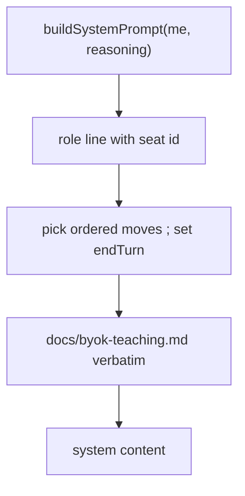
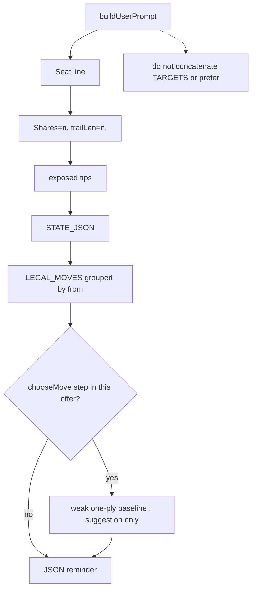

# byok-teaching-prompt — curated BYOK teaching, facts not orders

**Packet:** [P62 — BYOK teaching prompt](../../design/packets/P62-byok-teaching-prompt.md)
**Depends on:** P61 (batch JSON unchanged), P15, P11. P30 playback unchanged.
**SPEC:** read [§1](../../../SPEC.md) (pointer only), [§2](../../../SPEC.md)
(grain, 3-in / 3-out, girth 3, unbounded plane), [§3](../../../SPEC.md)
(`speed(N)`, inherit `spent`, majority bar), [§9](../../../SPEC.md) (last
remaining seat, starvation). **No game rule is added, changed, or implied.**
The teaching file is **non-normative**. If it disagrees with SPEC.md, SPEC
wins and the file is wrong. Nothing is owed to SPEC §11.
**Layer:** `packages/web` adapter (`byokBot.ts` and its tests) +
`docs/byok-teaching.md` + **one line** in SPEC.md §1. No `contracts`,
`rules-core`, or `online-api` behaviour change. `greedy-v1` / `chooseMove`
stay frozen (called, not retuned).
**Features:** [core](./byok-teaching-prompt.core.feature) ·
[edge cases](./byok-teaching-prompt.edge-cases.feature)

**Counts:** 18 scenarios (9 core, 9 edge) · 16 invariants · 0 deferred ·
0 SPEC §11 items.

Do not burst [byok-batch-turn](../byok-batch-turn/byok-batch-turn.md) or
[bot-turn-search](../bot-turn-search/bot-turn-search.md). Do not rewrite
P61’s batch JSON contract.

## Purpose

P61 let one completion commit a batch. Playtest 2026-09-07T13:16:19Z still
peeled `count=1` on seat B’s first turn because the **user** prompt printed
`Prefer on_target` and `[T0] … via count=1`. `tagOnTarget` ignores count, so
every same-exit peel was `on_target` while T0 named `1`. The system prompt
also taught stale **domination** (SPEC §9 repealed it).

This packet changes **prompt text only**: a curated teaching file as the
system-prompt body, user-prompt facts instead of orders, and an optional
`chooseMove` one-liner labelled a suggestion. The P61 parse / prefix / greedy
remainder loop is untouched.

## Scope

In: `docs/byok-teaching.md`; `buildSystemPrompt` / `buildUserPrompt`; one
non-normative SPEC.md §1 pointer; tests that lock phrases, forbid
`via count=` / `prefer …` on the live user prompt, and pin the baseline
index to `chooseMove`.

Out: offer-filter; enumerated turn plans; `beam-v1` as the hint or the
offer; runner; P58/P60; Pages `chooseTurnBeam`; `evaluate` retune; raising
`max_tokens`; P43 tutorial import; live grok in CI; a new `Move` kind;
online BYOK; editing P61 feature files.

## BSSN (recorded)

Adapter / docs decisions, not game rules. Written here so phases 2–4 do not
re-litigate them. No SPEC §11 item.

1. **Canonical teaching file.** `docs/byok-teaching.md` is the only body.
   `buildSystemPrompt` includes that file’s full text. Vitest must load it
   **without `fetch`**. Vite `?raw` (plus a `docs` alias if the file sits
   outside `packages/web`) is acceptable. Duplicating the prose as a second
   TypeScript string that can drift is not.

2. **System prompt shape.** `buildSystemPrompt(me, reasoning)` is:

   - one role line naming `seat ${me}` (keep today’s reasoning vs fast
     flavour difference);
   - the P61 one-liner: pick an ordered `moves` index array; set `endTurn`
     when the seat is done;
   - then the teaching file body, verbatim.

   Drop the old “Domination needs shares” block and the numbered “Prefer
   tags …” priorities. Tempo, win, board, mill, JSON contract, and the two
   examples live **in the teaching file** so the cacheable body is complete.

3. **Teaching file must quote SPEC, not invent.** Required **verbatim**
   substrings (sync test). Unicode `₂` matches SPEC.md:

   | Lock | Exact substring |
   |---|---|
   | Speed | `speed(N) = 1 + floor(log₂ N)` |
   | Split | `On a split, both parts inherit` and `spent` in that sentence |
   | Majority bar | `majority` and `speed 0` (SPEC: arrive as majority → speed 0) |
   | Grain | `follows the grain` |
   | Points | `3-in / 3-out` |
   | Girth | `girth is 3` |
   | Board | `unbounded` |
   | Win | `one seat remains` |
   | Starvation | `starvation` |
   | JSON | `"moves"` and `endTurn` |

   Also required, not necessarily verbatim SPEC: P38 “won match offers
   nothing” (paraphrase allowed); the loop `risk heads → take territory →
   hold specials → make heads` (SPEC §9, **specials** not an invented
   “shares” rewrite of the loop); `2^k` lump = `k+1` steps as one `count`
   (so P61’s tempo assertion still holds); `home_mill` / `onto_home` with
   empty trail and no expansion is wasted tempo; tags name outcomes, they
   are not orders.

   **Forbidden** in the teaching file: the substring `Domination` /
   `domination` (case-insensitive). Do not teach domination as a win.
   Do not invent a numeric *N* for starvation (tuning, SPEC §11 item 32).
   Do not dump fill, evaporation fronts, chord-test proofs, or `§11`.

4. **Two canned examples only** (in the teaching file, therefore in the
   system prompt). Compact snapshots: groups / trails / share counts — not
   a full `STATE_JSON`, not 58 spawners.

   - **Close vs cut.** Label containing `Close vs cut`. One **Before**
     snapshot. Two legal indices: one that **closes**, one that **cuts**.
     Two **After** snapshots (`After close` and `After cut`) so
     `apply(state, move) → state` is visible. Faithful to SPEC: closing
     claims enclosed ground (including enemy heads); a cut evaporates
     enemy trail. Canned fiction, not a fixture the engine must replay.
   - **T1 tempo.** Same `(from, exit)`: `[0] count=1`, `[1] count=2`,
     `[2] count=3`. Teaching answer is `[2]` (or `[1]` then more), **not**
     `[0]` plus `endTurn`.

   No third novel. No P43 lesson ids (`L0`–`L7`).

5. **SPEC.md pointer.** One sentence in §1 immediately after the playtest /
   BYOK sentence (the paragraph that begins “Playtest later added local
   heuristic / BYOK seats…”). Labelled **non-normative**. Must contain
   `docs/byok-teaching.md` and `must not add a game rule`. No other SPEC
   edit.

6. **User prompt: facts, not orders.** Keep seat line, exposed tips,
   `STATE_JSON`, grouped `LEGAL_MOVES` with tags, reply-JSON reminder.
   **Phase line is always** `Shares=${n}, trailLen=${n}.` — including when
   shares are 0 or `trailLen >= 4`. Drop every “prefer …” sentence.

7. **Drop the TARGETS block from the live user prompt.**
   `formatTargetsForPrompt` may remain exported for `targets.test.ts`.
   `buildUserPrompt` must not concatenate it. `syncTargetLocks` still runs
   in `playLlmBotTurn` **only** to drive `on_target` tags on LEGAL_MOVES
   rows (`tagOnTarget` still ignores count). A tag is not an order.

8. **Forbidden live user-prompt substrings** (case-insensitive where
   noted): `via count=`; `prefer ` (trailing space, case-insensitive);
   a `TARGETS` heading / `TARGETS:` line. `on_target` as a **tag** on a
   LEGAL_MOVES row is allowed.

9. **Optional greedy baseline.** When `rules` is passed and `chooseMove`
   returns a `step` that `movesEqual`s an entry of **this offer**
   (`moves` argument), append exactly:

   ```
   A weak one-ply baseline would play `[i]` (`count=C from=F exit=E`).
   Suggestion only — you may return any ordered indices from this offer.
   ```

   `i` is that entry’s index in the offer. `C`/`F`/`E` are that step’s
   `count` / `from` / `exit`. Two sentences, suggestion labelled.

   **Omit** the paragraph when any of: offer has no steps; `rules`
   omitted; `chooseMove` is `endTurn`; the chosen step is not in the
   offer. Do **not** use P21 T0 / `merge_pair via count=1` as the
   baseline. Do **not** call `chooseTurnBeam` / `playBotTurn` /
   `chooseTurnGreedy` for this hint — one `chooseMove` ply only.
   Do **not** edit `opponent.ts` scoring.

10. **P61 unchanged.** Parse, illegal tail, empty-prefix `greedy-v1`
    remainder, `llmHits` seat-turns, token budgets
    (`BYOK_REASONING_MAX_TOKENS` 512 / `BYOK_FAST_MAX_TOKENS` 64),
    `temperature: 0`, thinking off, no conversation history, no extract
    retry, no `/v1/pick`. P62 tests do not replace P61 tests.

11. **No live model in CI.** Do not assert grok picks `[2]`.

## Terms

| Term | Means |
|---|---|
| **teaching file** | `docs/byok-teaching.md` — non-normative curated rules for the BYOK system prompt |
| **live user prompt** | `buildUserPrompt(...)` as posted by `playLlmBotTurn` |
| **phase line** | the single `Shares=…, trailLen=….` facts sentence |
| **baseline** | optional one-ply `chooseMove` hint, labelled suggestion only |
| **offer** | P61: `legalMoves` steps, engine order, global `[i]` |
| **on_target** | LEGAL_MOVES tag when `tagOnTarget` matches **exit** (ignores count) |
| **greedy-v1** | frozen `chooseMove` (P11). Baseline source. Not retuned here |

Use AGENTS.md vocabulary for game words (*arrow*, *grain*, *point*, *head*,
*stack*, *trail*, *cut*, *closure*, *spawner*, *share*). Do not add *lump*
or *peel* to CONTEXT.md.

## Flow

System prompt (cacheable body = teaching file):



User prompt (per completion):



## Invariants

1. The system shall include the full `docs/byok-teaching.md` body in every
   `buildSystemPrompt` result.
2. WHEN the teaching file is read, it shall contain the locked substrings
   in BSSN 3 (speed formula, inherit `spent`, majority / speed 0, grain,
   `3-in / 3-out`, girth is 3, unbounded, one seat remains, starvation,
   `"moves"`, `endTurn`).
3. The teaching file shall not contain `domination` (any case).
4. WHEN `buildUserPrompt` runs, the live user prompt shall not contain
   `via count=` and shall not contain `prefer ` (case-insensitive).
5. WHEN `chooseMove` returns a step that is in this offer, the user prompt
   shall name that step’s offer index as a weak one-ply baseline labelled
   suggestion only.
6. WHEN the offer is empty, or `rules` is omitted, or `chooseMove` is
   `endTurn`, or the chosen step is not in the offer, the system shall
   omit the baseline paragraph.
7. WHILE target locks exist, the system shall still tag matching
   LEGAL_MOVES rows `on_target` and shall not print a `TARGETS` block in
   the live user prompt.
8. The system shall not call `chooseTurnBeam` to produce the baseline.
9. WHEN the same state, offer, and ports are given twice, the baseline
   index shall be identical.
10. The prompt builder in `packages/web/src/byokBot.ts` shall not use
    `Date.now`, `Math.random`, or `performance.now`.
11. `packages/online-api/src/pages-heuristic.ts` shall keep importing
    `chooseMove` and shall not import `chooseTurnBeam`.
12. The P61 batch parse / illegal-tail / empty-prefix loop shall stay the
    live turn protocol.
13. Token budgets, `temperature: 0`, and thinking-off shall be unchanged.
14. SPEC.md §1 shall point at `docs/byok-teaching.md` as non-normative and
    shall say the teaching file must not add a game rule.
15. WHILE shares are 0 or `trailLen >= 4`, the phase line shall still be
    facts only (`Shares=`, `trailLen=`).
16. The teaching file shall not contain `§11`, `even-odd`, or
    `evaporation front`.

## What this file deliberately does not decide

- Game rules. SPEC.md is silent here because this is not a game packet —
  do not add a §11 item.
- Offer-filter / hiding `count=1`.
- Numbered complete turn plans.
- `beam-v1` as the BYOK offer or the baseline.
- Raising `max_tokens`.
- Importing P43 lessons.
- Unfreezing `greedy-v1`.
- Whether a live model picks `[2]` (no grok in CI).
- P58 personalities, P60 worker, online BYOK, MCP.

## Game-rule edges (out of scope)

Cut mid-closure, fork-stem cut, chord coincide vs interleave, pincer arms
on different turns, land bridge vs enclosing heads, accumulator capture,
stack reduced to one head, stranded head, contested spawn (SPEC §11 item
15), cell far from origin (item 4): **not this packet**. Engine behaviour
is unchanged. The close-vs-cut **example** restates decided SPEC; it does
not extend it.

## P61 BSSN this packet supersedes (prompt only)

- P61 BSSN 11 “keep P15 priorities prose”: **replaced** by the teaching
  file. Keep the `2^k` lump sentence inside the teaching file.
- P61 BSSN 17 “keep `formatTargetsForPrompt` on the user prompt”:
  **`syncTargetLocks` stays; the TARGETS block leaves the live user
  prompt.**
