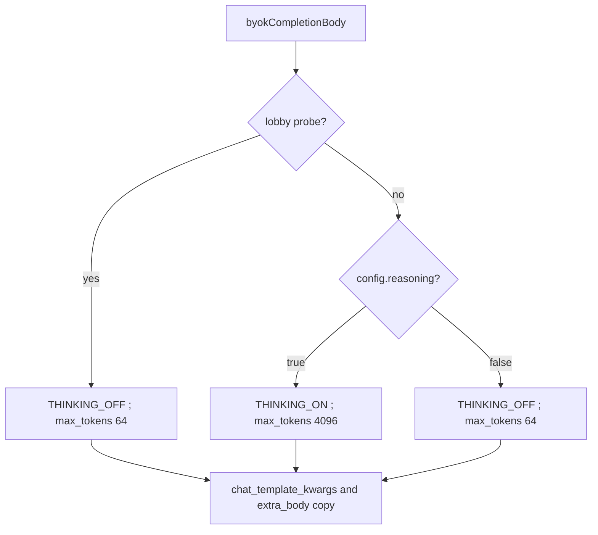
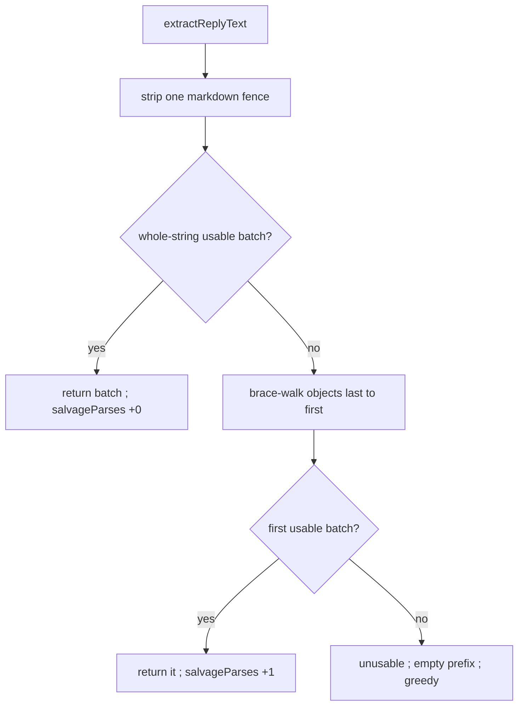

# byok-thinking-teach — lobby thinking, split/share teaching, token totals

**Packet:** [P63 — BYOK thinking on, split/share teaching, token totals](../../design/packets/P63-byok-thinking-teach.md)
**Depends on:** P62 (teaching file, no prefer, no TARGETS), P61 (batch JSON,
prefix, hits), P15, P11. P30 playback unchanged.
**SPEC:** read [§1](../../../SPEC.md) (existing non-normative pointer only —
**do not add a second**), [§2](../../../SPEC.md) (grain, 3-in / 3-out, girth
3, girth-3 pinwheel = one vertex = three border arrows = three **shares**),
[§3](../../../SPEC.md) (`speed(N) = 1 + floor(log₂ N)`, inherit `spent`),
[§9](../../../SPEC.md) (one seat remains, starvation). **No game rule is
added, changed, or implied.** The teaching file stays **non-normative**. If
it disagrees with SPEC.md, SPEC wins. Do not invent starvation *N*. Nothing
is owed to SPEC §11.
**Layer:** `packages/web` adapter (`byokBot.ts`, `byokConfig.ts`,
`matchLog.ts`) + `docs/byok-teaching.md`. No `contracts`, `rules-core`, or
`online-api` behaviour change. `greedy-v1` / `chooseMove` stay frozen (P62
baseline hint unchanged).
**Features:** [core](./byok-thinking-teach.core.feature) ·
[edge cases](./byok-thinking-teach.edge-cases.feature)

**Counts:** 24 scenarios (12 core, 12 edge) · 22 invariants · 0 deferred ·
0 SPEC §11 items.

Do not burst [byok-batch-turn](../byok-batch-turn/byok-batch-turn.md),
[byok-teaching-prompt](../byok-teaching-prompt/byok-teaching-prompt.md), or
[bot-turn-search](../bot-turn-search/bot-turn-search.md). Do not rewrite
P61’s apply-prefix / empty-prefix / `llmHits` seat-turn loop. Two P62
scenarios that this packet moves are tagged `@superseded-P63` (pointer,
not a rewrite).

## Purpose

Playtest `conquarrow-match-2026-09-08T06:00:52.500Z` (R=7, seed 1, 3 seats:
A heuristic / B grok-4.6 BYOK / C human) never split. Six steps, all
`count=3`. The last `why` inverted `spent=1` / `spd=2` as “turn done”.
`reasoning_content` was boilerplate. P61 forced `enable_thinking: false`
even when the lobby **Reasoning** checkbox was on (that flag only flipped
512 vs 64 and the role line). P62’s T1 example ended **Play `[2]`**, so
combined with “send a `2^k` lump as one count” the model learned **never
split**. `share` on a LEGAL_MOVES row was boolean, so a 1-share land-bridge
and a 3-share pinwheel looked the same.

This packet lets the lobby flag turn thinking **on** at 4096 tokens, teaches
split-throughput and 1-share vs 3-share as **facts**, prints `share+N` and
`left=`, and salvages the last usable batch JSON from an essay. Prefer-orders
are still forbidden.

## Scope

In: `byokCompletionBody` thinking/token split; `testByokConnection` stays a
tiny thinking-off probe; last-usable-batch parse + `salvageParses`;
`ByokRunStats` token totals; teaching T1 rewrite + pinwheel example;
LEGAL_MOVES `share+N` and `left=`; P62 tests that pin `Play [2]` or
unconditional thinking-off **move in this PR**.

Out: offer-filter; enumerated turn plans; `beam-v1` as hint or offer;
runner; P58/P60; Pages `chooseTurnBeam`; `evaluate` as an “IQ” score;
per-completion log rows; in-app graph/HUD chart; P43 lesson import; live
grok in CI; a fourth canned example; prefer-orders (`prefer split`,
`prefer don’t close`); raising tokens above 4096; SPEC.md game-rule edits;
a second SPEC.md teaching pointer; unfreezing greedy.

## BSSN (recorded)

Adapter / docs decisions, not game rules. Written here so phases 2–4 do not
re-litigate them. No SPEC §11 item.

### 1. Thinking follows the lobby flag

`byokCompletionBody(config, messages, maxTokens?)` for a **live turn** POST
(`fetchLlmMoveBatch` / `playLlmBotTurn`):

| `config.reasoning` | kwargs | `max_tokens` |
|---|---|---|
| `true` | `BYOK_THINKING_ON` | `BYOK_REASONING_MAX_TOKENS` **4096** (retarget this constant; tests that pin 512 move) |
| `false` | `BYOK_THINKING_OFF` | `BYOK_FAST_MAX_TOKENS` **64** (unchanged) |

Keep sending **both** `chat_template_kwargs` and
`extra_body.chat_template_kwargs` (NVIDIA + xAI) with the **same** kwargs
object. `temperature: 0` and `response_format: { type: 'json_object' }`
stay. No conversation history.

`BYOK_THINKING_ON` / `BYOK_THINKING_OFF` keep today’s shape
(`enable_thinking` plus `force_nonempty_content: true`).

### 2. Probe does not spend 4096

`testByokConnection` is still the tiny `{"move":0,"why":"probe"}` probe
(P61 BSSN 9). It posts `BYOK_THINKING_OFF` and `max_tokens === 64` **even
when `config.reasoning === true`**. Do not retarget the probe at the batch
contract. Do not send `BYOK_THINKING_ON` on a lobby ping.

Live-turn `byokCompletionBody` follows BSSN 1. The probe may pass an
explicit token override (already 64) **and** a thinking-off override; the
observable is the posted body, not the helper signature.

### 3. Parse: last usable batch object

P61 fence-strip + whole-string `JSON.parse` is not enough once thinking can
put an essay in `content`.

`parseMoveBatch` (or a helper **used by it**; `parseMoveBatch` stays the
live parse entry) on `extractReplyText` output:

1. **`extractReplyText` unchanged:** non-empty `content` (trimmed length >
   0), else `reasoning_content`.
2. Strip **one** optional wrapping markdown fence (P61
   `stripMarkdownFence`: first and last lines ` ``` ` / ` ```json `).
3. **Whole-string path.** `JSON.parse` the entire stripped string. If the
   value is a **usable batch**, return it. Do **not** increment
   `salvageParses`. This is the Grok JSON-in-`content` path, including a
   usable outer object that happens to contain nested objects in extra
   keys.
4. **Scan path.** Otherwise find JSON **object** slices with a brace-depth
   walk that respects JSON string literals and escapes (a `{` inside a
   string is not a start). Collect complete `{`…`}` slices in appearance
   order. Walk **last to first**. The first slice that `JSON.parse`s to a
   **usable batch** wins. If this path succeeds where (3) did not,
   increment `salvageParses` by 1 for **that completion**.
5. If none → unusable → empty prefix → greedy remainder (P61). Do not
   increment `salvageParses`.

Still **one POST**. No extract-retry completion. No digit harvest. No
second completion to “find the JSON”.

**Usable batch** is the P61 contract, not “any `{`”:

- non-null object, not an array;
- `moves` is an array of JSON integers (`typeof number` &&
  `Number.isInteger`);
- `endTurn` is a boolean;
- extra keys ignored; `why` ignored for control flow;
- a non-integer `moves` entry makes **that object** unusable (skip it,
  continue last-to-first) — same as P61 malformed, now per candidate;
- empty `moves: []` with boolean `endTurn` **is** usable;
- negative / out-of-range integers stay and become illegal items at apply
  (P61).

A CoT example object that is not a batch is skipped. If a later (in
walk order: earlier in the string when walking last-to-first… **last
usable in appearance order**) usable batch exists, it wins.

Worked cases:

| Stripped text | Result | salvage |
|---|---|---|
| `{"moves":[1],"endTurn":true}` | that batch | 0 |
| fence-wrapped same | that batch (after strip) | 0 |
| `{"moves":[1],"endTurn":true,"hint":{"moves":[9],"endTurn":false}}` | outer batch (whole-string wins) | 0 |
| `essay…\n{"moves":[1],"endTurn":true}` | `[1]` / true | 1 |
| two sibling batches, last is `[1]` / true | last | 1 |
| `{"thought":true}` then a usable batch | the usable one | 1 |
| `thinking...\nANSWER: 2` | unusable | 0 (no increment) |

### 4. `byokStats` totals (no per-completion rows)

Extend `ByokRunStats` (aggregate **and** per-seat). Old logs: missing
fields read as **0**. `withByokStats` **adds** the numeric fields (same
as hits/fallbacks) except `maxTokens` (below). `lastError` stays
last-write-wins.

| Field | Meaning |
|---|---|
| `promptTokens` | sum of `usage.prompt_tokens` when that field is a `number` |
| `completionTokens` | sum of `usage.completion_tokens` when a `number` |
| `lengthOuts` | completions whose `finish_reason` is `length` or vendor synonym `max_tokens` |
| `salvageParses` | nested-batch recoveries (BSSN 3 step 4) |
| `maxTokens` | `BYOK_REASONING_MAX_TOKENS` or `BYOK_FAST_MAX_TOKENS` as **sent** on that seat-turn’s POSTs |

`finish_reason`: read `choices[0].finish_reason` when it is a string; else
top-level `finish_reason` when it is a string. Only `length` and
`max_tokens` count. Other values (`stop`, `unknown`, missing) do not.

If `usage` / `finish_reason` is absent or not those shapes, skip (treat as
0). **Never throw.** Never log secrets, raw `content`, or
`reasoning_content`.

`maxTokens` on a delta is the config value used for that seat-turn’s
POSTs. Persist **max** on the aggregate and per-seat fold:
`Math.max(prev.maxTokens ?? 0, delta.maxTokens ?? 0)`. One match, one
budget in the usual case.

`playLlmBotTurn` / `LlmBotTurn` shall return these fields so the local AI
plan mapper can put them on the `withByokStats` delta. New matches may
initialise them to 0. Not-ready / idle turns: 0, not a throw.

**Hits** still mean “this seat-turn never took empty-prefix greedy”
(P61). Salvage that yields a nonempty legal prefix is a **hit**. A
length-out that still salvages JSON can increment **both** `lengthOuts`
and still be a hit. Length-out + unusable text → fallback, `lengthOuts`
+1, `salvageParses` unchanged (0 for that completion).

No HUD graph. Existing HUD hits/fallback line may stay. Reviewers compare
playtests by downloading JSON. Do **not** add an `evaluate` score.

### 5. Teaching file (`docs/byok-teaching.md`)

Keep P62 locks (verbatim where P62 required them):

| Lock | Exact substring |
|---|---|
| Speed | `speed(N) = 1 + floor(log₂ N)` |
| Split inherit | `On a split, both parts inherit` and `spent` in that sentence |
| Majority bar | `majority` and `speed 0` |
| Grain | `follows the grain` |
| Points | `3-in / 3-out` |
| Girth | `girth is 3` |
| Board | `unbounded` |
| Win | `one seat remains` |
| Starvation | `starvation` |
| JSON | `"moves"` and `endTurn` |

Still required, not necessarily verbatim SPEC: P38 “won match offers
nothing”; loop `risk heads → take territory → hold specials → make heads`;
`2^k` lump = `k+1` steps as one `count`; `home_mill` / `onto_home` with
empty trail and no expansion is wasted tempo; tags name outcomes, they are
not orders.

**Forbidden** (teaching file, any case for domination): `domination`;
invented numeric *N* for starvation; `§11`; `even-odd`; `evaporation
front`; P43 lesson ids (`L0`–`L7`); prefer-orders (`prefer split`,
`prefer the 3-share`, `prefer don’t close`, `Play [2]` as the only good
T1 answer — the substring `Play [2]` shall be **absent**).

**Tempo section — rewrite T1 punchline.** Must still list the same
`(from, exit)` indices `[0] count=1`, `[1] count=2`, `[2] count=3`. Must
still say don’t peel three `count=1` as three POSTs. Must **not** say
Play `[2]` as the only good answer. Required beats (SPEC §3 table,
3-stack numbers):

- Lump `count=3` walks **2** tiles this turn (`speed(3)=2`).
- Split **2+1 before walking**: pair walks 2, singleton walks 1 → **3**
  tiles. Splitting is a decision **before** you walk; after the lump both
  parts inherit `spent`.
- Three `count=1` is legal (P61 offer unfiltered) but is the same
  singleton throughput without the pair’s extra step.

**New example — pinwheel 1-share vs 3-share.** Compact snapshots
(groups/trails/share counts, not 58 spawners). Shape matches close-vs-cut:
**Before**, two indices, **After 1-share** / **After 3-share** as exact
labels. Faithful to SPEC: girth-3 pinwheel encloses exactly one spawner
**vertex**; three border arrows are three **shares**. Homeward close that
only claims the trail + one border → 1 share. Walking the other two
borders then landing → 3 shares. Show `apply(state, move) → state` and
the share counts. Do **not** say “prefer the 3-share line”.

**Keep** the close-vs-cut example (labels `Close vs cut`, `Before`,
`After close`, `After cut`). **Three examples total.** No fourth.

The mill-section tag list may name `share+N` (a share **delta**) instead
of boolean `share`, so teaching does not contradict LEGAL_MOVES rows. That
is still a tag name, not an order.

`buildSystemPrompt` still includes the full teaching file body (P62).

### 6. LEGAL_MOVES row facts

- When `gainedShare > 0`, tag **`share+N`** (N = that integer delta), not
  boolean `share`. Omit the share tag if 0.
- Every **step** row: **`left=K`** where `K = portionSpd - spent` (the
  same integers already printed as `spd` / `spent`). No clamp. Place it
  next to those fields (`spd=… spent=… left=…`).
- Legend may keep “steps left this turn = spd-spent”; the per-row `left=`
  is what T3 inverted.
- Do not add prefer-orders. `on_target` stays a tag (exit match, ignores
  count). P62 phase line, no TARGETS block, optional `chooseMove`
  baseline — unchanged.
- `annotateMove` already computes `gainedShare`. Do not call `beam-v1` /
  `chooseTurnBeam` for a share hint.

### 7. P61 loop unchanged except parse and thinking/tokens

Illegal-tail ignore-`endTurn` re-prompt, empty-prefix `greedy-v1`
remainder, lump apply, seat-turn `llmHits` / `llmFallbacks`, completions
cap 64, P38 mid-batch win, not-ready → `playBotTurn`, no `/v1/pick` —
stay. Salvage is **not** a second POST and **not** a new fallback class.

### 8. No live model in CI

Do not assert grok walks the pinwheel or splits. Do not raise 4096 in this
PR after playtest.

### 9. Purity

`parseMoveBatch`, prompt builders (`buildSystemPrompt` / `buildUserPrompt`
/ `annotateMove` / `formatLegalMoves`), `byokCompletionBody`, and the
`withByokStats` numeric fold shall not use `Date.now`, `Math.random`, or
`performance.now`. (Existing `createMatchLog` `startedAt` clock is not
this fold.)

## Terms

| Term | Means |
|---|---|
| **lobby flag** | `ByokConfig.reasoning` — the Reasoning checkbox |
| **usable batch** | P61: non-null object, `moves` integer array, `endTurn` boolean |
| **whole-string path** | fence-stripped text `JSON.parse`s to a usable batch |
| **salvage** | whole-string path failed and a nested/last usable batch succeeded |
| **length-out** | completion `finish_reason` is `length` or `max_tokens` |
| **share+N** | LEGAL_MOVES tag; N = `gainedShare` when > 0 |
| **left=K** | steps remaining this turn for that portion: `spd - spent` |
| **teaching file** | `docs/byok-teaching.md` — still non-normative |
| **probe** | `testByokConnection` tiny `{"move":0,"why":"probe"}` POST |
| **hit / fallback** | P61 seat-turn counters; salvage of a legal prefix is still a hit |

Use AGENTS.md vocabulary for game words (*arrow*, *grain*, *point*,
*vertex*, *head*, *stack*, *trail*, *cut*, *closure*, *land bridge*,
*spawner*, *share*). A pinwheel is a girth-3 triangle about a **vertex**.

## Flow

Live completion body:



Parse:



## Invariants

1. WHEN `config.reasoning` is true, a live-turn `byokCompletionBody` shall
   send `enable_thinking: true` on both kwargs copies and
   `max_tokens === 4096`.
2. WHEN `config.reasoning` is false, a live-turn `byokCompletionBody` shall
   send `enable_thinking: false` on both kwargs copies and
   `max_tokens === 64`.
3. WHEN `testByokConnection` runs, the posted body shall use thinking off
   and `max_tokens === 64` even if `config.reasoning` is true, and shall
   still be the move-0 probe (not the batch contract).
4. The teaching file shall not contain `Play [2]`. It shall still list
   `[0]` `count=1`, `[1]` `count=2`, `[2]` `count=3`, teach lump = 2 tiles
   vs split 2+1 = 3 tiles, and say not to peel three `count=1` as three
   POSTs.
5. The teaching file and every `buildSystemPrompt` result shall contain
   `Before`, `After 1-share`, and `After 3-share`, and shall contain
   `Close vs cut`, `After close`, and `After cut`.
6. WHEN `gainedShare > 0`, the LEGAL_MOVES step row shall contain
   `share+N` with N equal to that delta and shall not use a bare `share`
   tag. WHEN `gainedShare` is 0, the row shall omit a share tag.
7. WHEN a step row is printed, it shall contain `left=K` with
   `K = portionSpd - spent` (the same integers as `spd` and `spent`).
8. WHEN fence-stripped text is an essay plus more than one JSON object,
   `parseMoveBatch` shall return the **last** usable batch.
9. WHEN whole-string `JSON.parse` yields a usable batch, `salvageParses`
   shall stay 0 for that completion.
10. WHEN no usable batch exists, the system shall treat the prefix as
    empty, run `greedy-v1` remainder, issue no extract-retry POST, and
    count a fallback.
11. WHEN the whole-string parse fails and a nested/last usable batch
    succeeds, `salvageParses` shall increase by 1 for that completion and
    fetch shall have been called once.
12. WHEN `usage` / `finish_reason` is missing, token fields shall read as
    0 and the fold shall not throw.
13. WHEN an old match log omits the new stats fields, load and
    `withByokStats` shall treat them as 0.
14. WHEN `finish_reason` is `length` (or `max_tokens`) and last-JSON is
    still a usable batch whose prefix is nonempty, the system shall
    increment `lengthOuts` and shall still count a hit.
15. WHEN `finish_reason` is `length` and the text is unusable, the system
    shall increment `lengthOuts` and shall count a fallback.
16. The teaching file shall still contain the P62 locked substrings
    (speed formula, inherit `spent`, majority / speed 0, grain,
    `3-in / 3-out`, girth is 3, unbounded, one seat remains, starvation,
    `"moves"`, `endTurn`) and shall not contain `domination` (any case),
    `§11`, `even-odd`, or `evaporation front`.
17. `packages/online-api/src/pages-heuristic.ts` shall keep importing
    `chooseMove` and shall not import `chooseTurnBeam`. `opponent.ts`
    scoring shall not be edited. The system shall not call `evaluate` or
    `chooseTurnBeam` to grade or hint BYOK.
18. Parse, prompt builders, `byokCompletionBody`, and the `withByokStats`
    numeric fold shall not use `Date.now`, `Math.random`, or
    `performance.now`.
19. There shall be one live thinking contract: lobby true → on/4096;
    lobby false → off/64; probe → off/64. P62/P61 tests shall not pin
    `enable_thinking: false` on a reasoning-true live-turn body.
20. P61 illegal-tail re-prompt, empty-prefix `greedy-v1`, and mocked
    `count=3` lump apply shall stay green.
21. `withByokStats` shall persist `maxTokens` as the max of previous and
    delta (missing = 0).
22. Stats, `lastError`, and match logs shall not contain the API key, raw
    `content`, or `reasoning_content`.

## P62 / P61 BSSN this packet supersedes

- P62 BSSN 4 “two canned examples only” / T1 answer is Play `[2]`:
  **three** examples; T1 is split-throughput vs lump, not Play-`[2]`-only.
  P62 core scenario *T1 tempo example prefers the lump index not
  peel-and-pass* is `@superseded-P63`.
- P62 BSSN 10 / edge scenario *Token budgets and thinking-off stay P61*
  (512, thinking always off): **`@superseded-P63`**. Fast path stays 64.
  Reasoning path is 4096 + thinking on.
- P62 invariant 13 “thinking-off shall be unchanged”: replaced by this
  packet’s lobby split. Temperature 0 stays.
- P61 BSSN 3 “No last-match-wins” / whole-string-only parse: **extended**
  by last-usable-batch salvage. Whole-string success still wins (Grok).
  Unusable prose still empty-prefix. Do not burst P61 feature files.
- P61 BSSN 10 thinking off / token budgets: live turn follows the lobby
  flag; probe stays off/64.

## What this file deliberately does not decide

- Game rules. Do not add a §11 item.
- Offer-filter / hiding `count=3` or `count=1`.
- Prefer-orders.
- `evaluate` / `chooseTurnBeam` as quality.
- Per-completion arrays, HUD graphs.
- Raising 4096 without `lengthOuts` evidence (later packet).
- Whether a live model splits or walks the pinwheel (no grok in CI).
- P58, P60, online BYOK, MCP.

## Game-rule edges (out of scope)

Cut mid-closure, fork-stem cut, chord coincide vs interleave, pincer arms
on different turns, land bridge vs enclosing heads, accumulator capture,
stack reduced to one head, stranded head, contested spawn (SPEC §11 item
15), cell far from origin (item 4): **not this packet**. Engine behaviour
is unchanged. The pinwheel **example** restates decided SPEC §2 (girth-3
encloses exactly one vertex / three shares); it does not extend it.
