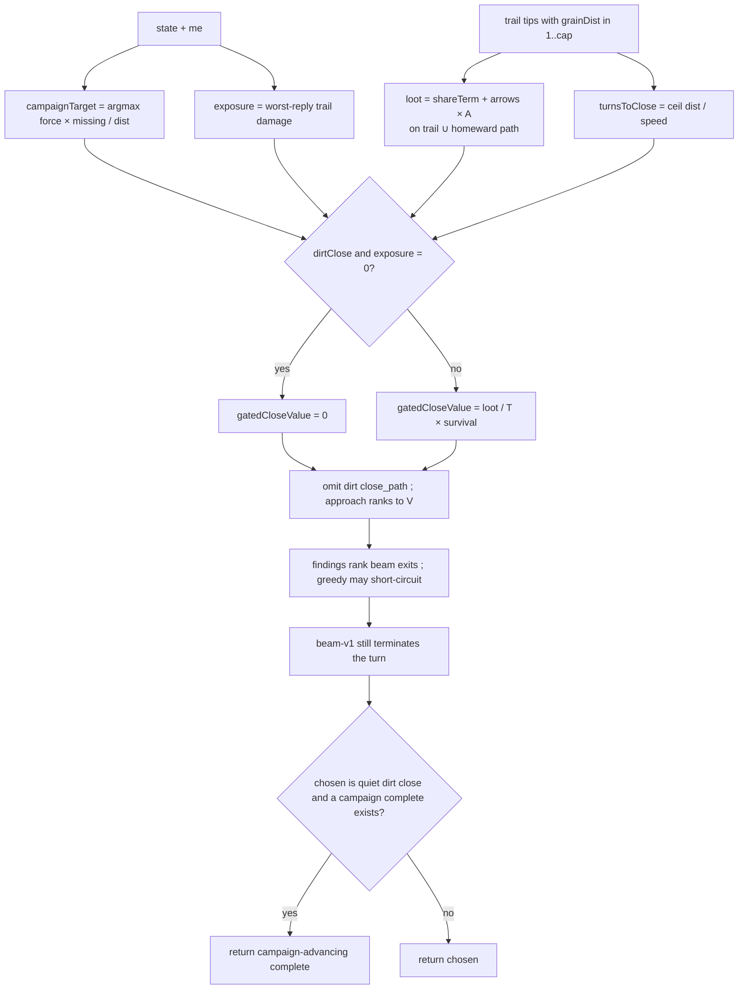

# close-and-spawner-value — walk home, then walk toward production

**Packet:** [P54 — Closing and spawner value](../../design/packets/P54-close-and-spawner-value.md)
**Follow-on:** [P57 — Campaign target](../../design/packets/P57-campaign-target.md)
gates the P54 rate so a quiet-board 0-share dirt close scores zero, and aims
`approach_spawner` / the P56 leave at one campaign vertex.
**SPEC:** read [§3](../../../SPEC.md) (speed, split vs merge) and
[§7](../../../SPEC.md) (closure, shares, spawners). **No game rule is added,
changed, or implied.** Nothing is owed to SPEC §11. Do not edit SPEC.md.
**Layer:** `packages/web` only. No `contracts` DTO change, no `rules-core`.
Online-api **behaviour** is unchanged (`pagesHeuristic` still calls
`chooseMove`).
**Depends on:** [bot-turn-search](../bot-turn-search/bot-turn-search.md) (P53,
P56). P55's reply search stays on.
**Features:** [core](./close-and-spawner-value.core.feature) ·
[edge cases](./close-and-spawner-value.edge-cases.feature)

## Purpose

The heuristic does not close, and when it does it does not close on anything
worth having. On the committed P53 baseline match
([`P53-baseline-match-2026-08-31.json`](../../design/packets/data/P53-baseline-match-2026-08-31.json))
there were **11 closes across 71 turns and 6 seats, first at move 56**
(15 closes per 100 turns). Three adapter faults, none of them a missing
game rule:

1. The only distance-driven finding is `approach_spawner`, which always
   points **away** from territory. Immediate `close` / `claim_share` fire
   only when the landing completes *on this step*. There is no multi-step
   walk home.
2. `collectFindings` skips any group already standing on an open share, so
   a tip that reached a border mills to a sibling instead of banking it.
3. Fast-and-small versus slow-and-big has no arithmetic: nothing compares
   loot per turn, discounted by how cuttable the trail is.

P53's beam can commit several steps to a route. P54 aims that search at
a **close value rate** and a **`close_path` goal**. After P56 they leave
home; playtest 2026-09-01T09:50 then paints the nearest 1-turn 0-share
loop (18 closes, 0 cuts). P57 gates that dirt rate and names **one
campaign vertex**.

## Scope

In: `closeValue` as a rate; `exposure` / `survival` as a P55-swappable
seam; superlinear `shareTerm`; a `close_path` finding; mill-guard
replacement (skip-group → that group's goal is the close that banks the
share); `collectFindings` / `bestFindingMove` / BYOK lock validity for the
new kind; constructed tests plus the existing P53 shuttle head-to-head
left intact. P57: `campaignTarget`; dirt-close gate on the P54 rate;
`approach_spawner` ranked to that vertex; `BotDrive` all `1`; one
return-time compare so a quiet dirt complete does not beat a
campaign-advancing complete the beam already adopted.

Out: opponent plies and replacing the exposure *proxy* with worst-reply
damage (P55); retuning P53 beam budgets (`BEAM` / `BRANCH` / `MAX_PLAN` /
`MAX_APPLIES`) or `greedy-v1`'s `scoreStepExtras` / never-pass /
findings-short-circuit; a third close-economy constant besides `S` and
`A`; an absolute CI threshold on closes-per-100 or `firstCloseAt`;
`evaluate` occupancy-as-share (P53 BSSN 11 still holds); SPEC.md;
`rules-core`; Pages calling `chooseTurnBeam`. P57 also out: personality
sliders / lobby / seat-kind / match-log fields (P58); retuning
`evaluate`, `tipTerm`, `closeUrgency`, `MOBILITY_SCALE`, `S`, `A`,
`IDLE_SLACK`, `SORTIE_SLACK`, or any beam / reply budget; spawner-gravity
in `evaluate`; changing P56's expedition predicate; multi-vertex
campaigns or a stored plan; unfreezing `greedy-v1`.

## BSSN (recorded)

Adapter decisions, not game rules. Written here so phases 2–4 do not
re-litigate them.

1. **`S` and `A` are the only close-economy constants.**
   `SHARE_VALUE_S = 100`, `ARROW_VALUE_A = 25` — the same magnitudes
   `evaluate` already uses for a territory share and an owned arrow — so
   ranking a planned close and scoring a completed one do not fight.
   The findings reward ladder (`close` 90, `attack` 55, `approach_spawner`
   40) is not a close-economy constant; `close_path` sits on that ladder
   at reward **80** (between attack and immediate close) so mixed-list
   `score` stays comparable. Do not add a third loot weight.

2. **Share term is triangular in the count this closure claims.**
   `shareTerm(n) = S × n × (n + 1) / 2`. One share is `S`; two is `3S`;
   three is `6S`. Taking three shares in **one** closure therefore outranks
   three separate one-share closures at equal `turnsToClose` (`6S` vs
   `3S`) without a separate "enclose the vertex" case. Squaring (`n²`) is
   rejected: it would make a 6-turn two-share close beat a 2-turn
   one-share close (`4S/6 > S/2`), which the packet forbids.

3. **The rate, then survival.**
   ```
   loot(shares, arrows) = shareTerm(shares) + arrows × A
   closeValue = loot / turnsToClose × survival(exposure, turnsToClose)
   ```
   Quiet board (`exposure = 0`) reduces to loot per turn. A 2-turn
   one-share close and a 6-turn two-share close **tie** on triangular
   shares (`3S/6 = S/2`) once arrows are equal; **fewer `turnsToClose`
   wins that tie** (then more arrows, then more shares, then smaller
   `goal` id). A 3-turn two-share close (`3S/3 = S`) beats the 2-turn
   one-share close (`S/2`) on the same quiet board — one formula, no
   branch.

4. **`turnsToClose` is the real clock.**
   `turnsToClose = max(1, ceil(grainDist / speed(heads)))` where
   `grainDist` is `distanceToTerritory` from the tip and `heads` is the
   **walking portion** — `close_path`'s `move.count`, which is the max
   legal count on the homeward exit (BSSN 8). Stay-behind can cap that
   below the stack on the arrow; using the stack size would overstate
   `speed` and understate turns. A 2-stack that can stride covers two
   grain steps per turn (`speed(2) = 2`). Distance 0 (already on own
   territory) is not a close path.

5. **`exposure` was a product (P54); P55 replaced the function.**
   The distance-product proxy and the two core scenarios that asserted
   it are `@superseded-P55`. `survival` is unchanged. Quiet board
   (`exposure = 0`) still reduces to loot per turn.

6. **`survival` discounts extra turns, not the landing turn.**
   ```
   survival(e, T) = (1 + e) ** -(max(0, T - 1))
   ```
   Closing this turn (`T = 1`) is undiscounted: the loot banks before a
   cut. Extending pays geometric hazard per extra turn. When `e = 0`,
   `survival = 1` for every `T`. When an enemy sits two grain steps from
   an otherwise identical trail, `e > 0` and the shorter close wins the
   comparison the quiet board gave to the bigger one. IEEE `number` is
   allowed in the adapter (`evaluate` already uses it); same inputs must
   yield the same bit pattern — no `Date`, no `Math.random`, no unordered
   reduction that feeds a ranking.

7. **Loot estimator is on-path, not fill.**
   Claimed arrows = (my current trail arrows that are not already my
   territory) ∪ (homeward grain path from the tip up to but **not**
   including the landing territory arrow). Claimed shares = those arrows
   that border a spawner vertex. Interior fill is not estimated — a
   constructed three-share monopoly puts the three borders on the trail
   / path. One homeward BFS: lift the existing `distanceToTerritory` in
   `botEvaluate.ts` so path and distance share an implementation.
   Delete the private copy in `findings.ts`. Do not write a second
   algorithm.

8. **`close_path` finding.**
   Kind `'close_path'`. For each of my groups that is on my trail, has
   `grainDist` in `1..=cap`, and has a legal step that **strictly
   reduces** `distanceToTerritory`: emit one finding. `goal` is the
   landing territory arrow. `cost` is `turnsToClose`. `reward` is 80.
   `score = scoreOf(80, turnsToClose) + closeValue` so mixed-list order
   sits between immediate `close` (90) and `approach_spawner` (40), and
   two `close_path`s on the same state order by `closeValue`. The move is
   the distance-reducing step on the best exit at **maximum legal
   count**, then lesser `moveKey` — do not run `pickPortion` (that is
   what biased approach toward `count=1`). Best exit: the one whose
   landing distance is smallest, then lesser `moveKey`.

9. **Mill guard is replaced, not deleted.**
   A group whose `from` is an open (unowned) spawner-border arrow still
   must not hop to a sibling. **Do not `continue` past it.** Emit
   `close_path` for that group; **do not emit `approach_spawner` from
   that `from`**. Visiting a border is still not `claim_share` (P21/P53).
   Groups not standing on an open share may emit both `close_path` and
   `approach_spawner`; scores / kind priority decide.

10. **`bestFindingMove` kind order** inserts `close_path` after `attack`
    and before `approach_spawner`:
    `close`, `claim_share`, `cut`, `intercept`, `attack`, `close_path`,
    `approach_spawner`, `merge_pair`.
    That is not a `scoreStepExtras` retune. Greedy may now short-circuit
    onto a homeward step; never-pass stays.

11. **`evaluate` is not retuned.** Tip-pressure and territory/share terms
    already reward a completed close and a shorter remaining walk. Close
    value ranks *candidate routes* in findings; the beam's terminal score
    stays P53 `evaluate`. Occupancy is still not a share.

12. **Head-to-head.** P53's committed shuttle-rate / `count>1` assertions
    on reconstructed baseline heuristic turn-starts stay green. This
    packet does **not** add an absolute CI gate on closes-per-100 or
    `firstCloseAt` (baseline 15 / 100, first at 56 is the playtest bar
    for `pnpm bots`, advisory like `pnpm crap`). Constructed positions
    are the committed close / mill / rate tests.

13. **Local live, online frozen** — same as P53 BSSN 2.
    `playBotTurn` still calls `chooseTurnBeam`. Pages still calls
    `chooseMove`. Event-legibility's combat-rich harness **replays the
    committed P53 baseline log** (24 cuts). Live greedy after this packet
    short-circuits onto `close_path` and no longer mills into a cut, so a
    60-turn `chooseTurnGreedy` self-play is as vacuous as beam was in P53.

14. **BYOK locks.** `close_path` stays valid while the locked group still
    exists, the `goal` is still my territory, and some legal step from
    `from` still reduces `distanceToTerritory`. Do not treat "goal
    became owned" as stale — the goal *is* owned.

15. **Module.** `closeValue`, `shareTerm`, `loot`, `exposure`,
     `survival`, `turnsToClose`, `SHARE_VALUE_S`, `ARROW_VALUE_A`,
     `estimateCloseLoot`, and `preferClose` live in
     `packages/web/src/botClose.ts` (pure). P55 replaced `exposure`.
     `findings.ts` imports them. `botClose` must not import `findings`
     (cycle). Move `grainDistance` next to `distanceToTerritory` in
     `botEvaluate.ts` and re-export it from `findings.ts` so existing
     imports keep compiling. Search still talks to the engine only
     through `RulesPort`. Add `botClose.ts` to `packages/online-api/tsconfig.json`
     `include` (same reason as P53: Pages typechecks opponent's graph).

16. **Campaign target is a search-origin fact (P57).** Recomputed from
    `(geometry, state, me)` at the start of `chooseTurnBeam` and by
    `collectFindings` / `estimateCloseLoot`. Not stored on `GameState`.
    Not a game rule.

    ```
    campaignTarget(state, me) =
      the spawner vertex V that maximises
        force(V) × (3 − ownShares(V, me)) / max(1, grainDist(nearest own group, V))
      among V with ownShares(V, me) < 3
      ties: lesser vertex id
    ```

    `force(V)` is `spawner.force.num / spawner.force.den` as IEEE number
    — the setup force already on the state (SPEC §7). Do not invent a
    second table. `ownShares(V, me)` counts V's `borderArrows` whose
    territory is `me`. `grainDist` to a vertex is `min grainDistance`
    from an own-group arrow to that vertex's border arrows — the same
    BFS `approach_spawner` already uses. Default cap is
    `DEFAULT_FINDINGS_CAPS.distCap` (12). Beyond the cap, distance is
    `cap + 1`; the vertex still competes. `max(1, dist)` so a group
    already on a border scores `force × missing`. No own groups, or
    every spawner monopolised: `undefined`. Same state, same `me`, same
    `V`. No clock, no RNG.

17. **Dirt close (P57).** A close candidate is a dirt close when all of:
    `shares == 0`; `hitsCampaign` is false (no claimed-set arrow borders
    the campaign vertex); `advancesCampaign` is false (the homeward
    landing is not strictly grain-closer to V than the tip). Then:

    ```
    if dirtClose and exposure == 0:
      gatedCloseValue = 0
    else:
      gatedCloseValue = loot / T × survival
    ```

    Four-argument `closeValue(shares, arrows, T, exposure)` **stays the
    ungated P54 rate** so the 2-turn-one-share vs 6-turn-two-share
    arithmetic, and `closeValue(0, 3, 3, 0) = 25`, keep their numbers.
    Findings score, `preferClose` on flagged candidates, and the
    return-time compare use the gated value. Do not add a second
    `preferClose` sort key. Do not change `S` or `A`. Do not add
    `A_dirt`. Under fire (`exposure > 0`) the 1-turn empty land-bridge
    stays the P54 corridor.

18. **`estimateCloseLoot` booleans (P57).** Return
    `{ shares, arrows, hitsCampaign, advancesCampaign }`. Both booleans
    are pure functions of the candidate plus the origin campaign.
    `advancesCampaign` is `grainDist(landing, V) < grainDist(tip, V)`
    with `landing = homewardPath.landing`. Missing landing or missing V
    → both false. A V-border in the claimed set is a share, so
    `hitsCampaign` with `shares == 0` is typically empty; keep the
    conjunct as the packet wrote it.

19. **Findings order the campaign (P57).** `approach_spawner` ranks
    departing exits by grain distance to `campaignTarget`, not to the
    nearest spawner of any kind. `Finding.goal` stays an `ArrowId`: the
    nearest border arrow of V, then lesser id. A group already standing
    on an open share of V keeps P54's mill guard (`close_path`, no
    `approach_spawner` from that `from`). Quiet-board dirt `close_path`s
    are **omitted** from `collectFindings` (they must not consume
    `maxFindings`). Immediate `close` findings still emit — `greedy-v1`
    short-circuit stays frozen. `cut` / `attack` get no new terms. If
    `campaignTarget` is `undefined`, `approach_spawner` keeps P54's
    nearest-open-share ranking.

20. **Return-time campaign compare (P57).** `evaluate` still pays `+25`
    per painted arrow, so a 1-turn dirt complete can outscore a walk
    toward V if the homeward exit is expanded. After `IDLE_SLACK` and
    `SORTIE_SLACK`, if the chosen complete is a quiet dirt-close
    complete (origin `exposure == 0`, shares did not rise, trail empty
    at the terminal, no own group strictly closer to V than at origin)
    **and** the search adopted a campaign-advancing complete (share
    gain, or some own group or trail tip strictly closer to V than
    origin groups), return the campaign-advancing complete. No new
    slack constant. Do not change `SORTIE_SLACK` or P56's expedition
    predicate. Do not put this in `evaluate`. Do not add
    spawner-gravity.

21. **`BotDrive` (P57).** Export from `botClose.ts`:

    ```
    BotDrive = { shareLoot: 1, arrowLoot: 1, campaignPull: 1, bankUnderFire: 1 }
    ```

    Every factor in this packet multiplies one of those. All stay `1`
    (identity). `shareLoot` multiplies `shareTerm`; `arrowLoot`
    multiplies `arrows × A`; `campaignPull` selects campaign-ranked
    `approach_spawner`; `bankUnderFire` keeps the P54 dirt rate when
    `exposure > 0` (`dirtClose and (exposure == 0 or bankUnderFire == 0)`
    — with the weight at 1 that is `dirtClose and exposure == 0`). No
    UI, no seat kind, no match-log field. P58 may clone the object.

22. **Playtest log (P57).** Citation: 2026-09-01T09:50:40Z (3-seat,
    `R = 7`, `spawnerSeed = 1`, 18 closes / 0 cuts after P56). Committed
    tests construct the post-paint leave and the quiet / under-fire
    boards. The JSON at
    `docs/design/packets/data/conquarrow-match-2026-09-01T095040-792Z.json`
    is optional in CI (same stance as P56's 03:39 log). If present,
    reconstructing heuristic turn-starts after each seat's first close
    must not return a dirt-only plan when a campaign-advancing complete
    existed.

23. **P57 module.** `campaignTarget`, `isDirtClose`, `BotDrive` /
    `BOT_DRIVE`, the loot booleans, and gated ranking live in
    `botClose.ts`. `findings.ts` imports them. `botSearch.ts` may import
    `campaignTarget` for the return-time compare and must not write a
    third grain BFS. `botClose` must not import `findings` or
    `botSearch`.

24. **Constructed dirt loop size (P57, phase-2).** The packet's "1-turn
    0-share 3-arrow loop" is the playtest shape (`loot = 75`). A
    constructed on-path 1-turn 0-share close may be **2 arrows** when a
    3-on-path loop would require an off-path trail arrow that does not
    empty on close. The discriminant is 0-share + not hit/advance, not
    the arrow count: ungated dirt still beats a 3-turn one-share walk;
    gated dirt loses. The core under-fire ranking may set `exposure` on
    the **candidate** (numeric, e.g. 2) when live P55 exposure on a
    1-arrow trail stays 0; the renamed bot-turn-search land-bridge
    scenario still uses live `exposure > 0`.

25. **Return-time compare vs P56/P55 (P57, phase-3).** The BSSN 20 swap
    must not steal First sortie or P55 boxing. Two readings, both
    adapter:
    1. A quiet dirt-close complete is swapped for a campaign-advancing
       complete only when the **origin trail is already non-empty**.
       Origin-at-home 0-share paints stay P56 (`SORTIE_SLACK` /
       `homeboundScore`). Threatened departing exits still disable
       `trackSortie`.
    2. After `SORTIE_SLACK` picks an expedition that does **not**
       advance V, replace it with a campaign-advancing complete if the
       search adopted one. That aims the P56 leave without putting
       spawner-gravity in `evaluate`.

## Terms

| Term | Means |
|---|---|
| **close value** | `loot / turnsToClose × survival(exposure, turnsToClose)` |
| **loot** | `shareTerm(shares) + arrows × A` estimated for one prospective closure |
| **shareTerm(n)** | `S × n × (n + 1) / 2` — superlinear in shares this closure claims |
| **turnsToClose** | `max(1, ceil(distanceToTerritory(tip) / speed(walkingHeads)))` — `walkingHeads` is `close_path.move.count` |
| **exposure** | trail arrows lost under the worst enemy reply — [P55](../opponent-ply-and-denial/opponent-ply-and-denial.md) |
| **proximity** | `max(0, distCap + 1 - d)` from an enemy group to my trail (`0` if out of cap) |
| **survival** | `(1 + exposure) ** -(T - 1)` for `T ≥ 1` (and `1` when `T = 1`) |
| **close_path** | finding kind: one homeward step on a multi-step route back to own territory |
| **open share** | spawner-border arrow not yet owned as territory (visiting ≠ claiming) |
| **homeward path** | grain BFS from a trail tip to the first own-territory arrow |
| **mill** | hopping between sibling open borders instead of banking the share |
| **campaign target** | the one spawner vertex this turn: max `force × missing-own-shares / grainDist`, skip monopolised, ties on id. Not on `GameState` |
| **dirt close** | 0-share close that does not border the campaign vertex and does not land closer to it. Quiet board → gated `closeValue` 0. Under fire → P54 land-bridge |
| **hitsCampaign** | some claimed-set arrow borders the campaign vertex |
| **advancesCampaign** | homeward landing is strictly grain-closer to the campaign vertex than the tip |
| **BotDrive** | `{ shareLoot, arrowLoot, campaignPull, bankUnderFire }`, all `1` in P57 |

*arrow*, *stack*, *head*, *share*, *trail*, *point*, *vertex*, *closure*,
*land bridge* keep their AGENTS.md / SPEC §7 meanings. *dirt close* is not
a **home mill close** (that is still-at-home, P56) and not SPEC §7's
**land bridge** (correct under fire or when the close hits / advances the
campaign).

## Module boundary (normative)

```ts
export const SHARE_VALUE_S = 100;
export const ARROW_VALUE_A = 25;

export type BotDrive = {
  readonly shareLoot: number;
  readonly arrowLoot: number;
  readonly campaignPull: number;
  readonly bankUnderFire: number;
};
export const BOT_DRIVE: BotDrive;

export const shareTerm = (shares: number): number;
export const loot = (shares: number, arrows: number): number;
export const turnsToClose = (grainDist: number, heads: number): number;
export const survival = (exposure: number, turnsToClose: number): number;
export const closeValue = (
  shares: number,
  arrows: number,
  turnsToClose: number,
  exposure: number,
): number;
export const exposure = (
  geometry: GeometryPort,
  rules: RulesPort,
  state: GameState,
  me: PlayerId,
  distCap?: number,
): number;
export const campaignTarget = (
  geometry: GeometryPort,
  state: GameState,
  me: PlayerId,
  distCap?: number,
): VertexId | undefined;
export const isDirtClose = (candidate: {
  readonly shares: number;
  readonly hitsCampaign: boolean;
  readonly advancesCampaign: boolean;
}): boolean;
```

`FindingKind` includes `'close_path'`. `distanceToTerritory` remains
exported from `botEvaluate.ts` (re-exported from `opponent.ts` as today).
`estimateCloseLoot(geometry, state, me, tip)` returns
`{ shares, arrows, hitsCampaign, advancesCampaign }` using BSSN 7 and
BSSN 18. `preferClose(a, b)` is negative when `a` ranks better
(gated closeValue, then fewer `turnsToClose`, then more arrows, then more
shares, then smaller `goal` id). Flagged candidates (`hitsCampaign` /
`advancesCampaign` present) use the dirt gate; four-arg `closeValue`
stays ungated.

When two gated `closeValue`s compare, higher wins; on a numeric tie, fewer
`turnsToClose`, then more arrows, then more shares, then smaller `goal`
id.

## Flow



## Campaign target (P57, normative)

P54's rate is doing what it was asked: a 1-turn close of three empty
arrows is `75` loot. After P56 the expedition is one step off home and a
landing on empty dirt. Empty arrows were priced like production. The
discriminant is the campaign, not a new `A_dirt`.

`campaignTarget` is recomputed each `chooseTurn` from the board. It is
not a waypoint stored across turns. A vertex the seat already
monopolises is not a campaign. Grain distance reuses `grainDistance`;
do not write a third BFS.

A 0-share home paint is still not an expedition (P56). This packet
decides what the expedition walks *toward*. Under fire, the 1-turn empty
loop stays the corridor close. On a quiet board it is no longer a goal.

## Invariants

1. When two candidate closes differ only in loot and `turnsToClose` and
   `exposure` is 0, the system shall pick the higher `loot / turnsToClose`,
   breaking a numeric tie on fewer `turnsToClose`.
2. When a 2-turn close banks one share and a 6-turn close banks two, with
   equal arrows and `exposure` 0, the system shall prefer the 2-turn close.
3. When a 2-turn close banks one share and a 3-turn close banks two, with
   equal arrows and `exposure` 0, the system shall prefer the 3-turn close.
4. When one closure claims three shares and three closures each claim one
   share, at equal `turnsToClose` and equal total arrows, the system shall
   prefer the three-share closure (`shareTerm(3) > 3 × shareTerm(1)`).
5. The system shall compute `shareTerm(n)` as `S × n × (n + 1) / 2` with
   `S = 100`.
6. The system shall add `arrows × 25` to loot and shall not introduce a
   third loot coefficient.
7. When `exposure` is 0, the system shall return `survival = 1` for every
   `turnsToClose ≥ 1`.
8. When `turnsToClose` is 1, the system shall return `survival = 1` even
   if `exposure` is positive.
9. *(superseded P55)* Distance-product `exposure` — worst-reply trail
   damage now lives in opponent-ply-and-denial.
10. *(superseded P55)* Threatened-proxy flipping the 2-turn vs 3-turn
    comparison — same.
11. The system shall compute `turnsToClose` as
    `max(1, ceil(grainDist / speed(walkingHeads)))`.
12. WHEN a group stands on my trail with `1 ≤ distanceToTerritory ≤ cap`
    and a legal step that reduces that distance, the system shall emit a
    `close_path` finding whose move reduces it.
13. WHEN a group's `from` is an open spawner-border arrow, the system
    shall not emit `approach_spawner` from that `from`, and shall emit
    `close_path` rather than skipping the group.
14. WHEN a legal step visits an unclaimed spawner border without raising
    the seat's share count, the system shall not emit `claim_share` for
    that step.
15. The system shall estimate claimed arrows and shares from the current
    trail and the homeward path only, and shall not run fill.
16. The system shall pick the `close_path` move as a maximum-count
    legal step that strictly reduces `distanceToTerritory`.
17. WHILE `bestFindingMove` chooses among kinds, the system shall prefer
    immediate `close` over `close_path` over `approach_spawner`.
18. The system shall compute homeward distance with the same
    `distanceToTerritory` implementation `evaluate` uses.
19. The system shall not use `Date`, `Math.random`, `performance.now`, or
    an elapsed-time cutoff in `closeValue` / `exposure` / `close_path`.
20. Shuffling `state.groups` / `state.trails` / `state.territory`
    insertion order shall not change `exposure`, `closeValue`, or
    `chooseTurnBeam`'s plan on a constructed close position.
21. `pagesHeuristic` shall keep calling `chooseMove`.
22. WHILE `greedy-v1`'s `chooseMove` sees a legal step, the system shall
    not return `endTurn` from `chooseMove`.
23. On the committed P53 baseline heuristic turn-starts, `beam-v1`'s
    shuttle rate shall remain below `greedy-v1`'s and below 10 percent,
    and its share of `count > 1` steps shall remain above `greedy-v1`'s.
24. The system shall not import `packages/rules-core` from `botClose.ts`
    except through `RulesPort` (it should need none).
25. `playBotTurn` shall keep returning `chooseTurnBeam`'s move list.
26. The system shall compute `campaignTarget` as the spawner vertex V
    maximising `force(V) × (3 − ownShares(V, me)) / max(1, grainDist(nearest own group, V))`
    among V with `ownShares < 3`, breaking ties on lesser vertex id.
27. The system shall measure grain distance to a vertex as the minimum
    `grainDistance` from an own group to that vertex's border arrows, and
    shall not write a third grain BFS.
28. When a nearer spawner is monopolised by me and a farther spawner is
    not, `campaignTarget` shall return the unmonopolised vertex.
29. When a close candidate has `shares == 0`, does not hit the campaign,
    and does not advance it, and `exposure` is 0, the system shall treat
    its gated close value as 0.
30. When that same candidate has `exposure > 0`, the system shall keep
    the P54 ungated rate.
31. When a 2-turn close banks one share and a 6-turn close banks two,
    with equal arrows and `exposure` 0, the system shall still prefer
    the 2-turn close (dirt-close gate off).
32. WHILE `approach_spawner` ranks departing exits and a `campaignTarget`
    exists, the system shall rank by grain distance to that vertex, not
    to the nearest spawner of any kind.
33. WHEN a group's `from` is an open share of `campaignTarget`, the
    system shall emit `close_path` and shall not emit `approach_spawner`
    from that `from`.
34. WHEN `chooseTurnBeam` plans the generated opening after one 0-share
    home mill close (territory > 3, trail empty, groups on home), the
    first departing step shall strictly reduce grain distance to
    `campaignTarget` or land on a shortest grain path to it.
35. WHEN a quiet board offers a 1-turn 0-share dirt close and a 3-turn
    walk that would border one unowned share of `campaignTarget`,
    `chooseTurnBeam` shall not terminate on the dirt close.
36. The system shall not store `campaignTarget` on `GameState`.
37. The system shall export `BotDrive` / `BOT_DRIVE` with every weight
    equal to 1.
38. The system shall not use `Date`, `Math.random`, `performance.now`, or
    an elapsed-time cutoff in `campaignTarget`.
39. Shuffling `state.groups` / `state.spawners` / `state.territory`
    insertion order shall not change `campaignTarget` or
    `chooseTurnBeam`'s plan on a constructed campaign position.

## What this file deliberately does not decide

- Worst-reply `exposure` and one enemy ply —
  [P55](../opponent-ply-and-denial/opponent-ply-and-denial.md) (landed
  as spec).
- Whether Pages should call `chooseTurnBeam` — still P53 BSSN 2.
- Absolute closes-per-100 / `firstCloseAt` gates in CI.
- Retuning `MOBILITY_SCALE`, beam budgets, or `scoreStepExtras`.
- A third loot constant, occupancy-as-share, or fill in the estimator.
- Personality sliders, lobby difficulty, extra `chooseTurn`
  implementations, seat-kind changes, match-log fields — **P58**.
- Spawner-gravity in `evaluate`. Multi-vertex campaigns, waypoints, or
  a plan stored across turns.
- Game-rule edges (cut mid-closure, fork-stem cut, chord coincide vs
  interleave, pincer arms on different turns, stranded head, contested
  spawn, cell far from origin) — already decided in SPEC.md / other
  packets; this file does not reopen them.

## Spec files

- `close-and-spawner-value.core.feature` — 15 scenarios (2 `@superseded-P55`)
- `close-and-spawner-value.edge-cases.feature` — 25 scenarios
- Invariants above — 39 EARS one-liners
- BSSN 16–25 (P57) recorded above; no SPEC §11 item; no game rule.
