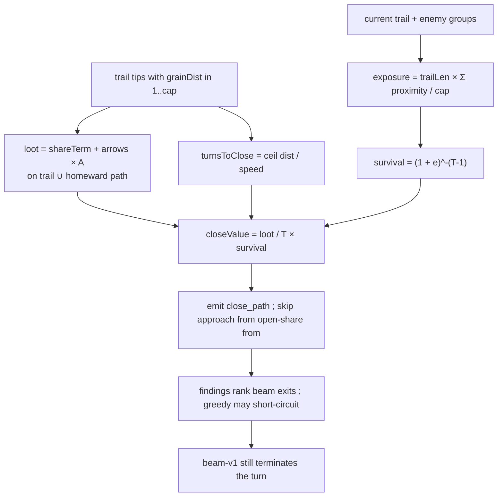

# close-and-spawner-value — the heuristic learns to walk home

**Packet:** [P54 — Closing and spawner value](../../design/packets/P54-close-and-spawner-value.md)
**SPEC:** read [§3](../../../SPEC.md) (speed, split vs merge) and
[§7](../../../SPEC.md) (closure, shares, spawners). **No game rule is added,
changed, or implied.** Nothing is owed to SPEC §11. Do not edit SPEC.md.
**Layer:** `packages/web` only. No `contracts` DTO change, no `rules-core`.
Online-api **behaviour** is unchanged (`pagesHeuristic` still calls
`chooseMove`).
**Depends on:** [bot-turn-search](../bot-turn-search/bot-turn-search.md) (P53).
**Features:** [core](./close-and-spawner-value.core.feature) ·
[edge cases](./close-and-spawner-value.edge-cases.feature)

## Purpose

The heuristic does not close, and when it does it does not close on anything
worth having. On the committed P53 baseline match
([`P53-baseline-match-2026-08-31.json`](../../design/packets/data/P53-baseline-match-2026-08-31.json))
there were **11 closes across 71 turns and 6 seats, first at move 56**
(15 closes per 100 turns). Three adapter faults, none of them a missing
game rule:

1. The only distance-driven finding is `approach_spawner`, which always
   points **away** from territory. Immediate `close` / `claim_share` fire
   only when the landing completes *on this step*. There is no multi-step
   walk home.
2. `collectFindings` skips any group already standing on an open share, so
   a tip that reached a border mills to a sibling instead of banking it.
3. Fast-and-small versus slow-and-big has no arithmetic: nothing compares
   loot per turn, discounted by how cuttable the trail is.

P53's beam can commit several steps to a route. This packet aims that
search at a **close value rate** and a **`close_path` goal**.

## Scope

In: `closeValue` as a rate; `exposure` / `survival` as a P55-swappable
seam; superlinear `shareTerm`; a `close_path` finding; mill-guard
replacement (skip-group → that group's goal is the close that banks the
share); `collectFindings` / `bestFindingMove` / BYOK lock validity for the
new kind; constructed tests plus the existing P53 shuttle head-to-head
left intact.

Out: opponent plies and replacing the exposure *proxy* with worst-reply
damage (P55); retuning P53 beam budgets (`BEAM` / `BRANCH` / `MAX_PLAN` /
`MAX_APPLIES`) or `greedy-v1`'s `scoreStepExtras` / never-pass /
findings-short-circuit; a third close-economy constant besides `S` and
`A`; an absolute CI threshold on closes-per-100 or `firstCloseAt`;
`evaluate` occupancy-as-share (P53 BSSN 11 still holds); SPEC.md;
`rules-core`; Pages calling `chooseTurnBeam`.

## BSSN (recorded)

Adapter decisions, not game rules. Written here so phases 2–4 do not
re-litigate them.

1. **`S` and `A` are the only close-economy constants.**
   `SHARE_VALUE_S = 100`, `ARROW_VALUE_A = 25` — the same magnitudes
   `evaluate` already uses for a territory share and an owned arrow — so
   ranking a planned close and scoring a completed one do not fight.
   The findings reward ladder (`close` 90, `attack` 55, `approach_spawner`
   40) is not a close-economy constant; `close_path` sits on that ladder
   at reward **80** (between attack and immediate close) so mixed-list
   `score` stays comparable. Do not add a third loot weight.

2. **Share term is triangular in the count this closure claims.**
   `shareTerm(n) = S × n × (n + 1) / 2`. One share is `S`; two is `3S`;
   three is `6S`. Taking three shares in **one** closure therefore outranks
   three separate one-share closures at equal `turnsToClose` (`6S` vs
   `3S`) without a separate "enclose the vertex" case. Squaring (`n²`) is
   rejected: it would make a 6-turn two-share close beat a 2-turn
   one-share close (`4S/6 > S/2`), which the packet forbids.

3. **The rate, then survival.**
   ```
   loot(shares, arrows) = shareTerm(shares) + arrows × A
   closeValue = loot / turnsToClose × survival(exposure, turnsToClose)
   ```
   Quiet board (`exposure = 0`) reduces to loot per turn. A 2-turn
   one-share close and a 6-turn two-share close **tie** on triangular
   shares (`3S/6 = S/2`) once arrows are equal; **fewer `turnsToClose`
   wins that tie** (then more arrows, then more shares, then smaller
   `goal` id). A 3-turn two-share close (`3S/3 = S`) beats the 2-turn
   one-share close (`S/2`) on the same quiet board — one formula, no
   branch.

4. **`turnsToClose` is the real clock.**
   `turnsToClose = max(1, ceil(grainDist / speed(heads)))` where
   `grainDist` is `distanceToTerritory` from the tip and `heads` is the
   **walking portion** — `close_path`'s `move.count`, which is the max
   legal count on the homeward exit (BSSN 8). Stay-behind can cap that
   below the stack on the arrow; using the stack size would overstate
   `speed` and understate turns. A 2-stack that can stride covers two
   grain steps per turn (`speed(2) = 2`). Distance 0 (already on own
   territory) is not a close path.

5. **`exposure` is a product, so a quiet board is exactly rate.**
   For each enemy group, `d_i` is grain distance (out-arrows, cap =
   `DEFAULT_FINDINGS_CAPS.distCap`) from that group's arrow to the
   nearest arrow of **my trail**; unreachable / beyond cap is `cap + 1`.
   `proximity_i = max(0, cap + 1 - d_i)` (zero when out of reach).
   ```
   exposure = trailLen × (Σ proximity_i) / cap
   ```
   No enemy in cap ⇒ `exposure = 0` even on a long trail. Longer trail
   scales threat when someone *can* reach. Sum groups in sorted arrow-id
   order. Do not filter stay-behind 1-stacks (P55). **P55 replaces this
   function** with worst-reply damage; `survival` stays.

6. **`survival` discounts extra turns, not the landing turn.**
   ```
   survival(e, T) = (1 + e) ** -(max(0, T - 1))
   ```
   Closing this turn (`T = 1`) is undiscounted: the loot banks before a
   cut. Extending pays geometric hazard per extra turn. When `e = 0`,
   `survival = 1` for every `T`. When an enemy sits two grain steps from
   an otherwise identical trail, `e > 0` and the shorter close wins the
   comparison the quiet board gave to the bigger one. IEEE `number` is
   allowed in the adapter (`evaluate` already uses it); same inputs must
   yield the same bit pattern — no `Date`, no `Math.random`, no unordered
   reduction that feeds a ranking.

7. **Loot estimator is on-path, not fill.**
   Claimed arrows = (my current trail arrows that are not already my
   territory) ∪ (homeward grain path from the tip up to but **not**
   including the landing territory arrow). Claimed shares = those arrows
   that border a spawner vertex. Interior fill is not estimated — a
   constructed three-share monopoly puts the three borders on the trail
   / path. One homeward BFS: lift the existing `distanceToTerritory` in
   `botEvaluate.ts` so path and distance share an implementation.
   Delete the private copy in `findings.ts`. Do not write a second
   algorithm.

8. **`close_path` finding.**
   Kind `'close_path'`. For each of my groups that is on my trail, has
   `grainDist` in `1..=cap`, and has a legal step that **strictly
   reduces** `distanceToTerritory`: emit one finding. `goal` is the
   landing territory arrow. `cost` is `turnsToClose`. `reward` is 80.
   `score = scoreOf(80, turnsToClose) + closeValue` so mixed-list order
   sits between immediate `close` (90) and `approach_spawner` (40), and
   two `close_path`s on the same state order by `closeValue`. The move is
   the distance-reducing step on the best exit at **maximum legal
   count**, then lesser `moveKey` — do not run `pickPortion` (that is
   what biased approach toward `count=1`). Best exit: the one whose
   landing distance is smallest, then lesser `moveKey`.

9. **Mill guard is replaced, not deleted.**
   A group whose `from` is an open (unowned) spawner-border arrow still
   must not hop to a sibling. **Do not `continue` past it.** Emit
   `close_path` for that group; **do not emit `approach_spawner` from
   that `from`**. Visiting a border is still not `claim_share` (P21/P53).
   Groups not standing on an open share may emit both `close_path` and
   `approach_spawner`; scores / kind priority decide.

10. **`bestFindingMove` kind order** inserts `close_path` after `attack`
    and before `approach_spawner`:
    `close`, `claim_share`, `cut`, `intercept`, `attack`, `close_path`,
    `approach_spawner`, `merge_pair`.
    That is not a `scoreStepExtras` retune. Greedy may now short-circuit
    onto a homeward step; never-pass stays.

11. **`evaluate` is not retuned.** Tip-pressure and territory/share terms
    already reward a completed close and a shorter remaining walk. Close
    value ranks *candidate routes* in findings; the beam's terminal score
    stays P53 `evaluate`. Occupancy is still not a share.

12. **Head-to-head.** P53's committed shuttle-rate / `count>1` assertions
    on reconstructed baseline heuristic turn-starts stay green. This
    packet does **not** add an absolute CI gate on closes-per-100 or
    `firstCloseAt` (baseline 15 / 100, first at 56 is the playtest bar
    for `pnpm bots`, advisory like `pnpm crap`). Constructed positions
    are the committed close / mill / rate tests.

13. **Local live, online frozen** — same as P53 BSSN 2.
    `playBotTurn` still calls `chooseTurnBeam`. Pages still calls
    `chooseMove`. Event-legibility's combat-rich harness **replays the
    committed P53 baseline log** (24 cuts). Live greedy after this packet
    short-circuits onto `close_path` and no longer mills into a cut, so a
    60-turn `chooseTurnGreedy` self-play is as vacuous as beam was in P53.

14. **BYOK locks.** `close_path` stays valid while the locked group still
    exists, the `goal` is still my territory, and some legal step from
    `from` still reduces `distanceToTerritory`. Do not treat "goal
    became owned" as stale — the goal *is* owned.

15. **Module.** `closeValue`, `shareTerm`, `loot`, `exposure`,
    `survival`, `turnsToClose`, `SHARE_VALUE_S`, `ARROW_VALUE_A`,
    `estimateCloseLoot`, and `preferClose` live in
    `packages/web/src/botClose.ts` (pure). P55 edits `exposure` there.
    `findings.ts` imports them. `botClose` must not import `findings`
    (cycle). Move `grainDistance` next to `distanceToTerritory` in
    `botEvaluate.ts` and re-export it from `findings.ts` so existing
    imports keep compiling. Search still talks to the engine only
    through `RulesPort`. Add `botClose.ts` to `packages/online-api/tsconfig.json`
    `include` (same reason as P53: Pages typechecks opponent's graph).

## Terms

| Term | Means |
|---|---|
| **close value** | `loot / turnsToClose × survival(exposure, turnsToClose)` |
| **loot** | `shareTerm(shares) + arrows × A` estimated for one prospective closure |
| **shareTerm(n)** | `S × n × (n + 1) / 2` — superlinear in shares this closure claims |
| **turnsToClose** | `max(1, ceil(distanceToTerritory(tip) / speed(walkingHeads)))` — `walkingHeads` is `close_path.move.count` |
| **exposure** | `trailLen × Σ proximity_i / distCap` — P54 proxy; P55 replaces the function |
| **proximity** | `max(0, distCap + 1 - d)` from an enemy group to my trail (`0` if out of cap) |
| **survival** | `(1 + exposure) ** -(T - 1)` for `T ≥ 1` (and `1` when `T = 1`) |
| **close_path** | finding kind: one homeward step on a multi-step route back to own territory |
| **open share** | spawner-border arrow not yet owned as territory (visiting ≠ claiming) |
| **homeward path** | grain BFS from a trail tip to the first own-territory arrow |
| **mill** | hopping between sibling open borders instead of banking the share |

*arrow*, *stack*, *head*, *share*, *trail*, *point*, *vertex*, *closure*,
*land bridge* keep their AGENTS.md / SPEC §7 meanings.

## Module boundary (normative)

```ts
export const SHARE_VALUE_S = 100;
export const ARROW_VALUE_A = 25;

export const shareTerm = (shares: number): number;
export const loot = (shares: number, arrows: number): number;
export const turnsToClose = (grainDist: number, heads: number): number;
export const survival = (exposure: number, turnsToClose: number): number;
export const closeValue = (
  shares: number,
  arrows: number,
  turnsToClose: number,
  exposure: number,
): number;
export const exposure = (
  geometry: GeometryPort,
  state: GameState,
  me: PlayerId,
  distCap?: number,
): number;
```

`FindingKind` includes `'close_path'`. `distanceToTerritory` remains
exported from `botEvaluate.ts` (re-exported from `opponent.ts` as today).
`estimateCloseLoot(geometry, state, me, tip)` returns `{ shares, arrows }`
using BSSN 7. `preferClose(a, b)` is negative when `a` ranks better
(closeValue, then fewer `turnsToClose`, then more arrows, then more
shares, then smaller `goal` id).

When two `closeValue`s compare, higher wins; on a numeric tie, fewer
`turnsToClose`, then more arrows, then more shares, then smaller `goal`
id.

## Flow



## Invariants

1. When two candidate closes differ only in loot and `turnsToClose` and
   `exposure` is 0, the system shall pick the higher `loot / turnsToClose`,
   breaking a numeric tie on fewer `turnsToClose`.
2. When a 2-turn close banks one share and a 6-turn close banks two, with
   equal arrows and `exposure` 0, the system shall prefer the 2-turn close.
3. When a 2-turn close banks one share and a 3-turn close banks two, with
   equal arrows and `exposure` 0, the system shall prefer the 3-turn close.
4. When one closure claims three shares and three closures each claim one
   share, at equal `turnsToClose` and equal total arrows, the system shall
   prefer the three-share closure (`shareTerm(3) > 3 × shareTerm(1)`).
5. The system shall compute `shareTerm(n)` as `S × n × (n + 1) / 2` with
   `S = 100`.
6. The system shall add `arrows × 25` to loot and shall not introduce a
   third loot coefficient.
7. When `exposure` is 0, the system shall return `survival = 1` for every
   `turnsToClose ≥ 1`.
8. When `turnsToClose` is 1, the system shall return `survival = 1` even
   if `exposure` is positive.
9. When an otherwise identical trail has an enemy group two grain steps
   from it versus no enemy in `distCap`, the system shall report a strictly
   larger `exposure` in the first.
10. When that threatened `exposure` is applied to a 2-turn one-share close
    versus a 3-turn two-share close (equal arrows), the system shall prefer
    the 2-turn close.
11. The system shall compute `turnsToClose` as
    `max(1, ceil(grainDist / speed(walkingHeads)))`.
12. WHEN a group stands on my trail with `1 ≤ distanceToTerritory ≤ cap`
    and a legal step that reduces that distance, the system shall emit a
    `close_path` finding whose move reduces it.
13. WHEN a group's `from` is an open spawner-border arrow, the system
    shall not emit `approach_spawner` from that `from`, and shall emit
    `close_path` rather than skipping the group.
14. WHEN a legal step visits an unclaimed spawner border without raising
    the seat's share count, the system shall not emit `claim_share` for
    that step.
15. The system shall estimate claimed arrows and shares from the current
    trail and the homeward path only, and shall not run fill.
16. The system shall pick the `close_path` move as a maximum-count
    legal step that strictly reduces `distanceToTerritory`.
17. WHILE `bestFindingMove` chooses among kinds, the system shall prefer
    immediate `close` over `close_path` over `approach_spawner`.
18. The system shall compute homeward distance with the same
    `distanceToTerritory` implementation `evaluate` uses.
19. The system shall not use `Date`, `Math.random`, `performance.now`, or
    an elapsed-time cutoff in `closeValue` / `exposure` / `close_path`.
20. Shuffling `state.groups` / `state.trails` / `state.territory`
    insertion order shall not change `exposure`, `closeValue`, or
    `chooseTurnBeam`'s plan on a constructed close position.
21. `pagesHeuristic` shall keep calling `chooseMove`.
22. WHILE `greedy-v1`'s `chooseMove` sees a legal step, the system shall
    not return `endTurn` from `chooseMove`.
23. On the committed P53 baseline heuristic turn-starts, `beam-v1`'s
    shuttle rate shall remain below `greedy-v1`'s and below 10 percent,
    and its share of `count > 1` steps shall remain above `greedy-v1`'s.
24. The system shall not import `packages/rules-core` from `botClose.ts`
    except through `RulesPort` (it should need none).
25. `playBotTurn` shall keep returning `chooseTurnBeam`'s move list.

## What this file deliberately does not decide

- Worst-reply `exposure` and one enemy ply — P55.
- Whether Pages should call `chooseTurnBeam` — still P53 BSSN 2.
- Absolute closes-per-100 / `firstCloseAt` gates in CI.
- Retuning `MOBILITY_SCALE`, beam budgets, or `scoreStepExtras`.
- A third loot constant, occupancy-as-share, or fill in the estimator.

## Spec files

- `close-and-spawner-value.core.feature` — 10 scenarios
- `close-and-spawner-value.edge-cases.feature` — 17 scenarios
- Invariants above — 25 EARS one-liners
