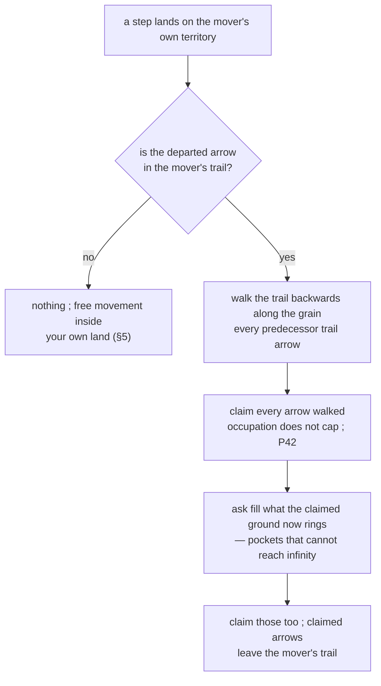

# closure — coming home, and what that takes with you

**Packet:** [P05b — Closure, fill & land bridges](../../design/packets/P05b-closure-fill.md)
**SPEC:** §7 (closure, *which arrows the landing claims*, the land bridge, the pincer,
territory is contestable), §6.1a (a trail is a set, all-to-all points), §11 items 16, 26, 34
**Features:** [core](./closure.core.feature) · [edge cases](./closure.edge-cases.feature)
**Sibling:** [fill](../fill/fill.md) — what the claimed ground *rings*

## Purpose

Every packet so far has added something a player can lose. This is the one that adds
something they can **keep**.

P05 left one branch of the safety rule deliberately empty: a step onto your own
territory marks nothing, and claims nothing, and the comment on it says so. This
file fills that branch.

Three ideas, in dependency order:

1. **A closure is an ordinary step** whose destination is already the mover's own
   territory (§7). No new move kind, no declaration.
2. **What it claims is the trail walked backwards along the grain** from the arrow it
   departed. The trail records no path (§6.1a) and does not need to — the grain
   recovers it.
3. **What the claimed ground then rings is claimed too.** Once the path is territory,
   any pocket that cannot reach infinity is surrounded — so a self-loop takes its
   inside, and a bare strip takes nothing (§11 item 36).

## Scope

In: the closure trigger, the backward walk, the claim, the land bridge, the pincer
(as two ordinary landings), the carve-out of enemy ground, and what leaves the trail.

Out: **the interior** — [fill](../fill/fill.md) owns reachability and the pockets.
**Conversion** — §7 grants the enclosed tiles *and everything standing on them*, and
this packet claims the tiles and leaves the heads standing (P07). **Evaporation** —
an enemy trail on a claimed arrow is **stripped** (P13). Convert then **wipes**
the victim's remaining trail from converted stacks (P33), so a chord between
encircled stacks does not survive on the claim.
**Accumulators** — an arrow changing hands is P08's hook, and there is nothing to
reset yet. **Vertices** — nothing here enumerates one (§11 item 34).

Tests run against the **generated tiling**, not a fixture. That is not a preference:
a finite board has no infinity to fail to reach, so no fixture can host [fill](../fill/fill.md),
and the two halves of a closure are not worth testing on different boards.

## Terms

| Term | Means |
|---|---|
| **closure** | a step whose destination is already the mover's own territory, made while the mover is trailing |
| **the closing arrow** | the arrow the closing step **departed** — the last arrow of the trail, and the root of the backward walk |
| **backward walk** | trail arrows reachable from the closing arrow against the grain. `Y` precedes `X` when `Y` is trail and `target(Y)` is `origin(X)` |
| **the claim** | every arrow the backward walk reaches. It becomes the mover's territory |
| **upstream / downstream** | of the closing arrow, along the grain. The claim is exactly the upstream part |
| **the walk's root** | where the backward walk stops: the mover's own territory, or the **stack anchor** the trail starts from — a prefix evaporated up to an anchor is the ordinary way that happens (§6.1) |
| **land bridge** | a claim that rings nothing. The path becomes territory, one tile wide, and needs no branch of its own (§7) |
| **carve-out** | a closure that claims ground another player held. Territory is contestable (§7) |
| **pincer** | a forked trail whose arms land one at a time. Not a rule — two ordinary closures (§7) |

*trail*, *territory*, *grain*, *point*, *anchor grade* keep their
[trails](../trails/trails.md) meanings.

## What a landing claims

**There is no enclose-or-strip gate.** The path is claimed either way, and whether
anything else falls out is [fill](../fill/fill.md)'s question — a pocket of
non-territory that cannot reach infinity is enclosed, and a strip simply rings nothing
(§11 item 36). §7's *land bridge* is therefore a description of an outcome rather than
a branch in the rules.

Occupation does not cap the walk ([trails-simple](../trails-simple/trails-simple.md)
P42 / §11 item 49). A garrison on an upstream trail arrow is claimed with the path;
the stack stays, now on land. Firebreaks halt evaporation only
([cuts](../cuts/cuts.md)).

[trails](../trails/trails.md)' `anchorGrade` is deliberately **not** consulted. It is
almost the same question and it is undirected — §6.1 re-attaches a fragment against
the direction it was laid — whereas a claim has the direction the closing head actually
travelled.

## Why backwards, and why it is not "the whole stretch"

§7 needs opposite answers in two passages, and the grain is what supplies both:

| §7 | the backward walk gives it |
|---|---|
| the pincer's second arm "is then an **open trail** hanging off a fork point that is *now territory*" | the other arm is **downstream** of the fork, so the walk never reaches it |
| a cut fragment driven home claims "**the path itself** — a land bridge" | the fragment is entirely **upstream**, so the walk takes all of it, dead end included |
| a point is **all-to-all**, every in feeding every out (§6.1a) | at a merge the walk takes **every** trail in-arrow — the set holds no pairing to prefer one (§11 item 26) |

*Claim the whole connected stretch* fails the first: the second arm would become
territory before it could enclose anything, and the pincer would stop existing.
*Claim only paths between two anchored ends* fails the second: a fragment is one long
dangle, so salvage would claim nothing.

## The pincer is two closures, not a rule

§7 is explicit that forking needs no additional rule, and this file must not add one.
Arms land one at a time:

1. The first arm lands. The walk runs arm → fork → stem → territory, so the stem is
   claimed with it. The second arm is downstream of the fork and is untouched.
2. The second arm is now an open trail whose root — the fork point — is territory. Its
   own landing is an ordinary closure, and it takes the ground between itself and the
   arm that solidified first.

So the pincer's two scenarios are both instances of the scenarios above, and that is
the claim being made: *nothing was added for it.*

## Invariants

- When a step's destination is already the mover's own territory and the departed
  arrow is in the mover's trail, the system shall treat the step as a closure.
- The system shall claim every trail arrow reachable from the departed arrow by
  following the trail against the grain.
- The system shall claim no trail arrow reachable from the departed arrow only by
  following the trail with the grain.
- At a point where the claimed trail has more than one in-arrow, the system shall
  claim every one of them.
- The system shall stop the walk at the mover's own territory, and at an arrow with no
  trail predecessor — the stack anchor the trail starts from.
- The system shall claim, in addition to the walked path, every arrow the claimed
  ground then rings (see [fill](../fill/fill.md)).
- When the claimed ground rings nothing, the system shall claim the walked path and
  nothing else.
- The system shall claim a walked or enclosed arrow whichever player held it before,
  and shall record exactly one owner per arrow.
- The system shall remove every claimed arrow from the claiming player's trail.
- The system shall leave every other player's trail unchanged by a closure.
- The system shall leave every head standing where it stood, including a head of
  another player on a claimed arrow.
- When the departed arrow is not in the mover's trail, the system shall claim nothing.
- When the destination belongs to another player, the system shall not treat the step
  as a closure.
- The system shall enumerate no vertex — **P37: measured as a delta.** Loss resolution sits on the tail of `apply` and reads the spawner lattice when a seat owns ground and holds no head, so this sentence can no longer be measured across a whole `apply`. The rule itself still reads no vertex: assert it as *no lattice read beyond an idle move on the same board*. See `docs/spec/immediate-loss/immediate-loss.md`.
- The system shall not mutate the input state, and shall return equal outputs for
  equal inputs.

## What this file deliberately does not decide

- **What the enclosed region is** — [fill](../fill/fill.md). This file says *that*
  the interior is claimed and never *which* tiles it contains.
- **Whether an enclosed enemy head converts** — P07 (§6.3). Here it keeps standing on
  ground that is now someone else's, which is a legal state and a stated seam, not a
  rule about heads surviving.
- **Whether a claimed arrow's production resets** — P08 (§7). An arrow changing hands
  is the event that will reset an accumulator, and there are no accumulators yet.
- **Who owns a special** — a reading of `territory` through `borderArrows`, and P08's
  (§11 item 34). Nothing here writes or counts a vertex.
