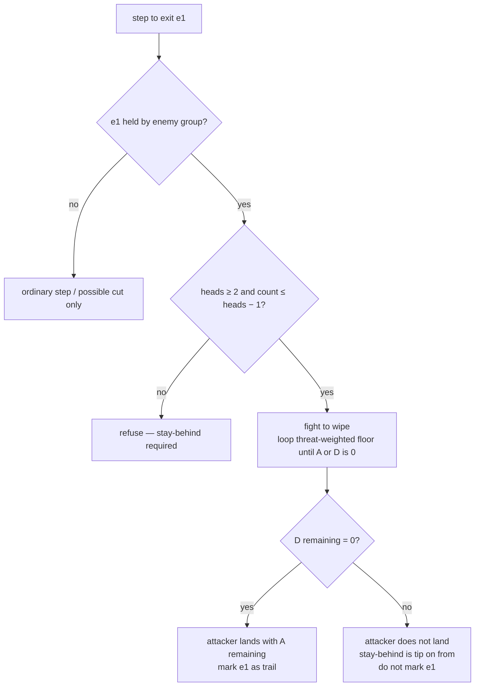

# combat — contact on an enemy-occupied arrow

**Packet:** [P06 — Cuts, evaporation & contact combat](../../design/packets/P06-cuts-combat.md)
**SPEC:** §6.2 (contact combat), §11 items 6, 10, **37**, **38**
**Features:** [core](./combat.core.feature) · [edge cases](./combat.edge-cases.feature)
**Sibling:** [cuts](../cuts/cuts.md) — evaporation from a crossing

## Purpose

P04 refused stepping onto an enemy-occupied arrow with *contact is P06*. This
file fills that seam with the approved **contact combat** rule (§11 items 37–38).

~~Contested-point 1:1~~ — *two stacks pointing into the same point fight* — is
**withdrawn**. Shadowing and waiting beside an enemy without stepping onto them
are ordinary play.

## Scope

In: the combat trigger, stay-behind, fight-to-wipe, the threat-weighted loss
rule, land / bounce outcomes, mark-only-on-land, allowance cost, order with
cuts, and the explicit non-trigger.

Out: **evaporation** — [cuts](../cuts/cuts.md). **Conversion** — P07. Territory
combat modifiers — §11 item 39 (parked). Blotto, battle slots, secret bids,
RNG, mid-fight interrupt / retreat — rejected or deferred.

Tests on the **P02 fixture boards**.

## Terms

| Term | Means |
|---|---|
| **attack** | an ordinary step whose destination holds an enemy group |
| **stay-behind** | ≥ 1 head left on `from`; a lone head cannot attack |
| **A** | the step's `count` — attacking heads (`count ≤ heads − 1`) |
| **D** | defender heads on the destination arrow |
| **threats** | *tA* = *D*/(*A*+*D*), *tD* = *A*/(*A*+*D*) |
| **loss weights** | *wa*∶*wd* = *tA*² ∶ *tD* |
| **fight-to-wipe** | loop the floor rule until *A* or *D* is 0, inside one `apply` |

## How contact resolves

**Exact arithmetic.** Threats and weights are rationals / integer cross-products —
never floating point (ADR 0001). Equivalent integer form: *wa*∶*wd* = *D*² ∶ *A*(*A*+*D*).

Under the current magnitude step, a single round already wipes one side for
positive integer *A*, *D*; the loop states the HoMM intent if the table is retuned.

## Invariants

- When a step's destination holds an enemy group, the system shall resolve contact
  combat with the §6.2 threat-weighted floor rule, looping until *A* or *D* is 0.
- The system shall refuse an attack that would empty `from`, and shall not offer
  such a count in `legalMoves`.
- The system shall not treat two stacks that merely point into the same point as
  in combat.
- When *A* = *D*, after flooring the system shall leave the attacker with
  remainder and the defender with zero.
- When *D* remaining is 0, the system shall land the attacker with *A* remaining
  and mark the destination as trail.
- When *A* remaining is 0, the system shall not land the attacker and shall not
  mark the destination.
- The system shall spend one step of the attacker's allowance for the whole battle.
- When combat and a cut both apply, the system shall resolve combat before the cut.
- The system shall compel no step: declining is always legal, and it is the
  absence of a move rather than a move (P51).
- The system shall not mutate the input state, and shall return equal outputs for
  equal inputs.
- The system shall use no randomness and no floating-point loss arithmetic.

## What this file deliberately does not decide

- **Evaporation** — [cuts](../cuts/cuts.md).
- **Conversion of standing heads** — P07.
- **Territory combat modifiers** — §11 item 39 (parked).
- **Retreat between rounds** — deferred; fight-to-wipe has no mid-battle interrupt.
