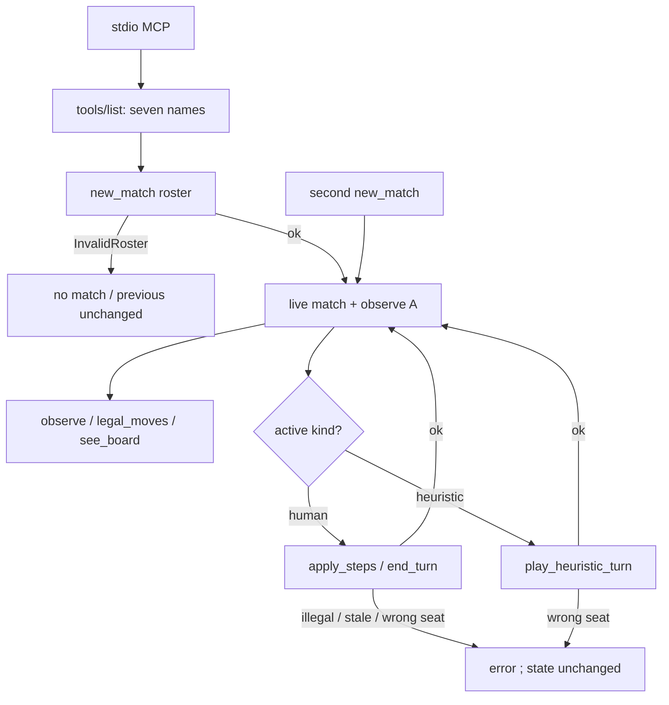

# conquarrow-mcp — stdio tools over rules-core, not a scrape

**Packet:** [P67 — Conquarrow MCP](../../design/packets/P67-conquarrow-mcp.md)
**ADR:** [0004 — board picture is SVG](../../adr/0004-mcp-board-picture-is-svg.md),
[0003 — Pages-direct BYOK](../../adr/0003-pages-direct-byok.md) (untouched)
**Depends on:** P01, P04, P11-read, P15-read, P21-read, P64-read. After P66 (`#57`).
**SPEC:** none. Adapter only. **No game rule is added, changed, or implied.**
Nothing is owed to SPEC §11. Teaching file stays P66’s.
**Layer:** new package `packages/mcp` (`@conquarrow/mcp`) over `rules-core` +
`contracts` + `geometry-tiling`. Not `packages/web` as a dependency. Not a
Pages drive. Not raw `GameState`.
**Features:** [core](./conquarrow-mcp.core.feature) ·
[edge cases](./conquarrow-mcp.edge-cases.feature)

**Counts:** 23 scenarios (9 core, 14 edge) · 22 invariants · 0 deferred ·
0 SPEC §11 items.

Do not burst [byok-hint-and-threat](../byok-hint-and-threat/byok-hint-and-threat.md),
[byok-batch-turn](../byok-batch-turn/byok-batch-turn.md),
[findings-planner](../findings-planner/findings-planner.md),
[bot-turn-search](../bot-turn-search/bot-turn-search.md), or
[won-is-over](../won-is-over/won-is-over.md). Do not edit
`docs/byok-teaching.md`. Do not touch `chooseTurnBeam`.

## Purpose

BYOK is one POST per leftover-tempo offer. A local tool caller wants **tools**
over the same engine: a seat-scoped observation, numbered legal rows in the
BYOK text shape, `apply` / end-turn / frozen greedy-v1, and a board picture to
look at. The caller is not a seat kind. Seats it drives are **human**. Heuristic
seats move only when `play_heuristic_turn` is called. This package does not
call a model and does not hold a key.

One sentence: **stdio MCP over `legalMoves` / `apply` / observation+findings —
not a UI scrape and not raw `GameState`.**

## Scope

In: `packages/mcp` stdio server; seven tools; in-process live match; last
`legal_moves` offer per seat; simple SVG board picture; README stdio one-liner.

Out: BYOK on Pages; teaching-file edits; temperature / plan echo; MCP
resources; a match log or temp file; multi-match concurrency; AWS; a server
rasterizer or `magick`; storing which human is a living person; a fourth seat
kind; `chooseTurnBeam`; scraping Pages; depending on `@conquarrow/web` (React /
Vite `?raw`).

## BSSN (recorded)

Adapter decisions, not game rules. Written here so phases 2–4 do not
re-litigate them. No SPEC §11 item.

### 1. Package and transport

- Directory `packages/mcp`, name `@conquarrow/mcp`.
- Official SDK `@modelcontextprotocol/sdk`, **stdio** transport.
- Suggested server name `conquarrow`. Bin / start script is the OpenCode
  one-liner. There is no MCP config in the repo today — do not invent a second
  format.
- One live match per process. `matchId` is an opaque in-process string
  (`match-1`, `match-2`, …). No `Math.random` / `Date.now` to mint it.
- Tools other than `new_match` operate on that live match. They do not take
  `matchId`. A second `new_match` replaces the first.

### 2. Roster

- `new_match` requires `playerCount` ∈ {3, 6} and `seats`: an array of
  `human` | `heuristic` of that length. Any other count, a `byok` kind, a
  length mismatch, or a missing roster is refused and leaves **no** match
  (or the previous match, if any, unchanged).
- Defaults when omitted: `R=7`, `homeOffset=5`, `dominationN=5`,
  `spawnerSeed=1`. Setup is `makeTiling()` + `makeMatch(config)`.
- Seat ids are the player labels `A`… in play order (`mintPlayerId`).
- Every tool except `new_match` takes `seat`. `new_match` returns observation
  for `A`.
- The living person is a chat fact, not server state.

### 3. Who may mutate

| Tool | Who |
|---|---|
| `observe`, `legal_moves`, `see_board` | any existing seat |
| `apply_steps`, `end_turn` | only the **active human** seat |
| `play_heuristic_turn` | only the **active heuristic** seat, and only when called |

`legalMoves` / `apply` are always the engine’s, for `activePlayer`. A
`legal_moves` call for a seat that is not active returns an empty text and
**does not** replace that seat’s last offer. Findings for a non-active `me`
are `[]`.

### 4. Observation keys (locked)

```
me, activePlayer, winner,
shareCounts, territoryCounts, starvationStreaks,
myGroups, exposedTips,
threatLine,
offerTags,
longestEnemyTrail,
spawnersNearTips,
findings
```

- `me` is the `seat` argument (A on `new_match`).
- `winner` is `null` or a seat id. Never omit the key.
- `threatLine` is `threatLineFromCounts` over those fields. Not `leadLine`.
- `offerTags` is the P64 named set present on the current engine offer for
  `me` when `me === activePlayer`: `cut`, `closes`, `borders_spawner`, plus
  dirt-closes when every `closes` row lacks `share+N`. Otherwise `[]`.
- `longestEnemyTrail` is `null` when no other seat has trail length > 0;
  else `{ seat, length, sample }` with `sample` capped at 24 ids
  (`MAX_LISTED_ARROWS`).
- `spawnersNearTips` is the P64 tip-local rank, cap 12. Same facts as
  `pickSpawnerRows`. Never the full spawner map.
- `findings` are `collectFindings` objects. The step field is `move`, not
  `step`. A finding is omitted unless `move` is a `kind === 'step'` row of
  `legalMoves` for `activePlayer` and `me === activePlayer`.
- JSON tools must not include a `spawners` array of length 58, a full
  `territory` cell list, or raw `trails` beyond the sample cap.

### 5. `legal_moves` text

Same columns as `formatLegalMoves` / `annotateMove`:

```
[i] step from=… exit=… count=… [leave=N] spd=… spent=… left=… tipDist={d0}→{d1} trailLen=… [tags=…]
```

`leave=` only when `leave > 0`. Default **includes** mills. `includeMills: false`
drops rows tagged `home_mill`. Last offer for index apply is the printed list
for that seat.

### 6. `apply_steps`

Exactly one of:

- `steps`: `{ from, exit, count }[]`
- `indices`: numbers that appear as `[i]` on **this seat’s** last `legal_moves`

Empty, both, or neither: refuse, state unchanged. Each accepted step is
`rules.apply`. Return `observation` (for that seat) and `landed`: per step
`{ from, exit, count, tags }` whose tags are the `annotateMove` tags of that
step (including `closes`, `cut`, `share+N`). A stale index, an illegal step,
a won match, or a kind/active mismatch: refuse, state unchanged. Wrap
`ContractViolation`; do not swallow.

### 7. Board picture

`see_board` returns SVG text (ADR 0004). Not PNG. Coordinates from
`makeLayout`, arrows in `geometry.window(seedPoint, R)`. Assertable marks:

- root `<svg xmlns="http://www.w3.org/2000/svg">` with a `viewBox`
- one element per window arrow: `data-arrow="{id}"`
- one element per window spawner: `data-spawner="{id}"`
- one element per window group: `data-group="{arrow}" data-owner="{seat}"`
  and `data-highlight="1"` iff `owner === seat` argument
- no `data-legal-index`, no findings, no `<script>`
- same state + seat → byte-identical SVG
- same state, other seat → same `viewBox` and `data-arrow` / `data-spawner`
  set; only group `data-highlight` (and highlight stroke) may differ

The picture is not an offer. CI must not run ImageMagick.

### 8. Imports

Do not depend on `@conquarrow/web`. Do not import `Board.tsx`, React, or
Vite `?raw`. Copy `annotateMove` / `formatLegalMoves` / `threatLineFromCounts`
/ `collectFindings` / `chooseTurnGreedy` (and their pure callees) into
`packages/mcp/src/` when a web import would pull the renderer. Frozen
`greedy-v1` only.

### 9. Errors

| Situation | Name |
|---|---|
| no live match | `NoLiveMatch` |
| bad roster / count / kind | `InvalidRoster` |
| unknown seat id | `UnknownSeat` |
| mutate wrong kind or not active | `SeatKindMismatch` |
| index not on last offer | `StaleOfferIndex` |
| engine illegal / won | wrap `ContractViolation` |

Refuse = tool error, live match state identical to before the call
(or still no match).

## Terms

| Term | Means |
|---|---|
| **seat** | A participant labeled in play order. Who submits their moves. |
| **human** | A seat whose moves arrive through `apply_steps` / `end_turn`. |
| **heuristic** | A seat whose only legal MCP mutation is `play_heuristic_turn` (greedy-v1). |
| **caller** | The MCP client. Not a seat kind. |
| **live match** | The one in-process `GameState` + seat plan + last offers. |
| **observation** | The locked JSON view. Not `GameState`. |
| **offer** | Numbered BYOK-shaped rows from the last `legal_moves` for that seat. |
| **board picture** | Simple SVG of the `R`-window. Not an offer. |
| **landed tags** | `annotateMove` tags of an applied step. |

_Avoid:_ OpenCode seat, BYOK seat (this package), chair, leadLine, bitmap as a
tool result, scrape, screenshot.

## Helper shape

```
new_match({ playerCount, seats, R?, homeOffset?, dominationN?, spawnerSeed? })
  -> { matchId, observation }

observe({ seat }) -> observation
legal_moves({ seat, includeMills? }) -> { text }
apply_steps({ seat, steps? , indices? }) -> { observation, landed }
end_turn({ seat }) -> { observation }
play_heuristic_turn({ seat }) -> { moves, observation }
see_board({ seat }) -> { svg }

tools/list -> the seven names, no resources
```

`play_heuristic_turn` applies `chooseTurnGreedy` in order, including its
endTurn. `moves` is that list. The engine accepted each at apply time.

## Flow



## Invariants

- WHILE serving a tool, the system shall call `rules-core` `legalMoves` /
  `apply` / end-turn and shall not scrape a DOM, launch a browser, or shell out.
- WHEN `playerCount` is not 3 or 6, or a kind is not `human` or `heuristic`, or
  `seats.length` is not `playerCount`, `new_match` shall refuse and shall not
  replace an existing live match.
- WHEN `apply_steps` or `end_turn` names a seat that is not the active human
  seat, the system shall refuse and leave state unchanged.
- WHEN `play_heuristic_turn` names a seat that is not the active heuristic
  seat, the system shall refuse and leave state unchanged.
- WHEN `apply_steps` names an illegal step or a stale index, the system shall
  refuse and leave state unchanged.
- WHEN `state.winner` is set, `apply_steps`, `end_turn`, and
  `play_heuristic_turn` shall refuse and leave state unchanged.
- WHEN `observe` runs, every `findings[].move` shall be a `kind === 'step'`
  member of `legalMoves` for `activePlayer`, and `me` shall be `activePlayer`,
  or `findings` shall be empty.
- WHEN `observe` runs, `spawnersNearTips` shall contain at most 12 rows, and
  the payload shall not include a full spawner map.
- WHEN `threatLine` is returned, it shall equal `threatLineFromCounts` over
  the observation’s counts, offer tags, and dirt flag.
- WHEN `legal_moves` prints a row, it shall include `spd=` and shall include
  `leave=` iff the unmoved heads on `from` are greater than `count`.
- WHEN `includeMills` is false, no printed row shall carry tag `home_mill`.
- WHEN two `see_board` calls share state and seat, the SVG texts shall be
  equal.
- WHEN two `see_board` calls share state and differ in seat, they shall share
  `viewBox` and the `data-arrow` / `data-spawner` sets, and only group
  `data-highlight` may differ.
- WHEN `see_board` runs, the SVG shall not contain `data-legal-index` or a
  findings list, and shall not be a PNG.
- WHEN `new_match` succeeds a second time, the previous `matchId` shall no
  longer be the live match, and last offers shall be empty.
- WHEN a tool other than `new_match` runs with no live match, the system shall
  refuse `NoLiveMatch`.
- WHEN two findings tie, the system shall reuse P21’s deterministic tie-break.
- The observation, findings, board picture, and matchId mint shall not use
  `Math.random` or `Date.now`.
- Keys shall not leave the process. This package shall not call OpenAI or any
  model host.
- `tools/list` shall name exactly
  `new_match`, `observe`, `legal_moves`, `apply_steps`, `end_turn`,
  `play_heuristic_turn`, `see_board`.
- The server shall list no MCP resources.
- JSON tools shall not return the full 58-spawner array.

## What this file deliberately does not decide

- BYOK prompt contract, temperature, plan echo (P64/P66).
- Beam search as an MCP flag (parked).
- Online BYOK (P20+).
- Whether a future packet extracts web helpers into a shared package — copy
  is in-bounds here.
- Rasterizing the SVG (caller / `magick`, not this server).
