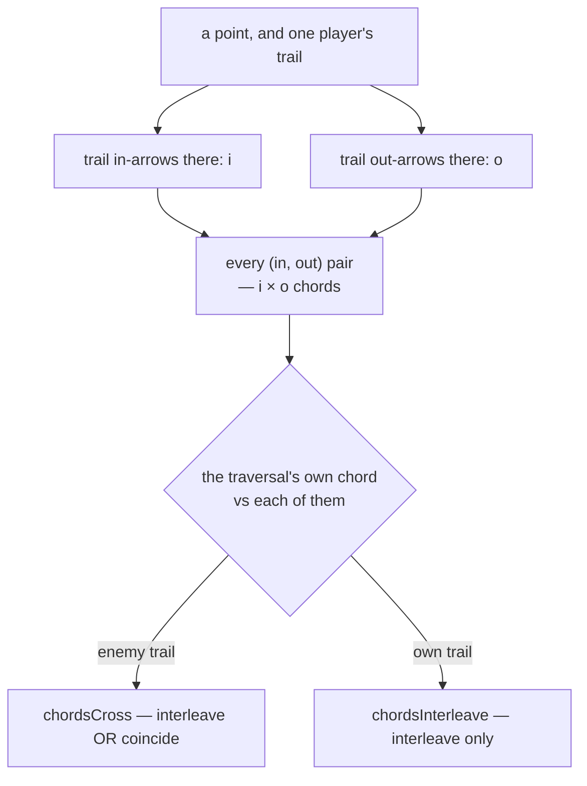

# crossings — a trail's chords at a point, and who crossed whom

**Packet:** [P05 — Trails, sentries & crossings](../../design/packets/P05-trails-crossings.md)
**SPEC:** §2 (trails own points, the chord test), §6.1a (all-to-all points),
§11 items 26 and 27
**Features:** [core](./crossings.core.feature) · [edge cases](./crossings.edge-cases.feature)
**Builds on:** [chord-test](../chord-test/chord-test.md) — P01's predicate, unchanged

## Purpose

P01 shipped the predicate: given two chords at a point, do they interleave, and do
they cross. It said outright that **extracting a trail's chords is the caller's
problem**, and this is the caller.

Two jobs, and the second is where a wrong-but-plausible implementation hides:

1. **Extraction** — read a player's trail in-arrows and out-arrows at a point off
   the arrow set, and present every (in, out) pair as a chord. `i × o` of them.
2. **Application** — test a traversal's own chord against each of those, with the
   right predicate for the question being asked.

## Scope

In: chord extraction at a point, the enemy-crossing query, the self-crossing query.

Out: **what a crossing does.** A cut, its evaporation and its combat are P06
(§6.1, §6.2); the lobe inversion a self-crossing causes is P05b (§7). Everything
here is a **query** — nothing is refused and nothing is destroyed by asking.

Tests run on the P02 fixture boards. `minimal` is `K₇`, which makes dense
multi-chord points easy to author; the port answers `slotOf` either way.

## Terms

| Term | Means |
|---|---|
| **traversal** | a `(from, exit)` pair transiting the point `target(from)`. It draws one chord |
| **chord** | the arc from an in-slot to an out-slot at a point (P01) |
| **the trail's chords at a point** | every (trail in-arrow, trail out-arrow) pair there — `i × o` of them, with no pairing implied |
| **crossing** | the traversal's chord **interleaves with or coincides with** one of the trail's |
| **self-crossing** | the same, against the mover's own trail, and on **interleave only** |
| **shadowing** | travelling alongside an enemy trail point after point without ever crossing it |

## Extraction is `i × o`, and the count is the point

| the trail's shape at the point | i | o | chords |
|---|---|---|---|
| stub — trail leaves, nothing arrived | 0 | 1 | **0** — landing on the out is still §2 coincide |
| tip — trail arrives, nothing leaves | 1 | 0 | **0** |
| spine — passes through once | 1 | 1 | **1** |
| join — two strands arrive, one leaves | 2 | 1 | **2** |
| split — one arrives, two leave | 1 | 2 | **2** |
| crossover — passes through twice | 2 | 2 | **4** |
| triple crossover | 3 | 3 | **9** |

**Why there is no pairing to recover.** A walk that went `a→a, b→b` and one that
went `a→b, b→a` leave the identical arrow set (§11 item 26), so the set determines
no pairing and asserting one would route damage down arrows the player never
connected. The point simply *is* a join followed by a split, every in feeding every
out (§6.1a). A knot is genuinely more cuttable than a spine, which is the right
sign: more strands through a point, more ways through it.

**The triple crossover is impassable by arithmetic.** All six slots are the
trail's, so no traversal exists that is not testing against the trail's own arrows
— no enemy can transit the point at all, and no rule had to say so.

## Two predicates, because §7 asks a narrower question than §6.1

| against | predicate | why |
|---|---|---|
| an **enemy** trail | `chordsCross` — interleave **or** coincide | both real cases: threading between two of their arrows, and landing directly on one (§2) |
| the **mover's own** trail | `chordsInterleave` only | coincidence cannot invert anything — re-traversing an arrow already in the set leaves the set unchanged (§6.1a), so there is nothing for §7's even-odd to flip |

The relationship is itself an invariant, not two independent tests: `chordsCross`
is `chordsInterleave` widened by coincidence (chord-test spec).

## Crossing is a decision, not a tripwire

The test is on the **exit choice**, so a head standing at a point an enemy trail
runs through has not crossed anything. Three behaviours follow with no extra
design (§2), and all three are scenarios here rather than prose:

- **Shadowing** — travel alongside an enemy trail point after point, choosing your
  moment.
- **Holding a contested point** — stand there without committing to a fight.
- **Racing in parallel** — two trails through one corridor, mutually aware and
  mutually unobligated, until one of them turns.

All three survive §6.2 only because declining is always legal: no step is ever
forced, so a
first-class move (P04). What an enemy denies you is passage *through* a point,
never the right to stand beside it.

## Invariants

- The system shall present exactly `i × o` chords for a player's trail at a point
  with `i` trail in-arrows and `o` trail out-arrows there.
- The system shall pair no trail in-arrow with any particular trail out-arrow.
- The system shall present no chord for a player whose trail has no in-arrow or no
  out-arrow at the point.
- The system shall report a crossing of an enemy trail when the traversal's chord
  interleaves with or coincides with any chord of that trail at the point, or
  when the traversal's exit is one of that trail's arrows (SPEC §2 coincide),
  including when the trail presents no chord at the point.
- The system shall report no crossing when the traversal's exit is not a trail
  arrow of that player and the traversal's chord neither interleaves with nor
  coincides with any chord of that trail at the point.
- When testing against the mover's own trail, the system shall report a
  self-crossing on interleave only, and never on coincidence.
- The system shall test the traversal against every chord the trail presents, not
  only the first.
- The system shall report a crossing only for a traversal — never for arriving at a
  point, and never for standing on one.
- The system shall derive every chord through `slotOf`, and shall infer no slot
  from an arrow identifier.
- The system shall report the same verdict for the same `(state, traversal)`
  however the trail's arrows were inserted.
- The system shall change no state when asked for a crossing verdict.

## What this file deliberately does not decide

- **What a crossing costs.** Evaporation, its fronts and its kills are P06 (§6.1);
  the 1:1 exchange at the point is P06 (§6.2).
- **What a self-crossing claims.** What the loop rings once the path is claimed is
  P05b's (§7, §11 item 36 — reachability, so there is no lobe inversion to report).
  Here the crossing is reported and nothing more.
- **Whether the crossing move is legal.** It is — that is §2's whole point about
  crossing being a decision. Legality lives in [trails](../trails/trails.md) and
  P04; this file answers *did it cross*, not *may it*.
