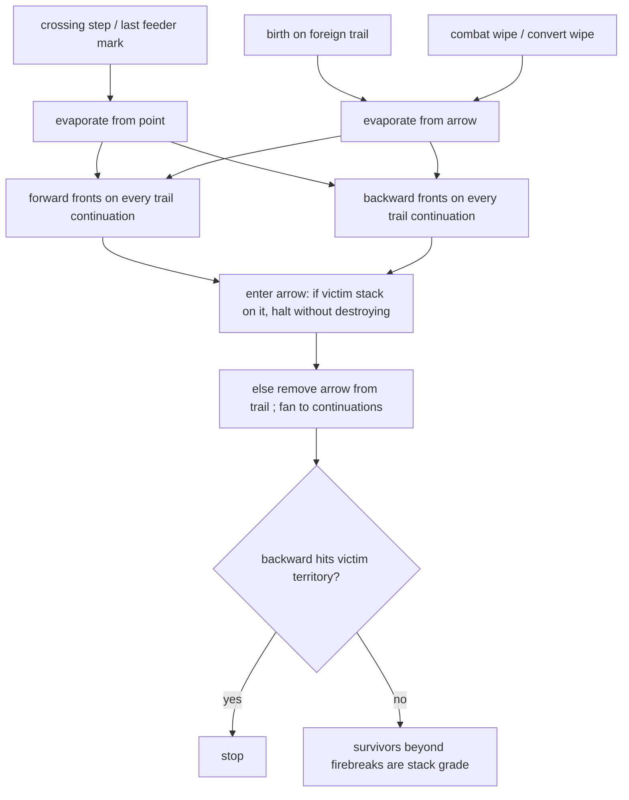

# cuts — evaporating a trail

**Packet:** [P13 — Trail fire & anchors](../../design/packets/P13-trail-fire-anchors.md)
(was P06 for the original kill-per-front rule)
**SPEC:** §6.1, §6.1a, §2, §11 items 8, 24, 26, 27, 28 (P12 re-resolutions), item 47 (P40)
**Features:** [core](./cuts.core.feature) · [edge cases](./cuts.edge-cases.feature)
**Sibling:** [combat](../combat/combat.md) · [birth-cut](../birth-cut/birth-cut.md)
**Builds on:** [crossings](../crossings/crossings.md)

## Purpose

An enemy traversal that crosses your trail **cuts** it. A territory-root feeder
mark is a cut at `P0`. A birth onto foreign trail is also a cut
([P40](../birth-cut/birth-cut.md)), started from the birth arrow. Combat wipe
and convert wipe start the **same** evaporation from an arrow
(`evaporateFromArrow`); they are not a second destruction, and they are not
named a cut. Evaporation clears trail paint in both directions until a garrison
or territory stops it. **It does not kill heads** — combat does.

## Terms

| Term | Means |
|---|---|
| **cut** | a crossing step, a territory-root cut at `P0`, or a birth on foreign trail |
| **cut point** | the point evaporation starts from, when the seed is a crossing or a territory-root cut |
| **front** | one advancing edge of evaporation (no kill) |
| **firebreak** | the first occupied arrow a front would enter — halt; arrow and stack survive |
| **region** | trail between two firebreaks, or a firebreak and territory |
| **territory-root cut** | last enemy mark on a territory feeder into `P0` |

## How a cut resolves

## Invariants

- When a cut resolves, the system shall evaporate the victim's trail both ways from the cut point without reducing any head counts.
- When a front would enter an arrow occupied by the victim, the system shall halt and shall not destroy that arrow.
- At a branch, the system shall send a front into every continuation.
- The system shall halt per arrow, never by a head on another arrow of the same point.
- When a backward front reaches the victim's territory, the system shall stop.
- When a step marks the last clean territory feeder into a trail root `P0`, the system shall cut the owner's trail at `P0`.
- When a stack is wiped to 0, the system shall evaporate that owner's trail from that arrow.
- When a spawner birth lands on another player's trail arrow, the system shall evaporate that trail from the birth arrow (P40).
- The system shall not leave a dormant (unanchored) trail component standing.
- The system shall not mutate the input state.
