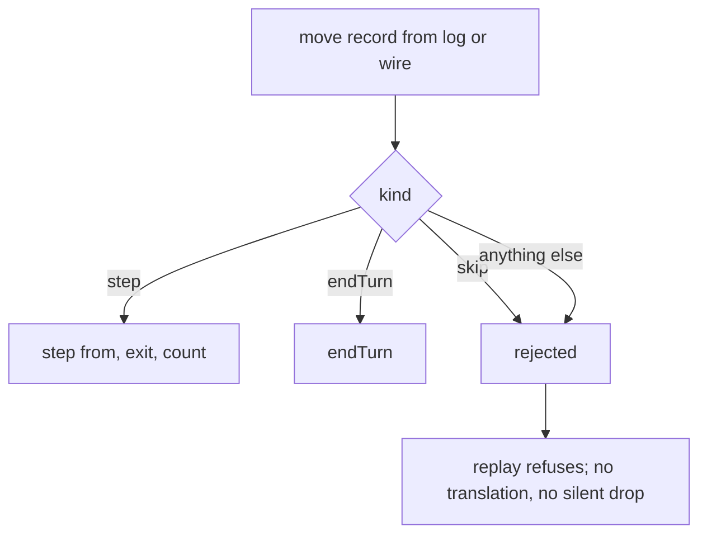

# P51 — Delete `SkipMove`

Packet: [`docs/design/packets/P51-delete-skip-move.md`](../../design/packets/P51-delete-skip-move.md).
Depends on **P50**, which stopped the only producer of a skip.

## Purpose

`SkipMove` is a state no-op whose entire content was being a *recorded decision*.
It was only ever a way to jump to the next actionable stack — the job P50 now
does client-side, emitting no move — and recording it turned a UI cursor into a
domain concept, put it on the online wire, and got it written into SPEC.md as a
game rule it never was.

This packet deletes the kind. **Declining stays legal**: nothing ever compelled a
step, and **End turn** remains the only way to forfeit remaining allowance. What
changes is the *mechanism* — from "skip is a move you make" to "no move is
compelled".

## Terms

| Term | Means |
|---|---|
| **skip** | the deleted move kind: named an arrow, changed no state, was logged |
| **declining** | not stepping a stack; after this packet, the absence of a move, not a move |
| **compelled** | a state in which the engine would force a step. There is no such state, before or after |
| **legal-move offer** | what `legalMoves` returns for a state; after this packet it is steps plus `endTurn`, never a skip |
| **persisted log** | the ordered move list a match replays from, on disk or on the wire |

## Flow — decoding a persisted move

## Scope

**In:** deleting the kind from `contracts`, `rules-core`, `web`, `online-api`;
the test and `.feature` sweep; the SPEC.md correction.

**Out:** any change to what a player can do. No §11 item is opened. If a
behaviour turns up that this packet has not decided, that is a §11 entry and an
escalation, not a default.

## Behavioural delta: none a player can observe

Three near-misses, each checked and each genuinely inert:

1. **`legalMoves` shrinks.** A movable group with allowance but *zero* landable
   exits contributed exactly `skip(arrow)` and now contributes nothing. The
   offer is never empty regardless — `endTurn()` is always pushed. Callers that
   matter already filter on `kind === 'step'`
   ([`autoEndTurn.hasLegalStep`](../../../packages/web/src/autoEndTurn.ts),
   [`cursor.movableArrows`](../../../packages/web/src/selection/cursor.ts)), so
   auto-pass, victory and the P50 cursor are all untouched. Only a test counting
   the offer's *length* changes, and that is a setup change, not an expectation.
2. **The match-log summary loses its `skips` counter.**
   [`matchLog.ts:171`](../../../packages/web/src/matchLog.ts) renders the count
   only `if (summary.skips > 0)`, and after P50 nothing increments it — the line
   is already unreachable. Removing the field removes dead output.
3. **The bot never saw one.** [`byokBot.ts:97`](../../../packages/web/src/byokBot.ts)
   already does `moves.filter((m) => m.kind !== 'skip')`, so no model has ever
   been offered a skip.

The one *observable* change is at the decode boundary, and it is deliberate.

## No backward compatibility

A persisted log or wire payload carrying `"skip"` is **rejected**, not
translated to a no-op and not silently dropped. Matches logged before P50 do not
replay. This is an explicit decision by the human owner — those logs are being
deleted — and it is what keeps this a deletion rather than a compatibility shim.
Rejection uses the decoder's existing failure path; no new error shape is added.

## Adapter BSSN

- **`requestSkip` and the `cannot-skip` refusal go too.** The `InputMode` member
  and the `'cannot-skip'` [`RefusalReason`](../../../packages/web/src/fx/present.ts)
  exist only to produce or refuse a skip. With no skip to request, a mode method
  that can only fail is worse than no method: it invites a caller to reintroduce
  the concept. The tests that exercise the refusal
  (`ray-run-input.*`, `count-after-route.edge-cases`, `input.test`) lose their
  subject and are deleted, not restated — "you may not skip while a route is
  drawn" has no surviving meaning.
- **`tutorial/restrict.ts`'s delegation** goes with the `InputMode` member; the
  tutorial never restricted skip beyond passing it through.

## Test-sweep taxonomy

35 test files use `skip(`. They are three kinds and they are **not**
interchangeable — decide per test, do not blanket-delete and do not
blanket-keep:

- **Incidental no-op nudges** — `apply(state, skip(x))` used to advance without
  moving while asserting something else did not change. Delete the nudge; the
  assertion stands on the state it already had.
- **Assertions about skip itself** — skip on an arrow that is not yours throws;
  skip does not convert; a skipped step does not bank. Each either goes (the
  behaviour no longer exists) or is restated against the surviving expression of
  the same idea, which is **no step is ever compelled**.
- **Replay fixtures** whose move list contains a skip. Re-record without it. The
  final state **must** be identical; a differing final state is a defect to
  report, not a fixture to adjust.

27 `.feature` files carry 76 lines naming skip. Correct the ones describing live
behaviour; a scenario that exists only to exercise skip goes with it.

## SPEC.md correction

Eight hits, seven of which change. Per CLAUDE.md, §11 is amended in place with a
strike, never deleted.

| Line | Now | Becomes |
|---|---|---|
| `§2 :54` | "declining is always legal. Skip is a first-class move (§4)" | declining is legal because no step is ever forced |
| `§4 :285` | "A stack may move or skip" | a stack may move, or not; there is no move that means *not* |
| `§4 :332` | "Skipping is normal, not a fallback" | keep the point — a rearguard standing still is doing its job — reworded off the word *skip* |
| `§6.1 :460` | "not skipping the rest of the join-then-split" | **unchanged** — ordinary English, not the move kind |
| `§6.2 :508` | "Skip is first-class (§4)" | standing beside an enemy without stepping onto them fights nothing, because no step is forced |
| `§6.2 :1059` | "skip still declines advancing" | not stepping still declines advancing |
| `§6.3 :1097` | "Skip does not convert" | not stepping does not convert |
| `§11 :947` | "skip is a first-class move" | strike that clause in place, point at P51 |
| `§11 :951` | "does a skipped step bank" | moot; the answer (no) is unchanged and now follows from there being nothing to skip |

## Invariants (EARS)

1. Ubiquitous — The system shall offer no move of kind `skip` for any state.
2. Ubiquitous — `MOVE_KINDS` shall contain exactly `step` and `endTurn`.
3. Ubiquitous — The legal-move offer shall be non-empty for every live state.
4. Event-driven — When a persisted move record names kind `skip`, the decoder
   shall reject it and shall not substitute any other move.
5. Event-driven — When a replay fixture is re-recorded without its skips, the
   final state shall be identical to the recorded one.
6. State-driven — While a stack has allowance and no landable exit, the system
   shall offer no move naming that stack.
7. Unwanted — If a match log is written after this packet, then it shall contain
   no record of kind `skip`.
8. Ubiquitous — The system shall compel no step: for every live state,
   `endTurn` shall be legal.

## Counts

6 core scenarios, 9 edge scenarios, 8 invariants.
