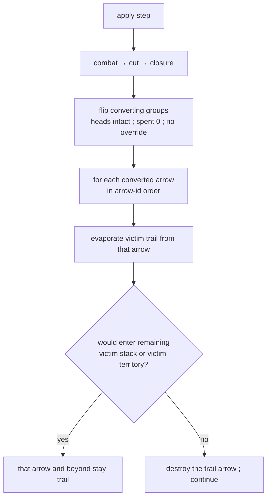

# encircled-path — convert wipe of the victim's trail

**Packet:** [P33 — Clear encircled enemy path on convert](../../design/packets/P33-encircled-path.md)
**SPEC:** §6.3, §6.1 (halt-at-first), §11 item 40 (re-resolved)
**Features:** [core](./encircled-path.core.feature) · [edge cases](./encircled-path.edge-cases.feature)
**Upstream:** [encirclement](../encirclement/encirclement.md) flips owners;
[cuts](../cuts/cuts.md) owns `evaporateFromArrow`; [trails-simple](../trails-simple/trails-simple.md)
keeps cut-created dormant.

## Purpose

Playtest: after a winning enclosure, a brown trail chord still connected two
converted stacks on the claimer's land. P22 left orphan dormant marks after
convert. That paint **is** the encircled path.

This packet does not change **who** converts. It changes what happens to the
victim's **trail** when they do: wipe from each converted arrow under the same
halt-at-first rule combat wipe already uses. A fork's **both arms** evaporate
because a point is all-to-all — not because convert grows a second rule.

## Scope

In: convert-time trail wipe; both arms of a converted fork; halt at remaining
victim stacks on neutral; cut-created dormant that no wipe reached; closure
still stripping trails on newly claimed tiles.

Out: the conversion *predicate* (P07 / P28); combat math; P29 match-over FX;
a strip that is not wipe.

Tests: authored-territory convert cases may use fixtures. Fresh enclosure still
runs on the **tiling**.

## Terms

| Term | Means |
|---|---|
| **encircled path** | the victim's trail connected to stacks that convert this `apply` |
| **convert wipe** | `evaporateFromArrow` from each converted arrow after ownership flips |
| **fork** | trail with two out-arrows at a point; ordinary trail, all-to-all |
| **remaining firebreak** | a victim-owned stack that did **not** convert this pass |

## How convert wipe resolves

Converted stacks are already the claimer's, so they are not victim firebreaks.
`evaporateFromArrow` must see the converted arrows **still in** the victim trail
when it seeds — a prior strip of those arrows would no-op and leave the path.

## Invariants

- When a group converts, the system shall evaporate the victim's trail from each
  converted arrow under the halt-at-first rule, after ownership has flipped.
- When convert wipe runs, the system shall treat converted stacks as not the
  victim's firebreaks.
- When convert wipe would enter an arrow occupied by a remaining victim stack
  that did not convert (stack-grade on neutral ground), the system shall halt
  and shall leave that arrow and its stack.
- When a converted trail is a fork, the system shall evaporate both arms until
  a remaining victim firebreak.
- When two stacks on one trail both convert, the system shall leave no victim
  trail on the arrows that connected them.
- The system shall not evaporate a cut-created dormant component that no convert
  wipe reached.
- The system shall not evaporate a different territory-grade trail component of
  the same victim.
- The system shall not change who converts or head counts on convert.
- The system shall not mutate the input state, and shall return equal outputs
  for equal inputs.

## What this file deliberately does not decide

- Whether a step onto enemy territory is legal — P28.
- Cut evaporation, combat wipe of emptied stacks — P13 / P06, reused not rewritten.
- Match-over dim / shine — P29. The trail set is already clean.

## Counts

11 scenarios (4 core, 7 edge). 9 invariants. Item 40 trail clause re-resolved
in SPEC.md. No new §11 gap. No unexpected cost.
