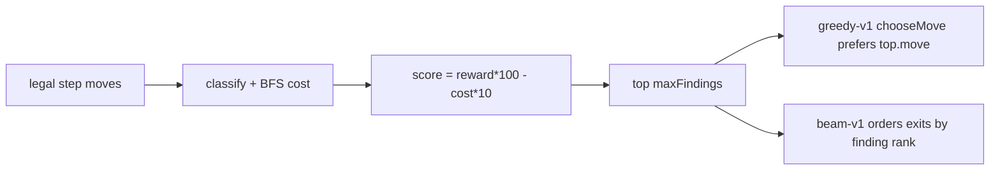

# Findings planner (playtest adapter)

Pure multi-goal stubs for the heuristic (and later BYOK targets). See
[P21](../../design/packets/P21-findings-planner.md).

P53 demotes this list to **move ordering** for `beam-v1` (exits, not portions).
`chooseMove` / `greedy-v1` still short-circuit on `bestFindingMove`. See
[bot-turn-search](../bot-turn-search/bot-turn-search.md).

## Invariants

- WHILE collecting findings, the system shall not use time, randomness, or I/O.
- WHEN findings are sorted, the system shall order by descending score then ascending move key.
- WHEN a legal step exists, chooseMove shall not return endTurn.

## Spec files

- `findings-planner.core.feature`
