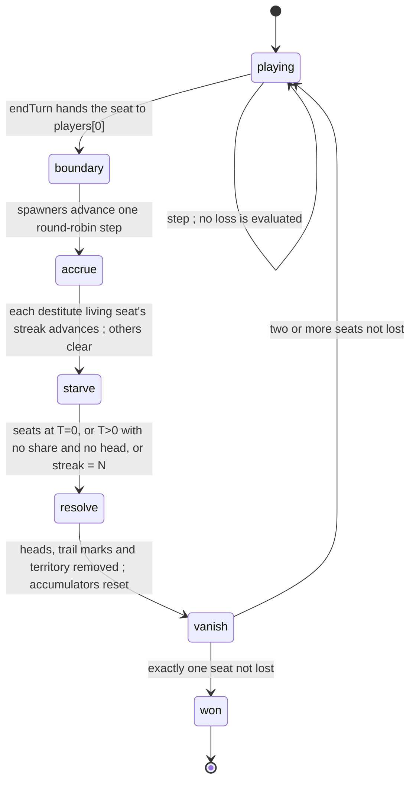

# losing-conditions — when a seat is out, and what it leaves behind

**Packet:** [P36 — Losing conditions, per seat, and the losing seat vanishes](../../design/packets/P36-starvation-per-seat.md)
**SPEC:** §9 Victory (**headline rule repealed**), §11 items 32 and 44–45.
**Layer:** `packages/rules-core` + `packages/contracts` (GameState DTO) + adapters that read the retired fields.
**Features:** [core](./losing-conditions.core.feature) ·
[edge cases](./losing-conditions.edge-cases.feature)

## Purpose

A 6-player log showed a seat with no territory taking turns for the rest of the
match. That is **spec-compliant today** — §9 measures elimination in heads —
but §8 already knows the position is terminal:

> Under Splix closure (§7) every claim must depart from and land on your own
> territory, so a player holding none can never claim anything, ever.

§8 guards it at setup only. Underneath sat a sharper defect: `tickDomination`
advances only when *exactly one* living player is destitute, so two broke seats
cancel each other's clocks indefinitely, and when it does fire it ends the whole
match, handing the win to the first surviving seat in **array order** while other
players are still contesting it.

This feature replaces "lose your last head and you are out" with the decided
four-case rule, makes destitution per seat, and makes a lost seat **vanish**.

## The rule (decided; do not re-litigate)

Three readings of a player: territory *T*, spawner shares *S*, heads *H*. A
share **is** territory on a spawner-border arrow (§9), so `S > 0 ⟹ T > 0` and
the cases below are exhaustive and disjoint.

| *T* | *S* | *H* | Outcome |
|---|---|---|---|
| 0 | — | — | **lost** — can never claim again (§8) |
| >0 | 0 | >0 | **starvation clock** — *N* full rounds, then lost (§9) |
| >0 | 0 | 0 | **lost** — no production and no units; nothing can ever change |
| >0 | >0 | 0 | **alive**, passed over until a spawner yields a head |
| >0 | >0 | >0 | normal play |

**A lost seat vanishes.** Its heads, its trail marks and its territory are
removed; vacated territory becomes **unowned** and its accumulators reset as on
capture (§7). A dead player's land must not become a region nobody can ever
claim.

**The match ends when one seat remains.** "Last player with any heads" is
replaced by "last seat not lost".

### `lost` is derived, not stored

```
lost(p)  ⟺  territoryCount(p) === 0  or  (shareCount(p) === 0 and heads(p) === 0)
```

Read against the table this is exactly the two immediate rows, and it is
**idempotent**: once a seat's pieces are removed it has no territory, so the
predicate keeps holding. So no `lost` flag joins `GameState` — a flag would be a
second copy of something the board already says, and the two copies would
eventually disagree. This matters more than it sounds: the DTO is read by 14
files across four packages, and every field added there is a migration.

What *is* stored is the starvation clock, because a streak is history and history
is not derivable:

- **removed:** `dominationStreak: number`, `dominationHolder: PlayerId | undefined`
- **added:** `starvationStreaks: ReadonlyMap<PlayerId, number>` — full rounds each
  living, destitute seat has been destitute. Absent means zero.
- **kept:** `dominationN` — the threshold, setup data, already documented as a
  misnomer in `match-config.ts`.

The single holder/streak pair is exactly what cannot express two broke seats, so
replacing it *is* the multi-player fix rather than a tidy-up alongside it.

## When loss resolves — ~~the round boundary~~ **superseded by P37**

> **P37 corrected this section.** A loss now resolves on the move that causes
> it; see `docs/spec/immediate-loss/immediate-loss.md`. The reasoning below is
> kept because it records why the boundary was chosen and why playtest rejected
> it — in particular, the third argument (fixture coupling) turned out to cut the
> other way: §8 calls a player with no territory an unplayable position setup
> must prevent, so the fixtures that author heads without territory were
> authoring illegal states, and the coupling was evidence about the fixtures
> rather than about the rule.


**Loss is evaluated once per full round, at the boundary where accrual and the
starvation tick already happen** (`applyEndTurn`, `movement.ts`). Not inside a
step, and not after a convert.

"Immediate" in the decided rule means **no grace period** — the contrast is
against starvation's *N* rounds, not a claim about sub-turn timing. The boundary
preserves that contrast exactly: a seat that hits `T = 0` is gone at the end of
that round, with no clock and no reprieve.

Three reasons it belongs there and not mid-step:

1. **A turn stays atomic with respect to removals.** Removing pieces mid-turn
   means the acting player's later steps run on a board that changed under them
   as a side effect of their own earlier step. `applyElimination` is already
   called after a convert, but it only ever *sets a winner* — it never deletes
   anyone's pieces, which is a much larger change to make mid-turn.
2. **It is where every other match-level condition already ticks** — accrual
   (§11 item 41), the starvation streak, and the existing win check.
3. **Mid-step evaluation couples the loss rule to every movement fixture.**
   Measured: 8 of 39 `rules-core` test files (all of `combat.*`, `crossings.*`,
   `movement.*`) author no territory at all, because they are about movement and
   combat and have no reason to. Under mid-step evaluation every player in them
   is lost on the first `apply` and their heads are deleted. That breadth is a
   coupling signal, not merely churn: a rule about who is out of the match should
   not be reachable from a rule about taking one step.

A consequence worth stating plainly: a seat that loses its last territory may
still take the remaining turns of that round. With 6 seats that is at most one
more turn each for the seats after it in the rotation. It cannot take a turn in
the *next* round.

## Turn rotation — pass, never skip

**Every seat stays in `state.players`, lost or not, and the array is never
mutated or reordered.**

Accrual and the boundary fire when `endTurn` hands the seat back to
`players[0]`. Remove a seat from the rotation — or reorder the array — and that
marker moves or disappears; if the removed seat *is* `players[0]`, the boundary
never fires again, accrual stops, and a `T>0, S>0, H=0` seat can **never** be
paid the head that would revive it. The same trap closes if every remaining seat
is headless at once.

So a seat with no legal moves is **passed**: it takes its turn, has nothing to
do, and `endTurn` moves on. That is already what the engine does for a seat with
no groups, which is why case `T>0, S>0, H=0` costs almost nothing to implement —
it is the *removal* of the heads-based elimination check, not a new mechanism.

`accrueRound` reads only `state.territory.get(arrow)` and needs no heads
anywhere, so the headless-but-paid seat is paid on schedule with nothing on the
board. **Do not add a liveness guard to accrual** — that guard is precisely what
would make case 4 unimplementable.

`firstAlive` is **gone**. `applyEndTurn` compares against `players[0]` whether
or not that seat is still playing, and `nextPlayer` never skips. There is no
*first living player* reading of the boundary.

## The flow



Order inside the boundary is **accrue, then advance the clocks, then resolve
losses.** Only one of those two orderings is load-bearing, and it is not the one
an earlier draft of this document claimed.

**A lost seat never owned a spawner share.** `S > 0` places a player in an
*alive* row of every case in the table, so no seat that qualifies to be lost owns
a share. That is worth stating as a theorem, because a great deal follows from it:

- **Accrual cannot save a seat from loss, and cannot clear a starvation streak.**
  `accrueRound` pays only the owner of a spawner-border arrow, and neither a
  lost seat nor a destitute one owns one. So accrue-before-resolve is *vacuously*
  safe: the two touch disjoint arrows and the order cannot change an outcome.
  The claim that accruing first rescues a seat about to be paid was wrong — a
  seat is rescued by *capturing* a share during a turn, which is closure, not
  accrual.
- **A lost seat's territory never includes a share**, so removal never vacates a
  spawner-border arrow and never changes a spawner's ownership.

**Tick before resolve is load-bearing**, and it is observable: a seat goes on the
round its streak *reaches* `dominationN`, not the round after. Reverse those two
and every starvation loss is one round late.

The remaining order requirement is **resolve every seat, then check for a
winner** — not a win check inside the per-seat loop, which would set `winner` to
the second-to-last seat in the instant before removing it.

## What the share theorem rules out

Because a lost seat never owned a share, two situations that look like edge cases
are **unconstructible**, and no scenario may assume them:

- a lost seat vacating a spawner-border arrow, and
- a spawner all three of whose border arrows belonged to a lost seat.

Accumulator reset on removal is therefore always about **share-free** territory,
and a spawner's round-robin cursor advances without reference to who owns
anything. Both are still worth a scenario — the reset must happen, and the cursor
must not care — but they must be written on a board that can exist.

## Determinism

- Losses resolve in `state.players` order, never by map iteration.
- `starvationStreaks` is iterated through `state.players`, never through the map's
  own key order.
- Territory reversion and accumulator resets walk arrows in `compareArrows`
  order, as `resetAccumulatorsOnCapture` already does.
- No clock, no randomness, no input mutation — the core's standing rule.

## Invariants (EARS)

1. Where a player owns no territory, the system shall record that player as lost.
2. Where a player owns territory, no spawner share and no head, the system shall
   record that player as lost.
3. While a player owns territory, a spawner share and no head, the system shall
   **not** record that player as lost.
4. While a player owns territory and no spawner share and at least one head, the
   system shall advance that player's starvation streak at each full round.
5. The system shall advance every destitute living player's streak independently
   of how many other players are destitute.
6. When a destitute player owns a share again, the system shall clear that
   player's streak and no other player's.
7. When a player's starvation streak reaches `dominationN`, the system shall
   record that player as lost.
8. When a player becomes lost, the system shall remove every head, every trail
   mark and every territory arrow belonging to that player.
9. When a player's territory is removed, the system shall leave those arrows
   unowned and reset their accumulators.
10. When a player becomes lost, the system shall leave every other player's
    heads, trails and territory unchanged.
11. ~~The system shall evaluate loss only at a full-round boundary.~~ — **repealed by P37:** a loss resolves on the move that causes it.
12. ~~The system shall not evaluate loss during a step, a skip, or a convert.~~ — **repealed by P37.** See `docs/spec/immediate-loss/immediate-loss.md` invariants 1, 2 and 5.
13. The system shall advance streaks before resolving losses, so that a seat is
    lost on the round its streak reaches `dominationN` and not the round after.
14. The system shall never remove a player from `state.players`, nor reorder it.
15. Where the active player has no legal move, the system shall pass that seat's
    turn without applying anything.
16. While exactly one player is not lost, the system shall set `winner` to that
    player.
17. While two or more players are not lost, the system shall leave `winner` unset.
18. The system shall never set `winner` to a player chosen by position in
    `state.players`.
19. The system shall produce a result independent of the insertion order of
    every map it reads, and shall report lost seats in `state.players` order.
    *(Per-seat removal gives nobody anything, so removals commute and
    resolution order has no falsifying observation of its own — this is the
    observable content of that requirement, not a weaker substitute.)*
20. Equal states shall produce equal losses, in equal order.
21. ~~A replay of the same move list shall lose the same seats at the same
    boundaries.~~ — **superseded by P37:** the same seats on the same *moves*.
    See `docs/spec/immediate-loss/immediate-loss.md` invariant 14.
22. The system shall never record as lost a player who owns a spawner share.
23. The system shall resolve every qualifying seat before setting `winner`.

## Open, and deliberately not decided here

Added to SPEC.md §11:

- ~~**Item 44 — what represents a match that ends with no surviving seat?**
  `winner: PlayerId | undefined` cannot say "over, nobody won", and
  `victoryFx` reads `winner === undefined` as *playing*
  (`packages/web/src/fx/victory.ts:77`). Two seats can reach `T>0, S=0, H=0` on
  one boundary, so the state is constructible. **This packet does not invent a
  draw.** It removes every qualifying seat, leaves `winner` unset, and the match
  is terminal-but-unwon — which the adapter will present as still playing. That
  is wrong, it is recorded as wrong, and picking a representation is a rule
  decision for the human.~~

  **Resolved by dissolution in P37 — and the mistake above is worth naming.**
  "Constructible" was the wrong test. The state can certainly be *authored*; what
  matters is whether play reaches it, and it cannot. Seats open owning their home
  spawner's triangle, `closure.ts` only ever reassigns a share arrow to the
  claimant, and `vanishSeat` — the one path that clears territory — never vacates
  a share-bordering arrow, because a seat holding `S > 0` sits in an *alive* row
  of the table above and so never qualifies. Some seat therefore always owns a
  share, that seat is never lost, and no move empties the table. Nothing needed
  representing. See `docs/spec/immediate-loss/immediate-loss.md`, which pins the
  chain as invariants 9, 10 and 11 rather than leaving it as prose.
- **Item 45 — should a lost seat's trail *evaporate* (§6.1) rather than simply
  clear?** Evaporation is the destruction a cut causes and it is what players are
  taught to read. Clearing is silent. This packet clears, because evaporating a
  whole trail from a non-cut event is a new trigger for §6.1 and inventing one is
  out of bounds.

  **Resolved by P39: it still clears; the adapter presents flicker-then-fade.**
  See `docs/spec/seat-vanish-fx/seat-vanish-fx.md`. The engine half of this
  packet's answer stands. What P39 fixed is the adapter reading every trail drop
  as a cut, so a seat leaving the match looked like someone crossed its trail.

## The victory banner must stop naming a mechanism

`packages/web/src/fx/victory.ts` derives *how* a match was won from a head
count: `livingCount(state) === 1 ? 'elimination' : 'starvation'`, where
`livingCount` counts seats with at least one head. That works **today** because
starvation sets `winner` while the victim still holds heads, so the count is ≥ 2.

P36 breaks it. A lost seat's heads are removed, so whenever `winner` is set
exactly one seat has heads, `how` is *always* `'elimination'`, the `'starvation'`
branch is dead, and the banner always reads **"… wins — last head"** even when
the loser starved. That is a lie this packet introduces, so fixing it is in
scope even though adapter presentation generally is not.

The fix is to stop claiming a mechanism the state can no longer supply: the
banner names the winner and nothing else. The reason is genuinely not derivable
after the fact — the losing seat and its clock are both gone — so deriving it
would mean storing it, and a field that exists only to caption a banner is the
wrong trade. If the reason is wanted later it belongs in the match log
(P32 telemetry), which is written while the loss happens.

Invariants: **while `winner` is set, the banner shall not assert a losing
mechanism**, and the locked string is:

- banner: `{label} wins`

Locked, not left to the implementation, because P29 locked its two banner
strings and the tests assert them literally — a replacement that is only
described would be the one string in this family nobody can check. P29's spec is
superseded in place: `docs/spec/win-board-celebration/win-board-celebration.md`
carried `VictoryHow`, the `livingCount` discriminant, both old banner literals
and two EARS invariants, all now struck through pointing here.

## Out of scope

- Retuning `dominationN` (default 5) — tuning belongs with the spawner table
  (§7, §11 item 11).
- Kingmaking under 3+ play; §8 accepts it for playtest.
- Any change to how territory or shares are won or lost.
- Adapter presentation of a vanished seat beyond not stalling on its turn, not
  reading the removed DTO fields, and not captioning a mechanism it cannot
  derive (above). **P39 owns flicker-then-fade.**
- Recording *why* a seat was lost, in the match log or anywhere else. Follow-on.
