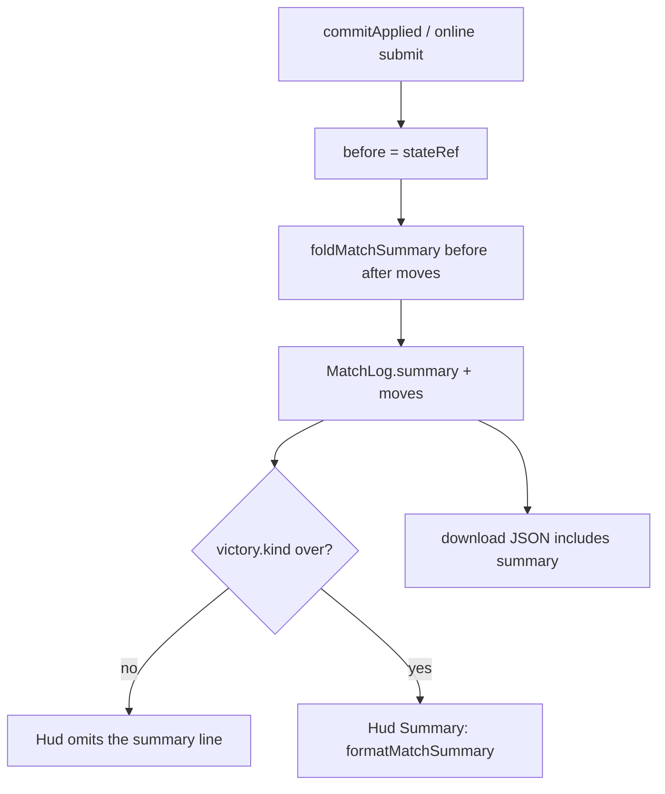

# match-summary-telemetry — playtest counters on the match log and HUD

**Packet:** [P32 — Match summary telemetry](../../design/packets/P32-match-summary-telemetry.md)
**SPEC:** none (adapter presentation). Reads `GameState.territory` / `.trails`
and `Move.kind`. Does not change apply or victory.
**Layer:** `packages/web` only. Does not touch `rules-core`, contracts DTOs, ADR 0002.
**Features:** [core](./match-summary-telemetry.core.feature) ·
[edge cases](./match-summary-telemetry.edge-cases.feature)

## Purpose

After a match, playtest review wants a one-line count of steps, end-turns,
closes, and cuts without opening the downloaded JSON. Fold those counters on
each logged apply; show the line under "Moves logged" only when the match is
over.

## Scope

In: `MatchSummary` on `MatchLog`; pure `foldMatchSummary` /
`appendMovesWithSummary` / `formatMatchSummary` / `matchSummaryLine`; Hud
prop; App restore + `beforeState` on both local and online record paths;
backward-compatible load. Tests against the **pure helpers** (same posture
as `fx/victory.ts`). No RTL.

Out: rules-core, SPEC.md, online protocol, new FX, reconstructing a
summary from moves alone.

## Terms

| Term | Means |
|---|---|
| **summary** | `MatchSummary` counters on the adapter match log |
| **batch** | the `moves` list passed to one `appendMovesWithSummary` |
| **close (proxy)** | some player's territory *count* increased in the batch |
| **cut (proxy)** | some player's trail *size* decreased and that player did **not** gain territory in the same batch |
| **firstCloseAt** | index into `log.moves` of the first move of the first closing batch |
| **over** | `victory.kind === 'over'` (P29); equivalently `state.winner` is set |
| **line** | `formatMatchSummary` output, shown only when over |

These proxies are **not** SPEC §7 closure or §6 cut. A conversion that nets
tiles is a close here. Claiming your own trail on a landing is not a cut here.

## Fold (normative)

```
territoryCount(state, player) = |{ arrow | state.territory.get(arrow) = player }|

gainers(before, after) =
  { p in before.players ∪ after.players
    | territoryCount(after, p) > territoryCount(before, p) }

trailSize(state, player) = state.trails.get(player)?.size ?? 0

cutVictims(before, after) =
  { p | trailSize(after, p) < trailSize(before, p)
        and p not in gainers
        and p still has a piece in after }
```

A **piece** is a group that player owns, a trail arrow, or a territory arrow.
P39: a vanished seat's trail drop is not a cut. A living player's still is.

foldMatchSummary(summary, moves, before, after, movesLoggedBefore):
  if moves is empty: return summary
  steps    += count of kind step
  endTurns += count of kind endTurn
  if gainers nonempty: closes += 1
  if cutVictims nonempty: cuts += 1
  if gainers nonempty and firstCloseAt is unset:
    firstCloseAt = movesLoggedBefore
  return summary
```

Count territory with **one scan** of each state's `territory` map (not
`players × territory`). Trail sizes read the per-player sets; missing set
is 0.

`appendMovesWithSummary` appends `moves` and replaces `summary` with the
fold. `appendMoves` appends and does **not** fold.

## Format and HUD (normative)

```
formatMatchSummary(s) =
  "{steps} steps · {endTurns} end-turns"
  + " · {closes} closes · {cuts} cuts"
  + (s.firstCloseAt defined ? " · first close @ move {firstCloseAt}" : "")

matchSummaryLine(over, summary) =
  over and summary defined ? formatMatchSummary(summary) : undefined
```

Hud renders the line iff `matchSummary` is defined:

```
<p className="meta match-summary">Summary: {matchSummary}</p>
```

App passes `matchSummaryLine(victory.kind === 'over', log.summary)`.

## Persistence (normative)

- `createMatchLog` sets `summary` to zeros (`firstCloseAt` unset).
- `loadLastMatchLog`: parse failure → `undefined`; parsed object with
  missing `summary` → same object with `emptyMatchSummary()`.
- `serializeMatchLog` / download include `summary`.

## App wiring (normative)

`App.tsx` is the full hot-seat/online shell (Board, Hud, lobby). It must
not render `App restore incomplete`.

```
record(moves, next, before?, byokDelta?, byokSeat?):
  if moves empty: return
  if before defined: appendMovesWithSummary
  else: append moves, leave summary as-is
  withWinner; optional withByokStats; saveMatchLog

commitApplied → record(..., before = stateRef.current)
online submit path → record(applied, game, before)
```

Delete `packages/web/src/AppMain.tsx`. `main.tsx` imports `./App`.

## Flow



## Invariants

- When the logged batch is empty, the system shall not change the summary
  or the move list.
- When no player's territory count increases, the system shall not
  increment `closes` or set `firstCloseAt`.
- When a player's trail shrinks and that player's territory count
  increased in the same batch, the system shall not treat that shrink as a
  cut.
- ~~When a player's trail shrinks and that player's territory count did not
  increase, the system shall increment `cuts`.~~ — **superseded by P39:** only
  while that player still holds a piece after the batch. A vanished seat's
  trail drop is not a cut. See `docs/spec/seat-vanish-fx/seat-vanish-fx.md`.
- When `firstCloseAt` is already set, a later close shall not change it.
- When `victory.kind` is not `over`, `matchSummaryLine` shall be undefined.
- When `victory.kind` is `over` and a summary exists, `matchSummaryLine`
  shall equal `formatMatchSummary`.
- Equal `(summary, moves, before, after, movesLoggedBefore)` shall yield
  equal folded summaries.
- `foldMatchSummary` shall not call `Date.now` or `Math.random`.
- The rules engine shall be unchanged: no edit to `packages/rules-core`.
- Loading a stored log that lacks `summary` shall yield empty counters and
  shall not throw.

## What this file deliberately does not decide

- What a closure or a cut *is* in the rules — P05b / P06.
- Win banner / shine — P29.
- Match-log seats / BYOK stats — already shipped.
- Reconstructing counters from a moves-only file.

## Scenario count

11 core + 15 edge = **26** scenarios. **11** EARS invariants.
