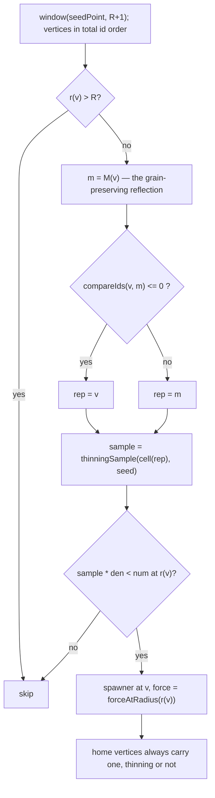

# Spec — the spawner field is mirrored (P41)

Packet: `docs/design/packets/P41-mirrored-spawner-field.md`.
SPEC: §2 *map symmetry*, §4 *travel*, §7 *the radial gradient*, §11 item 48.

Setup data only. **No rule reads a spawner's placement or force** (§7), so
nothing in this spec changes what a move does — it changes which vertices carry a
spawner when a match is built.

## The shape of the change

The only edit to the walk is *where the hash is sampled*. Ordering, the radius
cutoff, the density table, the force table and the home override are all
unchanged.

## Why the reflection is enough

*M* is an automorphism of the oriented graph (§2) and fixes the origin, so for
every vertex `r(M(v)) = r(v)`. Same radius means same band, same density
threshold and same force. Sampling both members of an orbit at the same
representative therefore makes them agree by construction — not within a
tolerance.

## What fairness means here, precisely

Travel is anisotropic: 1 step per unit with the grain, 2 against, because
`N + SE + SW = 0`. That prices three separate journeys — out to the contested
centre, home again, and the closure around what was taken. A claim is **not** a
closed walk (§7 closure departs territory and lands back on it at a different
arrow, with the owned boundary closing the loop), so the balance property of
closed walks does not exempt claiming from the anisotropy either.

No single scalar captures all three, which is why this spec asserts symmetry
rather than measuring a distance: an automorphism of the oriented graph equalises
every directed path length at once.

## EARS invariants

1. **Ubiquitous** — the spawner map shall be invariant under *M*: for every
   vertex *v* within *R*, *v* carries a spawner if and only if *M(v)* does.
2. **Ubiquitous** — where both carry one, the two forces shall be equal.
3. **Ubiquitous** — a vertex fixed by *M* (on the axis) shall be treated exactly
   as any other: its representative is itself, and it is neither favoured nor
   skipped.
4. **Ubiquitous** — *M* shall be an involution on vertex cells: `M(M(v)) = v`,
   and *M* shall map a vertex cell to a vertex cell of the same parity.
5. **Ubiquitous** — `makeMatch` shall remain a pure function of its config: two
   calls with equal config produce equal states, and no clock or RNG is read.
6. **Ubiquitous** — the vertex walk shall visit in total id order, so the map is
   built identically on every run and platform.
7. **Ubiquitous** — every home vertex shall carry a spawner regardless of the
   thinning, as before this packet.
8. **Ubiquitous** — no spawner shall exist at radius greater than *R*.
9. **Ubiquitous** — each spawner's force shall be exactly `forceAtRadius(r)` for
   its own radius, with the density and force tables unchanged by this packet.
10. **Event-driven** — when the two seats' home vertices are an *M*-orbit, then
    each seat's multiset of `(directed distance from home, force)` pairs over all
    spawners within *R* shall be equal. *(The fairness statement the packet is
    for. It follows from 1, 2 and *M* being an automorphism, and is worth
    asserting directly because it is the property a playtest would notice.)*
11. **Ubiquitous** — every walk that returns to the arrow it left shall have
    equal counts of the three grain directions and therefore length 3*k*. *(A
    standing property of the tiling, not of this packet, and it constrains only
    closed walks — **not** claims, which land on a different arrow of the same
    region. Belongs to the geometry conformance suite.)*
12. **Ubiquitous** — a net displacement of *k* against the grain shall cost
    exactly 2*k* steps, independent of the order of the steps taken.
13. **Unwanted** — if the reflection helper does not satisfy invariant 4, then
    setup shall fail loudly rather than build a field that is asymmetric in a way
    no test names.

## What is deliberately not asserted

- **Nothing about the count of spawners.** The thinning is a density target, not
  a rule (§7), and no test may pin a count — a retune must not be able to change
  which scenarios pass (§11 item 12).
- **Nothing about clustering texture.** Halving the independent samples makes the
  field lumpier at the same nominal density. That is expected, is a matter of
  feel, and is for playtest rather than for a test.
