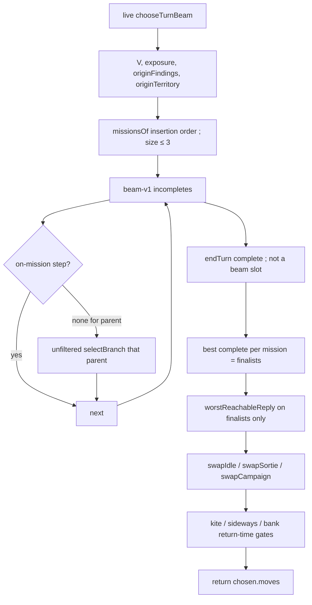

# mission-and-staging — search only the job, paint only as a step

**Packet:** [P59 — Mission and staging](../../design/packets/P59-mission-and-staging.md)
**Depends on:** [bot-turn-search](../bot-turn-search/bot-turn-search.md) (P53, P56),
[close-and-spawner-value](../close-and-spawner-value/close-and-spawner-value.md)
(P54, P57),
[opponent-ply-and-denial](../opponent-ply-and-denial/opponent-ply-and-denial.md)
(P55).
**SPEC:** read [§3](../../../SPEC.md) (speed, split vs merge) and
[§7](../../../SPEC.md) (closure, shares, spawners). **No game rule is added,
changed, or implied.** Nothing is owed to SPEC §11. Do not edit SPEC.md.
**Layer:** `packages/web` only. No `contracts` DTO change, no `rules-core`.
Online-api **behaviour** is unchanged (`pagesHeuristic` still calls
`chooseMove`).
**Features:** [core](./mission-and-staging.core.feature) ·
[edge cases](./mission-and-staging.edge-cases.feature)

## Purpose

Two playtests after P56/P57. The 09:50 log was still a **dirt painter**
(18 closes / 0 cuts). P57 zeros sideways dirt on a quiet board; that
stays. What P57 does not decide:

1. A 0-share close can be a **staging** step that moves the border
   toward campaign vertex `V` even when the landing arrow itself is
   not "the" closer tile. Grain is one-way: a share 3 arrows outbound
   can be ~9 arrows of trail once the seat has to close against the
   grain. A human paints a short loop, then walks the remaining 1–2.
2. Risk is pointed at the trail that exists at a terminal, not at the
   return path a kite has not walked yet. A share-kite looks like +1
   share and a long `tipTerm` and still wins from a quiet home.
3. The beam is unfocused. Findings only *sort* exits; every extendable
   child still pays a full enemy reply (`REPLY_TURN_APPLIES = 400`).

This packet is issue 1 only (smarter, cheaper search). A worker is
**P60**. Personalities stay **P58** (parked). `greedy-v1` stays frozen.
Pages still calls `chooseMove`. P55's reply *algorithm* stays; this
packet changes **which completes pay for it**.

## Scope

In: one mission menu per `chooseTurn` (size ≤ 3); `remainingPath` /
kite / staging predicates; on-mission beam expansion with unfiltered
fallback; P55 replies on **finalists** only; return-time gates after
P56/P57 swaps; `packages/web/src/botMission.ts`; dirt gate uses
`isSidewaysDirt` at search/findings time.

Out: a worker / unlocking input (P60); P58 personalities; retuning
`evaluate`, `tipTerm`, `closeUrgency`, `MOBILITY_SCALE`, `S`, `A`,
`IDLE_SLACK`, `SORTIE_SLACK`, `BEAM`, `BRANCH`, `MAX_PLAN`,
`MAX_APPLIES`; dropping `REPLY_BEAM` / `REPLY_BRANCH` /
`REPLY_MAX_PLAN` / `REPLY_MAX_APPLIES`; A* / replacing `beam-v1`;
unfreezing `greedy-v1`; lifting Pages onto `chooseTurnBeam`; editing
SPEC.md; multi-vertex campaigns; a second close-value rate; a wall-clock
cutoff (P53 invariant 4 stands).

## BSSN (recorded)

Adapter decisions, not game rules. Written here so phases 2–4 do not
re-litigate them. No SPEC §11 item.

1. **Import graph — no third module, no cycle.**
   ```
   botEvaluate, botReply
        ↑
   botClose     (campaignTarget, closeValue, exposure, P57 isDirtClose helper)
        ↑
   botMission   (missionsOf, remainingPath, kite/staging/sideways,
                 onMissionStep, servesMission)
        ↑
   findings     (may import isSidewaysDirt / remainingPath)
   botSearch    (filter, finalists, return-time gates)
   ```
   - `botMission` may import `botClose`, `botEvaluate`, `botReply`.
   - `botMission` must not import `findings` or `botSearch`.
   - `botClose` must not import `botMission`, `botSearch`, or `findings`.
   - `findings` must not import `botSearch`.
   - `botReply` must not import `botMission`.
   - Add `../web/src/botMission.ts` to
     `packages/online-api/tsconfig.json` `include` (Pages typechecks
     opponent's graph; same reason as P53/P54).
   Do not invent a third module "just to compile."

2. **`missionsOf` signature.** Packet sketch is
   `(geometry, rules, state, me) => readonly MissionKind[]`.
   `botMission` must not import `findings`, so **cut detection is
   passed in**:
   ```
   missionsOf(geometry, rules, state, me, originFindings) -> MissionKind[]
   ```
   `originFindings` is the **once-cached** `collectFindings` at search
   origin (kinds + moves only; tests may stub). `cutAvailable` is true
   iff some finding has kind `cut` or `attack` whose `move` is among
   `rules.legalMoves(origin)`. `boxAvailable` is computed inside
   `missionsOf` from origin `legalMoves` + groups (BSSN 6). `V` is
   `campaignTarget(origin, me)` imported from `botClose`. `exposure` is
   `botClose.exposure` at origin. Do not call `collectFindings` inside
   `missionsOf`.

3. **Mission menu (insertion order, not a score).** Size ≤ 3.
   Recomputed at the start of live `chooseTurnBeam` (`withReplies:
   true`). Not stored on `GameState`. Deterministic. No clock, no RNG.

   ```
   outbound     := remainingPath(origin, me, V)
   V            := campaignTarget(origin, me)     // P57, may be undefined
   onTrail      := trailSize(origin, me) > 0
   underFire    := onTrail AND exposure(origin, me) > 0
   cutAvailable := originFindings contains cut or attack
                   whose move is legal at origin
   boxAvailable := P55 constructed-box shape is legal this turn (BSSN 6)

   missions := []
   if underFire:              missions.push(bank)
   if cutAvailable:           missions.push(cut)
   if missions is empty:      missions.push(contest)
   if boxAvailable
      and missions.length < 3
      and bank not in missions:
                              missions.push(deny)
   missions := first 3
   if V is undefined and contest in missions:
     drop contest
     if missions is empty: missions := [contest]
   ```

   `bank` and `contest` do not co-exist: if already cuttable, we bank.
   `cut` may sit next to `contest` or `bank`. `deny` never overrides
   `bank`. Priority is this insertion order.

4. **No-`V` edge.** `remainingPath` is `CAMPAIGN_DIST_CAP + 1`. Do not
   invent a second campaign target. Sideways dirt stays zero on a quiet
   board (`remainingPath` cannot drop). Staging never fires
   (`remainingPath(terminal) < outbound` is false). Walk any unowned
   share by P57's fallback `approach_spawner` ranking (nearest open
   share) — that ranking already lives in close-and-spawner-value BSSN
   19; this packet does not re-specify it.

5. **Remaining path, kite, staging — one BFS family.** Reuse
   `grainDistanceToAny` / `homewardPath` / P54 `close_path`. Do not
   write a third BFS. Named exports from `botMission`:

   ```
   KITE_RATIO = 2
   CAMPAIGN_DIST_CAP = 12          // same magnitude as findings distCap
   REPLY_DIST = DEFAULT_REPLY_DIST_CAP   // 12, import from botReply
   ```

   ```
   remainingPath(state, me, V) =
     min grainDist(from, any borderArrow of V)
     over from in { own group arrows } ∪ { own territory arrows }
     cap CAMPAIGN_DIST_CAP
     if V undefined: CAMPAIGN_DIST_CAP + 1
     from-set enumerated in ArrowId order (never Map insertion)

   originTerritory := territory arrows owned by me at origin
                      (frozen at chooseTurnBeam start)

   kiteLength(terminal, me) =
     if trailSize(terminal, me) > 0:
       max homewardPath from each own trail tip
       using originTerritory as "home", not terminal territory
     else:
       0

   projectedTrail(plan) =
     every arrow the plan stepped onto
     ∪ every arrow of the homeward / close_path used for kiteLength
     as a sorted unique ArrowId list (id ascending)

   enemyCanReach(arrows) =
     some enemy group at origin has grainDist(group, some arrow in arrows)
     ≤ REPLY_DIST

   isKite(plan) =
     contest ∈ missions
     AND (sharesOf(terminal) > sharesOf(origin)
          OR some own group stands on a border of V)
     AND kiteLength(terminal) >= KITE_RATIO * max(1, outbound)

   isThreatenedKite(plan) =
     isKite(plan) AND enemyCanReach(projectedTrail(plan))

   isStagingClose(plan) =
     sharesOf(terminal) == sharesOf(origin)
     AND trailSize(terminal, me) == 0
     AND remainingPath(terminal, me, V) < outbound
     AND NOT isThreatenedKite(plan)
     AND NOT enemyCanReach(projectedTrail(plan))
     AND planHasStep(plan)

   isSidewaysDirt(plan) =
     sharesOf(terminal) == sharesOf(origin)
     AND trailSize(terminal, me) == 0
     AND remainingPath(terminal, me, V) >= outbound
   ```

   `NOT enemyCanReach(projectedTrail)` on staging is the edge-13
   reading: a short 0-share close whose own trail is enemy-reachable
   is **not** staging even when it is not a kite. Under fire
   (`bank` / origin `exposure > 0`) the P54 corridor still applies
   — staging is not required for that close to keep a non-zero rate.

   `sharesOf` counts territory on spawner-border arrows (same as
   `evaluate`). `planHasStep` is true iff some move has `kind ===
   'step'`.

   `homewardPath` may take an optional home-arrow set defaulting to
   `state.territory` owned by `me`. That is the same BFS, not a third
   one. `kiteLength` passes `originTerritory`.

6. **`boxAvailable` (P55 shape, one target).** True when there exists
   an enemy **1-stack** with exactly one legal exit arrow `O` that is
   not our territory, every other exit of that stack is our territory
   (or illegal), and we have a legal step this turn whose `exit` is
   `O`. Ties: lesser enemy `PlayerId`, then lesser `O` id. That `O`
   is the deny target for the rest of the search. Do not add a box
   finding kind.

7. **Dirt gate vs P57 three-boolean.** Four-argument `closeValue`
   stays the ungated P54 rate (`closeValue(0, 3, 3, 0) = 25`; 2-turn
   one-share vs 6-turn two-share unchanged). `isDirtClose(hitsCampaign,
   advancesCampaign)` remains exported from `botClose` so existing P57
   numeric tests keep their numbers; it is **not** the live search
   gate and **not** a second sort key.

   Live quiet-board zero / `close_path` omission:
   ```
   if isSidewaysDirt(candidate) and origin exposure == 0:
     gated ranking value = 0; omit that close_path from collectFindings
   else if isStagingClose(candidate):
     gated ranking value = (loot / T) × survival    // loot may be arrows × A
   else:
     gated ranking value = (loot / T) × survival    // P54
   ```
   No `A_staging`. No change to `SHARE_VALUE_S` or `ARROW_VALUE_A`.
   Under fire, a 1-turn empty land-bridge keeps the P54 corridor
   (P57 BSSN 17 / 21 `bankUnderFire`).

   Findings cannot `apply` the close. For a `close_path` candidate,
   `isSidewaysDirt` / `isStagingClose` use a **territory overlay**:
   claimed arrows (P54 BSSN 7 set) treated as own territory, trail
   treated as empty, groups unchanged. Overlay is not `rules.apply`.
   `remainingPath` on that overlay vs origin `outbound` is the
   discriminant. `projectedTrail` for the candidate is the claimed
   set in id order.

8. **On-mission expansion (live beam only).** `beam-v1` stays.
   `BEAM` / `BRANCH` / `MAX_PLAN` / `MAX_APPLIES` opening bids stay.
   P53 BSSN 4 stands: `endTurn` is a complete candidate for every
   parent and does **not** occupy a beam slot.

   A step-child is on-mission if **any** listed mission accepts it:

   | mission | a step is on-mission when |
   |---|---|
   | **bank** | parent findings include `close_path` or immediate `close` with this from+exit, **or** the child strictly shrinks `distanceToTerritory` of some own group vs the parent **or** strictly shrinks own trail size vs the parent, **or** it is a 1-turn land-bridge (child trail empty, shares unchanged, `planHasStep`) while `bank` is listed |
   | **cut** | parent findings include `cut` or `attack` with this from+exit |
   | **contest** | the exit is a shortest-path step toward `V` (BSSN 9), **or** the move is a merge/split that raises `speed` of a group already on such a path (BSSN 9), **or** the child state `isStagingClose` vs origin, **or** the child occupies a border of `V`, **or** BSSN 19 extras (`close`/`close_path` finding, step from own trail, any split) |
   | **deny** | the exit is the boxed enemy's open arrow `O` |

   If `selectBranch` yields **zero** on-mission steps, fall back to
   today's unfiltered `selectBranch` for **that parent only**. The
   fallback is the escape hatch; the happy path is filtered. A
   mid-plan `endTurn` that produces `isSidewaysDirt` may still be
   recorded as a complete; it must not win the return value when an
   on-mission complete exists (BSSN 12).

   Do not call `collectFindings` twice per parent: origin findings
   are cached for `missionsOf`; per-parent findings stay the
   expansion order inside `orderSteps` (one call, as today).

   **Inner reply search does not use missions.**
   `chooseTurnBeamWithBudget(..., { withReplies: false })` keeps P55
   unfiltered expansion, does not call `missionsOf`, and does not
   reply-score (already). Only live `chooseTurnBeam`
   (`withReplies: true`) filters and finalists.

9. **Shortest path to `V` / speed raise.** A step from `from` to
   `exit` is a shortest-path step toward `V` iff `V` is defined and
   `grainDist(exit, V) === grainDist(from, V) - 1`, where
   `grainDist(arrow, V)` is min grain distance to a border of `V`,
   cap `CAMPAIGN_DIST_CAP`. Occupying a border (`grainDist(exit, V)
   === 0`) is the separate "occupies a border of `V`" clause.

   A merge/split raises speed iff after `apply`, some own group on
   an arrow that is on a shortest path to `V` (including a border)
   has `speed(heads)` strictly greater than that group's `speed`
   on the parent. `speed` is SPEC §3 (`1 + floor(log₂ N)`), imported
   from contracts — not reimplemented.

10. **Finalists only get P55 replies.** After the beam adopts
    completes (each complete's unreplied score is `evaluate`):

    ```
    finalists :=
      for each mission in missions:
        the best complete that serves that mission
        (evaluate desc, then planKey asc)
      if that set is empty: the single best complete
        (evaluate desc, then planKey asc)
    ```

    A complete **serves**:
    - **bank** iff own trail size < origin trail size **or**
      `exposure(terminal) < exposure(origin)` (when origin trail
      was non-empty; `exposure` at a terminal uses the P55 function
      on that state). Shrinking trail is enough when exposure is
      already 0.
    - **cut** iff some enemy's trail size is strictly smaller than
      at origin (enumerate enemy `PlayerId` ascending; any one
      suffices).
    - **contest** iff `(remainingPath dropped OR sharesOf rose OR
      isStagingClose) AND NOT isThreatenedKite`.
    - **deny** iff the target enemy group's `legalExits` (P53
      definition) dropped vs origin.

    Only finalists call `worstReachableReply` / `foldEnemyReply`.
    Every other complete keeps `replyScore = evaluate(...)`.
    `REPLY_TURN_APPLIES = 400` still caps the finalists **as a
    group** (P55 BSSN 7–8 skip rules unchanged). Nested enemy
    search stays `withReplies: false`. Do not change `REPLY_BEAM` /
    `REPLY_BRANCH` / `REPLY_MAX_PLAN` / `REPLY_MAX_APPLIES`. Do not
    drop `MAX_APPLIES`. This spec does **not** drop
    `REPLY_TURN_APPLIES` to 120 — no hitch measurement was taken;
    400 stays. `pnpm bots` mean-applies is advisory in the PR body.

    Completes that are not finalists do not call `foldEnemyReply`.
    Tests may wrap `RulesPort.apply` and count.

11. **`betterComplete` after replies.** Among finalists,
    `replyScore` desc then `planKey` asc (P55). Among the rest,
    unreplied `evaluate` then `planKey`. The returned plan is still
    chosen by BSSN 12 gates on top of `pickReturnedPlan`'s existing
    swaps, not by "the highest replied finalist" alone — a staging
    complete can beat a replied kite.

12. **Return-time gates.** After `swapIdle` / `swapSortie` /
    `swapCampaign` (P53/P56/P57, keep them), apply in this order;
    **last write wins**:

    ```
    chosen := pickReturnedPlan(...)     // existing swaps

    if a non-threatened contest-or-staging complete exists
       and isThreatenedKite(chosen):
      chosen := best such complete      // never return the kite
      // non-threatened contest-or-staging =
      //   isStagingClose OR (serves contest AND NOT isThreatenedKite)
      // best: evaluate desc, planKey asc (unreplied; replyScore if present)

    if a staging or contest-advancing complete exists
       and isSidewaysDirt(chosen)
       and bank not in missions:
      chosen := that complete           // P57 dirt painter, now at return too
      // contest-advancing = remainingPath dropped OR sharesOf rose
      // best: evaluate desc, planKey asc

    if bank in missions
       and a bank-serving complete exists
       and chosen does not serve bank:
      chosen := that bank complete
    ```

    Ties: `planKey` ascending. No third slack constant.
    `IDLE_SLACK` / `SORTIE_SLACK` stay.

    Staging must be allowed to *beat* a threatened kite even when
    the kite's raw `evaluate` includes a share. That compare is this
    gate, not an `evaluate` edit.

    **Threatened kite, no staging in the beam (edge 12):** if gate 1
    does not fire (no non-threatened contest-or-staging complete)
    and `isThreatenedKite(chosen)`, return the complete with
    smallest `kiteLength`, then smaller `planKey`. Never invent a
    move. A stop-short / pass that is already in the beam is
    eligible; do not synthesise one.

13. **Live vs nested.** `missionsOf`, the expansion filter, finalist
    replies, and BSSN 12 gates run only for the seat's live
    `chooseTurnBeam`. Inner replies do not.

14. **P53–P57 constructions stay green.** Stride / shuttle / box
    (P53), 2-turn-one-share vs 6-turn-two-share (P54, staging gate
    off), reply-budget and box / takeable-stack (P55), leave-after-
    paint (P56), campaign-target / quiet-dirt / under-fire corridor
    (P57) **plus** scenario 3 (threatened kite loses to staging).
    `greedy-v1` output on the P53 baseline positions is unchanged.

15. **`pnpm bots`.** Optional columns `staging closes / 100` and
    `threatened kites returned / 100` if cheap; not a CI gate. Mean
    applies / turn should sit **below** the post-P57 baseline on the
    same seeds (advisory number in the PR body). If it does not
    drop, the filter is not wired.

16. **Purity / ties.** No `Date`, no `Math.random`, no
    `performance.now`, no elapsed cutoff in `botMission` /
    `chooseTurn` / `evaluate`. Ties break on `planKey` / `moveKey` /
    vertex id / `PlayerId`, never on `Map` insertion. Search talks
    to the engine only through `RulesPort`.

17. **09:50 log (optional in CI).** Same stance as P57 BSSN 22. If
    `docs/design/packets/data/conquarrow-match-2026-09-01T095040-792Z.json`
    is present, reconstructing heuristic turn-starts after each
    seat's first close: `chooseTurnBeam` does not return
    `isSidewaysDirt` when a contest-advancing or staging complete
    existed, and does not return `isThreatenedKite` when a staging
    complete existed.

18. **Origin cut/attack for `missionsOf` is a legal-move scan, not a
    second `collectFindings`.** For each origin legal `step`, if
    `isCutMove(origin, after, me)` emit `{ kind: 'cut', move }`; if
    the destination group is an enemy emit `{ kind: 'attack', move }`.
    Those applies sit *outside* `MAX_APPLIES` / `REPLY_TURN_APPLIES`
    (search origin, uncapped `rules`). Per-parent expansion still
    calls `collectFindings` once for orderSteps. Do not call
    `collectFindings` a second time solely to fill `originFindings`.

19. **Contest on-mission extras (P53/P54 constructions stay green).**
    In addition to BSSN 8's shortest-path / speed-raise / staging /
    occupy-border clauses, a contest step is on-mission when:
    - parent findings include `close_path` or `close` with this
      from+exit (homeward continuation on an expedition), **or**
    - `from` already sits on own trail (staging / close_path step 2),
      **or**
    - the move is a split (`count < heads` of the moving group) —
      P53 2+2 must remain expandable.
    The unfiltered fallback still exists; these clauses keep the
    happy path from dropping the constructions before fallback.

20. **Return-time extras after BSSN 12** (still last-write-wins,
    still no third slack):
    - **Staging-shape over an open trail.** If `bank` is not listed,
      chosen still has open trail, shares did not rise, and a
      staging-*shape* complete exists (0-share, trail empty,
      remainingPath dropped, has a step — `enemyCanReach` not
      required) whose remainingPath is not worse than chosen:
      return that staging-shape. This is scenario 3 versus a kite
      that occupies a share but has not landed.
    - **Cut versus idle/sideways.** If `cut` is listed, chosen does
      not serve cut, and chosen is idle or sideways dirt: return
      the best cut-serving complete.
    - **Idle-as-dirt on 6-seat.** If chosen is `[endTurn]`
      (`isSidewaysDirt` of an empty close) and a contest-advancing
      complete exists: on a **6-seat** origin always take the walk
      (P56 leave after paint). On 2–3 seat boards, keep idle when
      the walk's `evaluate` is not strictly better (P53
      pass-is-best).

21. **`originExposure` for P57 `swapCampaign`.** Live search sets
    `originExposure = 1` iff `bank` is listed, else `0`. Avoids a
    second `exposure()` (itself a reply search) at beam start;
    `missionsOf` already ran `exposure` for `underFire`. Nested
    replies do not set a mission context.

## Terms

| Term | Means |
|---|---|
| **mission** | the job `beam-v1` may spend this turn on. One of `bank`, `cut`, `contest`, `deny`. Computed at live `chooseTurn` start, not stored on `GameState`. Size ≤ 3 |
| **bank** | mission when our trail is already down and `exposure > 0`. Close or get home. Contest waits |
| **cut** | mission when an origin finding of kind `cut` or `attack` is legal this turn |
| **contest** | default quiet mission: take a share of `V`, or move the border toward `V` |
| **deny** | mission when an enemy group is boxable this turn (P55 shape). Occupy the open exit |
| **remaining path** | min grain distance from own groups ∪ own territory to a border of `V`, cap `CAMPAIGN_DIST_CAP`; `CAMPAIGN_DIST_CAP + 1` if `V` undefined |
| **staging close** | 0-share close that drops remaining path to `V`, is not enemy-reachable on its projected trail, and has a step. Scored with the P54 rate, not a second loot constant |
| **sideways dirt** | 0-share close that does **not** drop remaining path. Quiet board → gated 0. Under fire → P54 corridor |
| **kite** | contest plan that occupies / claims toward `V` whose against-grain return onto **origin** territory is at least `KITE_RATIO` times outbound |
| **kite length** | arrow count of that homeward / `close_path` onto origin territory; 0 if the terminal trail is empty |
| **threatened kite** | a kite whose projected trail is grain-reachable by some enemy group within `REPLY_DIST` |
| **projected trail** | arrows the plan stepped onto ∪ homeward/close_path arrows used for kite length, unique, id-sorted |
| **KITE_RATIO** | 2. Named export. A 3-out / 9-back return is a kite |
| **finalist** | at most one best complete per mission slot (≤ 3). Only finalists run P55 `worstReachableReply` |
| **on-mission** | a step-child that any listed mission accepts. Off-mission children do not enter `next` unless the parent fallback fires |

*arrow*, *stack*, *head*, *share*, *trail*, *point*, *vertex*, *closure*,
*land bridge* keep their AGENTS.md / SPEC meanings. *dirt close* in
CONTEXT.md is sideways dirt; a staging close is not dirt. *box* is P53's
group-immobility, not P52's safe box. *mission* is not a personality
and not `BotDrive`.

## Module boundary (normative)

```ts
export type MissionKind = 'bank' | 'cut' | 'contest' | 'deny';

export const KITE_RATIO = 2;
export const CAMPAIGN_DIST_CAP = 12;

export const missionsOf: (
  geometry: GeometryPort,
  rules: RulesPort,
  state: GameState,
  me: PlayerId,
  originFindings: readonly { readonly kind: string; readonly move: Move }[],
) => readonly MissionKind[];

export const remainingPath: (
  geometry: GeometryPort,
  state: GameState,
  me: PlayerId,
  campaign: VertexId | undefined,
) => number;

export const kiteLength: (
  geometry: GeometryPort,
  terminal: GameState,
  me: PlayerId,
  originTerritory: ReadonlySet<string>,
) => number;

export const isKite: /* plan vs origin + missions → boolean */;
export const isThreatenedKite: /* … */;
export const isStagingClose: /* … */;
export const isSidewaysDirt: /* … */;
export const onMissionStep: /* parent, step, child, missions → boolean */;
export const servesMission: /* complete, mission, origin → boolean */;
```

Exact helper arities may bundle a `MissionContext` (origin, `V`,
`outbound`, `originTerritory`, `missions`, deny target `O`) so the
predicates share one frozen snapshot. The snapshot is per
`chooseTurnBeam` call, not on `GameState`.

`playBotTurn` still returns `chooseTurnBeam`. `chooseMove` remains
greedy-v1's per-step primitive. `BotDrive` stays all-1.

## Flow



## Invariants

1. The system shall compute at most three missions per live
   `chooseTurnBeam`, by the BSSN 3 insertion order, and shall not
   store them on `GameState`.
2. WHILE origin trail is non-empty and origin `exposure > 0`, the
   system shall list `bank` and shall not list `contest`.
3. WHEN origin is quiet (not under fire) and no cut is legal, the
   system shall list `contest` (or `[contest]` when `V` is missing
   and the menu would otherwise be empty).
4. The system shall not list `deny` while `bank` is listed.
5. WHEN `V` is undefined, the system shall not invent a second
   campaign target, and `remainingPath` shall be `CAMPAIGN_DIST_CAP + 1`.
6. The system shall compute `remainingPath` as the min grain
   distance from own groups ∪ own territory to a border of `V`,
   reusing `grainDistanceToAny`, and shall not write a third grain BFS.
7. WHEN a 0-share close drops `remainingPath` to `V`, its projected
   trail is not enemy-reachable, and the plan has a step, the system
   shall treat it as a staging close and shall not zero its P54 rate.
8. WHEN a 0-share close does not drop `remainingPath` and origin
   `exposure` is 0, the system shall treat it as sideways dirt
   (gated close value 0).
9. WHEN origin `exposure > 0`, the system shall keep the P54
   ungated rate for a 1-turn empty land-bridge (bank corridor).
10. WHEN `contest` is listed, a complete occupies or claims toward
    `V` with `kiteLength >= KITE_RATIO * max(1, outbound)`, and an
    enemy group grain-reaches its projected trail, the system shall
    treat that complete as a threatened kite.
11. WHEN a staging or non-threatened contest complete exists, the
    system shall not return a threatened kite.
12. WHEN a staging or contest-advancing complete exists, `bank` is
    not listed, and the chosen complete is sideways dirt, the system
    shall return the staging or contest-advancing complete.
13. WHEN `bank` is listed and a bank-serving complete exists, the
    system shall not return a complete that does not serve bank.
14. WHILE expanding the live beam, the system shall not place an
    off-mission step-child into `next` unless that parent's
    on-mission filter was empty, in which case unfiltered
    `selectBranch` fires for that parent only.
15. The system shall still consider `endTurn` as a complete for
    every parent and shall not occupy a beam slot with it.
16. The system shall call `worstReachableReply` / `foldEnemyReply`
    only on finalists, and non-finalist completes shall keep
    `replyScore = evaluate`.
17. WHILE replies run for a live `chooseTurn`, summed reply applies
    shall stay ≤ `REPLY_TURN_APPLIES` (400).
18. The system shall not run the mission filter or `missionsOf` inside
    nested `chooseTurnBeamWithBudget` with `withReplies: false`.
19. WHEN `chooseTurnBeam` is invoked twice on equal inputs, the
    system shall return byte-identical move lists.
20. The system shall not use `Date`, `Math.random`, `performance.now`,
    or an elapsed-time cutoff in `botMission` / `chooseTurn` /
    `evaluate`.
21. Shuffling `state.groups` / `state.territory` / `state.trails`
    insertion order shall not change `missionsOf` or
    `chooseTurnBeam`'s plan.
22. `pagesHeuristic` shall keep calling `chooseMove` and shall not
    import `chooseTurnBeam`.
23. WHILE `greedy-v1`'s `chooseMove` sees a legal step, the system
    shall not return `endTurn` from `chooseMove`.
24. On the committed P53 baseline heuristic turn-starts, `greedy-v1`
    plans shall be unchanged, and `beam-v1`'s shuttle rate shall
    remain below `greedy-v1`'s and below 10 percent, and its share
    of `count > 1` steps shall remain above `greedy-v1`'s.
25. WHEN the generated opening's active seat has completed one
    0-share home mill close, `missionsOf` shall be `[contest]` and
    the first departing step shall still leave home toward `V`.
26. WHEN a quiet board offers a 1-turn 0-share loop that does not
    drop `remainingPath` and a 3-turn walk toward `V`,
    `chooseTurnBeam` shall return the walk, not the loop.
27. WHEN a quiet board offers a staging close and a threatened kite
    that occupies a share of `V`, `chooseTurnBeam` shall return the
    staging close.
28. WHEN that same geography has no enemy within `REPLY_DIST` of the
    kite's projected trail, `chooseTurnBeam` may return the share /
    walk; staging is not required.
29. The system shall not change `evaluate`, `SHARE_VALUE_S`,
    `ARROW_VALUE_A`, `IDLE_SLACK`, `SORTIE_SLACK`, `BEAM`, `BRANCH`,
    `MAX_PLAN`, or `MAX_APPLIES`.
30. The system shall not import `packages/rules-core` from
    `botMission.ts` except through `RulesPort` (it should need none).
31. `playBotTurn` shall keep returning `chooseTurnBeam`'s move list.
32. Returned plans shall be a prefix of legal moves from the start
    state, last move handing the seat or ending the match.
33. WHEN `selectBranch` filter is empty for a parent, the system
    shall still return a legal turn ending in `endTurn`.
34. The system shall export `KITE_RATIO = 2` from `botMission`.

## What this file deliberately does not decide

- Worker thread, `planning` vs `playing` HUD, unlocking pan during
  think — **P60**.
- P58 personalities, lobby difficulty, extra `chooseTurn`
  implementations, seat-kind, match-log fields.
- Whether Pages should call `chooseTurnBeam` — still P53 BSSN 2.
- Retuning `evaluate` or any P53/P54/P55 budget except the finalist
  restriction above.
- A* / replacing `beam-v1`.
- Unfreezing `greedy-v1`.
- Multi-vertex campaigns, waypoints, stored plans across turns.
- Teaching `closeValue` a second rate for "risk of a future trail"
  beyond the predicates above.
- Game-rule edges (cut mid-closure, fork-stem cut, chord coincide vs
  interleave, pincer, stranded head, contested spawn) — already
  decided in SPEC.md / other packets; this file does not reopen them.

## Spec files

- `mission-and-staging.core.feature` — 9 scenarios
- `mission-and-staging.edge-cases.feature` — 8 scenarios
- Invariants above — 34 EARS one-liners
- BSSN 1–21 recorded above; no SPEC §11 item; no game rule.
