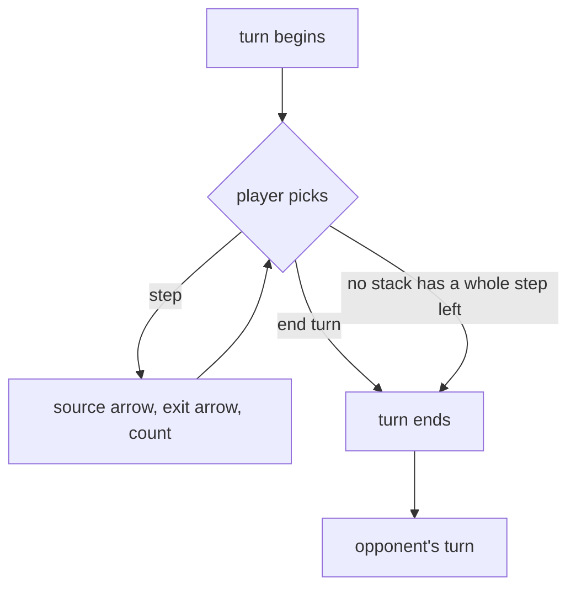

# move — what a player does

**Packet:** [P01 — Contracts](../../design/packets/P01-contracts.md)
**SPEC:** §3 (speed and allowance), §4 (turn structure), §5 (sentries are counts), §11 items 19, 20, 21
**Features:** [core](./move.core.feature) · [edge cases](./move.edge-cases.feature)

## Purpose

> **A move takes a portion of one arrow's heads one step along an out-arrow.
> A turn is an ordered list of moves, ended explicitly.**

Two variants and no others: **step**, **end-turn**. (A third, **skip**, was
deleted by P51: declining is the absence of a move, not a move.)

Splitting, merging, forking and dropping a sentry are all *the same move with a
different count*. Any fourth variant is a signal that a mechanic has been
invented rather than expressed.

## Scope

P01 owns the **shape** of a move. Whether a move is *legal* — whether the exit is
an out-arrow of the source's target point, whether the mover has allowance left,
whether a crossing is won — belongs to P04 and later. Letting legality leak into
this feature would bind the DTO to rules that have not been built.

## Terms

| Term | Means |
|---|---|
| **head** | one unit; also one life |
| **stack** | merged heads on one arrow; stack size **is** lives |
| **sentry** | heads left behind on a trail; a name, not a kind of unit. Discretionary, except for the anchor §5 charges at a join or a split — a legality rule, not a DTO one |
| **count** | how many of a source arrow's heads a step takes |
| **declining** | a stack staying put; the absence of a move, not a move (P51) |

## Why there is no unit identity

A stack is the count standing on an arrow. Nothing else. Introducing a `UnitId`
would model a shape the spec does not have, and would immediately raise
questions the rules never ask: *which* unit survives attrition, *which* one
carries the bank, *which* one a converted stack becomes.

The count model came from the interaction, not the other way round: an arrow
shows a number in its owner's colour, and you send a portion of it somewhere.
Galcon, on a directed graph.

## A turn

The player chooses the order. That is the whole reason the per-step model was
chosen over simultaneous resolution: **there is no within-turn resolution order
to invent**, and the ordering the player picked is already carried by the move
list a replay stores.

## Invariants

- The system shall represent a step as exactly a source arrow, an exit arrow and
  a count, and nothing else.
- The system shall reject a step whose count is zero, negative, or greater than
  the heads standing on the source.
- The system shall represent an end-turn with no arrow.
- The system shall preserve the order of moves within a turn.
- The system shall treat two structurally identical moves as equal, and shall not
  fall back on object identity.
- The system shall treat two turns containing the same moves in different orders
  as unequal.
- The system shall offer no move variant beyond step and end-turn.
- The system shall compute a group's movement allowance as `1 + floor(log₂ N)`
  whole steps, and shall never return a fraction.
- The system shall never return an allowance greater than the group's head count,
  so that splitting never loses on throughput.
- The system shall return an allowance that grows by at most one step per
  additional head.
- The system shall reject an allowance query for a group size that is zero,
  negative or fractional.

## Allowance moved here from `rational`

It was the harmonic curve with a banked remainder, which needed exact rationals
and turn-to-turn state. SPEC §3 now uses whole steps with nothing carried, so
allowance is a pure function of one integer and belongs beside the moves it
budgets rather than beside the accumulator arithmetic.

Two properties are worth more than the table of values. `speed(N) ≤ N` is §3's
founding constraint — stacking must never beat splitting — and it holds with
equality only at 1 and 2, which is what makes **the pair free** and therefore the
game's natural atom — the same size §6.1 makes the smallest garrison that halts a
front. Neither rule was written for the other.

`Math.log2` is float arithmetic. An implementation that rounds it is a
determinism bug of exactly the kind ADR 0001 calls the realistic one: it passes
unit tests and surfaces as replay drift.

## Order is data, and it changes outcomes

Stepping one stack onto another to reinforce it before a third commits to a
crossing is a legal and intended play (§4). So a turn is genuinely a *sequence*,
not a set — and the last two invariants above are what let a replay reproduce a
match exactly rather than approximately.

The reinforcement is not free: §3's merge rule gives a stack that merged this
turn speed 1 for that turn, which prices the manoeuvre in tempo without banning
it.

## What the DTO must keep expressible

**§11 item 22 is settled** (§3, allowance and spending): on a split both parts
inherit `spent`, so only the portion that moves pays. That is enforced by P04,
not here — but it constrains this DTO in one way worth stating, because it is
easy to lose.

A split sends part of a group forward while the rest stays *and remains able to
act*. So a turn routinely contains several moves naming the same origin, and a
rear group following a front group along arrows the front group just laid. The
DTO must not make either look malformed:

- no limit on how many moves name the same source
- no notion of a stack having "gone already"
- no distinction between stepping onto fresh ground and stepping onto your own
  trail

That last one matters most. §6.1a invariant 2 makes a trail a *set* of arrows:
stepping onto an arrow it already holds is legal and adds nothing. A lagging
group is ordinary play, and a DTO that treated it as suspect would have encoded
the wrong invariant.
