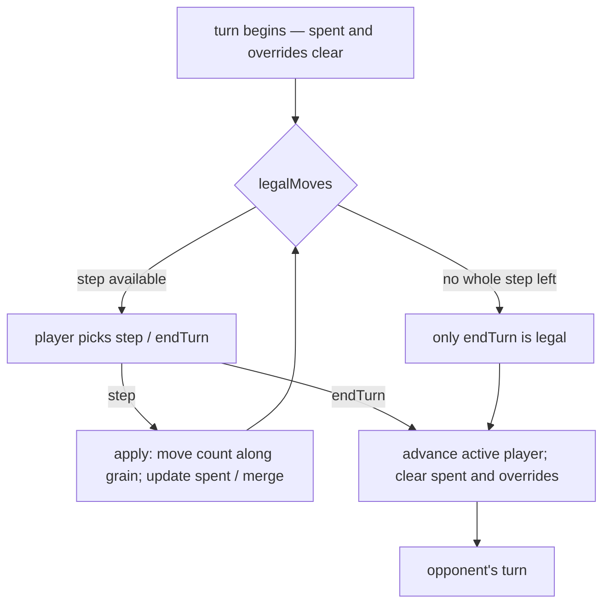

# movement — stacks, allowance and the turn loop

**Packet:** [P04 — Movement, stacks & the turn loop](../../design/packets/P04-movement.md)
**SPEC:** §3 (heads, stacks, speed, merge cost, allowance), §4 (turn structure),
§2 (movement follows the grain — via `GeometryPort` only), §11 items 19–22, 33
**Features:** [core](./movement.core.feature) · [edge cases](./movement.edge-cases.feature)

## Purpose

The first rules behaviour: how heads move on the board. A player spends an
ordered list of per-step moves — step, end-turn — against an occupancy map
over a `GeometryPort`. Allowance is integer (`speed(N) = 1 + floor(log₂ N)`);
nothing banks between turns; merging mid-turn costs tempo exactly as §3 prices
it.

This is also where `RulesPort` and `packages/rules-core` appear. P01 deferred
both so a speculative `apply` would not invent closure in type form; P04 knows
enough to land the movement slice. Later packets grow the same port.

## Scope

In: occupancy, spent, merge speed overrides, grain-following steps, end-turn,
player alternation, `legalMoves` / `apply`.

Out: trails and branch anchors (P05); crossings, cuts, combat (P06); territory,
fill, encirclement (P05/P07); spawners (P08); match setup and victory (P09).
Stepping onto an opponent-occupied arrow is **refused** here — that seam is
combat, not movement.

Tests hand-author occupancy over the P02 fixture boards (`minimal`, `spacious`).
There is no match-setup constructor.

## Terms

| Term | Means |
|---|---|
| **group** | the heads of one player standing on one arrow; allowance belongs to it |
| **spent** | whole steps that group has already taken this turn; cleared on end-turn |
| **effective speed** | `speed(size)`, unless a merge override sets it to 1 or 0 for the turn |
| **merge override** | the §3 cost of merging mid-turn: speed 1, or speed 0 if any arrival outnumbered what it joined. It rides with the **heads**, not with the arrow (§11 item 33) |
| **active player** | whose turn it is; only their groups may step |

*head*, *stack*, *point*, *arrow*, *vertex* keep their AGENTS.md meanings.
A stack **is** the group size — there is no separate HP.

## The turn

Every turn in a replay ends with an explicit `endTurn` (P04 D6, confirmed).
Exhaustion restricts `legalMoves`; it does not hide a player advance inside
`apply(step)`.

**`legalMoves` is the narrower half of the port, and deliberately so.** It names
a group only while that group still has a whole step left; a group with nothing
to do is simply not named, because declining is the absence of a move (P51) and
noise inside an already-finished turn is something a hot-seat player would have
to read past. Only one direction is asserted — **everything `legalMoves` offers, `apply`
accepts** — and the consequence for records is that a recorded turn follows
`legalMoves`, never the wider `apply`. The golden replay therefore contains no
move the engine would not have offered, which is what P10 will replay against.
P28's self-convert filter lives in both halves (`legalMoves` omits, `apply`
throws), so this ⊆ still holds. See
[refuse-self-convert](../refuse-self-convert/refuse-self-convert.md).

## Invariants

- The system shall move heads only along the grain: `exit` shall be an out-arrow
  of `target(from)`.
- The system shall refuse a step whose count exceeds the heads the active player
  holds on `from`.
- The system shall refuse a step when the group's `spent` is not strictly less
  than its effective speed.
- The system shall give a fresh group of size `N` exactly
  `speed(N) = 1 + floor(log₂ N)` whole steps per turn, and shall carry nothing
  between turns.
- When a group splits, the system shall give both parts the parent's `spent`, and
  shall charge only the moving part for the step.
- When a group merges as a minority or equal arrival, the system shall set the
  merged group's effective speed to 1 for the rest of the turn.
- When any arriving group outnumbers what it joined, the system shall set the
  merged group's effective speed to 0 for the rest of the turn.
- Once a group's effective speed is 0 for the turn, the system shall not restore
  it on a later merge the same turn.
- When a group carrying a merge override steps onto empty ground or splits, the
  system shall carry that override to every resulting part for the rest of the
  turn, rather than leaving it on the arrow the merge happened on (§11 item 33).
- The system shall merge two of the same player's groups on the same arrow
  automatically, with no extra move.
- The system shall refuse a step onto an opponent-occupied arrow.
- The system shall compel no step: a group the player leaves alone is named by
  no move, and `endTurn` is always legal (P51).
- When no owned group has a whole step left, the system shall offer only
  `endTurn` as a legal move.
- When `endTurn` is applied, the system shall advance the active player and clear
  every spent counter and merge override.
- The system shall not mutate the input state of `apply`.
- When `apply` is called twice with equal inputs, the system shall return equal
  outputs.

## What this packet deliberately does not decide

- Whether a step *onto* an enemy is a 1:1 attack — P06 (§6.2). Here it is simply
  illegal.
- Whether stepping lays trail — P05 (§5). Occupancy moves; the trail set does not
  appear in state.
- Match setup, spawn-at-boundary merges, victory — P09 / P08.
