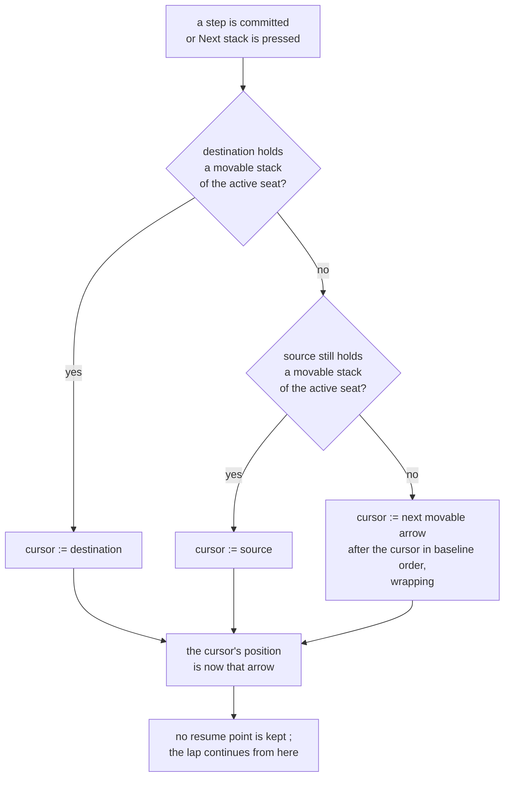
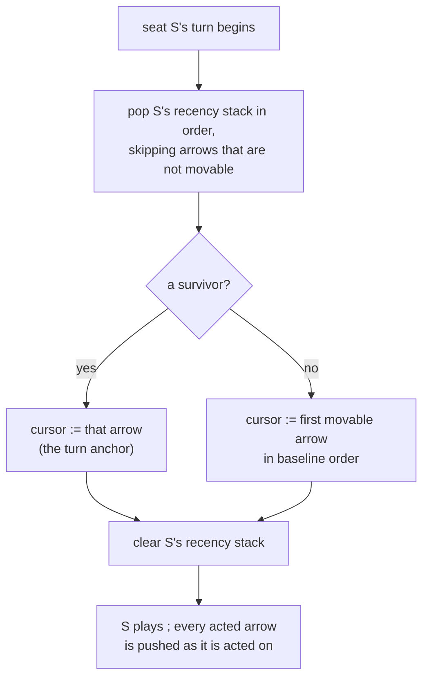

# Next stack: a selection cursor — P50

Packet: [`P50-next-stack-cursor.md`](../../design/packets/P50-next-stack-cursor.md).
Web adapter only. **No game rule is added, changed, or implied**; `contracts` and
`rules-core` are not touched. P51 deletes `SkipMove` afterwards.

## Purpose

Give the player a reliable way to reach every stack that can still act this turn,
exactly once per lap. The existing auto-picker cannot: it holds no position, only
a one-element memory of the arrow just acted on, so with three or more movable
stacks it oscillates between the two lowest arrow ids and starves the rest.

## Terms

Repo vocabulary is in [`AGENTS.md`](../../../AGENTS.md); these are the terms this
spec adds, all of them **adapter** concepts with no counterpart in the core.

| Term | Means |
|---|---|
| **movable arrow** | an arrow that is the `from` of at least one step in `rules.legalMoves(state)`. Derived at the port boundary — a stack with allowance left but no legal step is *not* movable, and the cursor must not land on it |
| **baseline order** | `compareArrows` over the movable arrows. A total order, already pinned for determinism |
| **cursor** | the adapter's current selection: one arrow, or nothing |
| **advance** | move the cursor one position, by the precedence rule below |
| **preemption** | an advance that goes to a stack the just-committed step created or grew, rather than to the baseline successor |
| **recency stack** | per seat, the arrows that seat acted on this turn, most recent first, at most one entry per arrow |
| **anchor** | the arrow the recency stack selects at the start of a seat's turn. *Not* the SPEC sense of anchor (trail liveness) — this word is unavoidable here and is always qualified as *turn anchor* in the feature files |

## The advance rule

A preemption **moves** the cursor rather than detouring from it. There is no
saved resume point, so an arrow reached by preemption is not offered again later
in the same lap.

Pressing *Next stack* with no step just committed has no destination and no
source, so it always takes branch F.

For a committed trip of several legs, *the step* the rule reads is the **last**
leg: its destination, its source, and — for branch F — its source as the cursor's
current position. A single-leg trip, which is the ordinary case, makes that the
same arrow the player clicked.

## Turn start

**Read before clear.** The recency stack is consumed to pick the anchor and only
then emptied; clearing first would discard the very entry that chooses the
anchor.

Per seat, because hot seat interleaves other seats between one seat's turns. In
memory only — a reload or an online rejoin starts with an empty recency stack,
which is identical to the first-turn case, so rejoin needs no special handling.

## Scope

- **In:** the cursor, the advance rule, the turn anchor, the button's rename and
  its availability from idle, and the fact that no `skip` move is emitted.
- **Out:** deleting `SkipMove` (P51), SPEC.md prose (P51), persistence of any
  kind, spectated/remote cursors, tutorial camera policy (P43/P48 own it; the
  tutorial bypasses the picker and continues to).

Camera behaviour is **unchanged**: pan only when the selection is off-screen,
with the existing margin. Asserted here only as a non-regression.

## Invariants

EARS one-liners. These become the property tests.

1. **Ubiquitous** — The system shall place the cursor only on a movable arrow, or
   on nothing.
2. **Ubiquitous** — The system shall visit every movable arrow at least once
   before visiting any movable arrow a second time, given a set of movable arrows
   that does not change between advances.
3. **Event-driven** — When *Next stack* is pressed, the system shall emit no move
   and shall leave the `GameState` identical.
4. **Event-driven** — When a turn begins for a seat whose recency stack contains
   at least one arrow that is still movable, the system shall place the cursor on
   the most recently acted such arrow.
5. **Event-driven** — When a turn begins for a seat whose recency stack is empty
   or holds no movable arrow, the system shall place the cursor on the first
   movable arrow in baseline order.
6. **State-driven** — While no arrow is movable, the system shall place the
   cursor on nothing.
7. **Unwanted** — If a committed step leaves a movable stack at its destination,
   then the cursor shall be that destination.
8. **Unwanted** — If a committed step leaves no movable stack at its destination
   but a movable remainder at its source, then the cursor shall be that source.
9. **Ubiquitous** — The system shall produce the same cursor sequence for the same
   sequence of committed steps, independent of map or set iteration order.
10. **Ubiquitous** — The system shall write no `skip` move to a match log.

Invariant 2 is deliberately conditioned on a stable movable set: a split adds an
arrow mid-lap and a death removes one, and the full-lap promise is over the set
as it stands, not over a snapshot. Invariant 9 is the determinism guard — the
cursor is adapter state, but a cursor that depended on `Map` order would still
make the *displayed* game differ between runs.

## Counts

10 invariants. 12 core scenarios, 21 edge-case scenarios.

## Decisions recorded here (BSSN, adapter-level — no game rule involved)

- **Movable is derived from `legalMoves`, not from allowance.** `allowanceOf` is
  private to `movement.ts` and exporting it would widen the port for a UI
  convenience. A stack with allowance but no legal step is correctly unreachable.
- **`compareArrows` is the baseline order.** Any total order satisfies the spec;
  this one is already exported and already pinned against iteration-order drift.
- **The cursor lives in the web adapter, not in `GameState`.** It is a view
  concern; putting it in state would make it replay-visible and put a UI
  preference on the online wire.
- **The advance function is shared by the button and the post-commit
  auto-advance.** One rule, two triggers, so the two can never disagree.
