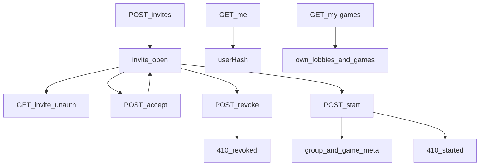

# online-auth-invites — Google identity, lobbies, library

**Packet:** [P17 — Online auth & invites](../../design/packets/P17-online-auth-invites.md)
**ADR:** [0002](../../adr/0002-cheap-async-online.md) (amended 2026-08-14)
**Features:** [core](./online-auth-invites.core.feature) · [edge cases](./online-auth-invites.edge-cases.feature)

## Purpose

Let two or more Google users form a 3- or 6-seat online lobby, then Start a
group/game **meta** record. Moves, WebSocket notify, and the Pages UI are
later packets. Tests talk to an HTTP/online port with a **fake Google
verifier** and a **fake S3**; they never call live Google or AWS.

Bearer is a Google **ID token**. Adapters may use a clock and CSPRNG (JWT
`exp`, invite tokens). `rules-core` stays pure.

Operator env (not in git): `GOOGLE_CLIENT_IDS` — accepted `aud` values
(Pages origin and localhost). Missing/invalid bearer → 401 on every
authenticated route.

## Terms

| Term | Means |
|---|---|
| **Google ID token** | JWT from Google Sign-In, sent as `Authorization: Bearer …` |
| **sub** | Google subject; stable player id; never returned to clients |
| **userHash** | `truncate16(SHA-256(sub))` — 32 lowercase hex characters |
| **truncate16** | first 16 bytes of the digest, hex-encoded |
| **creator** | the Google user who `POST /invites` |
| **hostSeatIndex** | index into `seats[]` the creator occupies at create; that seat must be `human`. Default: the first `human` seat |
| **invite token** | opaque CSPRNG value (32 bytes, hex); path parameter, not a PIN |
| **lobby** | an invite with status `open` |
| **groupHash** | `truncate16(SHA-256(sorted human userHashes joined by newline))`. Heuristic seats and 3-vs-6 are not in the preimage |

## HTTP (under the `/conquarrow` mapping)

| Method | Path | Auth |
|---|---|---|
| GET | `/me` | Bearer |
| GET | `/my-games` | Bearer | started rows include caller `status` ([P45](../online-game-library/online-game-library.md)) |
| POST | `/invites` | Bearer |
| GET | `/invites/:token` | none while open; 410 after revoke/Start |
| POST | `/invites/:token/accept` | Bearer |
| POST | `/invites/:token/revoke` | Bearer (creator only) |
| POST | `/invites/:token/start` | Bearer (any bound human) |

`GET /health` stays unauthenticated (P16). Game GET/POST lives under `/games/:groupHash/:gameNumber` (P18). The P16 `POST /moves` stub is removed in P18.

## Flow



## S3 (prefix `conquarrow/`)

```text
users/<userHash>/lobbies/<token>
users/<userHash>/groups/<groupHash>
invites/<token>.json
groups/<groupHash>/meta.json
groups/<groupHash>/games/NNNNNN/meta.json
```

P17 does **not** write `state.json` or `log.jsonl`.

## Invariants

- When a request has no valid Google ID token, the system shall respond 401 on `/me`, `/my-games`, `POST /invites`, accept, revoke, and start.
- When create lists fewer than two `human` seats, or a length other than 3 or 6, or a `byok` seat, the system shall respond 422 and shall not write S3.
- When create succeeds, the system shall bind the creator to `hostSeatIndex` (default: first human seat) and shall write only invite and lobby-pointer objects.
- While an invite is open, the system shall serve `GET /invites/:token` without a Google token and shall not include Google `sub` in the body.
- When a user accepts an invite they already occupy, the system shall return that same seat, shall not occupy a second chair, and shall write that user's lobby pointer if it is missing.
- When every human seat is already bound, the system shall reject a further accept with 409 and shall not add a spectator row.
- When the creator revokes, or when Start has succeeded, the system shall respond 410 with `reason` `revoked` or `started` on GET/accept/start of that token. A `started` 410 includes `groupHash` and `gameNumber` when the invite record has them (P26).
- If the caller is not the creator, then the system shall reject revoke with 403.
- If the caller is not a bound human on that invite, then the system shall reject Start with 403.
- When human seats are not all bound, the system shall reject Start with 409 and shall not write group or game objects.
- When Start succeeds, the system shall compute `groupHash` from sorted human `userHash` values joined by newline, allocate the next 6-digit game number, and shall not overwrite an existing `games/NNNNNN` object.
- When Start succeeds, the system shall not write `state.json` or `log.jsonl`.
- The system shall not include another user's lobbies or games in `GET /my-games`.
- The system shall list that user's open lobbies and started games on `GET /my-games`.
- When `GET /my-games` lists a started game, the system shall include a caller-relative `status` of `your-turn`, `waiting`, `won`, or `lost` ([P45](../online-game-library/online-game-library.md)).
