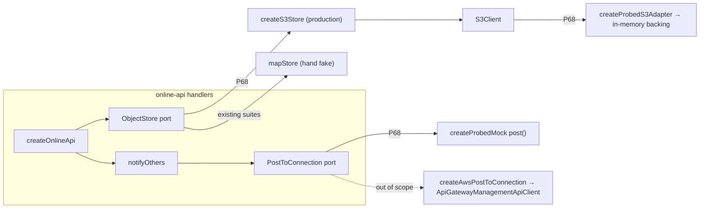
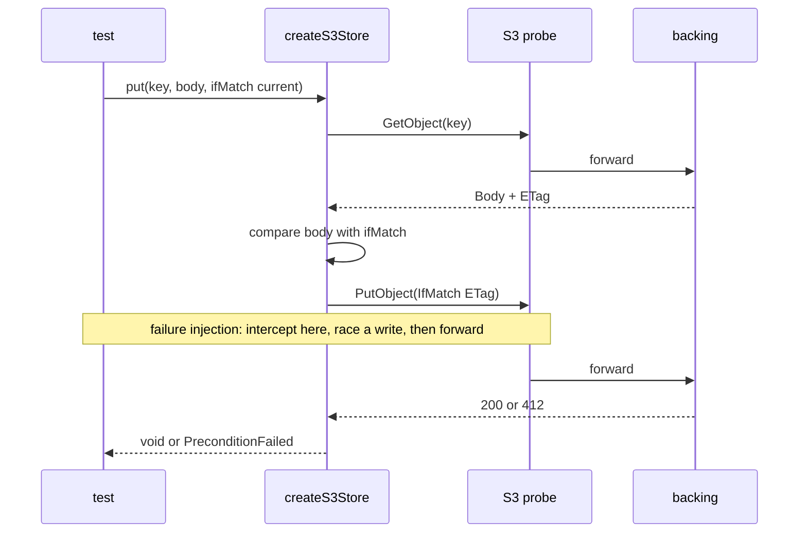

# Online edge probes (P68)

**Packet:** [P68 — test-kit at the I/O edges](../../design/packets/P68-test-kit-at-the-edges.md).
**Source of behaviour:** shipped code (`packages/online-api/src/s3-store.ts`,
`notify.ts`, `game-handlers.ts`, `handlers.ts`) and the P17 / P18 specs
([online-auth-invites](../online-auth-invites/online-auth-invites.md),
[online-moves-ws](../online-moves-ws/online-moves-ws.md)). Online, not game:
nothing here is a SPEC.md rule, and no scenario changes product behaviour.

- Core scenarios: [`online-edge-probes.core.feature`](./online-edge-probes.core.feature)
- Edge cases: [`online-edge-probes.edge-cases.feature`](./online-edge-probes.edge-cases.feature)

## Purpose

Execute the **production** object store, `createS3Store`, against a real
`S3Client` whose transport is a test-kit probe with an in-memory backing, and
drive `notifyOthers` through a probed `PostToConnection`. Until now every
`online-api` suite ran on `mapStore` (`test/support.ts`); the S3 adapter's
error mapping, conditional-write dance and pagination had no test at all.

Also: retire the P24 `local-main` overlay and guard the pure core against the
now-committed test library.

## Terms

| Term | Means here |
|---|---|
| **rig** | `createRig()` from `@hochgi/test-kit` — owns every probed adapter in one test; `rig.close()` tears them down |
| **probed S3** | `createProbedS3Adapter({ harness: rig, bucket })` — `.adapter` is a real `S3Client`; default rule forwards every command to the in-memory **backing** |
| **backing** | test-kit's in-memory S3: ETag = quoted MD5 of the body, `IfMatch` / `IfNoneMatch` → 412 `PreconditionFailed`, `NoSuchKey` for a missing key, `ListObjectsV2` pages capped at 1000 keys |
| **real store** | `createS3Store(BUCKET, probedS3.adapter)` — production code, unmodified |
| **map store** | `mapStore(map)` in `test/support.ts` — the hand-rolled `ObjectStore` the other suites use |
| **probed notifier** | `createProbedMock<ConnectionNotifier>({ harness: rig, methods: ['post'] })`, where `ConnectionNotifier.post` has `PostToConnection`'s signature narrowed to `Promise<200 \| 410>`; the deps get `(id, payload) => notifier.adapter.post(id, payload)` |
| **failure injection** | a probe rule — `probe.command(X).once().reject(err)`, or `expect.intercept()` then a racing write then `forward()` — never a new hand-written fake |
| **S3 error** | an `S3ServiceException` from `@aws-sdk/client-s3` built with a `name` and `$metadata.httpStatusCode` — the shape the real SDK throws |

## Seams (Goldilocks)

`ObjectStore` stays the handlers' seam; `S3Client` is probed only where the
code under test **is** the S3 adapter, or where one flow must prove the real
adapter composes with the handlers. `PostToConnection` is probed instead of the
management client: the client is too thin (raw bytes, SDK exceptions) and its
200/410 mapping lives in a Lambda entry that reads `env` at import.

## Test files (BSSN)

Under `packages/online-api/test/`, the repo's suffixes, no `.kit` marker:

- `online-edge-probes.core.test.ts` — the core feature
- `online-edge-probes.edge-cases.test.ts` — the edge-case feature
- `online-edge-probes.invariants.test.ts` — the EARS below
- `online-edge-probes.support.ts` — rig factory: probed S3, real store,
  probed notifier, an `api` built over them; helpers to seed keys and build
  S3 errors. Reuses `test/support.ts` users, hashes and HTTP helpers.

Every test creates its own rig and closes it (`afterEach` or `try/finally`).
No fake timers: nothing under test owns a timer.

## Invariants

1. **[EQUIV]** The system shall return the same observable result from the
   real store over the probed S3 as from the map store for every operation
   script in the fixed catalogue — `get` values, `listPrefix` results, and
   which `put`s throw `PreconditionFailed`. *(Catches drift in the hand fake
   ~30 suites rely on.)*
2. **[LIST]** When `listPrefix(p)` runs over a bucket holding *n* keys under
   *p* for *n* ∈ {0, 1, 999, 1000, 1001, 2000, 2001} plus keys outside *p*,
   the system shall return exactly the *n* keys under *p*, sorted by
   `compareStrings`, after ⌈*n* / 1000⌉ `ListObjectsV2` calls (one when
   *n* = 0).
3. **[NO-PUT]** If an `ifMatch` put fails its body comparison or finds no
   object, then the real store shall throw `PreconditionFailed` without sending
   a `PutObject`.
4. **[CORE-CLEAN]** The system shall name no `@hochgi/test-kit*` or
   `@vnatures/test-kit*` package in any `dependencies`, `devDependencies` or
   `peerDependencies` of `packages/contracts`, `packages/rules-core`, or any
   `packages/geometry-*` manifest (enumerated from the directory, so a new
   geometry package is covered).
5. **[DEV-ONLY]** Where a workspace manifest names a test-kit package, the
   system shall list it under `devDependencies` only — never `dependencies`,
   which would ship a test library in a Lambda bundle.
6. **[HOOK]** The pre-push hook shall run `pnpm verify` and no other command,
   and `scripts/check-local-hygiene.sh` shall not exist.
7. **[LINT]** If a file under `packages/contracts`, `packages/rules-core` or
   `packages/geometry-*` imports `@hochgi/test-kit*` or `@vnatures/test-kit*`,
   then `pnpm lint` shall fail. *(ESLint `no-restricted-imports`; verified by
   the reviewer with a throwaway import, not by Vitest — typed lint needs a
   tsconfig a synthetic file is not in. The rule must keep the existing
   `node:*` pattern on `src`: flat config replaces, not merges, a rule's
   options for overlapping files.)*

Invariants 1–6 are Vitest properties in `online-edge-probes.invariants.test.ts`;
the policy ones (4–6) read files off disk the way `infra.test.ts` does.

## Characterisation, not red (BSSN)

Both features encode shipped behaviour, so their tests pass on arrival.
Phase 2 shows each one *can* fail by hand-mutating the production line it
guards (drop `isNoSuchKey`'s 404 branch, drop the continuation loop, drop the
`status === 410` cleanup, send `PutObject` before the body comparison…),
watching the test go red, and reverting — and records the pairing in its
report. Invariants 4 and 6 are new and are red until phase 3. Invariant 5 is
vacuously green until the dependencies land in phase 2.

## Counts

Core: 8 scenarios. Edge cases: 15 scenarios (one outline, 4 rows).
Invariants: 7 (6 Vitest, 1 lint).

## Open — not this packet

- `notifyOthers` awaits each post with no timeout; a post that never settles
  holds the move response open. Observed, not specced: a timeout is a product
  change for a later online packet.
