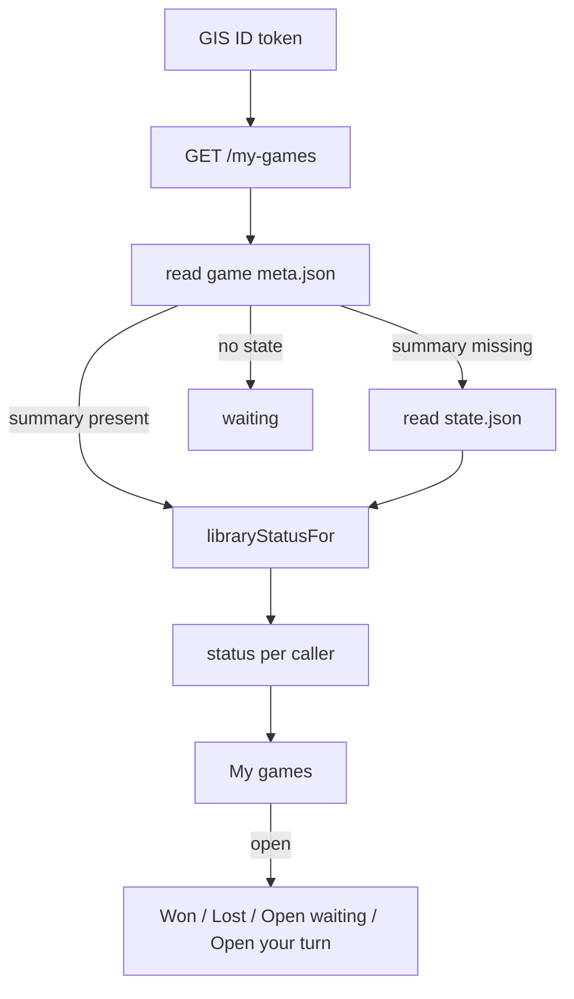

# online-game-library — My games statuses

**Packet:** [P45 — Game library status](../../design/packets/P45-game-library.md)
**ADR:** [0002](../../adr/0002-cheap-async-online.md) (amended 2026-08-27, P45)
**Amends:** [online-auth-invites](../online-auth-invites/online-auth-invites.md) · [online-moves-ws](../online-moves-ws/online-moves-ws.md) · [online-web](../online-web/online-web.md) · [online-shell](../online-shell/online-shell.md)
**Features:** [core](./online-game-library.core.feature) · [edge cases](./online-game-library.edge-cases.feature)

## Purpose

After Google Sign-In, the Online lobby needs a **My games** list that tells
the player which matches are theirs to move, waiting, won, or lost. P17's
`GET /my-games` already returns membership pointers; this packet adds a
caller-relative `status` on each started row and hides the list behind a
button.

Not a game rule. Tests talk to `OnlinePort`, `OnlinePagesPort`, and pure
helpers. No live Google or AWS. `rules-core` stays pure — the adapter may
call `isLost` when stamping or falling back.

## Terms

| Term | Means |
|---|---|
| **status** | `your-turn` \| `waiting` \| `won` \| `lost` on a started row, relative to the bearer |
| **library summary** | `players`, `activePlayer`, `lostPlayers`, and `winner` on game `meta.json` |
| **lostPlayers** | `PlayerId` strings for which `isLost` holds at last persist, sorted |
| **My games** | Signed-in Online control (copy `My games`) that lists started rows |
| **label** | Shell copy: `Open (your turn)` / `Open (waiting)` / `Won` / `Lost` |

## HTTP delta

`GET /my-games` 200 started row:

```text
{ "groupHash": "…", "gameNumber": "000001", "status": "your-turn" }
```

`status` is required. Open lobby rows are unchanged `{ "token" }`.

## Classification

`libraryStatusFor(userHash, seats, summary)` in `contracts`. Map the caller
to a `PlayerId` by bound-seat index → `summary.players[index]`. Then:

1. `winner === me` → `won`
2. `winner` set → `lost`
3. `lostPlayers` contains `me` → `lost`
4. `activePlayer === me` → `your-turn`
5. else → `waiting`

No `summary`, or no chair for the caller → `waiting`.

## Persist stamp

Every persist of `state.json` writes the library summary onto that game's
`meta.json` (same object as `seats`; do not drop chairs). `GET /my-games`
reads meta. Unstamped meta + existing `state.json` → one hydrate, then the
same classifier. Listing does not write S3.

## Shell

`libraryStatusLabel` / `MY_GAMES_COPY` / `NO_GAMES_COPY` in the web package
(P27 `CREATING_INVITE_COPY` precedent). Lobby disclosure is chrome: default
closed; no React Testing Library (P25).

Server sort: status rank `your-turn` (0), `waiting` (1), `won` (2), `lost`
(3); then `groupHash` ascending; then `gameNumber` descending.

## Flow



## Invariants

- When `GET /my-games` lists a started game, the system shall include a caller-relative `status` of `your-turn`, `waiting`, `won`, or `lost`.
- When the bearer occupies the active living seat and `winner` is unset, the system shall report `your-turn` for that bearer and shall not report `your-turn` for another bound human on that game.
- When `state.winner` is the bearer's `PlayerId`, the system shall report `won`; when `winner` is set and is not the bearer, the system shall report `lost`.
- When the bearer is in `lostPlayers` and `winner` is unset, the system shall report `lost` and shall not report `waiting` or `your-turn`.
- When a game has `meta.json` and no `state.json`, the system shall report `waiting` for every bound human.
- When a persist writes `state.json`, the system shall write `players`, `activePlayer`, and `lostPlayers` onto that game's `meta.json`, and `winner` when it is set, and shall keep `seats`.
- When `meta.json` lacks a library summary and `state.json` exists, `GET /my-games` shall classify from that state and shall not write S3.
- The system shall not include another user's lobbies or games in `GET /my-games`.
- When a request has no valid Google ID token, the system shall respond 401 on `GET /my-games`.
- The system shall sort started rows by status rank `your-turn`, `waiting`, `won`, `lost`, then `groupHash` ascending, then `gameNumber` descending.
- The system shall not include Google `sub` in `/my-games` bodies.
- When the player signs out, the adapter shall clear `/my-games`.
- When Online mode is selected and the player is signed in, the shell shall offer the My games control; when Local is selected, or the player is unsigned, the shell shall not offer it.
- When `status` on a `/my-games` body is missing or not one of the four strings, the adapter shall treat the library parse as failed.
- `libraryStatusFor` shall be a function of `userHash`, `seats`, and `summary` only: equal inputs shall yield equal status.

## Counts

- Core scenarios: 8
- Edge-case scenarios: 17
- Invariants: 15
- BSSN recorded in the packet and ADR 0002 (2026-08-27). No SPEC.md §11 item opened or closed.
