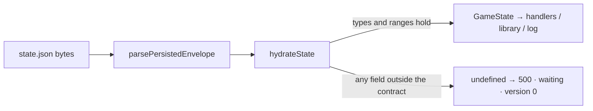

# Online hardening (P69)

**Packet:** [P69 — online hardening](../../design/packets/P69-online-hardening.md).
**Source of behaviour:** the packet, `packages/contracts/src/game-state.ts`
(the ranges), RFC 9110 §11.1 (auth scheme). Online, not game: no SPEC.md rule.

- Core: [`online-hardening.core.feature`](./online-hardening.core.feature)
- Edge cases: [`online-hardening.edge-cases.feature`](./online-hardening.edge-cases.feature)

## Terms

| Term | Means here |
|---|---|
| **stored position** | the `state` object inside `state.json`, read by `parsePersistedEnvelope` → `hydrateState` |
| **refused** | `parsePersistedEnvelope` returns `undefined` — the same outcome as any other malformed field; it never throws |
| **seated player** | an id in the stored position's `players` list |
| **valid stored position** | one `persistEnvelope` wrote for a real match (`test/online-persistence-parse.support.ts` builds them) |

## Test files (BSSN)

- Scheme case: `packages/online-api/test/google-tokeninfo.test.ts` (the verifier's home).
- Ranges: `packages/online-api/test/online-persistence-parse.edge-cases.test.ts`
  (one row per corrupted field, as today) and `.invariants.test.ts`.
- Handler-level: `packages/online-api/test/moves-ws.edge-cases.test.ts`.

## Invariants

1. **[NO-THROW]** The system shall return `undefined` and never throw from
   `parsePersistedEnvelope`, whatever JSON a stored position holds.
2. **[ROUND-TRIP]** When a valid stored position is re-read, the system shall
   load it unchanged (existing round-trip property, now over the stricter loader).
3. **[RANGES]** If a stored position breaks any range in the packet's table,
   then the system shall refuse it — never clamp, drop or default the field.
4. **[MEMBERSHIP]** The system shall load no position whose `activePlayer`,
   `winner`, or any owner / trail / streak player is not a seated player.
5. **[SCHEME]** The system shall treat the `Authorization` scheme
   case-insensitively and everything after it exactly as before.

## Counts

Core: 3 scenarios (one outline, 4 rows). Edge cases: 6 scenarios (three outlines, 28 rows).
Invariants: 5.
