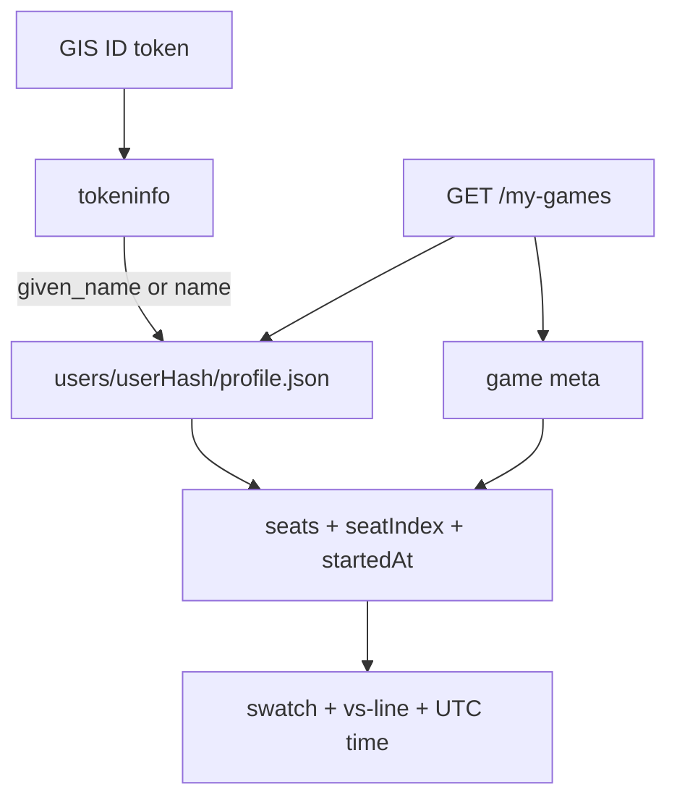

# online-library-identity — who, when, and my colour on My games

**Packet:** [P46 — Library row identity](../../design/packets/P46-library-row-identity.md)
**ADR:** [0002](../../adr/0002-cheap-async-online.md) (amended 2026-08-27, P46)
**Amends:** [online-game-library](../online-game-library/online-game-library.md)
**Features:** [core](./online-library-identity.core.feature) · [edge cases](./online-library-identity.edge-cases.feature)

## Purpose

P45 listed status and `gameNumber`. Two groups both show `000001`, so the
list cannot tell two waiting matches apart. This packet adds the chairs,
the caller's colour, and (for new games) when Start happened.

Not a game rule. No new AWS. GIS name claims are already on the ID token.

## Terms

| Term | Means |
|---|---|
| **library seat** | `{ kind, label, you }` on a started row — never `userHash` / `sub` / email |
| **seatIndex** | Caller's chair (0–5); shell tints from the board palette |
| **displayName** | GIS `given_name` else `name`, trimmed, max 40, stored on `users/<userHash>/profile.json` |
| **startedAt** | ISO-8601 UTC written at Start; omitted on pre-P46 meta |
| **vs-line** | Labels of chairs that are not `you`, joined with ` · ` |

## HTTP delta

`GET /my-games` started row:

```text
{
  "groupHash": "…",
  "gameNumber": "000001",
  "status": "waiting",
  "seatIndex": 0,
  "seats": [
    { "kind": "human", "label": "Gilad", "you": true },
    { "kind": "human", "label": "Shalev", "you": false },
    { "kind": "heuristic", "label": "AI", "you": false }
  ],
  "startedAt": "2026-08-27T09:10:00.000Z"
}
```

`seats` and `seatIndex` are required. `startedAt` is omitted when unknown.
Heuristic `label` is always `AI`. Unnamed humans use `Player A` … `Player F`.

## Profile

Authenticated create, accept, and `GET /my-games` upsert the caller's
profile when the verifier supplies a display name. Listing reads other
humans' profiles for labels. GET still does not write game objects.

## Start stamp

Start's game `meta.json` includes `startedAt` from `deps.clock()`. Persist
of `state.json` must not drop it.

## Shell

- Line 1: `formatLibraryRow(status, gameNumber)` — unchanged P45
- Line 2: `libraryVsLine(seats)` — other chairs' labels joined with ` · `
- Line 3: `formatLibraryStartedAt(startedAt)` when present (UTC, not local)
- Left border + your swatch in `libraryRowTint(seatIndex)` (`styleFor` fill)
- One swatch per chair in order; `you` is ringed
- Do not fill the whole button with the seat colour

## Flow



## Invariants

- When `GET /my-games` lists a started game, the system shall include ordered `seats` and the caller's `seatIndex`.
- When a listed human has no profile, the system shall label that chair `Player A` through `Player F` from its seat index.
- When a listed chair is heuristic, the system shall label it `AI`.
- When a listed human has a profile display name, the system shall use that name as the chair's label.
- The system shall not include Google `sub`, email, or `userHash` on library seats.
- When Start writes game meta, the system shall write `startedAt` as ISO-8601 UTC from the adapter clock.
- When game meta has no `startedAt`, `GET /my-games` shall omit `startedAt` and shall not invent a timestamp.
- When the verifier yields a display name, create, accept, and `GET /my-games` shall upsert that caller's profile.
- The vs-line shall list every chair except the caller's, in seat order.
- The shell shall tint a library row from the caller's `seatIndex` board colour and shall not use that colour as the button's entire fill.
- `formatLibraryStartedAt` shall render UTC, not the operator's local timezone.

## Counts

- Core scenarios: 6
- Edge-case scenarios: 8
- Invariants: 11
- BSSN in the packet and ADR 0002 (2026-08-27, P46). No SPEC.md §11 item opened or closed.
