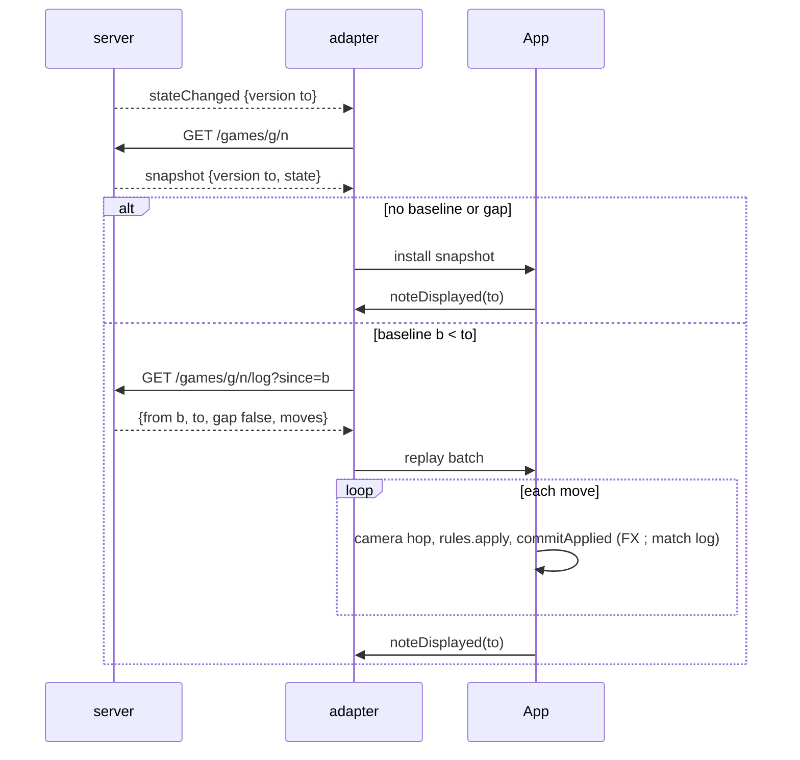

# online-move-log-replay — a remote turn plays out, move by move

**Packet:** [P49 — Online move-log replay](../../design/packets/P49-online-move-log-replay.md)
**SPEC:** none. **No game rule is touched, read, or implied.** This is transport plus presentation.
**ADR:** [0002 — cheap async online](../../adr/0002-cheap-async-online.md) owns the route shape decided below.
**Layer:** `packages/online-api` (one new read route, one log-line format change) and
`packages/web` (a new pure `online-replay.ts`, adapter plumbing in `online-pages.ts`,
a drain loop in `App.tsx`, one clause added to `spectate.ts`'s predicate).
**Features:** [core](./online-move-log-replay.core.feature) · [edge cases](./online-move-log-replay.edge-cases.feature)

## Purpose

Online play today has no per-move presentation at all. A `stateChanged` wake makes
the client re-GET a **full state snapshot** and install it wholesale
(`App.tsx` `hydrateState` → `stateRef.current`), never calling `commitApplied`. So a
remote turn produces no FX, no match-log entries, and — since P48 — nothing for the
spectated-turn camera to follow.

The moves already exist: `log.jsonl` is appended one JSON move per line by
`persistPosition`, heuristic bursts included. **No route serves it.** This feature
adds the route, replays the moves the client has not yet displayed, and drives them
through `commitApplied` so online gains the same effects layer local play has.

The governing rule, from the packet: **replay from what this client last displayed,
never from what the server last stored.**

## Terms

| Term | Means |
|---|---|
| **displayed baseline** | the version whose state this client is currently showing |
| **authoritative snapshot** | the state + version returned by `GET /games/{g}/{n}` |
| **log line** | one persisted move, stamped with the version its batch produced |
| **batch** | the moves one `POST /moves` persisted — the human move plus any heuristic burst; exactly one version |
| **replay batch** | a contiguous run of moves the client fetched to catch up: `{ from, to, moves }` |
| **gap** | the log cannot supply every version in `(from, to]` contiguously |
| **snapshot install** | today's behaviour — hydrate the snapshot and show it, replaying nothing |
| **replay queue** | wakes that arrived while an earlier replay batch was still playing, kept in arrival order |
| **divergence** | replayed moves produce a state disagreeing with the authoritative snapshot at the same version |

*move*, *head*, *trail*, *cut*, *territory* keep their AGENTS.md meanings. This feature
reads none of them — it transports moves and hands them to `rules.apply`.

## Decisions recorded here (online/infra BSSN, AGENTS.md in-bounds)

### D1 — the route is moves-since-version, not the whole log

`GET /games/{groupHash}/{gameNumber}/log?since={version}`, same auth and membership
check as `GET /games/{groupHash}/{gameNumber}` (`requireMember`: 401 unsigned,
403 non-member, 404 unknown game).

Body: `{ "from": <since>, "to": <currentVersion>, "gap": <boolean>, "moves": [ … ] }`
with `moves` the moves whose stamped version lies in `(from, to]`, in log order.

`since` is **required**; absent or non-integer is 422. Requiring it is deliberate —
there is no spelling of this route that quietly pulls a whole match. A client that
wants the whole history downloads the match log (P20+), not this.

### D2 — log lines carry the version their batch produced

`log.jsonl` lines become `{"v":<version>,"move":{…}}`. The stamp is the version
`persistPosition` is writing, so a batch's moves all carry one version and the file
stays append-only and ordered.

Lines without `v` — everything written before this packet — are **unstamped**. They
are never served as replayable moves; a request whose `(from, to]` window needs one
answers `gap: true`. Existing matches therefore keep working and simply install
snapshots, which is exactly the cold-start behaviour the packet already accepts.

### D3 — no pagination, one object read per request

The route reads `log.jsonl` whole and filters server-side. That is one S3 GET per
wake, alongside the state GET the client already performs — same order of cost, and
the wake rate is bounded by human turn-taking. Revisit if spectators (P20+) land, or
if a match log ever outgrows a comfortable single-object read.

### D4 — the adapter decides replay-or-install; App owns the baseline

`online-pages.ts` keeps the authoritative snapshot exactly as today. It additionally
holds a **displayed baseline**, which App reports with `noteDisplayed(version)` after
every snapshot install and after every replay batch finishes. On `stateChanged` for
the open game the adapter GETs the snapshot, then:

- no displayed baseline, or `gap`, or the log request failed → **snapshot install**;
- baseline `< to` and a contiguous window exists → **queue a replay batch**;
- baseline `>= to` → nothing to show.

App drains the queue in order. Cold start (`boot`, `routeFromHash`, `openMyGame`,
`becomeVisible`) never replays: it installs the snapshot and reports the baseline.

### D5 — divergence is logged, never mitigated

When a replay batch finishes at a version the client also holds an authoritative
snapshot for, the two states are compared by a pure digest. A mismatch is a bug in
purity or in log ordering: it is reported through `console.error` with group, game and
version, and **nothing else happens** — the replayed state stands, no reconcile, no
snapshot swap, no message to the player.

### D6 — P48's predicate gains one clause

`isSpectatedSeat` takes `ownSeat`: a seat is spectated when the tutorial is not
running and either the game is local and the seat is not `human`, or the game is
online and the seat to move is not this client's. `ownSeat` unknown defaults to *ours*,
so an online game with no `/me` yet behaves exactly as it does today.

### D7 — local input is refused while a replay is in flight

The board is showing a superseded position while a batch plays, so a local commit
against it would be a move chosen from a past state. Own-seat input is refused for the
duration; the queue drains and the restore hands control back.

## Flow

## Invariants (EARS)

1. *Ubiquitous*: The system shall serve only moves whose stamped version lies in `(from, to]`.
2. *Ubiquitous*: The system shall serve log moves in the order they were persisted.
3. *Unwanted*: If any version in `(from, to]` is unavailable or non-contiguous, then the response shall report a gap and carry no moves.
4. *Unwanted*: If `since` is absent or not an integer, then the request shall be rejected as unprocessable.
5. *State-driven*: While the caller is not a bound member of the game, the system shall serve no log moves.
6. *State-driven*: While no displayed baseline exists, the system shall install the snapshot and replay nothing.
7. *Event-driven*: When a wake arrives during a replay, the system shall queue it and replay every batch in arrival order, skipping none.
8. *Event-driven*: When a replay batch finishes, the system shall report its `to` as the new displayed baseline.
9. *Ubiquitous*: The system shall drive every replayed move through the same commit path as a local move, so effects and match-log entries are produced identically.
10. *Unwanted*: If a replayed state diverges from the authoritative snapshot at the same version, then the system shall report the divergence and change nothing.
11. *State-driven*: While a replay is in flight, the system shall accept no local move for this client's seat.
12. *Ubiquitous*: The system shall treat an online seat that is not this client's as spectated, and this client's own seat as not spectated.

## Counts

12 invariants · 12 core scenarios · 16 edge-case scenarios.
