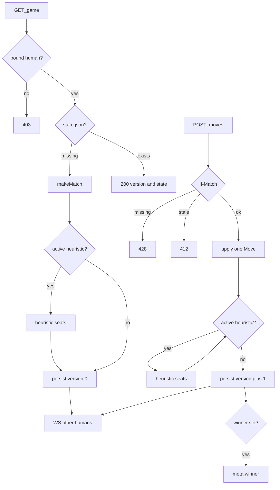

# online-moves-ws — apply, heuristic burst, WebSocket notify

**Packet:** [P18 — Online moves + WS](../../design/packets/P18-online-moves-ws.md)
**ADR:** [0002](../../adr/0002-cheap-async-online.md) (amended 2026-08-14, P18)
**Features:** [core](./online-moves-ws.core.feature) · [edge cases](./online-moves-ws.edge-cases.feature)

## Purpose

Let bound humans play an already-Started online game: load a position, submit
one `Move`, let heuristic seats finish their turns in the same invocation, persist
once, and wake the other humans. The Pages UI is P19. Tests talk to
`OnlinePort` plus a WebSocket port with a **fake Google verifier**, a **fake
S3**, a **scripted heuristic**, and a **fake `PostToConnection`**. They never
call live Google, AWS, or API Gateway.

`rules-core` stays pure. Geometry is the generated tiling (`makeMatch` with
`DEFAULT_MATCH_CONFIG` and `playerCount` 3 or 6 from game meta). Seat *i* in
meta is `players[i]`. Production heuristic is the Pages `chooseMove` /
`playBotTurn` loop (stable tie-break, forced `endTurn` if a seat has not
yielded). Tests inject the chooser.

## Terms

| Term | Means |
|---|---|
| **version** | Integer on `state.json`, starting at **0**. One successful persist increments it by 1 |
| **If-Match** | Request header `If-Match: "<n>"` (quoted decimal). Required on POST moves |
| **ensure** | First member read or write of a game that has meta but no `state.json`: `makeMatch`, optional opening heuristic burst, one persist at version 0 |
| **burst** | After the human `apply`, while there is no winner and the active seat is heuristic: Pages bot-turn loop for that seat, then the next heuristic seat, until a human seat or the game ends |
| **caller** | The authenticated user who issued this GET or POST |
| **connection id** | API Gateway WebSocket `connectionId` |

## HTTP (under the `/conquarrow` mapping)

| Method | Path | Auth |
|---|---|---|
| GET | `/games/:groupHash/:gameNumber` | Bearer, bound human on that game |
| POST | `/games/:groupHash/:gameNumber/moves` | Bearer, active human seat; header `If-Match` |

The P16 stub `POST /moves` (501) is **removed**. Invite routes are unchanged
(P17). `GET /health` stays unauthenticated.

POST body: `{ "move": <Move> }` (`step` \| `endTurn` from contracts).

POST 200 body: `{ "version", "groupHash", "gameNumber" }` — the client then
GETs state (ADR). GET 200 body: `{ "version", "state", "seats" }` where `state`
is a JSON encoding of `GameState` (observable: `players`, `activePlayer`,
`winner`, groups/trails/territory sufficient to replay) and `seats` is that
game's meta `InviteSeat[]` (P26). Google `sub` never appears.

## WebSocket

URL: `wss://ws.games.hochgi.com/conquarrow?access_token=<Google ID token>`.

`$connect`: verify the token (same `sub`/`aud`/`exp` as HTTP). Any verified
user may connect. Write `connections/<userHash>/<connectionId>`. Invalid or
missing token → 401, no key.

`$disconnect`: delete that key.

Notify (after a persist of `state.json`): `PostToConnection`
`{ "type": "stateChanged", "version", "groupHash", "gameNumber" }` to every
connection of every **other** bound human on that game — not the caller, not
heuristic seats. `PostToConnection` 410 → delete that connection key and
continue.

## S3 (prefix `conquarrow/`)

```text
groups/<groupHash>/games/NNNNNN/state.json    # { version, state }
groups/<groupHash>/games/NNNNNN/log.jsonl     # one JSON Move per line, apply order
groups/<groupHash>/games/NNNNNN/meta.json     # seats; winner (PlayerId) once finished
connections/<userHash>/<connectionId>
```

`log.jsonl` has no timestamps. Replay is `makeMatch` then fold the log.

P17 Start still writes **meta only**. Ensure on first member GET (or POST
moves) creates `state.json` / `log.jsonl`. Opening persist is version **0**,
including any opening heuristic burst. Later successful POSTs persist at
`n+1`.

Conditional puts: `If-None-Match: *` on first `state.json` and on
`games/NNNNNN/meta.json` at Start; `If-Match` on invite JSON for accept
(server retries; accept HTTP stays If-Match-free); `If-Match` on `state.json`
for moves (client header). Timeout or failed precondition leaves S3 unchanged
for that persist.

## Flow



## Invariants

- When a request has no valid Google ID token, the system shall respond 401 on GET game, POST moves, and WebSocket `$connect`, and shall not write S3.
- If the caller is not a bound human on that game, then the system shall reject GET and POST with 403 and shall not write `state.json` or `log.jsonl`.
- When game meta is missing, the system shall respond 404 on GET and POST and shall not create a game.
- When `state.json` is missing and a bound human GETs or POSTs, the system shall ensure: `makeMatch` with default match config and `playerCount` equal to the seat plan length, then the opening burst if the active seat is heuristic, then one persist at version 0.
- When ensure races, the system shall create `state.json` with `If-None-Match` so a second writer does not overwrite; the loser shall read the winner's object.
- When POST moves omits `If-Match`, the system shall respond 428 and shall not apply.
- When `If-Match` does not equal the stored quoted version, the system shall respond 412 and shall not apply.
- When the bearer is not the active human seat, the system shall respond 403 and shall not apply.
- When `apply` rejects the move as illegal, the system shall respond 422 and shall not persist.
- When `state.winner` is already set, the system shall reject POST moves with 409 `{ "reason": "finished" }` and shall not persist.
- When a persist first sets `state.winner`, the system shall write that `PlayerId` onto that game's `meta.json` as `winner`.
- When POST moves succeeds, the system shall `apply` the human move, then run the burst, persist **once** (`state.json` and a log append of every applied move), increment version by 1, and notify other bound humans.
- While the Lambda does not finish a persist, the system shall leave `state.json` and `log.jsonl` unchanged so the client may retry the same move and version.
- The system shall not include Google `sub` in HTTP or WebSocket bodies.
- The system shall not send `stateChanged` to the caller or to heuristic seats.
- When `PostToConnection` reports the connection gone, the system shall delete that connection key and shall not fail the persist.
- When two clients accept concurrently, the system shall not bind both to the same chair; the late writer shall retry and take the next unbound human seat or 409 if full.
- When Start allocates `games/NNNNNN`, the system shall not overwrite an existing object at that key (`If-None-Match`).
- When Start is retried while the invite is still open and that start's game meta already exists, the system shall finish that same start and shall not allocate a new game number.
- When Start has completed (invite status `started`), the system shall still respond 410 `{ "reason": "started" }` on GET/accept/start of that token, including `groupHash` and `gameNumber` when the invite record has them (P26).
- When GET game succeeds, the system shall include meta `seats` in the 200 body (P26).
- Members shall GET a finished game as 200 (version and terminal state).
