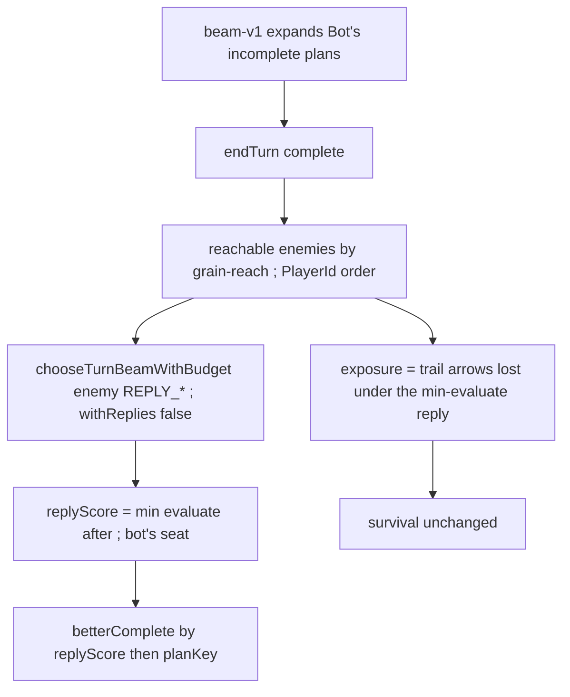

# opponent-ply-and-denial — one enemy reply, not a denial catalogue

**Packet:** [P55 — Opponent ply and denial](../../design/packets/P55-opponent-ply-and-denial.md)
**SPEC:** read [§6.2](../../../SPEC.md) (stay-behind) and
[§6.3](../../../SPEC.md) (encirclement converts intact). **No game rule
is added, changed, or implied.** Nothing is owed to SPEC §11. Do not
edit SPEC.md.
**Layer:** `packages/web` only. No `contracts` DTO change, no `rules-core`.
Online-api **behaviour** is unchanged (`pagesHeuristic` still calls
`chooseMove`).
**Depends on:** [bot-turn-search](../bot-turn-search/bot-turn-search.md)
(P53) and
[close-and-spawner-value](../close-and-spawner-value/close-and-spawner-value.md)
(P54).
**Features:** [core](./opponent-ply-and-denial.core.feature) ·
[edge cases](./opponent-ply-and-denial.edge-cases.feature)

## Purpose

The bot never plays preventatively. Firebreaks, blocking, spawner
denial, and the **box** are four views of one thing: *the enemy's best
reply got worse*. Enumerating those as evaluator terms misses the cases
nobody listed. One opponent ply, searched with P53's `beam-v1` at a
small budget, gets all four plus the unlisted ones.

P54's `exposure` is a distance proxy. This packet replaces that
function with the trail damage of the same worst reply. `survival` is
unchanged.

## Scope

In: one enemy ply after each **complete** bot plan; worst-case across
**reachable** enemy seats (not the next chair, not max-n); reuse
`chooseTurnBeamWithBudget` at a hard reply budget; `exposure` as trail
arrows lost under that worst reply; `chooseTurnBeam`'s complete ranking
uses `evaluate` after that reply (min across enemies); constructed
firebreak / box / takeable-stack / self-mobility tests; P53 head-to-head
left intact.

Out: a second searcher; max-n / paranoid-over-all-seats / depth > 1;
enumerated denial terms (firebreak detectors, trap detectors, spawner
blockers); modelling enemy economy (no extra `endTurn`s to accrue);
moving search off-thread; retuning P53 `BEAM` / `BRANCH` / `MAX_PLAN` /
`MAX_APPLIES` / `MOBILITY_SCALE` or P54 `S` / `A` / `survival`;
`greedy-v1` weights; Pages calling `chooseTurnBeam`; SPEC.md;
`rules-core`.

## BSSN (recorded)

Adapter decisions, not game rules. Written here so phases 2–4 do not
re-litigate them.

1. **One ply, not a tree.** After a complete bot plan (the state after
   the bot's terminating `endTurn`, or a move that already handed the
   seat), hypothesise one enemy taking a full turn **now**. Do not
   advance the seating rotation through intervening seats. Do not
   search a second ply of anyone.

2. **Whose reply is not "next seat".** Collect enemy `PlayerId`s that
   still have a group and are **grain-reachable**. Run one reply
   search per such seat, in **ascending `PlayerId`**. Take
   `min evaluate(afterReply, bot)`. A firebreak aimed at seat C must
   still be visible when seat B is next in rotation.

3. **Grain-reach.** An enemy is reachable when some group they own has
   grain distance (out-arrows, cap = `DEFAULT_FINDINGS_CAPS.distCap`
   = 12) to **any of mine**: my trail ∪ my territory ∪ arrows I occupy.
   Unreachable / beyond cap does not get a reply search. No reachable
   enemy ⇒ skip replies; `exposure` is 0; ranking is plain `evaluate`
   (P53). Stay-behind 1-stacks **are** included if they are in cap
   (they can still walk; they cannot attack).

4. **Hypothetical chair, not `endTurn` spam.** The reply start state
   is the terminal `GameState` with `activePlayer` set to that enemy
   and `winner` unset. That is a search artefact, not `rules.apply`.
   Enemy economy (spawner tick on `endTurn`) is **not** modelled —
   the packet forbids it. If the match already has a winner, skip
   replies.

5. **Reuse `beam-v1`, never recurse.** The enemy's turn is
   `chooseTurnBeamWithBudget(..., enemy, REPLY_BUDGET)`. That inner
   search **must not** run opponent ply (depth 1). Live
   `chooseTurnBeam` is the only caller of replies. A `withReplies:
   false` (default for the budgeted helper; live `chooseTurnBeam`
   passes `true`) is the seam. Do not write a second searcher.

6. **Enemy "best" is their `evaluate`.** The inner beam maximises
   `evaluate(state, enemy)` then `planKey` (P53 `betterComplete`).
   After folding that plan, the outer score is `evaluate(after, bot)`.
   We do **not** pick the enemy plan that minimises the bot among
   all enemy moves — that would be a different, more paranoid search
   than "their best reply."

7. **Reply budgets** (named exports; opening bids, tighter than P53):
   `REPLY_BEAM = 3`, `REPLY_BRANCH = 3`, `REPLY_MAX_PLAN = 4`,
   `REPLY_MAX_APPLIES = 40` (successful `rules.apply` inside **one**
   enemy `chooseTurnBeamWithBudget`). Per bot `chooseTurn`, a second
   hard cap `REPLY_TURN_APPLIES = 400` sums every apply inside every
   reply (not the bot's own `MAX_APPLIES`). Own-turn `MAX_APPLIES =
   2000` is **not** retuned and **does not** include reply applies.
   Mean `rules.apply` per bot turn (own + replies) must stay
   ≤ `MAX_APPLIES + REPLY_TURN_APPLIES`.

8. **Reply-budget exhaustion.** Completes are considered in the same
   order P53 already visits them (beam order, then `endTurn`).
   Reachable enemies in `PlayerId` order. When adding a reply would
   exceed `REPLY_TURN_APPLIES`, **stop opening new reply searches**.
   That complete keeps the last computed min if some enemies already
   replied; remaining enemies are skipped (not treated as −∞). A
   complete that received **no** reply scores as plain `evaluate`.
   Deterministic: same visit order ⇒ same skips.

9. **Complete ranking becomes reply-adjusted.**
   `betterComplete(a, b)`: `replyScore(a) > replyScore(b)`, or equal
   and `planKey(a) < planKey(b)`.
   `replyScore(complete) = min over replied enemies of
   evaluate(afterThatReply, bot)`, or `evaluate(terminal, bot)` when
   no reply ran. Incomplete beam ranking stays P53 (`evaluate` of the
   incomplete, no reply — the seat has not handed off).

10. **`exposure` is trail arrows lost under the worst reply.**
    On the **current** state (the close-value caller — typically
    before we walk home, so `findings` / `botClose` pass `rules`):
    run the same reachable-enemy reply procedure (same budgets,
    `withReplies: false` inner). For each replied enemy, `lost =
    max(0, myTrailSize_before − myTrailSize_after)`.
    `exposure = lost` of the enemy whose **bot** `evaluate` after
    reply is minimal (ties: smaller `PlayerId`). No reachable enemy,
    no trail, or every reply skipped ⇒ `0`. Quiet board is still
    exactly rate. Signature:
    `exposure(geometry, rules, state, me, distCap?)`.
    `survival` unchanged. Distance-product proxy is gone;
    P54 scenarios that asserted it are `@superseded-P55`.
    While a beam search is on the stack (bot turn or inner reply),
    `exposure` returns 0 so findings cannot recurse into another
    reply search. Close-path ranking inside the beam therefore uses
    a quiet `survival`; complete ranking still uses `replyScore`.

11. **No new denial terms.** Do not add firebreak / box / spawner-block
    detectors to `evaluate`, `findings`, or `scoreStepExtras`.
    P53's size-scaled mobility remains the gradient. Tests may
    `grep` `botEvaluate.ts` / `botClose.ts` / `findings.ts` for
    `firebreak` and `boxed` as identifiers and find none.

12. **The box, composed not named.** SPEC §6.2 (lone head cannot
    attack) + P28 (step onto enemy territory without an anchored trail
    is illegal) + SPEC §6.3 (close converts intact). A constructed
    enemy 1-stack with one open exit and two exits into bot territory,
    bot 2-stack in range: the plan occupies the open arrow (P53 box
    construction: park the **2-stack**). After that block, a reply
    search for that enemy returns only `endTurn` (zero legal steps, or
    only illegal territory steps). Subsequent bot turns still prefer
    shrinking that group's remaining mobility / closing — no trap
    detector.

13. **Firebreak without a firebreak term.** Constructed so
    `replyScore` after occupying the unique cut-path arrow and
    `endTurn` is **strictly greater** than `replyScore` after
    `endTurn` alone (the enemy's evaluate-best reply actually cuts
    the open trail, and the plant stops it). Unreplied `evaluate` of
    those two completes may still favour passing — the ply is what
    flips it. `chooseTurnBeam` then occupies that arrow. No
    firebreak identifier in `botEvaluate` / `botClose` / `findings`.

    **Ranking** (core scenario 1) is `pickBetterComplete` with
    injected `replyScore`s, not "beam plants." Do not couple it to
    the mill firebreak board.

14. **Takeable stack.** When two plans tie on unreplied `evaluate` and
    one leaves a 2-stack adjacent to an enemy 2-stack that can attack
    (stay-behind allows it) while the other does not, the replied
    ranking prefers the safe plan.

15. **Self-mobility.** Constructed so the two-exit complete's
    `replyScore` beats the one-exit complete's, and both beat
    `endTurn` (otherwise the beam correctly passes). Then
    `chooseTurnBeam` steps onto the two-exit landing. No new
    mobility coefficient.

16. **Head-to-head.** P53's shuttle-rate / `count>1` assertions on
    reconstructed baseline heuristic turn-starts stay green.
    "Wider margin than after P54" is `pnpm bots` advisory, not a CI
    gate. Do not add an absolute applies-per-turn assertion beyond
    the cap in BSSN 7.

17. **Local live, online frozen.** `playBotTurn` still
    `chooseTurnBeam`. Pages still `chooseMove`. Include any new
    web module in `packages/online-api/tsconfig.json` so Pages still
    typechecks.

18. **Purity.** No `Date`, `Math.random`, `performance.now`, elapsed
    cutoff. Ties: `planKey` / `moveKey` / `PlayerId` order. Reply
    `apply` counts are implementation counters. Search talks to the
    engine only through `RulesPort`.

## Terms

| Term | Means |
|---|---|
| **reply** | one full enemy turn planned with `beam-v1` from a hypothetical chair on the bot's terminal state |
| **reachable enemy** | a seat ≠ me with a group whose grain distance to any of mine is ≤ distCap |
| **replyScore** | `min` bot-`evaluate` after each reachable enemy's best reply (or unreplied `evaluate`) |
| **worst reply** | the reachable enemy reply that produced that min |
| **exposure** | `max(0, trailSize_before − trailSize_after)` on my trail under the worst reply |
| **box** | every legal exit of a group denied (territory-illegal + §6.2 stay-behind) |
| **grain-reach** | BFS along out-arrows, same `grainDistance` as P54, cap 12 |

*firebreak*, *cut*, *evaporation*, *head*, *stack*, *trail*, *territory*
keep their AGENTS.md / SPEC meanings. This packet does not add a
firebreak *finding*.

## Module boundary (normative)

```ts
export const REPLY_BEAM = 3;
export const REPLY_BRANCH = 3;
export const REPLY_MAX_PLAN = 4;
export const REPLY_MAX_APPLIES = 40;
export const REPLY_TURN_APPLIES = 400;

export type ChooseTurnBudget = {
  readonly beam?: number;
  readonly branch?: number;
  readonly maxPlan?: number;
  readonly maxApplies?: number;
  readonly withReplies?: boolean; // default false
};

export const chooseTurnBeamWithBudget: (
  geometry: GeometryPort,
  rules: RulesPort,
  state: GameState,
  me: PlayerId,
  budget?: ChooseTurnBudget,
) => readonly Move[];

export const exposure: (
  geometry: GeometryPort,
  rules: RulesPort,
  state: GameState,
  me: PlayerId,
  distCap?: number,
) => number;

export const replyScore: (
  geometry: GeometryPort,
  rules: RulesPort,
  terminal: GameState,
  me: PlayerId,
  budget?: { readonly turnAppliesLeft: number },
) => number;
```

`chooseTurnBeam` = `chooseTurnBeamWithBudget(..., { withReplies: true })`.
`survival` / `closeValue` signatures unchanged except they consume the
new `exposure`. `findings.ts` passes `rules` into `exposure`.

## Flow



## Invariants

1. WHEN `chooseTurnBeam` ranks two completes, the system shall prefer
   the higher `replyScore`, then the smaller `planKey`.
2. The system shall search a reply only for grain-reachable enemy
   seats, not for the next chair in rotation as such.
3. The system shall not search a second ply, and inner reply search
   shall run with `withReplies` false.
4. WHEN no enemy is grain-reachable, the system shall skip replies,
   return `exposure` 0, and rank completes by unreplied `evaluate`.
5. The system shall hypothesise the enemy chair on the terminal state
   and shall not `apply` intervening seats' `endTurn`s to reach them.
6. The system shall reuse `chooseTurnBeamWithBudget` for the reply
   and shall not add a second searcher.
7. WHILE a reply search runs, the system shall not exceed
   `REPLY_MAX_APPLIES` for that enemy, nor `REPLY_TURN_APPLIES` for
   the bot's `chooseTurn`.
8. WHEN `REPLY_TURN_APPLIES` would be exceeded, the system shall skip
   further reply searches and shall still return a legal bot plan.
9. The system shall compute `exposure` as my trail arrows lost under
   the worst (min bot-`evaluate`) reachable reply, or 0.
10. WHEN `exposure` is 0, the system shall keep `survival = 1` for
    every `turnsToClose ≥ 1` (P54).
11. The system shall not add firebreak, box, or spawner-denial terms
    to `evaluate` or `collectFindings`.
12. WHEN an enemy group is two grain steps from Bot's open trail,
    the threatened terminal's `replyScore` shall be no greater than
    the quiet board's.
13. WHEN an enemy 1-stack has one open exit and its other exits are
    Bot territory, and Bot has a 2-stack that can occupy that open
    arrow this turn without a competing share/close, `chooseTurnBeam`
    shall put a head on that arrow.
14. After that block, a reply search for that enemy shall return a
    plan with no `step` (only `endTurn`) when that group has no legal
    step.
15. WHEN two plans that tie on unreplied `evaluate` differ in whether
    they leave a stack the reachable enemy can take this reply, the
    system shall prefer the plan the reply cannot take.
16. WHEN two plans leave a Bot group with one versus two legal exits
    and an enemy is grain-reachable, the two-exit terminal's
    `replyScore` shall exceed the one-exit terminal's.
17. The system shall not use `Date`, `Math.random`, `performance.now`,
    or an elapsed-time cutoff in reply search or `exposure`.
18. Shuffling `state.groups` / `state.trails` / `state.territory`
    insertion order shall not change `exposure` or `chooseTurnBeam`'s
    plan on a constructed reply position.
19. `pagesHeuristic` shall keep calling `chooseMove`.
20. `playBotTurn` shall keep returning `chooseTurnBeam`'s move list.
21. On the committed P53 baseline heuristic turn-starts, `beam-v1`'s
    shuttle rate shall remain below `greedy-v1`'s and below 10 percent,
    and its share of `count > 1` steps shall remain above `greedy-v1`'s.
22. The system shall not import `packages/rules-core` from reply /
    `botClose` modules except through `RulesPort`.
23. WHILE `greedy-v1`'s `chooseMove` sees a legal step, the system
    shall not return `endTurn` from `chooseMove`.

## What this file deliberately does not decide

- Whether Pages should call `chooseTurnBeam` — still P53 BSSN 2.
- Retuning P53 beam width / `MOBILITY_SCALE` or P54 `S` / `A`.
- A worker thread if the reply budget still hurts UX.
- Enumerated denial terms if playtesting shows a miss — new packet
  with evidence.

## Spec files

- `opponent-ply-and-denial.core.feature` — 7 scenarios
- `opponent-ply-and-denial.edge-cases.feature` — 14 scenarios
- Invariants above — 23 EARS one-liners
