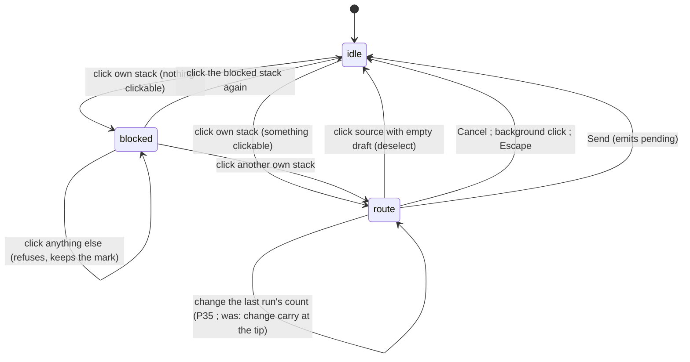

# ray-run-input — draft a route from straight runs, then send

**Packet:** [P34 — Ray-run route input](../../design/packets/P34-ray-run-input.md)
**SPEC:** §4 turn structure (read), §3 allowance (read), §5 sentries + interaction line (**one prose edit**)
**Layer:** `packages/web` only. Does not touch `rules-core`, contracts DTOs, `Move`, or ADR 0002.
**Features:** [core](./ray-run-input.core.feature) ·
[edge cases](./ray-run-input.edge-cases.feature)

## Purpose

A stack big enough to walk three or more steps has several equally short routes
to the same arrow, and the adapter picks one by `outArrows` iteration order — so
the player commits to a trail they did not author. Because a trail is what
closure, cuttability and crossings are computed from (§5–§7), the route *is* the
move, and choosing it by iteration order is choosing the move by accident.

This feature replaces destination-picking with **route-drafting**. Select a
stack, and the three **rays** light up. Click along a ray to append a **run** to
a drafted route. Repeat from the new tip. **Send** commits. Nothing touches the
board until Send, and every arrow of the route was named by a click — so no
route is ever chosen by the engine and the ambiguity has nowhere to live.

## Scope

In: a pure helper `packages/web/src/route.ts`; a `route` input phase replacing
`portion` in `input/modes.ts`; a carry control at the tip (**docked below the
board by P35**); Board paint of
the three tiers; Hud hint copy; the SPEC §5 interaction-line edit. Tests against
the helper + the input mode, against both `GeometryPort` implementations (same
posture as `selectionChrome` / `input.test.ts`). No RTL.

Out: `rules-core`, contracts, `Move`, `speed(N)`, what is legal to send; in-turn
undo; a numeric price ruler on the ray; drag-to-draw; keyboard route entry; bot
move generation; P30 playback pacing.

## Terms

| Term | Means |
|---|---|
| **slot** | an index into `outArrows(point)` — 0, 1 or 2 |
| **run** | one straight leg: `k` steps taken through the same slot |
| **ray** | the arrows reachable from the tip through one slot, in order, truncated |
| **ray arrow** | an arrow on a ray — route word `s^m` |
| **turn arrow** | a one-step turn off a ray arrow — route word `s^m·e`, `e ≠ s` |
| **clickable set** | ray arrows ∪ turn arrows; provably the unique-route set |
| **tip** | the last arrow of the draft, or the source when the draft is empty |
| **carry** | heads travelling from the tip; heads left behind are the sentry (§5) |
| **draft** | the route so far — an ordered list of `step` moves, applied to nothing |
| **send** | emit the draft as `pending`; the host applies it as a batch |
| **pop** | clicking a drafted arrow, discarding the draft after it |

Do not say *destination*, *portion dialog*, or *plan*. There is no destination
phase, no modal, and no chosen plan.

## Why the clickable set is exactly this (normative justification)

`OUT_DIRECTIONS` gives each point three out-arrows, 120° apart, summing to zero,
so a route is a **word over three slots**. Because the three sum to zero, a word
using all three returns to the same point (that is the girth-3 cycle), so a
shortest route's **prefix** uses at most two distinct slots. A destination is an
*arrow* — (origin point, grain) — so the destination fixes the word's **last**
letter and leaves the prefix's letters orderable.

> **Routes to a destination = orderings of the route word's prefix**, count
> `C(n−1, a)`.

Measured on the generated tiling this predicts every observed count exactly:
distance 2 → 1, 3 → up to 2, 4 → up to 3, 5 → up to 6, 6 → up to 10. **Ambiguity
begins at distance 3** — a 4-stack — not at 8 heads.

The characterisation the clickable set is built from, verified against 138
destinations to depth 6 with zero disagreement:

> **A destination has exactly one route iff its route word is `s^m` or `s^m·e`** —
> straight along one slot, then optionally one turn at the end.

There are exactly **9** such destinations at every distance ≥ 2 (3 slots × 3
final turns). Two consequences that must not be re-derived in code:

- Everything within 2 steps is unique-route, because its word is `s·e` — a
  prefix of length 1 has one ordering. **There is therefore no `remaining ≤ 2`
  special case to write.** The general rule already covers it.
- Click count equals the number of runs in the word, so clicking rays is
  run-length encoding of the route. Straight is one click, a dogleg is two. Of
  the three routes to a given distance-4 arrow — `ddee`, `dede`, `edde` — the
  costs are 2, 4 and 3 clicks: the common intent is the cheapest.

## A ray is "keep the same slot"

`GeometryPort` exposes no grain accessor, and this feature adds none. It does not
need one: `outArrows(point)` is ordered, stably, by contract, and the generated
tiling maps `DIRECTIONS` through that order, so `outArrows(point)[k]` **is** the
arrow of grain `k`. A ray is therefore *keep taking the same slot*, and on the
tiling that is exactly a straight line — `pointPosition` is `world(i, j)`, linear
in the lattice, so a constant-slot walk is exactly collinear on screen and the
three rays sit 120° apart.

On an abstract fixture board a slot carries no geometry, and "same slot" is
merely a stable, consistent walk. That is fine and deliberate: the *rule* is
slot-consistency, testable on either implementation, and the *straightness* is a
tiling property asserted by the tiling/layout suites, not by this feature's tests.

## Route construction (normative)

```
rayArrows(geometry, rules, scratch, tip, slot, carry, bound):
  out = []
  at = tip
  state = scratch
  for m in 1..bound:
    exit = geometry.outArrows(geometry.target(at))[slot]
    if exit is already in out, or in the draft's walked arrows: stop
    next = try rules.apply(state, step(at, exit, carry)) else stop
    out.push({ arrow: exit, steps: out.steps + [exit] })
    if terminal(state, next, exit): stop             # merge / closure / combat
    at = exit; state = next
  return out

terminal(before, after, exit):
  return before.groups.get(exit) is owned by the active player   # merge (§3)
      or after.territory is larger than before.territory         # closure (§7)
      or head counts changed on exit or on the arrow stepped from # combat (§6.2)

clickableSet(geometry, rules, scratch, tip, carry, bound):
  set = {}
  for slot in 0..2:
    ray = rayArrows(..., slot, ...)
    for each rayArrow at index m:
      set[rayArrow] = { kind: ray, slot, steps: s^(m+1) }
      for turnSlot in 0..2 where turnSlot ≠ slot:
        turnExit = geometry.outArrows(geometry.target(rayArrow))[turnSlot]
        if rules.apply(stateAfterRay, step(rayArrow, turnExit, carry)) succeeds
           and turnExit is not already keyed by a shorter route:
          set[turnExit] = { kind: turn, slot, steps: s^(m+1) + [turnExit] }
  return set
```

- **Measured, never derived.** Every hop is offered only because `rules.apply`
  accepted it on a scratch state, exactly as `reach.ts` already does. `speed()`
  bounds the search; the engine decides every step. An adapter that recomputed
  allowance here would drift the moment a rule moved.
- **A ray stops** at the first hop the engine refuses: enemy territory without
  territory-grade protection (§6.3), a P28 refused self-convert exit, allowance
  running out, an attack the stay-behind rule forbids (below), and a revisit.
- **A ray also stops at a terminal step** — one the engine *accepts* but whose
  effect the un-applied draft cannot show (below).
- **A painted ray never extends past its stop.** A click past it refuses.

### The stay-behind rule bounds where a run can attack

§6.2 and §11 item 38: an attack may not empty the arrow it comes from —
`count ≤ heads − 1`, and a lone head cannot attack. A run moves the **whole**
carry, so after its first hop the tip holds exactly the carry and `count = heads`
there. Therefore:

- **A ray stops *before* an arrow holding enemy heads at distance ≥ 2.** A
  mid-route attack is not a rule this feature may work around; it is refused, and
  the ray ends at the last arrow before it.
- ~~**An enemy-held arrow one step from the tip is offered only when
  `carry ≤ tipHeads − 1`** — that is, only when the player has left a sentry
  behind. Raising the carry to every head at the tip withdraws the offer.~~ —
  **superseded by P35.** The offer itself walks the run at `heads` *and* at
  `heads − 1`, so the arrow is always offered and the count control chooses the
  sentry rather than unlocking the attack.

~~This is not a limitation to route around, it is the rule surfacing where the
player can act on it: **the carry control is also how an attack is armed.** When
an adjacent enemy arrow is unofferable *only* because of the stay-behind, the
refusal says so — new `RefusalReason` `needs-stay-behind`, text
`An attack must leave a head behind`.~~ — **superseded by P35.** The *offer*
arms the attack; the control only sizes the sentry. `needs-stay-behind` is
**retired**: with the attack armed before the click, its only remaining triggers
were a terminal tip and a draft at `MAX_DEPTH`, where no count would make the
arrow clickable and the message would have been a lie. Those fall through to
`out-of-reach`.

### Terminal steps end the draft, not just the run

A draft is not applied, so the board on screen is the board *before* the draft.
Three accepted hops change that board so much that any further leg would be
drafted against ground the player cannot see:

| Terminal step | Observed as | Why the draft cannot continue |
|---|---|---|
| **merge** into the active player's own group (§3) | the arrow held a group of the active player before the hop | the carry stops being separable; the merged stack's allowance is a different group's |
| **closure** claiming ground (§7) | `state.territory` grew across the hop | the trail is wiped and territory claimed — the arrows a later leg would cross no longer mean what they meant |
| **combat** resolving (§6.2) | head counts changed on the destination or the source across the hop | contact resolves to a wipe inside one `apply`; heads on both sides are gone |

At a terminal tip the clickable set is **empty**: Send or pop, nothing else. The
draft is still un-applied and a pop still discards it, so nothing is lost — the
player sends, sees the new board, and drafts again with whatever allowance
remains.

**Detected by comparing the scratch state before and after the hop**, never by
reading engine internals. The closure case in particular cannot come from
`try apply … else stop`: the engine *accepts* the hop after a closure lands
(territory grows, the trail clears, the next hop is legal), so the stop is this
feature's own rule and is stated here rather than inferred.
- **Ray-before-turn.** A turn arrow exists only if its whole ray prefix is
  walkable. Shorter routes win: an arrow already keyed at a shorter distance
  keeps that entry.
- **Revisits stop a ray.** An arrow already on the ray or already walked by the
  draft ends the run, so a ray cannot loop on a fixture board with a short cycle.
- **The search bound is a bound, not an authority.** `MAX_DEPTH` minus the draft
  length, and `speed(carry)` may narrow it. Neither is ever the reason a hop is
  legal.

## Phase and transitions (normative)

```
InputPhase =
  | idle
  | blocked { from }                       # unchanged: nothing reachable
  | route  { from, tip, carry, tipHeads, draft: readonly Move[], runLengths: readonly number[] }
  #                                                    ^ carry = the last run's count (P35)
  #                                                                        ^ added by P35
```

`portion` is **removed**. There is no commit dialog.



- **`blocked` is P11's, unchanged.** A stack with nothing clickable keeps its mark
  until it is clicked again or another own stack is picked up; any other click
  refuses `out-of-reach` and leaves the mark standing, so the player is not
  silently un-told which stack is stuck. This packet only changes *what makes* a
  stack blocked — an empty clickable set rather than an empty reach.
- Selecting an own stack enters `route` with an empty draft, `tip = from`,
  `carry = ` every head on `from`, `tipHeads = ` the same. **P35: no count
  control is drawn until a run exists.**
- **Extend**: clicking a clickable arrow appends that option's `steps` to the
  draft as `step` moves at ~~the current carry~~ **the largest count that walks
  the run (P35)**, moves the tip there, and sets
  `tipHeads` from the scratch state after the draft (so combat losses show).
- **Pop**: clicking an arrow the draft walks truncates the draft to the prefix
  ending at that arrow, which becomes the tip. Popping to the source leaves an
  **empty draft in `route`**, not `idle`.
- **Deselect**: clicking the source with an already-empty draft returns to
  `idle` — today's idiom, unchanged.
- **Send** sets `pending` to the draft, in order, and returns to `idle`.
  **Cancel**, background click and Escape discard the draft and return to `idle`.
- Anything else refuses through the existing `RefusalReason` path (P11 Event 11):
  `not-yours` when nothing is selected and the arrow is not yours,
  `out-of-reach` for a reachable-but-not-clickable arrow and for a click past a
  ray's stop.
- `requestEndTurn` behaves as today. (`requestSkip` was the other control here;
  P51 deleted it with the move kind it sent.)

## Carry (normative) — **largely superseded by P35**

P35 inverted the order in which a route's two questions are asked. This section
is kept for the reasoning it records; where a bullet is struck through, the live
rule is in `docs/spec/count-after-route/count-after-route.md`.

- ~~`carry` defaults to **every head standing on the tip** and is chosen **at the
  tip, forward only**.~~ — **superseded.** A run is drafted at the largest count
  that walks it, and the count is chosen *after* the click.
- Changing the count recomputes the clickable set, so the rays lengthen and shorten
  live. That repaint is how the player learns that distance is bought with heads
  (§3); no numeral is needed to say it. *(Still true.)*
- ~~Offerable carries are those that can make at least one hop from the tip,
  measured by simulation — the same posture as `reach.ts`'s `minCount` /
  `maxCount`. A carry that cannot move is never offerable.~~ — **superseded:**
  measured over the **whole last run**, not one hop (`runCarries`). Still by
  simulation, never from `speed`.
- ~~A carry change **never** rewrites an already-drafted leg. Retroactive splitting
  would silently trim a drawn tail: 8 heads that walked 2 steps and then drop to
  4 have `speed(4) = 3` with 2 spent, so 1 step left rather than 2. Forward-only
  loses no expressiveness, because any split pattern is expressible in walk order.~~
  — **superseded:** the count rewrites the **last run** and leaves every *earlier*
  run byte-identical. The trimmed-tail worry does not arise, because the run being
  rewritten is the last one and has no tail. Runs before it are still immutable,
  which is the part of this reasoning that survived.
- Heads not carried stay behind and are the sentry (§5). There is no drop
  action and no pickup action. *(Still true — and because each run keeps its own
  count, a lower count on a later run leaves a sentry mid-route.)*
- ~~**The carry also arms an attack.** §6.2's stay-behind means an enemy-held arrow
  adjacent to the tip is offerable only while `carry ≤ tipHeads − 1`. Lowering the
  carry adds that arrow to the clickable set; raising it to every head removes it.~~
  — **superseded:** the *offer* arms the attack by walking at `heads − 1` as well
  as `heads`; the control sizes the sentry.

## Paint (normative)

Three tiers, quietest first, plus the tip.

```
routePaint({ phase, hoverArrow, pointer }):
  if phase.kind is not route:
    return { reachWash: {}, rayArrows: {}, turnArrows: {}, draftArrows: {},
             hoverPreview: {}, tip: undefined }

  reachWash    = every arrow the carry could reach this turn (reach.ts), minus
                 rayArrows, turnArrows, draftArrows and the tip
  rayArrows    = clickable set entries of kind ray
  turnArrows   = clickable set entries of kind turn
  draftArrows  = arrows the draft walks, in order
  tip          = phase.tip
  hoverPreview = if pointer is fine and hoverArrow is in the clickable set:
                   the clickable set that would apply from hoverArrow
                 else: {}
```

- `reachWash` is present so a smaller *clickable* set never reads as a smaller
  *reach*. It sits at P31's quiet floor.
- `rayArrows` is the primary mark — a continuous lit spine per slot.
  `turnArrows` are subordinate to their ray, never full ray weight.
- `draftArrows` is the strongest mark and reads as the trail it will become.
- Coarse pointer produces no `hoverPreview`. The model needs none: every
  clickable arrow is unambiguous, so there is nothing a preview must disclose.
- P28's refused wash, P29's match-over drop and P31's selected halo are unchanged.
  Match-over still drops all of this chrome.

Locked HUD strings:

- empty draft: `Click along a ray to walk straight · one turn at the end is free`
- non-empty draft, something still clickable:
  `Click to extend · click a walked arrow to go back · Send when ready`
- non-empty draft, **nothing clickable** — allowance spent, or the last step was
  terminal: `This run can go no further · click a walked arrow to go back · Send when ready`

The third string exists because the first browser pass found the second one
claiming "click to extend" at a tip with an empty clickable set. A player hunts
for a ray that is not there and concludes the rays are broken — the same class of
small lie this feature exists to remove, so it is not cosmetic.

## Performance

The clickable set is built **once per selection, per extend, per pop and per
carry change** — never per hover. `MAX_DEPTH = 8` bounds it at `3^8` walks worst
case and `3^6 = 729` for any stack the game produces, so hover is a lookup into
an already-built map. Hover lag is what would make this model feel broken.

## SPEC.md edit

§5's closing line currently reads *"The interaction model is Galcon-like: pick a
source arrow, pick a destination, send a portion."* It is replaced by the
drafting model, stating that a **move is still one portion, one step, one arrow**
so §4's rules model is untouched. Nothing else in SPEC.md changes, and no §11
item opens or closes. A game-rule gap found downstream is an escalate, not a
decision.

## Invariants

- The system shall offer a hop only after `rules.apply` accepted it on a scratch state.
- The system shall paint no ray arrow beyond the first hop the engine refuses or the first terminal step.
- The system shall end a ray before an arrow holding enemy heads at a distance of two or more from the tip.
- ~~While the carry equals the head count at the tip, the system shall not offer an arrow holding enemy heads.~~ — **superseded by P35.** There is no carry before a click any more, and the offer walks the run at `heads` *and* at `heads − 1`, so an adjacent enemy arrow is offered and the count control is what chooses the sentry. See `docs/spec/count-after-route/count-after-route.md`, *Full strength is not every head*.
- When a hop merges, closes, or resolves combat, the system shall offer nothing further from that tip.
- ~~If an adjacent enemy-held arrow is unofferable only because an attack would empty the tip, then the system shall refuse it with `needs-stay-behind`.~~ — **superseded by P35: the reason is retired.** The ordinary case is armed by the offer rather than refused, and the only states left were a draft at `MAX_DEPTH` and a terminal tip — where no count makes the arrow clickable, so "an attack must leave a head behind" would have been a lie. Those refuse with `out-of-reach`.
- While in the route phase, the system shall apply nothing to the game state until Send.
- The system shall include an arrow in the clickable set if and only if exactly one shortest route reaches it from the tip.
- The system shall present exactly nine clickable arrows at each distance of two or more, when no ray is truncated.
- The system shall key an arrow reachable by both a ray and a turn to the shorter route.
- The system shall end a run at an arrow already walked by the ray or by the draft.
- When the draft is sent, the system shall emit its moves in draft order and no others.
- When a drafted arrow is clicked, the system shall discard every move after it and no move before it.
- ~~When the carry changes, the system shall leave every already-drafted move unchanged.~~ — **superseded by P35:** the count now rewrites the **last run** and leaves every *earlier* run unchanged. See `count-after-route.md` invariants 8–9.
- If a click names an arrow that is reachable but not clickable, then the system shall refuse it with `out-of-reach` and apply nothing.
- The system shall derive the tip's head count from the state after the draft, not from the carry.
- Equal state, tip, carry and draft shall produce an equal clickable set and equal paint.
- While the draft is non-empty and nothing is clickable, the system shall show the run-can-go-no-further hint rather than the extend hint.
- The system shall consult no clock and no randomness in `route.ts`.
- The system shall build the clickable set once per selection, extend, pop or carry change, and not per hover.

## Counts

Scenarios: 38 core + 48 edge-case headers, the latter expanding to 52 cases (two
`Scenario Outline`s carry 3 examples each) = **90 cases**. Invariants: **21**.
The feature files are the contract; this tally is a convenience and has trailed
them twice — the 38th core scenario is the *run can go no further* hint, added
after the first browser pass.

## BSSN recorded here

- **Ray = same out-slot**, not a new `GeometryPort` accessor. Slot order is
  already stable by contract and is grain on the tiling; adding a grain accessor
  would be a contracts change the packet puts out of scope.
- **No `remaining ≤ 2` branch.** The unique-route characterisation subsumes it.
- **Carry is forward-only at the tip**, resolving the packet's note that a
  retroactive split invalidates the drafted tail.
- **`remaining` is not displayed.** The ray's length is the display, so no
  numeral can disagree with the painted rays.
- **`portion` phase and the modal are removed**, not skinned. A modal backdrop
  over the board being drawn on is the wrong shape. `PortionSlider` is deleted if
  nothing references it after the change; the online path is checked first.
- **`reach.ts` stays** as the faint tier and the simulation precedent. Its
  `plans` map is no longer consulted for route choice — that is the behaviour
  being removed.

### Ratified in phase 1 after phase 2 raised them

Phase 2 could not write tests without resolving these, resolved them by reading,
and kicked them back. All five readings stand and are now the contract:

- **The offer lives on the phase.** `route` carries
  `offer: RouteOffer { rays, clickable, carries, reachWash, previews }`, built
  once per selection / extend / pop / carry change. `routePaint` cannot be pure
  without it, and it is what makes "built once per change, not per hover"
  assertable — a hover must cost zero `rules.apply` calls.
- **`reachWash`** is the `reach.ts` entries holding a plan for *exactly* the
  current carry, measured from the tip, minus the louder tiers and the tip.
- **The source is never clickable.** `walkedArrows` includes `from`, so a
  slot-walk that re-enters the source ends there. Clicking the source is a
  deselect (empty draft) or a pop; `reach.ts`'s `withoutSource` is the P11
  precedent.
- **No turn arrow off the last ray arrow** — it would be one step past the
  bound. This is why a four-step reach offers 18 turn arrows and not 24.
- **The tip's head count always comes from the state after the draft**, never
  from the carry that was sent: a merge grew it, combat shrank it, and `tipHeads`
  reports what the engine says is standing there.
  The **carry** after an extend is the previous carry, *clamped* to `tipHeads`
  (`input/modes.ts`'s `enterRoute`). On an ordinary hop the two are the same
  number, because the whole carry arrives. They differ only where the hop was
  terminal, and then the carry is inert — a terminal tip offers no arrow and no
  other carry, so this is a display choice, not a rule. Clamping rather than
  raising is the conservative half of it: heads a **merge** added belong to the
  group that was merged into, whose allowance is a different group's (§3).
  Edge case *Popping restores the tip head count from the state after the shorter
  draft* pins the pair — `tipHeads` 11 with a carry of 8.

### Kicked back by phase 2 and fixed here

- **Enemy heads.** The old clause said a ray "ends *at*" an enemy arrow. Wrong:
  §11 item 38's stay-behind refuses every mid-route attack, so a ray ends
  *before* one at distance ≥ 2, and an adjacent one is offerable only while the
  carry leaves a sentry. See *The stay-behind rule* above.
- **Closure.** The old clause put the closure stop in the prose but not the
  normative construction, and the engine does not refuse the hop after a closure
  lands. It is now an explicit **terminal step** with a stated detection rule.
- **A route losing heads to combat on its third step is unconstructible** for the
  stay-behind reason, so the popping scenario that used it now uses a **merge** on
  the second step. The invariant it protects — the tip's head count comes from the
  state after the draft — is unchanged.
