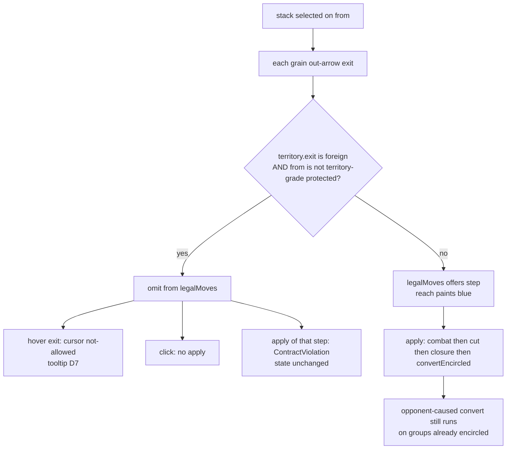

# refuse-self-convert — illegal self-inflicted conversion

**Packet:** [P28 — Refuse self-convert](../../design/packets/P28-refuse-self-convert.md)
**SPEC:** §6.3 (legality clause), §4 (refused steps), §6.1 (grades), §11 item 43
**Amends:** [encirclement](../encirclement/encirclement.md) (predicate kept;
self-walk-in is now illegal rather than converting) ·
[movement](../movement/movement.md) (`legalMoves` ⊆ `apply`) ·
[trails](../trails/trails.md) (enemy-territory mark remains a *protected* raid)
**Features:** [core](./refuse-self-convert.core.feature) ·
[edge cases](./refuse-self-convert.edge-cases.feature)

## Purpose

Playtest: a stack on **marked trail** (stack-grade or dormant component — thin
fill, no path to own closed territory) took one grain step onto **enemy
territory** (solid fill). Conversion ran on that same `apply`. The stack flipped
owner intact (§6.3 / §11 item 9). The player read trail paint as protection.

Nobody chooses that step if they can read it. It is not a tactic. This packet
stops **self-inflicted** conversion on the mover's own step. Opponent-caused
conversion (close around a garrison; cut a raider's umbilical while they are
already inside) **stays**.

## Scope

In: `legalMoves` omits self-convert steps; `apply` throws before occupancy
write; web refused-target paint + locked tooltip on the grain-adjacent `exit`.

Out: a second trail fill; changing the §6.3 *predicate*;
territory combat modifiers; a reasons enum on `RulesPort`; online protocol.

Tests: rules against `RulesPort` on fixture boards (authored territory — no
fill required). Web against a **pure helper** (`packages/web/src/refusedConvert.ts`
or equivalent). No React Testing Library. No new port method (D10).

## Terms

| Term | Means |
|---|---|
| **self-convert step** | a grain step whose `exit` is another player's **territory** and whose mover is not territory-grade protected from `from` |
| **territory-grade protected** | `from` is the mover's territory, **or** `from` is in the mover's trail and `anchorGrade(state, from, mover) === 'territory'` |
| **refused target** | that grain-adjacent `exit` while the stack on `from` is selected — visible, not clickable |
| **convert tooltip** | exact string `Would convert. This is their territory, and you have no trail home.` |

*arrow, trail, territory, head, stack, anchor, territory grade, stack grade,
dormant, encircled, convert* keep their AGENTS.md meanings. Do not say
*surrounded* in player-facing copy. One enemy territory arrow is enough.

## Protection predicate (normative)

```
isSelfConvertStep(state, from, exit, mover):
  land = state.territory.get(exit)
  if land is missing OR land == mover: return false
  if state.territory.get(from) == mover: return false
  trail = state.trails.get(mover)
  if trail has from AND anchorGrade(state, from, mover) == 'territory': return false
  return true
```

`legalMoves` skips `step(from, exit, count)` when this is true.
`apply(step)` throws `ContractViolation` when this is true, with the **stable**
message:

```
step onto enemy territory without a territory-grade trail would convert
```

Protection is read off `from` **before** the step. No combat simulation: if
`exit` is enemy territory and the mover is not protected, the step is illegal
including attacks. Check this **before** resolving a battle.

## Flow



## Adapter (web)

A pure helper lists grain outs of the selected `from` for which
`isSelfConvertStep` is true (via `territory`, `trails`, and `anchorGrade` —
already on the ports). Board paints those arrows as refused (quiet wash;
`TOLL_REACH_FILL` is leftover withdrawn-toll pink — reuse the colour, not the
copy), sets `cursor: not-allowed`, and shows the convert tooltip on hover
(same flip-rather-than-clamp placement as `SpawnerTip`). Click is a no-op:
no portion picker, no `apply`.

`reachFrom` already swallows `apply` throws — suicide destinations drop out of
blue reach with no reach rewrite. Distant unmarked enemy territory stays
ordinary non-reach. Convert tooltip wins over spawner hover on a refused
target. No tooltip when no stack is selected.

HUD help may mention the refusal in one clause; the tooltip string stays
locked. No "illegal move." prefix. No "surrounded" / "encircled" in the
player-facing string.

## Invariants

- When `exit` is another player's territory and the mover is not territory-grade
  protected from `from`, the system shall omit every `step(from, exit, count)`
  from `legalMoves`.
- When such a step is applied, the system shall refuse with `ContractViolation`
  and shall not mutate occupancy, trails, territory, or owners.
- While `from` is the mover's territory, or is on the mover's territory-grade
  trail, the system shall offer grain steps onto foreign territory (raid).
- When `exit` has no territory owner, the system shall not refuse the step for
  this reason (stack-grade on neutral remains legal).
- When `exit` is the mover's own territory, the system shall not refuse the
  step for this reason.
- When an opponent's apply claims a tile under an unprotected group, or cuts
  that group's last territory-grade path while they stand on foreign territory,
  the system shall still convert that group intact (§6.3).
- The system shall convert only inside a step: a turn in which nothing stepped
  converts nothing (P51).
- The system shall refuse a self-convert step before combat, so a contact fight
  cannot land and then convert the attacker.
- Everything `legalMoves` offers, `apply` shall accept.
- The system shall not mutate the input state, and shall return equal outputs
  for equal inputs. Equal illegal inputs shall throw equal `ContractViolation`
  messages.
- The system shall enumerate no vertex — **unchanged by P37**, for the part this packet owns: listing moves and refusing a self-convert never reach loss resolution, so their zero stays hard. A *permitted* move on the same board does reach it, and is measured as a delta over an idle move — as in `closure` and `cuts`. (`fill` keeps a hard zero — it is measured on `enclosedBy`, which never reaches resolution.) See `docs/spec/immediate-loss/immediate-loss.md`.
- When a stack on `from` is selected, the system shall present each
  grain-adjacent self-convert `exit` as a refused target with cursor
  `not-allowed` and the locked convert tooltip, and shall not apply a click.

## What this file deliberately does not decide

- A second trail fill for territory-grade vs stack-grade.
- Territory combat modifiers — §11 item 39.
- Changing conversion *effects* (intact stacks, `spent` reset, convert wipe — P33).
