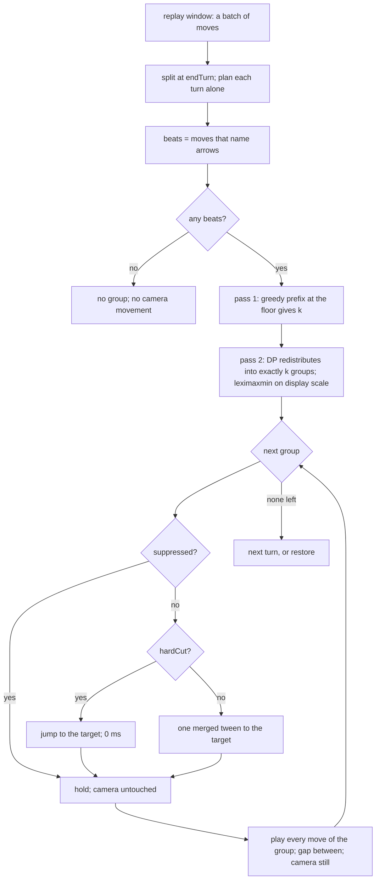
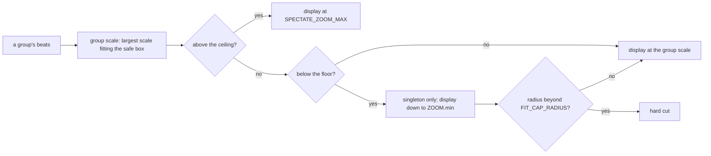

# spectated-camera-grouping — one camera movement per run of moves

**Packet:** [P52 — Spectated camera grouping](../../design/packets/P52-spectated-camera-grouping.md)
**SPEC:** none. **No game rule is touched, read, or implied.** This is presentation.
**Supersedes:** the per-move choreography of
[P48](../spectated-turn-camera/spectated-turn-camera.md) — `hopTargets`, the
bridging fit, and the per-move close fit.
**Layer:** `packages/web` only — `spectate.ts` gains the grouping, `App.tsx`
plays groups instead of hops. No `contracts`, no `rules-core`, no online change.
**Features:** [core](./spectated-camera-grouping.core.feature) · [edge cases](./spectated-camera-grouping.edge-cases.feature)

## Purpose

P48 gives every replayed move its own camera beat. Across a turn of short steps
in one neighbourhood — the common case — the camera dribbles small pans and
re-zooms between moves that were already on screen before it moved. The motion
carries no information and the board never settles.

This feature replaces the per-move beat with a **camera group**: a run of
consecutive moves framed once and played with the camera perfectly still. The
number of camera movements per turn is the minimum the safe box allows, and the
moves are then redistributed across that many groups so no group is framed
worse than it has to be.

Nothing here changes which moves apply, their order, or the resulting
`GameState`.

## Terms

| Term | Means |
|---|---|
| **camera group** | a maximal run of consecutive moves by one seat, within one turn, framed in a single shot |
| **beat** | the lattice points one hoppable move asks to be seen: its `from` and its `exit` centroids |
| **safe box** | the centred fraction `SAFE_BOX` of each viewport dimension that a group's beats must fit inside |
| **group scale** | the largest scale at which a group's beats all fit the safe box |
| **display scale** | the group scale after the display clamps — what the camera actually uses |
| **floor** | `SPECTATE_ZOOM_MIN`; how far out grouping will zoom to *collect* moves |
| **ceiling** | `SPECTATE_ZOOM_MAX`; how far in a tight group may punch |
| **k** | the number of camera movements one turn costs |
| **suppression** | declining to move at all because the next group's target is indistinguishable from the current camera |
| **turn boundary** | the seam between two turns, marked by `endTurn` |

*arrow*, *stack*, *head*, *trail*, *point* keep their AGENTS.md meanings. This
feature reads arrows only as **places to look at**.

## Module boundary (normative)

`packages/web/src/spectate.ts` stays **pure**: no clock, no `rAF`, no DOM, no
`localStorage`, no layout import. Every function below is total and deterministic.

**D1 (inherited from P48) still holds:** the pure module speaks lattice points.
**D2 — grouping speaks beats, not `Move`s.** `planGroups` takes the *points* of
each hoppable move and returns index ranges into that list. It therefore never
needs `Move`, `ArrowId`, `SeatKind`, or a centroid function, and a test can
express a whole turn as a list of point pairs. App maps `Move → Pt[]` through
`arrowsOfMove` + `arrowCentroid` exactly as it does today.

**D3 — the seat never reaches the pure module.** Grouping never spans a turn,
and a turn never spans a seat, so splitting at `endTurn` already enforces the
seat rule. `planGroups` is called once per turn and has no seat parameter.

```ts
export const SPECTATE_ZOOM_MIN = 30;      // floor: how far out to collect
export const SPECTATE_ZOOM_MAX = 56;      // ceiling: how far in to punch
export const SAFE_BOX = 0.72;             // fraction of each viewport dimension
export const GROUP_MOVE_PAN_EPS = 0.04;   // suppression: fraction of the shorter side
export const GROUP_MOVE_SCALE_EPS = 0.03; // suppression: scale ratio

export interface CameraGroup {
  readonly from: number;          // inclusive index into the beats
  readonly to: number;            // exclusive
  readonly target: CameraTarget;
  readonly hardCut: boolean;
}

turnRanges(moves: readonly Move[]): readonly { readonly from: number; readonly to: number }[]
splitTurns(moves: readonly Move[]): readonly (readonly Move[])[]   // = turnRanges().map(slice)
groupScale(points: readonly Pt[], viewport: Viewport): number
groupTarget(points: readonly Pt[], viewport: Viewport): { target: CameraTarget; hardCut: boolean }
planGroups(beats: readonly (readonly Pt[])[], viewport: Viewport): readonly CameraGroup[]
suppressed(current: CameraTarget, next: CameraTarget, viewport: Viewport): boolean
groupTiming(args: { speed: number; boundary: boolean; reducedMotion: boolean }):
  { moveMs: number; holdMs: number; gapMs: number }
```

`hopTargets` and `Hop` are **deleted**. `fitViewport`, `boundsOf`,
`arrowsOfMove`, `focusArrow`, `restoreTarget`, `clampSpeed`, `isSpectatedSeat`,
`cameraLocked`, `FIT_PADDING`, `FIT_CAP_RADIUS`, `BASE_TIMING` survive unchanged.
`hopTiming` is replaced by `groupTiming`.

## Segmentation (normative)

```
splitTurns(moves):
  split after every endTurn; a trailing run with no endTurn is its own turn
```

- A replay window may carry several turns. Each is planned **separately**.
- **D17 — the segmentation has one implementation and two shapes.**
  `turnRanges` is the index form; `splitTurns` is its `slice`. A consumer that
  must line cues up against the original move list uses the ranges, so nothing
  downstream ever recovers a position by comparing `Move` values — an identity
  comparison on a value type in the determinism-critical path is a defect waiting
  to happen, not a style choice.
- **D15 — `splitTurns` never emits an empty turn.** A window ending in `endTurn`
  yields no trailing empty run, and a window of nothing but `endTurn` yields no
  turn at all. A turn with no beats is indistinguishable from no turn, and the
  plan for either is the same: nothing. The same holds for a *leading* lone
  `endTurn`, which the server cannot produce but which costs nothing to define:
  a run that names no arrow is dropped, wherever it sits.
- Never group across a **turn** boundary, including the same seat's consecutive
  turns — a mobile seat while the others live only on spawner shares still gets
  a fresh camera beat per turn.
- Never group across a **seat** boundary. Implied by the above (D3).
- A turn can never straddle a batch: `game-handlers.ts` force-appends an
  `endTurn()` when a submission leaves the seat still to move, so every persisted
  version is a whole turn. **D4 — planning per batch is therefore planning per
  turn**, with no buffering and no added latency.
- Only moves with a non-empty `arrowsOfMove` become beats. `endTurn` names no
  arrows and contributes nothing to any group's bounds.
- A turn whose beats are empty produces **no group** and no camera movement.

## Fitting (normative)

```
groupScale(points, viewport):
  b     = boundsOf(points)
  halfW = (b.maxX - b.minX) / 2 + FIT_PADDING
  halfH = (b.maxY - b.minY) / 2 + FIT_PADDING
  return min(SAFE_BOX * viewport.width  / (2 * halfW),
             SAFE_BOX * viewport.height / (2 * halfH))

groupTarget(points, viewport):
  target = { cx: midX, cy: midY, scale: clampZoom(min(groupScale(points, viewport), SPECTATE_ZOOM_MAX)) }
  hardCut = hypot(halfW, halfH) > FIT_CAP_RADIUS
```

`clampZoom` is `viewport.ts`'s, so the display scale is always within the global
`[ZOOM.min = 24, ZOOM.max = 96]`. `FIT_PADDING > 0` keeps a zero-extent bounds
well defined, so a single-point beat is not a division by zero.

**D5 — the floor governs collection, not display.** `groupTarget` clamps against
the ceiling and the *global* floor, never against `SPECTATE_ZOOM_MIN`. A
singleton group whose own move cannot fit the safe box at the floor therefore
zooms out past 30, down to 24, rather than cropping a move the camera had no
choice about showing. Past `FIT_CAP_RADIUS` the P48 hard cut still applies.

**D6 — the safe box is applied to the fit, not to the assertion.** A group's
beats fit inside `SAFE_BOX` of the viewport whenever the group was feasible;
for an infeasible singleton they may fill more, which is the point of D5.

## Choosing the groups (normative)

Two passes over one turn's beats, in this order.

### Pass 1 — `k`, the number of camera movements

```
feasible(from, to) = groupScale(beats[from..to), viewport) >= SPECTATE_ZOOM_MIN

k = greedy prefix count:
  i = 0; k = 0
  while i < n:
    j = i + 1
    while j < n and feasible(i, j + 1): j = j + 1
    k = k + 1; i = j
```

The first move of a run is always admitted even when infeasible alone, so a
group is never empty and `k <= n`.

**D7 — greedy is optimal for `k`, and only for `k`.** The fit predicate is
monotone (a union's bounds only grow as beats are admitted), so no contiguous
partition beats a greedy prefix on count. Greedy's *allocation*, however, is
poor: it stuffs the first group until it hits the box at the floor and leaves
the remainder a close-up singleton. Pass 1 therefore contributes nothing but the
number `k`; the membership it computed is discarded.

### Pass 2 — allocation

Partition the `n` beats into **exactly `k`** contiguous non-empty groups
maximising **lexicographic maximin** on display scale: compare two partitions by
their group display scales sorted ascending, lexicographically, larger wins.
That is: raise the worst-framed group first, then the second worst, and so on.

- Balancing may lower the best group's scale to raise the worst. **D8 — that is
  the intended trade**: the badly-framed group is the one the eye complains about.
- **D9 — the score is the *display* scale, so it is capped at the ceiling.** Zoom
  above `SPECTATE_ZOOM_MAX` is worthless on screen, so a group already at the
  ceiling ranks equal to any other capped group and the allocation spends its
  moves on a needier neighbour instead.

  **D9 is a guard, not a live rule at the current spread.** Capping can only flip
  a comparison when the smaller entries of two score vectors tie exactly, and
  while `SPECTATE_ZOOM_MAX / SPECTATE_ZOOM_MIN < 2` (see Open question 5) two
  adjacent groups can never both sit at the ceiling. So no reachable turn is
  currently allocated differently because of the cap, and **no test should claim
  to demonstrate one**: the honest assertion is that a group above the ceiling
  *reports* `SPECTATE_ZOOM_MAX`, which is what invariants 10 and 17 mean. The
  clamp stays because widening the spread past a factor of two would make it live
  overnight, and finding out then would be expensive.
- Splits are contiguous — the camera cannot revisit a neighbourhood it has left —
  so this is a one-dimensional partition with an exact answer, not a clustering
  heuristic. Nothing is re-ordered.
- **D10 — ties break on the earliest split.** Where two candidate splits give
  equal score vectors, the smaller split index wins, evaluated last-split-first.
  The result is a single partition for a given input, never a set of equals.
  So a fully tied turn of `n` beats into `k` groups yields groups of
  `1, 1, …, n - k + 1` — the last group takes the remainder.

  **This is deliberately not an even split.** An even split was considered and
  rejected: it is a second optimisation criterion smuggled in as a tie-break, and
  it buys nothing. A tie means every candidate group is framed at the *same*
  display scale. Group sizes then affect only how long the camera dwells on each
  shot, and where the tied targets are also close, suppression (below) declines
  the movement between them and the split shape is not visible at all. The tie-break exists to make the
  plan single-valued; that is its whole job.
- Groups produced by pass 2 may individually be infeasible at the floor. That is
  allowed and is not a bug: `k` is already minimal, so no reallocation can
  restore feasibility that pass 1 could not.

**D11 — determinism is not optional here even though this is an adapter.** Two
clients watching the same match must see the same choreography, and a replay
must choreograph identically twice. Nothing in the plan may read `Set` or `Map`
iteration order, a clock, or a random source.

## Motion (normative)

For each group in order:

1. If `suppressed(currentCamera, group.target, viewport)`, do not move at all.
2. Otherwise run **one** tween to `group.target` over `moveMs`, or a hard cut
   when `group.hardCut`.
3. Hold: `seatHoldMs` at a turn boundary, `holdMs` otherwise. **D16 — the turn
   boundary is the *first group of every turn*, the first turn of a replay window
   included.** The camera arrives at that first group from the player's own view,
   which is a boundary in P48's sense as much as a seat change is, so it earns the
   same longer hold. Every later group of the same turn holds for `holdMs`.
4. Play the group's moves with `gapMs` between them. **The camera does not move
   again until the next group.**

```
suppressed(current, next, viewport):
  panPx    = hypot(next.cx - current.cx, next.cy - current.cy) * current.scale
  panLimit = GROUP_MOVE_PAN_EPS * min(viewport.width, viewport.height)
  ratio    = max(next.scale / current.scale, current.scale / next.scale)
  return panPx <= panLimit and (ratio - 1) <= GROUP_MOVE_SCALE_EPS
```

- **D12 — no bridge into the first group.** The bridging fit existed to soften
  per-move hops; there are none. One direct tween from wherever the camera stands,
  including the first group of a replay window. The saved camera is still saved
  at that moment, exactly as P48 specifies.
- **D13 — inside a group the camera is still.** Moves land where they fall, some
  near the edge of the safe box, none re-centred. A "gentle re-centre" would be
  the micro-movement this feature exists to remove.
- Suppression is measured against the camera **as it stands**, so a suppressed
  group leaves the camera untouched and the *next* group is measured from that
  same place — suppression never accumulates drift.

## Timing (normative)

```
groupTiming({ speed, boundary, reducedMotion }):
  s = clampSpeed(speed)
  scale(ms) = round(ms / s)
  moveMs    = reducedMotion ? 0 : scale(BASE_TIMING.easeOutMs + BASE_TIMING.easeInMs)
  holdMs    = scale(boundary ? BASE_TIMING.seatHoldMs : BASE_TIMING.holdMs)
  gapMs     = scale(BASE_TIMING.gapMs)
  restoreMs = reducedMotion ? 0 : scale(BASE_TIMING.easeInMs)
```

**D18 — the restore is not a group boundary and does not get the merged tween.**
P48 D8 says the restore runs for `easeInMs`, and P52 does not amend it: the
restore is the camera coming back to the player, not the camera changing shot
inside a turn. `groupTiming` therefore reports both durations, and the restore
keeps `easeInMs` — 300 ms at speed 1, not 560. Merging them would have doubled a
duration nobody asked to change.

**D14 — one merged tween per group boundary.** P48's ease-out and ease-in are
summed into a single duration so the pan reads as one gesture rather than two.
The reading rhythm is untouched: `gapMs`, `holdMs` and `seatHoldMs` keep their
P48 values and their P48 meanings, and `fx/timing.ts` budgets are still not
scaled. P48's D6 (reduced motion zeroes tweens only), D7 (the gap follows the
seat, the camera follows the toggle) and D8 (a hard cut is `0` ms) survive
verbatim.

## Unchanged from P48

The trigger (`isSpectatedSeat`, including P49's online clause), the input lock
(`cameraLocked`, and pause not freeing the camera), the saved camera, the whole
restore including the target-stack chain, the settings panel and `prefs.ts`.
None of it is re-specified here; P48's spec remains normative for all of it.

## Flow





## Invariants (EARS)

1. The system shall plan camera groups for one turn at a time, split at `endTurn`.
2. The system shall never place moves from two different turns in one camera group.
3. The system shall never place moves from two different seats in one camera group.
4. The system shall build beats only from moves that name at least one arrow.
5. When a turn names no arrows, the system shall produce no camera group for it.
6. The camera groups of a turn shall be contiguous, non-empty, in play order, and
   shall together contain every beat of that turn exactly once.
7. The system shall produce exactly as many camera groups as the greedy prefix at
   `SPECTATE_ZOOM_MIN` requires.
8. The system shall produce no partition of a turn's beats into fewer groups than
   it produced.
9. While every beat of a group fits the safe box at the floor, the system shall
   frame that group at a display scale of at least `SPECTATE_ZOOM_MIN`.
10. The system shall never frame a group above `SPECTATE_ZOOM_MAX`.
11. Every display scale the system produces shall lie within `[ZOOM.min, ZOOM.max]`.
12. If a group holds exactly one beat that cannot fit the safe box at the floor,
    then the system shall frame it below `SPECTATE_ZOOM_MIN` rather than crop it.
13. Every group's target shall be centred on the midpoint of that group's beats.
14. If a group's padded half-diagonal exceeds `FIT_CAP_RADIUS`, then the system
    shall hard-cut to its target and shall run no tween.
15. The system shall choose, among all partitions into that many groups, one whose
    display scales sorted ascending are lexicographically greatest.
16. The system shall break ties between equally scored partitions on the earliest
    split index, and shall return exactly one partition for a given input.
17. The system shall score a partition on display scales, so that a group framed
    above `SPECTATE_ZOOM_MAX` shall score exactly `SPECTATE_ZOOM_MAX`. (Per D9
    this is currently unobservable in the *choice* of partition; it is asserted on
    the score, not on an allocation it is claimed to change.)
18. Equal inputs shall yield equal plans, equal targets, and equal timings.
19. The system shall derive no part of a plan from `Set` or `Map` iteration order,
    a clock, or a random source.
20. While a group is playing, the system shall not move the camera.
21. The system shall run at most one camera movement per group.
22. If the next group's target is within `GROUP_MOVE_PAN_EPS` of the current
    camera in pan and `GROUP_MOVE_SCALE_EPS` in scale ratio, then the system shall
    leave the camera exactly where it is.
23. The system shall measure suppression against the camera as it stands, so that
    a suppressed group shall not shift the reference for the next one.
24. The system shall run one tween per group boundary, of the summed P48 ease-out
    and ease-in duration.
25. The system shall keep the P48 move gap, move hold and turn-boundary hold
    unchanged in value and in meaning.
25a. The system shall run the restore for the P48 ease-in duration alone, not for
    the merged group-boundary duration.
26. While `prefers-reduced-motion` is set, the system shall use a zero-length
    group tween and shall still take the camera to every group.
27. The system shall scale the group tween, the hold and the move gap by the
    playback speed together, and shall clamp that speed to `[0.5, 3]`.
28. The system shall apply the same plan to local bot playback and to online
    replay.
29. `spectate.ts` shall reference neither a clock, a random source, nor the DOM.
30. The system shall not alter which moves are applied, their order, or the
    resulting `GameState`.

## Deliberately untested

The rAF tween runner (`cameraTween.ts`) is unchanged and stays a thin clock owner
with no decision in it — every target it interpolates towards is a `spectate.ts`
value. Do not write scenarios that need a frame loop; the feature files are all
pure-module level.

**Known limitation — `spectate.ts` is outside Stryker's reach**, as P48 records.
Invariants 29 and 30 are structural fences that read the module's source text;
under mutation testing they would die for the wrong reason. `mutate[]` covers
`rules-core` only, so nothing is mis-scored today.

## Open after the first play-test

Presentation questions the numbers cannot settle on paper. None is a game rule;
none belongs in SPEC.md §11.

1. Are `SPECTATE_ZOOM_MIN = 30` and `SPECTATE_ZOOM_MAX = 56` the right spread, or
   does a real heuristic turn spend all its time pinned at one of them?
2. Is `SAFE_BOX = 0.72` generous enough that a move near a group's edge still
   reads, on a phone as well as a desktop?
3. Does suppression fire often enough to matter, or are consecutive groups always
   far apart in practice?
4. Does a long still group (a dozen moves, no camera movement) read as calm or as
   frozen?
5. The ceiling and floor are within a factor of two of each other
   (`56 / 30 = 1.87`), which has a structural consequence worth watching: two
   adjacent groups both framed at the ceiling can never occur, because their
   union would still be feasible at the floor and `k` would have collapsed to one.
   That is benign — it simply means a close-up shot is always a shot the turn
   really needed — but if play-testing widens the spread past a factor of two,
   that guarantee goes away.

## Counts

31 scenarios (10 core, 21 edge cases); 30 EARS invariants; 18 decisions
(D1–D18). No SPEC.md §11 item is touched — this feature reads no game rule.
