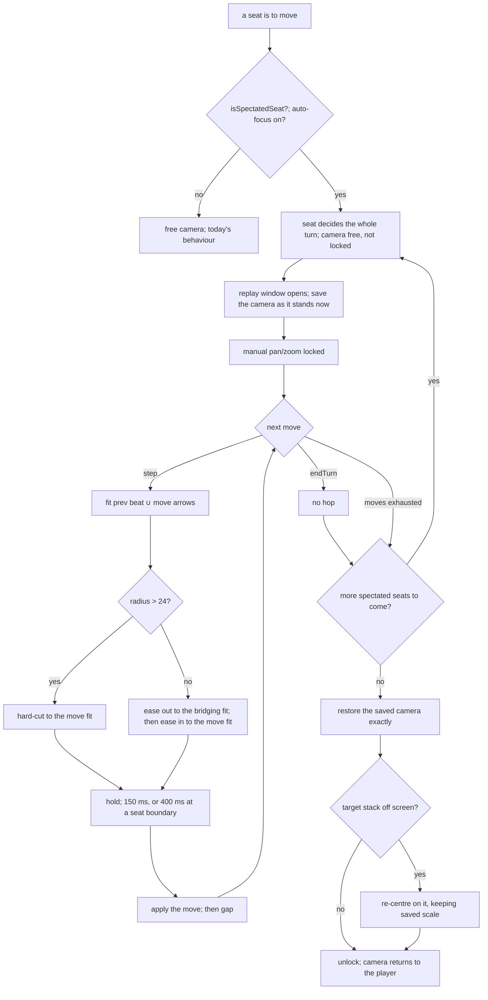
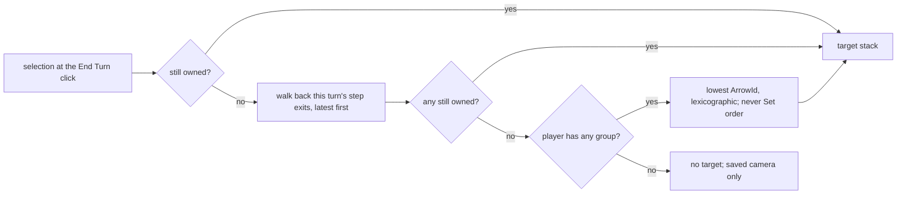

# spectated-turn-camera — the camera follows a turn decided elsewhere

**Packet:** [P48 — Spectated-turn camera](../../design/packets/P48-spectated-turn-camera.md)
**SPEC:** none. **No game rule is touched, read, or implied.** This is presentation.
**Layer:** `packages/web` only — a new pure module `spectate.ts`, a new pure
`prefs.ts`, an `arrowCentroid` export from `App.tsx`, and a rAF tween runner in App.
**Features:** [core](./spectated-turn-camera.core.feature) · [edge cases](./spectated-turn-camera.edge-cases.feature)

> **Amended by P52.** The per-move choreography below — the *hop*, the bridging
> fit, the move fit and `hopTargets` — is ~~normative~~ **resolved**: it is
> replaced by the camera group of
> [spectated-camera-grouping](../spectated-camera-grouping/spectated-camera-grouping.md),
> which frames a run of moves once and holds still while they play. Everything
> else in this document — the trigger, the input lock, the saved camera, the
> restore and its target-stack chain, the settings, reduced motion, and the fit
> formula itself — remains normative and is not restated there.

## Purpose

`applyMovesSequentially` replays a heuristic turn at `BOT_PLAYBACK_GAP_MS` with a
static camera, so an AI seat's turn lands wherever the player happens to be
looking. This feature moves the camera to each move as it plays, then puts the
player back exactly where they were when control returns.

The turn is **already decided** before any camera work begins (`planLocalAiTurn`
resolves the whole turn, then `applyMovesSequentially` replays it). The camera
never watches a decision, only a replay. Nothing here can change a move, a
legality, or an outcome.

## Terms

| Term | Means |
|---|---|
| **spectated seat** | the seat to move is not driven by whoever is at this keyboard |
| **replay window** | first hop of a spectated run to the restore; opens when a spectated seat's decided moves start applying |
| **hop** | the camera work for one move: ease-out to the bridging fit, ease-in to the move, hold, apply |
| **bridging fit** (*wide*) | a viewport fitting the previous beat's arrows ∪ the upcoming move's arrows |
| **move fit** (*close*) | a viewport fitting only the upcoming move's arrows |
| **hard cut** | jump to a target with no tween |
| **seat boundary** | a hop whose previous beat belongs to a different seat than its upcoming move |
| **saved camera** | the viewport as it stands when the replay window opens |
| **target stack** | the arrow the restore nudges to if it is off screen |

*arrow*, *stack*, *head*, *trail*, *point* keep their AGENTS.md meanings. This
feature reads arrows only as **places to look at**; it never reads ownership
semantics beyond "does this player still hold a group on this arrow".

## Module boundary (normative)

`packages/web/src/spectate.ts` is **pure**: no clock, no `rAF`, no DOM, no
`localStorage`, no layout import. Every function below is total and deterministic.

**Decision (D1): `spectate.ts` speaks lattice points, not arrows-plus-layout.**
The packet calls for `fitViewport(bounds, cap)` and `hopTargets(prev, next)`.
Rather than have the pure module depend on `TilingLayout`, App maps
`ArrowId → { x, y }` through the now-exported `arrowCentroid` and passes points
in. `spectate.ts` therefore imports only `./viewport` and `./seatPlan` types.
The only functions that take `ArrowId` are the ones that *choose* an arrow
(`focusArrow`, `arrowsOfMove`), and they treat it as an opaque orderable string.

```ts
export interface CameraTarget { readonly cx: number; readonly cy: number; readonly scale: number }
export interface LatticeBounds { readonly minX: number; readonly minY: number; readonly maxX: number; readonly maxY: number }
export interface Pt { readonly x: number; readonly y: number }

export const FIT_PADDING = 1.5;          // lattice units of slack around the fit
export const FIT_CAP_RADIUS = 24;        // beyond this, hard-cut instead of dollying
export const SPEED_MIN = 0.5;
export const SPEED_MAX = 3;
export const BASE_TIMING = { easeOutMs: 260, easeInMs: 300, holdMs: 150, seatHoldMs: 400, gapMs: 400 } as const;
export const OFFSCREEN_MARGIN_FRACTION = 0.16;   // mirrors App's post-move nudge

isSpectatedSeat(args: { seatKind: SeatKind; online: boolean; tutorial: boolean }): boolean
cameraLocked(args: { spectating: boolean; autoFocus: boolean; inReplayWindow: boolean; paused: boolean }): boolean
arrowsOfMove(move: Move): readonly ArrowId[]
boundsOf(points: readonly Pt[]): LatticeBounds | undefined
fitViewport(bounds: LatticeBounds, viewport: Viewport, cap?: number): { target: CameraTarget; hardCut: boolean }
hopTargets(prev: readonly Pt[], next: readonly Pt[], viewport: Viewport, cap?: number):
  { wide: CameraTarget | undefined; close: CameraTarget; hardCut: boolean } | undefined
focusArrow(args: { selectedAtCommit?: ArrowId; turnExits: readonly ArrowId[]; owned: ReadonlySet<ArrowId> }): ArrowId | undefined
restoreTarget(saved: CameraTarget, focus: Pt | undefined, viewport: Viewport): CameraTarget
hopTiming(args: { speed: number; seatBoundary: boolean; reducedMotion: boolean }): { easeOutMs; easeInMs; holdMs; gapMs }
clampSpeed(n: number): number
```

`packages/web/src/prefs.ts` owns the one `conquarrow:prefs` key, with a pure
`parsePrefs(raw: string | null): Prefs` and `serializePrefs`, plus
`loadPrefs`/`savePrefs` doing the storage touch (the `seatPlan.ts` precedent).

## Trigger (normative)

```
isSpectatedSeat({ seatKind, online, tutorial }) =
  not tutorial
  and not online
  and seatKind !== 'human'
```

- Local `heuristic` and `byok` seats: spectated.
- Hot-seat `human` seats: **never** spectated, including the ones that are not
  "you". Two humans at one screen are one pair of eyes.
- Tutorial: off entirely — it owns its camera (`lookAtLesson`, expect-step pan,
  demo loop) and two policies would fight.
- Online: off; P49. **D2:** the `online` guard is a distinct parameter precisely
  so P49 replaces `not online` with `seat.userHash !== ownUserHash` in one line.
- All-bot local match: every turn spectated.

Auto-focus (the preference) is *not* part of this predicate; it gates the camera,
not the classification. `cameraLocked` composes them.

## Choreography (~~normative~~ **resolved by P52**)

The per-hop sequence in this section no longer ships; see
[spectated-camera-grouping](../spectated-camera-grouping/spectated-camera-grouping.md).
What survives is recorded there: the absence of a full-board fit beat, the
`FIT_CAP_RADIUS` cut, `fitViewport`, and `arrowsOfMove`. The rest is kept below
as the record of what was tried first, and why the bridging beat existed.

Per **step** move, in order: ease out to the bridging fit → ease in to the move
fit → hold → apply.

- `arrowsOfMove(step)` = `[from, exit]`. `arrowsOfMove(endTurn)` = `[]`.
- A move with no arrows gets **no hop**: `endTurn` is the cue to restore.
- The *previous beat* is the arrows of the previous hopped move. For the **first**
  hop of a replay window it is the saved camera centre as a single point, so the
  player's own position stays in frame.
- There is **no full-board fit beat**, by design.

```
fitViewport(bounds, viewport, cap = FIT_CAP_RADIUS):
  cx = (minX + maxX) / 2
  cy = (minY + maxY) / 2
  halfW = (maxX - minX) / 2 + FIT_PADDING
  halfH = (maxY - minY) / 2 + FIT_PADDING
  scale = clampZoom(min(viewport.width / (2 * halfW), viewport.height / (2 * halfH)))
  radius = hypot(halfW, halfH)
  hardCut = radius > cap
```

`clampZoom` is `viewport.ts`'s, so the fit never zooms out past `ZOOM.min = 24`
nor in past `ZOOM.max = 96`. `FIT_PADDING > 0` makes a single-point bounds
(zero extent) well defined — no division by zero, ever.

**D3 — what the cap actually skips.** The packet says "hard-cut instead of
dollying" when the two-point fit exceeds 24 lattice units of radius. Since the
bridging beat exists only to bridge, `hopTargets` in that case returns
`wide: undefined` and `hardCut: true`: App hard-cuts straight to the move fit and
holds. It does not dolly out and back for a seat that has fled the field.

`hopTargets(prev, next, ...)` returns `undefined` when `next` is empty — no
arrows, no hop.

## Sequential opponents (normative)

The restore happens only when control returns to this client, never between
opponents. A hop from seat A's last move to seat B's first move is an ordinary
two-point fit with `holdMs = BASE_TIMING.seatHoldMs` rather than `holdMs`, so a
seat change reads as one.

The wait for the next seat's *decision* is outside the replay window: the camera
is parked at the previous move and is **not** locked. Locking a BYOK seat's
thirty-second think would be worse than today.

## Input lock (normative)

```
cameraLocked({ spectating, autoFocus, inReplayWindow, paused }) =
  spectating and autoFocus and inReplayWindow
```

`paused` is accepted and deliberately does not appear on the right-hand side:
**D4** — bot pause exists to stop BYOK credit burn, not to free the camera. An
in-flight tween finishes and holds; the lock stays. The escape hatch is the
auto-focus toggle, which releases the camera and restores free pan/zoom.

A yield-on-gesture handover is out of scope (ambiguous under touch).

## Restore (normative)

The saved camera is the viewport **as it stands when the replay window opens**,
not as it stood when your turn ended — panning during a seat's thinking time is
respected. **One saved camera per client**, not per seat.

```
restoreTarget(saved, focus, viewport):
  if focus is undefined: return saved
  s = toScreen({ ...viewport, cx: saved.cx, cy: saved.cy, scale: saved.scale }, focus.x, focus.y)
  margin = min(viewport.width, viewport.height) * OFFSCREEN_MARGIN_FRACTION
  visible = margin < s.x < width - margin and margin < s.y < height - margin
  return visible ? saved : { cx: focus.x, cy: focus.y, scale: saved.scale }
```

Exactly the existing post-move policy — a camera that jumps after every move
destroys the spatial orientation the capture effect depends on. The nudge keeps
`saved.scale`; it re-centres, it does not re-zoom.

**Target stack**, in order (`focusArrow`):

```
candidates = [selectedAtCommit (if given)] ++ reverse(turnExits)
focusArrow = first candidate in `owned`
           ?? min(owned) by lexicographic ArrowId
           ?? undefined
```

1. Ended by End Turn: the stack selected at the moment of the click. `commitApplied`
   clears selection (`setSnap(mode.reset())`), so App captures it *immediately
   before* the commit, never reads it back after.
2. Ended by exhaustion (`passIfExhausted`): no selection exists; `reverse(turnExits)`
   starts at the `exit` of the final step.
3. That stack gone (killed or converted): the walk back continues to earlier exits.
4. None survived but the player has units: the `owned` minimum by `ArrowId`,
   compared as strings, the same comparator App's auto-pick already uses.
   **Iteration order over a `Set` or `Map` here would be a defect, not a style
   choice.**
5. No units at all: `undefined` — saved camera only, no nudge.

`turnExits` holds only `step` moves' `exit` arrows, in play order. `endTurn`
contributes nothing.

**D9 — "control returns to this client" includes the end of the match.** When a
spectated seat's move wins the game there is no next seat to spectate, so the
window closes and the camera restores. Leaving the match closes the window too,
cancelling any in-flight tween and dropping the saved camera: a camera saved in
a finished match must never move the next one's.

**D10 — one saved camera per client means the target stack is the last local
turn's, even in hot seat.** With two humans sharing a screen, the restore after
a bot seat points at the stack the *previous* human committed with, because
that is the only local turn the client has seen. This follows from "one saved
camera per client" rather than being a separate rule, and it is on the
play-test list below.

## Settings (normative)

One cogwheel panel, exactly two controls, one `conquarrow:prefs` localStorage key:

```
Prefs = { autoFocus: boolean; playbackSpeed: number }
DEFAULT_PREFS = { autoFocus: true, playbackSpeed: 1 }
```

- **Auto-focus**, default on.
- **Opponent playback speed**, 0.5×–3×, default 1×, in 0.25× slider steps
  (`SPEED_STEP`). The step is a control affordance only; any stored value in
  range round-trips, and out-of-range values clamp rather than snap.

**D5 — parsing is total.** `parsePrefs` never throws: absent key, empty string,
malformed JSON and wrong types all fall back per field to `DEFAULT_PREFS`. A
stored *number* is never rejected, only put in range by `clampSpeed`: a value
outside `[0.5, 3]` clamps, an infinity clamps to the nearer bound, and `NaN` —
the one number with no place on the line — becomes `1`. An old stored value
should still start the app.

Bot-pause stays on the HUD; it is an in-the-moment action, not a preference.

## Timing (normative)

```
hopTiming({ speed, seatBoundary, reducedMotion }):
  s = clampSpeed(speed)                      // clamp to [0.5, 3]; NaN → 1, infinities clamp
  scale(ms) = round(ms / s)
  easeOutMs = reducedMotion ? 0 : scale(260)
  easeInMs  = reducedMotion ? 0 : scale(300)
  holdMs    = scale(seatBoundary ? 400 : 150)
  gapMs     = scale(400)
```

Speed scales the tweens, the hold, and `BOT_PLAYBACK_GAP_MS` together; 3× is
three times *faster*, so it divides. **D6 — reduced motion zeroes the tween
durations only.** `prefers-reduced-motion` hard-cuts instead of tweening: the
camera still takes you to the action, it just does not fly you there. Holds and
the move gap stay, because they are reading time, not motion. Disabling the
feature outright would deny the orientation benefit to exactly the people who
most need it.

`fx/timing.ts` budgets are **not** scaled.

**D7 — the gap follows the seat, the camera follows the toggle.** The slider is
labelled *opponent playback speed*, not *camera speed*, so `gapMs` scales for
every spectated seat whether or not auto-focus is on. Auto-focus gates the
hops; it does not put a bot back to 400 ms. An unspectated seat — there is
none in MVP, since the predicate covers every non-human local seat — keeps
`BOT_PLAYBACK_GAP_MS`.

**D8 — the restore is a tween of `easeInMs`, and a hard cut is `0` ms.** Past
the cap (D3) App runs the close fit with a zero duration rather than easing,
which is what "hard-cut" means to the runner.

Every number here is expected to move after the first play-test; that is what
the slider is for.

## Flow





## Invariants (EARS)

> **Amended by P52.** Invariants 8, 11, 12 and 13 describe the per-move hop and
> are **resolved** — their replacements are invariants 4, 14, 21 and 25 of
> [spectated-camera-grouping](../spectated-camera-grouping/spectated-camera-grouping.md).
> Invariant 24 now reads "the group tween, the hold and the move gap". Every
> other invariant here still holds and is still tested.

1. The system shall treat a seat as spectated when and only when the match is not
   a tutorial, is not online, and the seat's kind is not `human`.
2. While a tutorial is running, the system shall spectate no seat.
3. While a match is online, the system shall spectate no seat (P49 owns that).
4. When a spectated seat is deciding its turn, the system shall not lock manual
   pan or zoom.
5. While a replay window is open and auto-focus is on, the system shall lock
   manual pan and zoom.
6. While bots are paused, the system shall keep the camera lock exactly as it
   would be if they were running.
7. While auto-focus is off, the system shall neither lock the camera nor move it.
8. The system shall produce a hop for a `step` move and no hop for an `endTurn`.
9. Every fit the system produces shall have a scale within `[ZOOM.min, ZOOM.max]`.
10. Every fit the system produces shall contain every point it was asked to fit.
11. If a bridging fit's radius exceeds `FIT_CAP_RADIUS`, then the system shall
    hard-cut to the move fit and shall produce no bridging tween.
12. When the previous beat is empty, the system shall produce no bridging beat and
    shall fit the upcoming move alone.
13. When a hop crosses a seat boundary, the system shall hold for `seatHoldMs`
    rather than `holdMs`.
14. The system shall restore the saved camera between no two spectated seats, and
    shall restore it exactly once when control returns to this client.
15. The system shall save the camera as it stands when the replay window opens.
16. The system shall keep one saved camera per client, not one per seat.
17. When the target stack is visible under the saved camera, the system shall
    restore that camera unchanged.
18. When the target stack is off screen under the saved camera, the system shall
    re-centre on it and shall keep the saved scale.
19. When no target stack exists, the system shall restore the saved camera
    unchanged.
20. The system shall choose the target stack as the first still-owned arrow among
    the selection at commit followed by this turn's `step` exits in reverse play
    order.
21. If no such arrow is owned and the player owns any group, then the system shall
    choose the lexicographically lowest owned `ArrowId`.
22. The system shall never derive a target stack from `Set` or `Map` iteration
    order.
23. Equal inputs shall yield equal camera targets, equal timings, and equal target
    stacks.
24. The system shall scale the ease-out, the ease-in, the hold and the move gap by
    the playback speed together.
25. The system shall clamp the playback speed to `[0.5, 3]`.
26. While `prefers-reduced-motion` is set, the system shall use zero-length tweens
    and shall still take the camera to each move.
27. The system shall not scale `fx/timing.ts` budgets by the playback speed.
28. The system shall persist auto-focus and playback speed under exactly one
    `conquarrow:prefs` key.
29. If stored preferences are absent or malformed, then the system shall use the
    defaults and shall not throw.
30. `spectate.ts` and `prefs.ts`'s parser shall reference neither a clock, a
    random source, nor the DOM.
31. The system shall not alter which moves are applied, their order, or the
    resulting `GameState`.

## Deliberately untested

The rAF tween runner in App (interpolate `CameraTarget` → `CameraTarget` over
`easeMs`, cancel on unmount) is a thin clock owner with no decision in it. Every
decision it consumes is a `spectate.ts` value covered above. Do not write
scenarios that need a frame loop; the feature files are all pure-module level.

**Known limitation — `spectate.ts` and `prefs.ts` are outside Stryker's reach.**
Invariants 15, 27, 30 and 31 are *structural fences*: they read the module's own
source text off disk and assert what it may not contain. Under mutation testing
the instrumented source fails those reads, so every mutant of these two files
dies for the wrong reason and the score says nothing. `mutate[]` covers
`rules-core` only, so nothing is silently mis-scored today; if these files are
ever added, split the fences into a separate suite excluded from the Stryker
run first.

## Open after the first play-test

Presentation questions the numbers cannot settle on paper. None is a game rule;
none belongs in SPEC.md §11.

1. Do the starting durations (260 / 300 / 150 / 400 ms) read as one motion, or
   does the ease-out feel like a separate beat?
2. Is `FIT_CAP_RADIUS = 24` in the right place — how often does a real heuristic
   turn trip the hard cut?
3. Does the seat-boundary hold actually read as a seat change without new chrome?
4. In hot seat, does restoring to the *previous* human's stack (D10) confuse the
   human whose turn it now is? A per-seat target would contradict "one saved
   camera per client", so this is a choice to make with a controller in hand.
5. Do capture effects trail the camera at 3×, and if so should `fx/timing.ts`
   scale after all?
6. Is the yield-on-gesture handover missed enough to pay for its touch ambiguity?

## What this file deliberately does not decide

- Online spectated turns — **P49**.
- Auto-select at turn start — affects hot-seat and solo play, so not smuggled in.
- A yield-on-gesture camera handover — deferred until play-testing.
- Scaling FX budgets with playback speed — a follow-up if capture effects trail
  the camera at 3×.
- Any game rule. Nothing in this packet reads or writes one.

## Scenario count

21 core + 26 edge = **47** scenario blocks (four are `Scenario Outline`s, so more
cases than that). **31** EARS invariants.
No SPEC.md §11 change: this packet touches no game rule. Ten adapter decisions
(D1–D10) recorded above, and six play-test questions.
