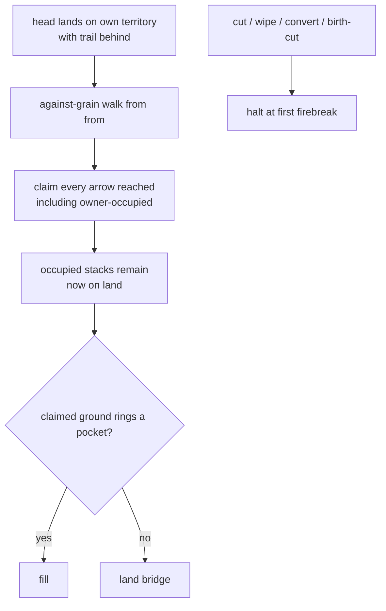

# trails-simple — P22 beta (D1–D4, D6, D8) + P42 claim walk

**Packets:** [P22 — Beta: simple trails](../../design/packets/P22-beta-simple-trails.md) ·
[P42 — Claim walk ignores firebreaks](../../design/packets/P42-claim-walk-ignores-firebreaks.md)
**SPEC:** §5 (branching free), §6.1 / §6.1a (dormant legal, firebreak = evaporation
halt), §6.3 (convert wipe is P33), §7 (claim walk, no occupation cap), §11 items
8, 23, 27, 35, 40, 42 (re-resolved), 49
**Features:** [core](./trails-simple.core.feature) · [edge cases](./trails-simple.edge-cases.feature)
**Upstream:** [closure](../closure/closure.md) owns the against-grain walk;
[cuts](../cuts/cuts.md) owns halt-at-first.

## Purpose

P22 reversed the stuckness tax of P13 D2–D4: branching costs nothing; cut tails
and headless marks persist; landing on own territory still paints.

P42 repeals P22 D5 / item 42. Playtest 2026-08-23: a stack-grade tip landed home
and paint stopped before a mid sentry. A firebreak stops **evaporation**, not
tile claim. The against-grain walk from the closing step's `from` claims
everything reached, including owner-occupied trail arrows; those stacks stay,
now on land. Pre-landing grade does not change how much is painted.

## Scope

In: branch legality (none), dormant persistence (cut tails), size-1 tip mobility,
full against-grain claim on every landing (stack-grade and territory-rooted),
occupied arrows on that walk becoming territory.

Out: combat math, spawners, GeometryPort, trail decay. Cut / wipe / convert /
birth-cut halt-at-first unchanged. Conversion predicate unchanged (territory-grade
still required to resist). Paint trigger unchanged (P22 D4). No new port method.

## Terms

| Term | Means |
|---|---|
| **trail** | set of arrows marked by a player; may be headless |
| **territory grade** | continuous own-trail path to own territory — conversion resistance, not a paint cap |
| **stack grade** | reaches an own stack but not territory |
| **dormant** | reaches neither — **legal standing state** under P22 |
| **firebreak** | owner-occupied trail arrow that **halts evaporation**. Paint does not consult it |
| **unanchored reconnect** | landing on own territory from a component that was not territory-grade before the step — still the full upstream walk (P42) |

## Flow

Occupation is not a branch of the claim walk. A fork's other arm stays trail
because it is *downstream* along the grain, not because it is occupied.

## Invariants

- WHEN a move creates or vacates a join or split, the system SHALL NOT refuse the move for unpaid branch toll.
- WHILE a trail component is dormant, the system SHALL leave its marks standing until cut evaporation, a convert wipe that reaches them (P33), or friendly re-attach.
- WHEN a size-1 stack is the sole stack on a stack-grade component, the system SHALL still permit a legal grain step that vacates its arrow.
- WHEN a head lands on own territory with trail behind, the system SHALL claim every arrow reached walking against the grain from the closing step's `from`, including owner-occupied trail arrows; those stacks SHALL remain on the now-territory arrows. Pre-landing grade SHALL NOT change the set claimed.
- WHEN a fork arm is downstream of the closing step, the system SHALL leave that arm as trail.
- WHEN the walk transits a merge, the system SHALL claim every trail in-arrow, occupied or not.
- WHEN a front (movement cut, combat wipe, convert wipe, or birth-cut) would enter an owner-occupied trail arrow, the system SHALL halt; that arrow and its stack survive.
- WHILE a head has a continuous own-trail path to own territory, the system SHALL NOT convert that head by encirclement alone.
- IF a head has no continuous own-trail path to own territory and sits inside enemy territory, THEN the system SHALL convert it.
- The system SHALL preserve total head count across a claim that paints occupied arrows.
- The system SHALL NOT consult `Date`, `Math.random`, or insertion order when computing the claim; the walk result SHALL be ordered by `compareArrows`.

## What this file deliberately does not decide

- Cut / wipe / convert / birth-cut halt-at-first — [cuts](../cuts/cuts.md),
  [encircled-path](../encircled-path/encircled-path.md),
  [birth-cut](../birth-cut/birth-cut.md).
- Adapter FX. A sentry that becomes land is ordinary territory.

## Counts

20 scenarios (8 core, 12 edge). 11 invariants. Item 42 re-resolved in place;
item 49 opened and closed. No new §11 gap. No unexpected cost.
