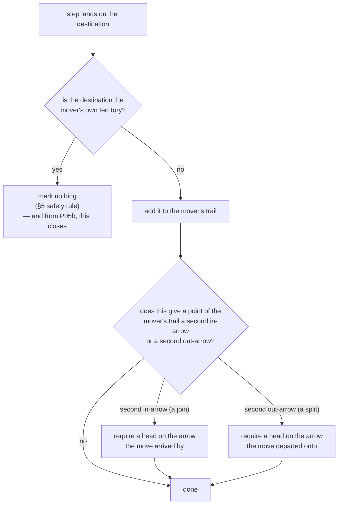

# trails — the board's memory (P05 archive; branching superseded by P22)

> **P22 beta:** live branching / dormant / paint-cap rules are in
> [`docs/spec/trails-simple/`](../trails-simple/trails-simple.md). Branch-toll and
> size-1-freeze scenarios in the `.feature` files below are **historical**; tests
> assert P22. Marking, set representation, and grades remain load-bearing.

**Packet:** [P05 — Trails, sentries & crossings](../../design/packets/P05-trails-crossings.md)
**SPEC:** §5 (safety rule, sentries; branching free under P22), §6.1a (trail
invariants), §6.1 (anchor grades — reachability only), §11 items 21–24, 27
**Features:** [core](./trails.core.feature) · [edge cases](./trails.edge-cases.feature)
**Sibling:** [crossings](../crossings/crossings.md) — the same trail, asked a different question

## Purpose

P04 moved heads over an occupancy map. This gives the board a memory of where they
have been, and makes that memory the thing every later rule reads.

Three ideas, in dependency order:

1. **A trail is a set of arrows** (§6.1a) — no order, no tree, no record of who
   laid it or how often it was walked.
2. **Moving inside your own territory lays no trail** (§5) — the safety rule, and
   everything about exposure follows from it.
3. ~~**Branching is the one place the rules require a head**~~ — **withdrawn by P22.**
   Branching is free; sentries are discretionary firebreaks (§5, §11 items 23, 35).

## Scope

In: trail and territory state, what a step marks, ~~branch-anchor legality~~ (P22:
branching free — see trails-simple), anchor grade as reachability.

Out: **closure and fill** (P05b) — a step landing on your own territory marks
nothing here and claims nothing, which is a seam, not a rule. **Cuts, evaporation
and combat** (P06) — nothing evaporates, and a crossing is reported rather than
resolved (see [crossings](../crossings/crossings.md)). **Conversion** (P07).
**Spawners** (P08) — nothing here reads a vertex.

Tests run on the P02 fixture boards. Every rule in this file is local, so a
7-point board hosts it (P02 measurement 2).

## Terms

| Term | Means |
|---|---|
| **trail** | the set of arrows a player's heads have stood on and not yet closed. A **set** — no order, no memory |
| **territory** | closed ground, one owner per arrow. Free, trail-less, safe movement (§5) |
| **mark** | what a step does to its destination: adds it to the mover's trail |
| **branch point** | a point where one player's trail has two or more in-arrows (a **join**) or two or more out-arrows (a **split**) |
| **crossover** | a point the trail runs through more than once — a join *and* a split, so it costs both anchors |
| **anchor** | the head a branch is *required* to leave. Also the grade of what holds a trail live — see below |
| **territory grade** | the trail reaches that player's own territory through their own trail |
| **stack grade** | it reaches one of their own stacks, but not their territory |
| **dormant** | it reaches neither. A headless wall (§6.1a) |
| **sentry** | heads a player *chose* to leave. Discretionary everywhere except a branch |

*head*, *stack*, *point*, *arrow*, *grain* keep their AGENTS.md meanings. A
**group** is still P04's: one player's heads on one arrow.

## What a step marks

One rule covers every combination without a case analysis: territory → territory
marks nothing, territory → neutral starts a trail, trail → neutral extends it,
trail → own territory marks nothing, and stepping onto your own trail adds nothing
because a set holds no duplicates.

Stepping into **enemy** territory marks trail. It is hostile ground — enterable
**from own territory or a territory-grade trail** (§6.3 / P28), and exposing
while you are there (§7). An unprotected walk-in is illegal, not a convert.

## The branch-anchor rule ~~(historical — withdrawn by P22)~~

> **P22:** branching is free; this section records the P05 reading for archive.
> Live rule: [trails-simple](../trails-simple/trails-simple.md).

§5 *formerly* stated it once:

> ~~**A move that gives a point a second trail in-arrow must leave at least one head
> on the in-arrow it arrived by. A move that gives a point a second trail
> out-arrow must leave at least one head on the out-arrow it departed onto.**~~

Three readings of *when* it bites are grammatically available, and **two of them
freeze the board**:

| reading | what happens |
|---|---|
| a standing invariant over the whole trail | **deadlock.** §5 and §6.1 both say damage can empty a branch point and that the state is legal. Under a whole-trail invariant, the first such cut makes *every* subsequent move illegal |
| a condition on arriving only | **vacuous for splits.** The movers land on the arrow they departed onto, so a head is always there |
| **local to what the move changes** — chosen | a move may not *create* an unpaid branch, and may not *strip* the anchor off a branch it is stepping away from. Nothing else is constrained |

The third is the only one that satisfies §5's own summary — *this constrains what
you may leave, not what may exist* — and §11 item 23's *mandatory, and the only
head the rules ever require*. The distinguishing case is **an already-unpaid
branch**: damage created it, no move is asked to repair it, and moves elsewhere
stay legal. That case is a named scenario in the edge cases, because it is the one
that tells the readings apart.

### The toll is one head per branch, not one per strand

§5 charges "the in-arrow it **arrived by**" and "the out-arrow it **departed onto**",
and a trail is a set that records neither (§6.1a) — a moment after a split, the arm it
created is indistinguishable from the arm already there. So the pairing the sentence
reaches for cannot be recovered, exactly as in §11 item 26, and the standing form of
the rule is an existence test rather than a per-arm one:

> **A join must keep at least one of its owner's heads somewhere among its in-arrows,
> a split at least one among its out-arrows, and no move may take the last one.**
>
> **Exception — territory root.** If the branch point is a live territory root
> (§6.1 — an owned territory in-arrow feeds it and is not on an enemy trail), that
> feeder anchors the junction. No head toll is owed there; mid-trail branches still pay.

A fork therefore costs one head and a crossover two — §6.1's price list and §5's *one
before, one after*, both — and a **sibling arm carries the toll for the whole
junction**, so any arm may be wholly vacated while another holds it. Only the mover's
own heads count: an enemy standing on a strand of your junction is a problem, not an
anchor (§6.1). A second exit off home is free for the same reason bare trail from home
is legal: territory, not a parked head, is the anchor.

This was **§11 item 35**, resolved during P05's review. The alternative — one head per
strand, from §5's *each mini-trail needs its own anchored end* — pins each of a
junction's arrows individually. **Both charge the same to build a branch**, which is
why the difference hid: forming a crossover costs two heads either way, because the
arriving strand pays. They part afterwards, when a lagging group or a reinforcement
reaches one of the strands already paid past — per strand pins it on arrival too, per
branch does not. No scenario above discriminates them, because each puts heads on at
most one strand per side; the invariants carry three properties that do.

Locality, not a before-and-after comparison, is what keeps this from freezing the
board: only the two branches the departing arrow itself belongs to are examined.

Two consequences already stated in §5 and not new here:

- **A lone head cannot branch.** It pays its only head and *stops there*, becoming
  the anchor rather than passing through. Too small to pay and unable to act are
  the same state, and the rules already handle it.
- **A crossover costs two** — one before the join, one after the split — so a
  2-stack that crosses its own trail ends with one head each side and nothing
  continues past it.

The anchor is a **toll, not a wall**: a front spends its kill on the first head it
meets and halts at the second (§6.1), so one anchor buys an arrow of delay. A
player who wants a branch point to actually stop something leaves two.

## Anchor grade is reachability, and it ignores the grain

§6.1's two grades are consumed by P05b (only territory grade can close) and P06
(evaporation stops at territory), but computing them is trail bookkeeping:
**is this trail arrow connected, through the player's own trail arrows, to their
territory — or only to one of their own stacks — or to neither?**

Connectivity **over the trail set** is undirected. §7's pincer says outright that
*enclosure is a property of the curve, not of the flow along it*, and §6.1
re-attaches a fragment by laying a fresh path **to** it, against the direction the
fragment was laid. A grade computed along the grain would refuse both.

**Touching territory is a different relation, and it is the departure.** "Undirected"
above is about trail-to-trail; it does not say what it means for a stretch to *reach*
the player's territory, and the two available answers are told apart by an approved
scenario (*a trail touching your territory and a fragment touching only a stack*).
The answer is that the stretch must **leave** ground the player already owns — some
arrow of it departs a point one of their own territory arrows feeds. §7: *"Drive a
fragment into your territory and you claim along the walk. Ordinarily it encloses
nothing: a strip has no inside."* Pre-landing grade does not cap that walk (P42).
Arriving at territory does **not** promote a stretch; grade is the departure. If
arriving promoted, this scenario's two-stretch contrast would vanish. §6.1 says the
same from the other side — a deep cut takes *"the region touching the victim's
territory"* and leaves the rest with *"territory anchor gone"*, which is only a
demotion if the anchor was the departure. §6.3 completes it: a raider's trail earns
no territory anchor however well it is garrisoned.

## Invariants

- The system shall mark a step's destination as the mover's trail unless that
  destination is already the mover's own territory.
- The system shall leave the trail unchanged when a step's destination is already
  in the mover's trail.
- The system shall answer every trail question from the arrow set and the standing
  counts alone, and shall record no order, no tree and no laying history.
- The system shall mark trail when a step enters territory belonging to another
  player.
- The system shall permit one arrow to belong to more than one player's trail.
- The system shall refuse a move that would leave a join of the mover's trail with
  none of the mover's heads on any of its in-arrows.
- The system shall refuse a move that would leave a split of the mover's trail with
  none of the mover's heads on any of its out-arrows.
- The system shall permit a move that wholly vacates one strand of a branch while
  another strand of that branch still carries one of the mover's heads.
- The system shall not count another player's heads towards the mover's branch toll.
- When a point of the mover's trail is both a join and a split, the system shall
  require both tolls.
- The system shall examine only the branches the departing arrow itself belongs to.
- The system shall permit a move that leaves an already-unanchored branch point
  unanchored.
- The system shall refuse every branching move by a group of one head, and shall
  leave that head where it stood.
- When a trail arrow is connected through its player's own trail to an arrow of
  that player's territory, the system shall report territory grade.
- When a trail arrow is connected through its player's own trail to one of that
  player's own groups but not to their territory, the system shall report stack
  grade.
- When a trail arrow is connected to neither, the system shall report dormant.
- The system shall compute trail connectivity without regard to the grain.
- The system shall keep trail and territory across the turn boundary, clearing
  neither on end-turn.
- The system shall not mutate the input state of `apply`, and shall return equal
  outputs for equal inputs.

## What this file deliberately does not decide

- **What a landing on your own territory claims** — P05b (§7). Here it marks
  nothing and the trail stays open. This is the same shape as P04 refusing an
  enemy-occupied destination, and it must not be approximated: a closure that
  claimed "the path only" would look like §7's land bridge and be wrong in every
  case that encloses something.
- **What a cut destroys** — P06 (§6.1). Trail is removed by nothing in this
  packet, so an arrow shared between two players' trails stays shared.
- **Whether a branch point's anchor survives combat** — P06. The rule here governs
  what a *move* may leave.
