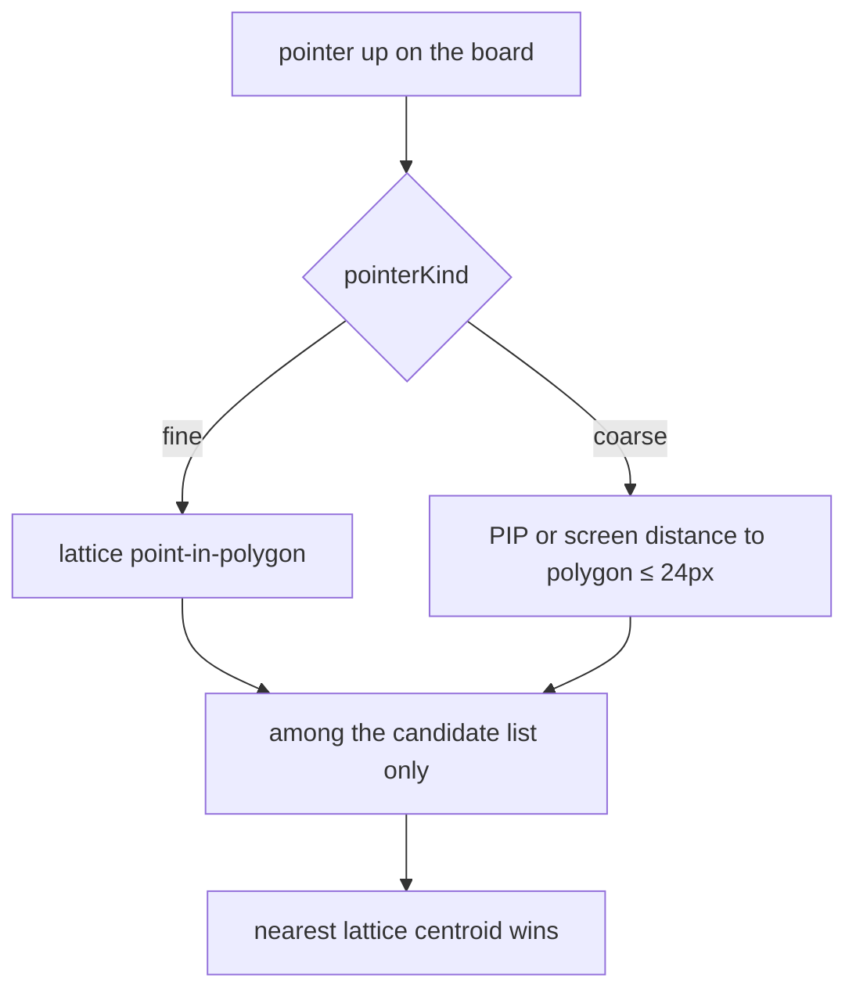
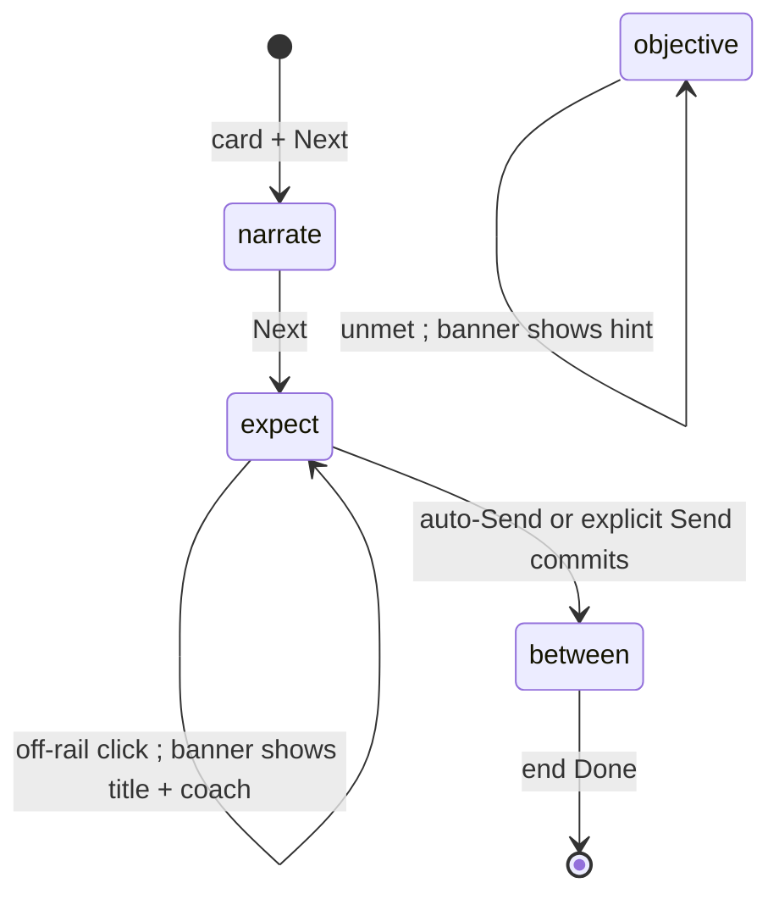

# tutorial-mobile-copy — fat-finger hits, auto-Send on rails, plain copy

**Packet:** [P44 — Tutorial mobile input + plain-language copy](../../design/packets/P44-tutorial-mobile-copy.md)
**SPEC:** adapter follow-up to P43. **No game rule is added, changed or
reinterpreted.** `contracts`, `rules-core`, `Move`, legality, and the engine
speed formula stay untouched. No §11 item is opened or closed.
**Layer:** `packages/web` only (`hit.ts`, `tutorial/**`, overlay/HUD chrome).
**Features:** [core](./tutorial-mobile-copy.core.feature) ·
[edge cases](./tutorial-mobile-copy.edge-cases.feature)

## Purpose

P43 taught the settled rules on the real engine. Mobile playtest then found two
adapter defects that still block first contact: taps miss the intended stack,
and learner copy quotes `1 + ⌊log₂ heads⌋`. This packet fixes **hit targets**,
**when Send is required**, and **learner-facing words**. Rails still never
make an illegal action legal.

## Scope

In: coarse-pointer padding on `hitArrow` (global for touch/pen); auto-Send on
single-exit, single-carry expect rails; a board-adjacent stage banner that
shows expect title + coach (same coach string as the HUD); pan-to-`from` when
an expect step becomes current; a stronger `lesson-target` wash on allowed
rail arrows; copy templates and catalogue strings with no speed formula; L4
drops “threat-weighted floor rule”; L7 keeps two narrate cards in plain
outcomes.

Out: new lessons or reordering L0–L7; golden-path / opening script changes
(copy-only edits to narrate / coach / title / summary / hint are in);
voiceover; i18n; online progress; keyboard-only navigation; redesigning
RouteDock for free play; zoom-on-expect (pan only); teaching the algebraic
form of speed.

## Terms

| Term | Means |
|---|---|
| **coarse pointer** | `pointerKind === 'coarse'` — touch or pen, via the existing `pointerKindOf` map (P31) |
| **fine pointer** | mouse / other — lattice point-in-polygon, padding 0 |
| **padding** | 24 CSS px (`COARSE_HIT_PADDING_PX`) of screen-space distance from a candidate polygon |
| **candidate list** | the culled / offered arrows the host already passes to `hitArrow` — never the whole board |
| **auto-Send** | calling the ordinary `send` path (`commitSnap`) when a rail has nothing left to decide |
| **stage banner** | board-adjacent chrome for expect / objective: title + body; not the narrate/end card |
| **lesson-target** | stronger wash on arrows in the active rail’s `selectable ∪ clickable` |
| **learner string** | any catalogue narrate / expect title / coach / hint / summary, plus `copy.ts` templates |

Do not say *popup*, *modal*, or *auto-click*. Auto-Send is the P35 “nothing to
decide” send, applied to a completed rail.

## Hit testing



Fine pointers must match today’s hits. Coarse padding is **global** (free play
included). An arrow that is not in the candidate list is never a hit, even if
it sits under the finger.

## Rail auto-Send versus Send

```mermaid
flowchart TD
  click[on-rail click]
  click --> matched{drafted exits equal the rail exits}
  matched -->|no| keep[keep drafting]
  matched -->|yes| auto{"single exit and carryAllow absent or length 1"}
  auto -->|yes| send[ordinary send via commitSnap]
  auto -->|no| dock[Send under the board stays required]
```

P35 `autoApplies` still runs. A 3-stack with `speed(3) = 2` may still offer a
second hop after one rail exit; the **rail** is finished, so auto-Send fires
anyway. Multi-exit rails and `carryAllow` of two or more values still name
Send in the coach.

## Stage chrome



Narrate/end cards keep their P43 role. While focus names a stack, the card
must not cover that stack (shorter top card or stacked under the focus).

## Decisions locked here (BSSN)

See the packet. Short form:

1. Auto-Send iff `exits.length === 1` and (`carryAllow` omitted or length 1).
2. Coarse padding is global; 24 CSS px; screen space; nearest centroid
   among hits; candidates only.
3. Stage banner shares the HUD coach string. Expect shows `title`. Objective
   shows `hint` as the body.
4. Pan `action.from` on-screen when an expect **becomes** current, draft
   empty, arrow off-screen. No yank mid-draft. No zoom.
5. Lesson-target wash = rail `selectable ∪ clickable`.
6. L0 speed copy comes from `renderCopy('speed-three')` plus
   `renderCopy('speed-pair')`. No `log`, no `⌊`. L4 copy does not say
   “threat-weighted floor rule”.
7. Inspect tips stay fine-pointer; coarse `pointermove` does not pin a
   spawner / convert tip (the share label “NEXT” reads as the lesson
   button on a phone).

## Invariants (EARS)

- *Ubiquitous*: The system shall treat `RulesPort` as the sole authority on
  legality during lessons, as P43 already requires.
- *Ubiquitous*: The system shall keep fine-pointer `hitArrow` equal to lattice
  point-in-polygon among the candidate list.
- *Ubiquitous*: The system shall keep every learner string free of the speed
  formula (`log`, `⌊`, `floor(log…)`).
- *State-driven*: While the pointer is coarse, the system shall accept a
  candidate whose polygon is within 24 CSS px of the tap in screen space.
- *State-driven*: While an expect rail has one exit and a missing or
  singleton `carryAllow`, the system shall send through the ordinary commit
  path once that exit is drafted.
- *State-driven*: While a rail is active, the system shall paint the
  lesson-target affordance only on allowed selectable and clickable arrows.
- *Event-driven*: When an expect step becomes current, the draft is empty,
  and `action.from` is outside the viewport, the system shall pan so that
  arrow is on-screen.
- *Event-driven*: When an off-rail click produces a coach line, the system
  shall present that same string in the stage banner and in the HUD.
- *Event-driven*: When the current step is an expect, the system shall show
  that step’s title in the stage banner.
- *Unwanted*: If an arrow is not in the candidate list, then padding shall
  not select it.
- *Unwanted*: If a route draft is already in progress, then expect-entry pan
  shall not move the viewport.
- *Unwanted*: If auto-Send does not apply, then a coach that asks the learner
  to commit shall name the Send control.

Scenario count: 15 core + 15 edge. EARS: 12.
