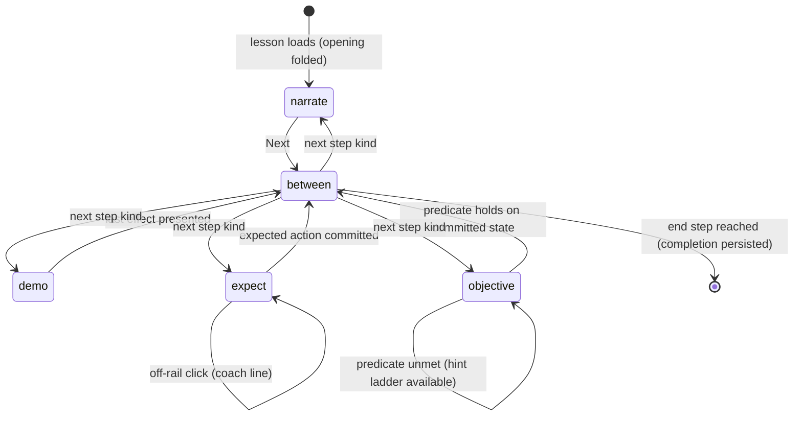

# tutorial — the interactive walkthrough

**Packet:** [P43 — Interactive walkthrough tutorial](../../design/packets/P43-tutorial.md)
**SPEC:** adapter feature over §4–§9 (read-only). **No game rule is added,
changed or reinterpreted**; `contracts`, `rules-core`, `Move`, legality are
untouched. No §11 item is opened or closed.
**Layer:** `packages/web` only (`src/tutorial/**`, Lobby, Hud wiring) plus a
headless validator suite.
**Features:** [core](./tutorial.core.feature) · [edge cases](./tutorial.edge-cases.feature)

## Purpose

The rules are settled; the defect class left open is comprehension. Playtests
P22→P42 each fixed a *misreading* — tips players could not read (P22), routes
picked silently (P34), conversions mistaken for bugs (P33), a win unannounced
(P37), a vanish misread as a cut (P39). The game teaches nothing today: first
contact is a hot-seat match against the full ruleset, while SPEC §1's whole
appeal — *an attentive player can compute the next move* — is locked behind
reading the board.

This feature adds a **lesson mode**: eight short scripted walkthroughs played
against the real engine on the real tiling, teaching movement, trails, closure,
cuts, combat, encirclement, economy and victory in the spec's own vocabulary.
Guidance is **rails where an input mechanic is new**, **objectives once
judgement is the skill**.

## Scope

In: a lesson data format and step machine (`packages/web/src/tutorial/`); a
restriction decorator over the existing `InputMode`; a goal-predicate registry;
demo playback through the ordinary commit path; Lobby entry (**Learn**, beside
Local | Online) and a dismissible first-run card; lesson controls (restart,
skip, progress dots, reset); practice-board labelling; a headless golden-path
validator test per lesson; completion flags in `localStorage`.

Out: any change to `contracts` / `rules-core`; an AI opponent during lessons;
localization; voiceover; achievements; online sync; post-MVP specials; keyboard
navigation; screenshots regression; a written manual page.

## Terms

| Term | Means |
|---|---|
| **lesson** | immutable data: id, title, `MatchConfig`, an opening move script, an ordered step list |
| **opening** | the lesson's move script folded through `rules.apply` onto `makeMatch(config)` — every staged board is reachable and legal by construction |
| **step** | one element of the lesson script: `narrate`, `demo`, `expect`, `objective` or `end` |
| **narrate** | overlay card + optional **focus rings**; advances on Next |
| **demo** | the engine plays given moves through the ordinary commit path, paced like bot playback; effects use the standard fx vocabulary |
| **expect** | a **rail**: the learner must perform a specific legal action; everything else gets the **coach line** |
| **objective** | free play until a **goal predicate** holds; a **hint ladder** ends in *show me* |
| **goal predicate** | pure function `GameState → boolean` from a fixed registry |
| **coach line** | tutorial-side guidance attached to a refused or off-rail click; never a substitute for the engine's own refusal |
| **golden path** | the lesson's intended click/move sequence; replayed headlessly by the validator |
| **practice board** | a lesson whose config differs from `DEFAULT_MATCH_CONFIG`; labelled in the HUD |

Do not say *popup*, *wizard*, *modal* or *scripted AI*. There is no popup, no
blocking wizard, and no opponent intelligence — enemy agency in lessons is demo
playback.

## The lesson step machine

Restart rewinds to the first step and refolds the opening. Leaving mid-lesson
returns to the Lobby and discards the match. A won match cannot arise mid-lesson
except where a lesson intends it (L7); P38's terminality applies unchanged.

## Lessons (L0–L7)

| # | Lesson | Teaches | Style |
|---|---|---|---|
| L0 | The grain | select · rays · run · Send · arrows-only movement · speed ladder via live ray repaint · merge costs the turn | rails |
| L1 | Trail & exposure | stepping off lays trail · trail renders distinct · leaving heads behind is the drop · skip and End Turn are normal | rails → observe |
| L2 | Closure | depart and land on own territory claims path + interior · land bridge strip · girth-3 teaser | rails |
| L3 | Cuts & firebreaks | crossing cuts · evaporation both ways · any head halts a front · sentry spacing prices regions · chord test drawn | objective |
| L4 | Contact combat | attack = step onto enemy-held arrow · stay-behind · threat-weighted floor rule · equals favour attacker | rails |
| L5 | Encirclement | closure converts intact · anchor grades · raider without territory-grade link is taken | demo → objective |
| L6 | Spawners | shares in thirds · girth-3 takes whole spawner · accumulator banks remainder · blockade halts | objective |
| L7 | Winning & losing | four loss cases · starvation *N* · fleeing past *R* self-starts the clock | observe → objective |

## Decisions locked here (BSSN)

1. **Reset progress restores the first-run card.** The card shows iff no
   completion record exists; resetting clears records, so the card returns.
2. **Skip lesson never marks completion.** It advances; the dot stays hollow.
3. **A demo whose move is refused at application time halts the session with a
   visible error** rather than silently skipping. The validator makes this
   unreachable for shipped lessons; the guard exists so a future rules change
   fails loudly instead of teaching nonsense.
4. **Practice-board label appears iff the lesson config differs from
   `DEFAULT_MATCH_CONFIG`** in any field. Config differences are confined to
   §7 setup data (bands, forces, *N*, radii) — verified by the validator.
5. **Tunable numbers in lesson copy are parameters filled from the lesson's
   config at render time**; only structural constants (girth 3, `speed(2)=2`,
   three shares) may be literal.
6. **No hot-seat handoff chrome during a lesson**: the single human seat always
   acts; there is no passing banner and no seat gate.
7. **Show-me is a demo**: revealing a golden answer applies it through the same
   commit path as any demo, so its effects play like everything else.

## Invariants (EARS)

- *Ubiquitous*: The system shall fold every lesson opening through
  `makeMatch(config)` plus `rules.apply`, and shall never construct a
  `GameState` for a lesson by any other means.
- *Ubiquitous*: The system shall treat `RulesPort` as the sole authority on
  legality, in lessons and outside them alike.
- *Ubiquitous*: The system shall produce identical committed states and
  overlays for equal lesson data and equal input sequences.
- *State-driven*: While an expect step is active, the system shall offer only
  selectable sources and clickable targets the rail allows.
- *State-driven*: While a step is incomplete, the system shall keep the session
  on that step.
- *Event-driven*: When a click falls outside an active rail, the system shall
  present the coach line and shall leave engine refusal behaviour unchanged.
- *Event-driven*: When an objective's goal predicate holds on committed state,
  the system shall advance to the next step.
- *Event-driven*: When a lesson reaches its end step, the system shall persist
  its completion flag before returning to the lesson list.
- *Unwanted*: If a demo move is refused by the engine at application time, the
  system shall halt the session with a visible error and shall not skip it.
- *Unwanted*: If a lesson's config differs from `DEFAULT_MATCH_CONFIG`, the
  system shall label the session practice board for its whole duration.
- *Unwanted*: If lesson copy quotes a tunable quantity, then that quantity
  shall be rendered from the lesson config and shall change when the config
  changes.
- *Unwanted*: If progress is reset, then the system shall clear every
  completion flag and shall restore the first-run card.
